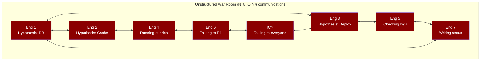
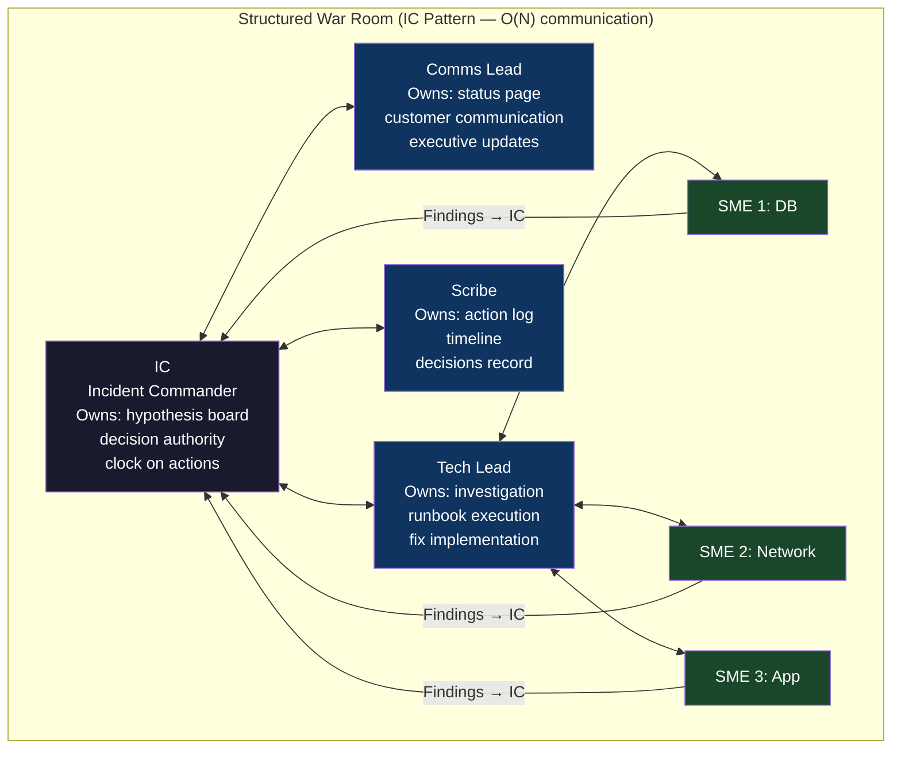
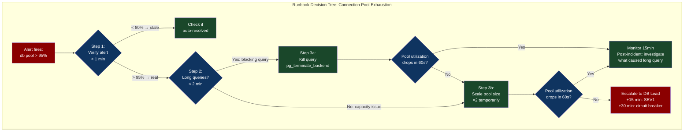

# Chapter 61: Incident Command — The War Room Is Also a Distributed System

> "An incident response with 12 engineers, no clear IC, and a Slack thread of 400 messages is itself a distributed system with a consensus problem."

**Part 08 — Fleet Resiliency** | Final chapter of Part 08. Bridges into Part 09 (FinOps and Security Frontiers) by establishing that incident response is the operational foundation on which cost optimization and security response are built.

---

## 1. Cold Open

It was 22:03 on a Wednesday when the GitLab.com database was accidentally deleted. Not corrupted. Deleted. The incident lasted approximately 18 hours, with approximately 18 hours of data loss. The full post-mortem is publicly available on GitLab's blog — an act of extraordinary transparency — and it reads as a masterclass in how a collection of individually competent engineers, each doing reasonable things, can collectively produce a catastrophic outcome when the process for coordinating them breaks down.

The sequence: a database replication issue required manual intervention. A systems administrator was SSHed into one of the production database servers performing a `pg_basebackup` operation to fix replication on the wrong server. He ran `rm -rf` on the wrong directory while the command was intended for a staging environment. The deletion was noticed within seconds but `rm -rf` on a 300GB database is fast. By the time the first person typed "stop" in the incident channel, the database was gone.

What followed was an 18-hour window of pure incident command failure. The team attempted four different backup restoration strategies in parallel. Procedure 1 (regular backup) — last backup was 24 hours old, not the 6-hour backup they thought they had, because the backup job had been silently failing for months. Procedure 2 (disk snapshots) — the snapshot policy had been changed and the most recent snapshot was also 24 hours old. Procedure 3 (Azure backup) — had never actually been tested in production; the restore process was documented but the documentation was wrong. Procedure 4 (filesystem sync from secondary) — the secondary was a streaming replica that had replicated the deletion. All four backup strategies failed or produced incomplete data.

The incident had 24 people in the war room at peak. The Slack thread had 847 messages in 6 hours. Multiple engineers attempted recovery operations without coordinating with each other, some of which conflicted. Nobody had clear authority to say "stop all recovery attempts, we are going with plan X." The decision about which backup to use took 4 hours to make because each person in the room was proposing a different option, each option required someone else to verify it, and verification required waiting for someone who was also in the Slack thread proposing a different option.

The technical lesson — implement and test your backups — is obvious and has been discussed elsewhere. The less-obvious lesson is about the information routing and decision authority problems that occur when an incident response itself becomes a distributed system without consensus. This chapter is about building the incident command structure that prevents the coordination failure, and about understanding why the structure is not bureaucratic overhead but the minimum viable process for making correct decisions under pressure.

---

## 2. The Uncomfortable Truth

The romantic vision of incident response is a brilliant engineer who looks at the dashboards, intuits the root cause, and fixes it in 20 minutes. This happens occasionally for simple incidents with obvious signatures. For complex incidents — cascading failures, data loss, multi-region events — the bottleneck is almost never technical capability. It is information flow and decision authority.

In a 12-person incident war room, information about the system state is distributed across 12 people. Each person has observed different dashboards, run different queries, has different hypotheses. The information flow problem: if each person shares their observations with the group, the group's communication complexity is O(N²). At N=12, that's 132 channels of information that each person must process simultaneously while also investigating the problem. Human attention doesn't scale this way — the result is that critical observations get lost in the noise, incorrect hypotheses persist because nobody with the authority to dismiss them is listening to the right channel, and decision latency increases with incident severity instead of decreasing.

The incident command structure is the solution. Not because it's required by process, but because it solves a real information routing and decision authority problem that emerges from the geometry of a distributed cognition problem. The IC (Incident Commander) is not the smartest person in the room. The IC is the routing node that aggregates information from all channels and serializes it into a single state model. The tech lead is the person who generates the hypothesis and the fix. The comms lead handles the external communication channel so it doesn't compete with the internal investigation channel. The scribe records state so that the IC can query "what do we know so far" without asking everyone to repeat themselves. Each role is solving a specific distributed systems problem.

---

## 3. Mental Model — The War Room as a Distributed System

**The named model: "The Incident Consensus Problem"**

An incident war room is a distributed system where each engineer is a node with partial state. The "correct action" to take is a decision that requires aggregating state from all nodes, reaching consensus on the most-likely hypothesis, and authorizing a single action from that consensus. Without structure, this system exhibits the same failure modes as any distributed system without consensus: split-brain (multiple engineers taking conflicting actions), stale reads (decisions based on outdated observations), and livelock (endless hypothesis discussion without convergence).





The IC's job is explicitly NOT to investigate the technical problem. The IC's job is to maintain the shared hypothesis board (the consensus state), assign investigation tasks (serialize work), make decisions on conflicting hypotheses (consensus protocol), and control the action clock (force time-bounded decisions). An IC who starts debugging code has left their routing role and created a gap in the state aggregation — the point where information fails to get routed is the point where parallel conflicting actions start.

---

## 4. Dissection

### Naive Approach: Heroic Response

The heroic response model: the most experienced engineer takes all information, makes all decisions, and executes all fixes. Works for incidents with one obvious cause and one engineer who understands the entire stack. Fails when the incident spans more than one domain (database + network + application), when the experienced engineer is not on call, or when the incident involves multiple simultaneous causal chains that require parallel investigation.

### Where It Breaks

The heroic model breaks on the information bandwidth problem. A single human can process approximately 5-7 information streams simultaneously before attention fragments. A complex incident generates 12+ streams: Prometheus dashboards, Loki logs, Grafana traces, Kubernetes events, application logs, cloud provider status page, customer reports, internal Slack messages, team Zoom calls, runbook steps, recent deployment history, and domain expert findings. The heroic engineer starts making decisions based on whichever of these 12 streams they happen to be looking at when the decision point arrives. This is not a skill failure — it is an architectural failure of the response structure.

### Correct: The Incident Command System (ICS)

The Incident Command System was developed by US firefighters in the 1970s after a wildfire where multiple agencies with different radio frequencies and command structures couldn't coordinate effectively, causing preventable deaths. The problem is structurally identical to a complex software incident. The ICS principles: unity of command (every responder reports to exactly one person), span of control (no IC manages more than 5-7 direct reports), common terminology (shared language for status, actions, hypotheses), and incident action plan (written goals for the current operational period).

```go
// incident/state.go — Machine-readable incident state for structured war rooms
// Shared via a Slack bot or an incident management tool

package incident

import (
    "time"
    "sync"
)

type Severity int

const (
    SEV1 Severity = 1  // Major outage, > 10% users affected, page all on-call
    SEV2 Severity = 2  // Partial outage, < 10% users affected, page primary on-call
    SEV3 Severity = 3  // Degraded performance, no page, investigate next business day
    SEV4 Severity = 4  // Minor issue, no user impact, ticket for next sprint
)

type HypothesisStatus string

const (
    HypothesisActive    HypothesisStatus = "investigating"
    HypothesisRuledOut  HypothesisStatus = "ruled_out"
    HypothesisConfirmed HypothesisStatus = "confirmed"
)

// Hypothesis represents a possible root cause being investigated
type Hypothesis struct {
    ID          string
    Description string
    Proposer    string
    Status      HypothesisStatus
    Evidence    []string
    AssignedTo  string
    CreatedAt   time.Time
    UpdatedAt   time.Time
}

// ActionItem represents a time-bounded action with clear ownership
type ActionItem struct {
    ID          string
    Description string
    Owner       string
    Deadline    time.Time
    Status      string // "in_progress", "complete", "blocked"
    Result      string
    CreatedAt   time.Time
}

// IncidentState is the shared consensus state managed by the IC
type IncidentState struct {
    mu sync.RWMutex

    IncidentID       string
    Severity         Severity
    StartTime        time.Time
    IC               string // Current incident commander
    CommsLead        string
    TechLead         string
    Scribe           string

    // Current understanding of the incident
    Title            string
    Summary          string // Updated every 15 minutes by IC
    CurrentHypothesis string // The ONE hypothesis we're currently testing

    Hypotheses       []Hypothesis
    Actions          []ActionItem
    Timeline         []TimelineEntry

    // Status page state
    UserImpact       string // Description of what users are experiencing
    StatusPageStatus string // "investigating", "identified", "monitoring", "resolved"

    // Decision log: all decisions made with authority and reasoning
    Decisions        []Decision
}

type TimelineEntry struct {
    Time        time.Time
    Author      string
    Role        string // IC, TL, SME-DB, etc.
    Event       string
    IsDecision  bool
    IsAction    bool
}

type Decision struct {
    Time      time.Time
    DecidedBy string  // Must be IC or explicitly delegated authority
    Decision  string
    Reasoning string
    Alternatives []string // What else was considered
}

func (s *IncidentState) AddHypothesis(h Hypothesis) {
    s.mu.Lock()
    defer s.mu.Unlock()
    h.CreatedAt = time.Now()
    h.UpdatedAt = time.Now()
    s.Hypotheses = append(s.Hypotheses, h)
}

func (s *IncidentState) MakeDecision(d Decision) {
    s.mu.Lock()
    defer s.mu.Unlock()
    d.Time = time.Now()
    s.Decisions = append(s.Decisions, d)
    // Add to timeline
    s.Timeline = append(s.Timeline, TimelineEntry{
        Time:       d.Time,
        Author:     d.DecidedBy,
        Role:       "IC",
        Event:      "DECISION: " + d.Decision,
        IsDecision: true,
    })
}

// ICUpdate formats the current state for broadcast to the war room
// Called by IC every 15 minutes to synchronize shared state
func (s *IncidentState) ICUpdate() string {
    s.mu.RLock()
    defer s.mu.RUnlock()

    activeHyps := 0
    for _, h := range s.Hypotheses {
        if h.Status == HypothesisActive {
            activeHyps++
        }
    }

    activeActions := 0
    for _, a := range s.Actions {
        if a.Status == "in_progress" {
            activeActions++
        }
    }

    return fmt.Sprintf(
        "[IC UPDATE - %s]\n"+
        "Duration: %s | Severity: SEV%d\n"+
        "Current hypothesis: %s\n"+
        "Active investigations: %d | Active actions: %d\n"+
        "User impact: %s\n"+
        "Next update in: 15 minutes\n",
        time.Now().Format("15:04:05"),
        time.Since(s.StartTime).Round(time.Minute),
        s.Severity,
        s.CurrentHypothesis,
        activeHyps,
        activeActions,
        s.UserImpact,
    )
}
```

### Correct: Runbooks as Executable Documentation

A runbook is not a list of steps to read. It is a decision tree that encodes the knowledge of the most experienced person who has dealt with this class of incident, made available to whoever is on call at 3am. The critical properties: each step has a clear expected outcome, each step has a clear "if this doesn't work" branch, and each step has a clear time budget (don't spend more than X minutes on step N before escalating).

```markdown
# Runbook: Database Connection Pool Exhaustion
# Trigger: db_connection_pool_exhaustion alert fires
# Severity: SEV2 (typically), escalate to SEV1 if user error rate > 5%
# Author: platform-team | Last updated: 2024-01-15

## Immediate Actions (< 5 minutes)

### Step 1: Verify the alert is real (1 minute)
```bash
# Check current pool utilization
kubectl exec -n production deploy/api-service -- \
  curl -s localhost:9090/metrics | grep db_pool
# Expected: db_pool_connections_active / db_pool_connections_max > 0.95
```
**If metric shows < 80%**: Alert may be stale. Check if it auto-resolved.
**If metric shows > 95%**: Proceed to Step 2.

### Step 2: Check for blocking queries (2 minutes)
```sql
-- Run on primary database
SELECT pid, now() - query_start AS duration, query, state
FROM pg_stat_activity
WHERE state != 'idle' AND now() - query_start > interval '30 seconds'
ORDER BY duration DESC;
```
**If long-running query found**: Proceed to Step 3a (Kill long query).
**If no long queries**: Proceed to Step 3b (Scale connection pool).

### Step 3a: Kill long-running query (2 minutes)
```sql
-- Kill the blocking query (replace $PID with the PID from Step 2)
SELECT pg_terminate_backend($PID);
-- Expected: returns TRUE and the query terminates within 5 seconds
```
**Expected outcome**: Pool utilization drops within 60 seconds.
**If pool doesn't drop**: Escalate to Tech Lead, proceed to Step 3b.

### Step 3b: Scale connection pool (2 minutes)
```bash
# Temporarily increase pool size (max safe value: 2× current)
kubectl set env -n production deploy/api-service \
  DB_POOL_MAX_SIZE=200  # was 100
# Wait 30 seconds, check pool metric
```
**This is a temporary fix. Root cause must be addressed in post-incident.**

## Escalation Path
- 5 minutes without improvement: escalate to DB team lead
- 15 minutes without improvement: declare SEV1, page VP Engineering
- 30 minutes: consider enabling circuit breaker to protect database
```



### Tradeoffs: Incident Command Overhead vs. Speed

| Structure | Decision speed | Decision quality | Suitable for |
|---|---|---|---|
| Heroic (1 person) | Fast | Low (attention fragmented) | SEV3/4, simple incidents |
| Informal (group) | Slow (consensus) | Medium (but variable) | SEV2 with < 4 people |
| ICS (IC + roles) | Medium (routing overhead) | High (serialized state) | SEV1/2 with 4+ people |
| Full ICS (all roles) | Slow (overhead at setup) | Very high | Major outages, P0 |

The overhead of establishing IC roles is approximately 3-5 minutes at incident start. This overhead is worth paying for any incident expected to last more than 30 minutes. For incidents that resolve in < 10 minutes, the overhead is not worth it — the incident is over before the structure delivers its benefits.

---

## 5. War Room — GitLab Database Deletion (2017)

On January 31, 2017, GitLab.com lost approximately 6 hours of production data due to an accidental `rm -rf` on a production database directory. The incident is fully documented in GitLab's public post-mortem. The following reconstructs the incident command failures alongside the technical failures.

**+0:00** — A database reliability engineer (DRE) SSHed into `db1.cluster.gitlab.com` (production) instead of the intended `db1.cluster.staging.gitlab.com` while attempting to fix a replication lag issue. He ran `rm -rf /var/opt/gitlab/postgresql/data/pg_xlog/` to remove old WAL segments that were filling the disk.

**+0:01** — The command begins deleting. The DRE realizes immediately he's on the wrong server. He types "shit" in the internal incident channel. At this point the incident had been running for 60 seconds and 9.5GB of WAL segments had been deleted.

**+0:03** — The DRE stops the deletion, but the damage is done. The Postgres directory is partially corrupted. He notifies the team.

**+0:05** — The Incident Command failure begins. At this point, GitLab had no formal IC role. The CTO, VP of Engineering, DRE, and three other engineers all joined the incident channel simultaneously. Each person began proposing a different recovery strategy. There was no mechanism for prioritizing proposals, no IC to assign investigation tasks, and no time budget on individual recovery attempts.

**+0:45** — After 40 minutes of discussion, the team attempts backup restoration. They discover the automated backup job has been silently failing for months. The backup they have is 24 hours old, not 6 hours as documented.

**+1:30** — Team attempts Azure blob storage backup restore. The restore process has never been tested in production. The documentation is incorrect for the current version of the backup tool. The restore fails with an undocumented error.

**+2:15** — Team attempts filesystem snapshot recovery. The snapshot policy had been changed and the most recent snapshot is also 24 hours old.

**+4:00** — After 4 hours and three failed recovery strategies, the team makes the decision to restore from the 24-hour-old backup and accept the data loss. This decision took 2 additional hours to implement because multiple engineers were still pursuing other recovery strategies that had not been formally ruled out.

**+18:00** — GitLab.com recovers. Approximately 6 hours of production data is permanently lost.

```mermaid
gantt
    title GitLab Database Deletion Incident (2017)
    dateFormat HH:mm
    axisFormat %H:%M

    section Triggering Event
    DRE SSHes to wrong server (production vs staging)  :crit, t1, 00:00, 1m
    rm -rf runs on production WAL directory             :crit, t2, 00:01, 1m
    DRE realizes error, stops deletion                  :crit, t3, 00:02, 1m
    Team notified in incident channel                   :done, t4, 00:03, 2m

    section Incident Command Failure
    Multiple engineers propose recovery strategies      :crit, ic1, 00:05, 40m
    No IC assigned, no hypothesis prioritization        :crit, ic2, 00:05, 4h
    Parallel uncoordinated recovery attempts            :crit, ic3, 00:45, 3h

    section Failed Recovery Attempts
    Attempt 1: Automated backup (silent failure for months) :crit, r1, 00:45, 45m
    Attempt 2: Azure blob backup (undocumented, untested)   :crit, r2, 01:30, 45m
    Attempt 3: Filesystem snapshot (policy changed)         :crit, r3, 02:15, 1h45m

    section Decision Paralysis
    4h of multi-engineer discussion without convergence  :crit, dp1, 00:05, 4h
    Decision to accept 24h backup loss (finally made)   :done, dec1, 04:00, 2h

    section Recovery
    Restore from 24-hour backup begins                  :done, rec1, 06:00, 12h
    GitLab.com restored                                 :done, rec2, 18:00, 30m

    section Post-Incident
    Public post-mortem published (same day)             :done, post1, 18:30, 2h
    Backup testing added to runbook                     :done, post2, 20:30, 4h
```

**The post-mortem identified five contributing factors, three of which are incident command failures:**

1. No backup verification (technical)
2. No IC assigned at start — no one had authority to deprioritize recovery strategies (command failure)
3. No time budget on recovery attempts — each attempt continued past the point of diminishing returns (command failure)
4. Untested restore procedures — backup existed but restore was never tested (technical)
5. No mechanism to formally rule out hypotheses — each rejected strategy was re-proposed by someone who hadn't been tracking the previous discussion (command failure)

**The counterfactual with proper incident command:**

```
+0:03: IC assigned (CTO takes role immediately given severity)
+0:05: IC posts: "Current hypothesis: partial WAL corruption. 
        Recovery strategies ranked: (1) most recent automated backup, 
        (2) filesystem snapshot, (3) Azure blob. 
        TL: verify backup time and integrity — 15 minute time budget."
+0:20: TL reports: "Backup is 24h old. Snapshot is also 24h old. Azure untested."
+0:25: IC makes decision: "We accept 24h data loss. Proceed with automated 
        backup restore. Rule out all other strategies."
+0:30: Recovery begins, unambiguous, all other investigation stops.
+4:00: Recovery complete (instead of +18:00)
```

The IC pattern would not have recovered the lost data. But it would have compressed the recovery timeline from 18 hours to approximately 4 hours by eliminating the 14 hours of uncoordinated parallel recovery attempts that each failed at different stages with no single person tracking the overall strategy.

---

## 6. Lab — Tabletop Exercise: etcd Data Loss

A tabletop exercise is an incident simulation run without touching any real systems. The team talks through what they would do, in real time, with a facilitator who introduces complications. The goal is to identify gaps in runbooks, ambiguities in decision authority, and untested recovery procedures before they appear in a production incident.

### Scenario: Kubernetes etcd Cluster Data Loss

**Setup:** The on-call engineer discovers at 14:23 that the Kubernetes API server is returning errors. Investigation shows that two of three etcd members have crashed. The third etcd member is responding but its data directory shows signs of corruption. All Kubernetes resources (pods, services, configmaps, secrets) are inaccessible.

### Runbook: etcd Recovery

```bash
#!/bin/bash
# runbook_etcd_recovery.sh
# Triggered by: Kubernetes API server unreachable or etcd member failure
# Severity: SEV1 — all workloads affected
# IC required: Yes, immediately

set -euo pipefail

ETCD_NAMESPACE="kube-system"
ETCD_BACKUP_BUCKET="${ETCD_BACKUP_BUCKET:?Must set ETCD_BACKUP_BUCKET}"
ETCD_BACKUP_PREFIX="etcd-snapshots"

# === STEP 1: Assess etcd cluster health (5 minutes) ===
echo "=== STEP 1: etcd cluster health check ==="
echo "Expected: 3 healthy members"

# Check etcd member health (requires etcdctl access)
kubectl -n "$ETCD_NAMESPACE" exec -it etcd-$(hostname) -- \
  etcdctl \
    --cacert=/etc/kubernetes/pki/etcd/ca.crt \
    --cert=/etc/kubernetes/pki/etcd/server.crt \
    --key=/etc/kubernetes/pki/etcd/server.key \
    endpoint health --cluster \
    2>&1 || echo "WARNING: etcdctl failed — etcd may be down"

# === STEP 2: Check for existing snapshot (5 minutes) ===
echo ""
echo "=== STEP 2: Find most recent backup ==="
echo "DECISION POINT: How old is the backup? > 1h? Accept data loss before proceeding."

# List available snapshots
aws s3 ls "s3://${ETCD_BACKUP_BUCKET}/${ETCD_BACKUP_PREFIX}/" \
  --recursive \
  --human-readable \
  | sort -k1,2 \
  | tail -10

# IC DECISION REQUIRED: Review backup age. If > 2h, notify stakeholders of
# data loss before proceeding. Do NOT proceed silently.

SNAPSHOT_KEY="${1:?Usage: $0 <s3-snapshot-key>}"
echo "Using snapshot: $SNAPSHOT_KEY"
echo "IC must confirm: data loss from this snapshot is acceptable (Y/N)?"
read -r CONFIRM
if [[ "$CONFIRM" != "Y" ]]; then
  echo "Recovery aborted. Investigate alternative strategies."
  exit 1
fi

# === STEP 3: Stop all Kubernetes components on control plane nodes ===
echo ""
echo "=== STEP 3: Stop control plane components (5 minutes) ==="
echo "Stopping: apiserver, controller-manager, scheduler on ALL control plane nodes"
echo "WARNING: This stops the entire Kubernetes control plane. Workloads continue running."

# On EACH control plane node (run in parallel via SSH or orchestration tool):
# systemctl stop kubelet
# Move static pod manifests to prevent restart:
# mv /etc/kubernetes/manifests/kube-apiserver.yaml /tmp/
# mv /etc/kubernetes/manifests/kube-controller-manager.yaml /tmp/
# mv /etc/kubernetes/manifests/kube-scheduler.yaml /tmp/
# mv /etc/kubernetes/manifests/etcd.yaml /tmp/

echo "ACTION: Confirm all control plane components stopped on all nodes before proceeding"
echo "Verify: kubectl get pods -n kube-system returns connection error (expected)"

# === STEP 4: Restore etcd from snapshot ===
echo ""
echo "=== STEP 4: Restore etcd snapshot (10-15 minutes) ==="

# Download snapshot
aws s3 cp "s3://${ETCD_BACKUP_BUCKET}/${SNAPSHOT_KEY}" /tmp/etcd-snapshot.db

# Restore on EACH control plane node with unique cluster-token and peer URL
# (Replace NODE_NAME, PEER_URL, INITIAL_CLUSTER values per node)
etcdctl snapshot restore /tmp/etcd-snapshot.db \
  --name="etcd-node-1" \
  --initial-cluster="etcd-node-1=https://10.0.0.1:2380,etcd-node-2=https://10.0.0.2:2380,etcd-node-3=https://10.0.0.3:2380" \
  --initial-cluster-token="etcd-cluster-1" \
  --initial-advertise-peer-urls="https://10.0.0.1:2380" \
  --data-dir="/var/lib/etcd-restore"

# Update etcd data directory to restored path
# Edit /etc/kubernetes/manifests/etcd.yaml: --data-dir=/var/lib/etcd-restore

# === STEP 5: Restart control plane ===
echo ""
echo "=== STEP 5: Restart control plane (5 minutes) ==="
# Move static pod manifests back:
# mv /tmp/kube-apiserver.yaml /etc/kubernetes/manifests/
# etc.

echo "Verifying control plane recovery:"
kubectl get nodes --timeout=120s
kubectl get pods -n kube-system --timeout=120s

echo "=== Recovery complete. Declare SEV1 resolved. Begin post-mortem scheduling. ==="
```

### Post-Mortem Template

```markdown
# Post-Mortem: [Incident Title]
Date: YYYY-MM-DD
Severity: SEV[1-4]
Duration: Xh Ym
IC: [Name]
Authors: [Names]
Status: Draft / In Review / Approved

## Impact
- Users affected: [N users, or % of traffic]
- Duration of user impact: [X minutes]
- Error budget consumed: [Y% of 30-day budget]
- Revenue impact: [if applicable]

## Timeline
[HH:MM] Event description — who detected/did what

## Root Cause Analysis (5 Whys)
**Symptom:** [what users experienced]
**Why 1:** [immediate technical cause]
**Why 2:** [why did why-1 happen]
**Why 3:** [why did why-2 happen]
**Why 4:** [systemic/process failure]
**Why 5:** [organizational/cultural factor]

**Root cause:** [statement of deepest addressable cause]

## Contributing Factors
- [Technical factor 1]
- [Process gap 1]
- [Monitoring gap 1]

## What Went Well
- [Thing the team did correctly]

## Action Items
| Action | Owner | Due Date | Priority |
|--------|-------|----------|----------|
| [Specific, verifiable action] | [Name] | [Date] | P1/P2/P3 |

## Lessons Learned
[1-3 sentences on the systemic lesson, not the individual mistake]

## Blameless Retrospective
This post-mortem follows the blameless post-mortem principle:
people made reasonable decisions given the information available to them.
The system — including tooling, processes, documentation, and monitoring —
is the subject of investigation, not individual performance.
```

---

## 7. Loose Thread

Part 08 has built a complete resiliency stack: metrics that survive cardinality (CH-56), fault injection that reaches the kernel (CH-57), mathematical models of saturation (CH-58), simulation of complex failure interactions (CH-59), SLO engineering that makes reliability measurable and organizationally actionable (CH-60), and the incident command structure that coordinates response when everything fails (this chapter). Part 09 extends this foundation into the domains where infrastructure decisions have direct financial and security consequences. The connection is direct: the error budget framework from Chapter 60 is the basis for cost-reliability tradeoff decisions in FinOps (how much reliability are you buying with each dollar of infrastructure spend?), and the incident command structure from this chapter is the response framework for security incidents where the same information-routing and decision-authority problems appear, but with adversarial actors who are actively trying to prevent your diagnosis. Part 09 opens with the FinOps framework for treating cloud spend with the same rigor as reliability.

---

*End of Part 08 — Fleet Resiliency*

*Next: Part 09 — FinOps and Security Frontiers*
*Chapter 62 — Cloud Cost Engineering: Unit Economics, Chargeback, and the FinOps Flywheel*
