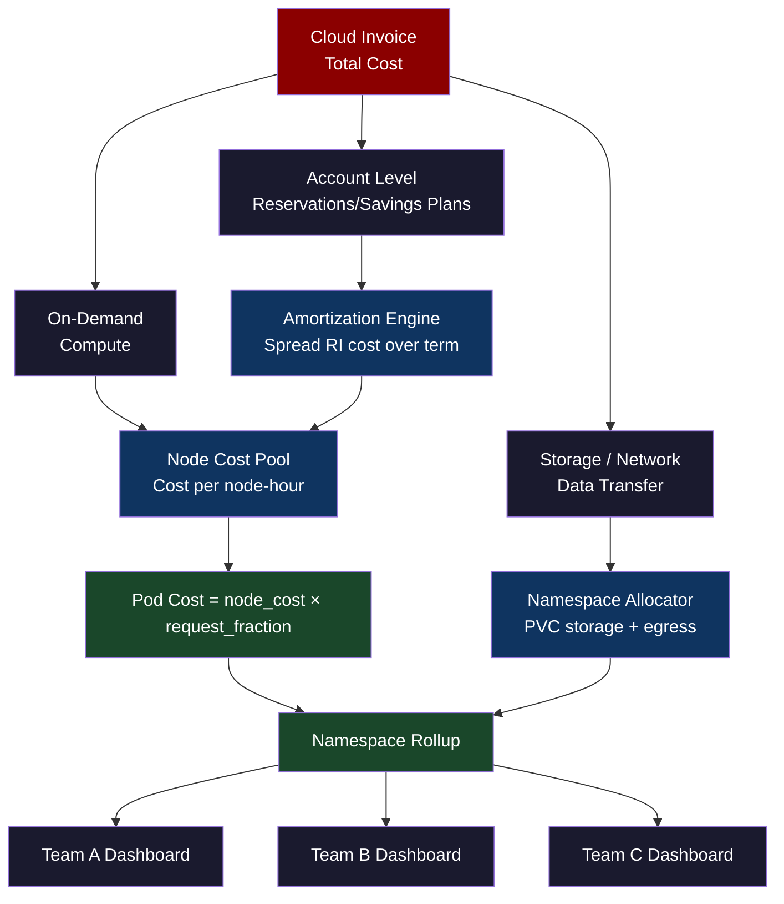
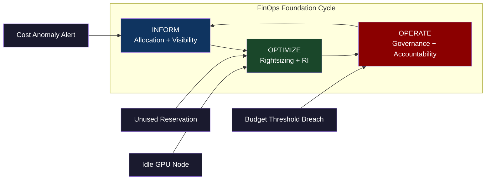
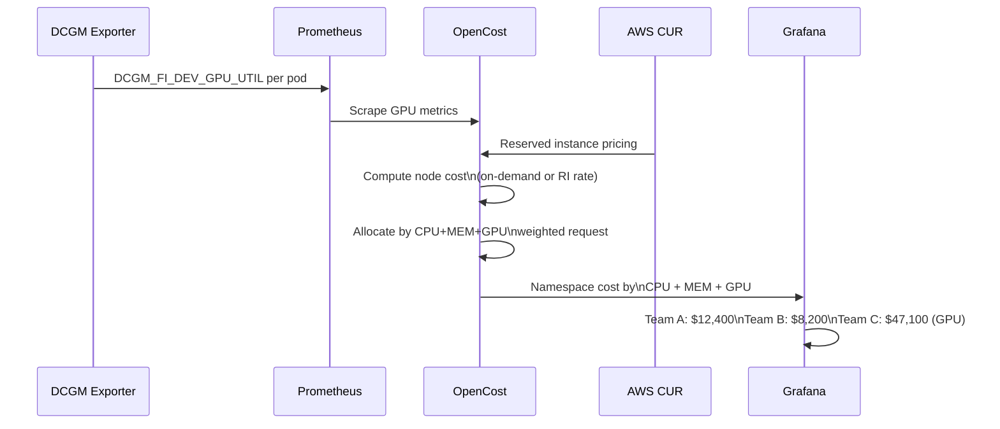
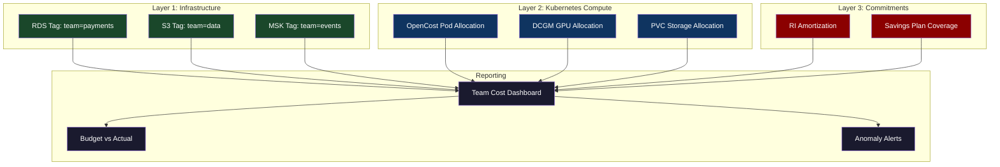
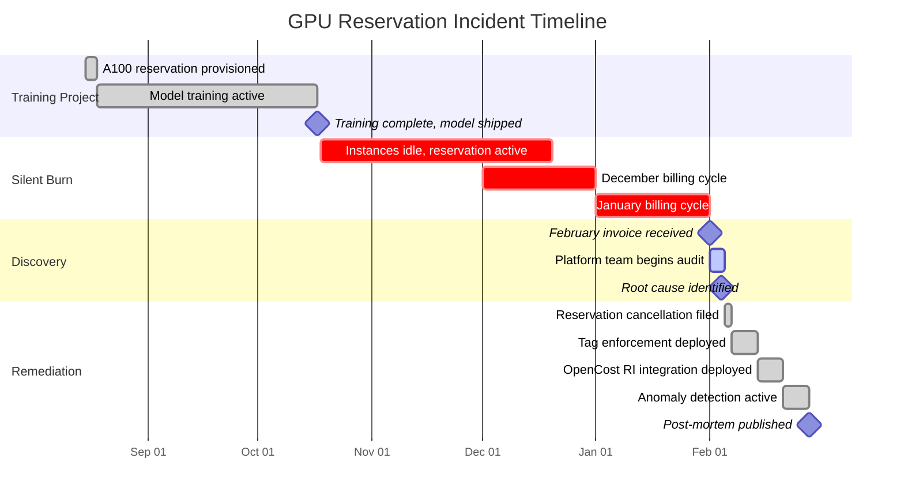

# CH-62: FinOps at Hyperscale — Cost Attribution in a Multi-Tenant Supercluster

**"Spending $10M/month on compute is easy. Knowing which team spent $847,000 of it is hard. Knowing which team should have spent $847,000 less is even harder."**

---

## Cold Open

The invoice arrived on the first of February. $34.2 million for January — up $7.1 million from December with no corresponding growth in traffic. The VP of Engineering forwarded it to the platform team with a single line: "Explain this."

Three engineers spent the next four days inside AWS Cost Explorer, Athena query logs, and kubectl describe outputs trying to reverse-engineer a month of charges into something coherent. The bill showed EC2, EBS, data transfer, GPU hours, NAT gateway fees, S3 storage tiers, and seventeen other line items. None of it mapped cleanly to teams, products, or features. The tagging policy that someone wrote in 2021 — "all resources must have a `team` and `project` tag" — had been ignored by roughly 40% of Terraform modules and 70% of manually provisioned resources. GPU reservations from a Q3 training sprint were still active in January. Nobody had cancelled them.

The reservation line item alone was $2.1 million. Twelve reserved GPU instances — eight A100 nodes, four V100 nodes — that had been provisioned for a model training project that shipped in October. The project was done. The reservation was not. The instances sat idle, burning $58,333 per day in guaranteed charges, their utilization at 0% for sixty-three straight days. Every cost allocation report the team had been running — weekly namespace cost summaries, per-team dashboards in Grafana — showed nothing because the reserved instances were billed at the account level, not the Kubernetes level. OpenCost saw pods. OpenCost did not see the reservation that funded the nodes those pods would have run on.

The platform team's response was to build a proper FinOps practice, not a better dashboard. A dashboard shows you what happened. A practice changes what will happen. Over the following six weeks, they implemented tag enforcement via AWS Config rules (non-compliant resources auto-tagged and owners notified), deployed OpenCost with custom allocation rules that joined Kubernetes namespace costs to reservation pricing, and built anomaly detection on top of CloudWatch Cost Anomaly Detection with Slack alerts at $10K daily variance. The $2.1M/month leak was closed. Three other smaller leaks — totaling $340K/month in oversized RDS instances and idle ECS task definitions — were found in the same audit.

The deeper lesson was not about dashboards or tools. It was about organizational physics: cost attribution without teeth is tourism. When an engineering team gets a Slack message saying "your namespace spent $47,000 this week," and there are no consequences, no chargebacks, no executive review, the message gets snoozed. The teams that reduced costs were the ones whose engineering managers had committed to a budget — a real number they were accountable for. Visibility without accountability is just expensive introspection.

---

## Uncomfortable Truth

The entire FinOps tooling ecosystem — Kubecost, OpenCost, AWS Cost Explorer, CloudHealth, Apptio — is built around the assumption that you can precisely attribute cost to a consumer. You cannot. Not in a shared infrastructure model.

A node running three workloads from three teams has CPU, memory, network, and EBS costs. OpenCost will allocate those proportionally based on resource requests. But if team A requests 4 CPUs and uses 0.5, and team B requests 1 CPU and uses 0.9, the allocation model says team A spent four times more than team B. Team A's developer argues they only used 0.5 CPUs. Team B's developer argues they used 90% of their request. Both are right, and the cost allocation is wrong regardless of which metric you choose.

The uncomfortable truth is that Kubernetes cost allocation is an approximation that creates internal political conflict while pretending to be accounting. It is more accurate than nothing, and it is useful for identifying gross inefficiencies. But when you use it to bill teams — to actually charge-back costs to business units — you will spend as much time arguing about methodology as you save in infrastructure costs. The companies that get FinOps right do not use cost allocation to win arguments. They use it to change engineering incentives before the invoice arrives.

Reserved Instance and Savings Plans optimization compounds this problem. An RI is a commitment made at the account or organization level. The cost is incurred whether the instances run or not. The "savings" only exist in comparison to on-demand pricing — a comparison that assumes the alternative was to run the same workload on-demand, which may not be true. RI amortization models allocate the upfront cost over the reservation term. If team A provisioned the RI and team B consumed it, who benefited? The accounting is ambiguous by design.

---

## Mental Model: The Metered City

Think of a multi-tenant Kubernetes cluster as a city with shared utilities. The city has electricity, water, roads, and sewage. Every resident consumes these utilities to some degree. The utility company bills the city as a whole. The city then has to decide how to allocate that bill to residents.

The naive model is to split equally: every resident pays the same. The request-based model charges proportional to how much each resident asked for. The usage-based model charges proportional to what they actually consumed. Each model is defensible and each produces different results. The city also has fixed costs — the water treatment plant runs whether you use one gallon or a million — and those fixed costs must be allocated somewhere.

**Label: The Metered City Model** — cost attribution is always a policy choice about which consumption metric best drives the behavior you want. There is no "correct" metric, only metrics that incentivize the outcomes you need.





---

## Dissection

### Naive: Tag Everything and Run Cost Explorer

The first instinct every platform team has is to mandate tags and build dashboards. Apply `team=`, `project=`, `env=` to every EC2 instance, every RDS database, every S3 bucket. Query AWS Cost Explorer filtered by tag. Export to Grafana. Done.

This breaks immediately for three reasons. First, Kubernetes workloads do not map to single EC2 instances. A node runs dozens of pods from multiple teams simultaneously. EC2-level tagging tells you which team owns the node — if they own it exclusively — but in a shared cluster, no team owns a node. Second, managed services (RDS, ElastiCache, MSK) are provisioned at the infrastructure level but consumed by applications at the Kubernetes level. The Terraform module that provisions the RDS cluster is owned by the platform team. The application that queries it is owned by a product team. The tag on the RDS instance says `team=platform`. The cost attribution says the platform team spent $80K/month on databases they don't actually control. Third, untagged resources — which are always more than you expect — fall into a black hole. Cost Explorer shows a large "no-tag" bucket. Nobody owns it. Nobody fixes it.

### Why It Breaks: The Attribution Gap

The fundamental problem is a layer mismatch. Cloud billing operates at the resource level (instance, volume, bucket). Application ownership operates at the workload level (deployment, namespace, service). Kubernetes cost allocation bridges this gap by computing a per-pod cost from per-node cost, but the bridge requires two inputs: accurate node pricing (including RI amortization) and accurate resource request data from the Kubernetes API.

OpenCost solves this with a cost allocation model built on four components: node cost (fetched from cloud provider APIs or a pricing configmap), pod resource requests (from the Kubernetes API), actual utilization (from Prometheus metrics), and a configurable weighting between request-based and utilization-based allocation. The formula for pod cost in request-only mode is:

```
pod_cost_hour = (cpu_request / node_cpu) * node_cpu_cost_hour
              + (memory_request / node_memory) * node_memory_cost_hour
```

The node cost includes the amortized RI price if the node is running on a reserved instance. This is where OpenCost's cloud integration matters — it must read the reservation inventory from the AWS Cost and Usage Report (CUR) to compute the correct per-node price.

### GPU Cost Attribution with DCGM

Standard CPU/memory cost models fail for GPU workloads because a GPU is not divisible by default. A pod that requests one A100 gets the full A100. But with MIG (Multi-Instance GPU) or time-slicing, multiple pods share one GPU. DCGM (Data Center GPU Manager) exports per-process GPU utilization, memory utilization, and power consumption as Prometheus metrics. The attribution chain is:

```
DCGM metric: DCGM_FI_DEV_GPU_UTIL{gpu="0", pod="training-job-xyz"}
→ Prometheus scrape
→ OpenCost custom allocation rule: join pod label to GPU util
→ Cost = (gpu_util_fraction) * (gpu_node_cost_hour)
```

In practice, this requires a custom allocation rule in OpenCost's configmap that joins the DCGM pod label to the Kubernetes pod metadata. Without this join, all GPU cost is attributed to the node and allocated by CPU/memory request — which radically undercharges GPU-heavy pods and overcharges CPU-only pods on the same node.



### The Correct Model: Layered Attribution

The correct cost attribution architecture has three layers operating independently and joined at the reporting layer.

**Layer 1: Infrastructure costs** — EC2, RDS, ElastiCache, MSK, S3, data transfer. These are billed at the cloud account level. The attribution model here is ownership: which team owns this resource? Enforced via tag policy (AWS Config rules reject untagged resources) and Terraform workspace isolation (each team's Terraform state owns their resources).

**Layer 2: Kubernetes compute costs** — the cluster's EC2 nodes, EBS volumes for PVCs. These are shared and attributed via OpenCost's pod-level allocation model. GPU nodes use DCGM-augmented allocation.

**Layer 3: Reservation and commitment costs** — RIs, Savings Plans, CUD (GCP Committed Use Discounts). These are amortized across the account and allocated proportionally to teams based on their on-demand equivalent spend. The team that benefits most from the commitment (because they have the most stable workload) is allocated the most commitment cost.



### Rightsizing: VPA as a Cost Instrument

VPA (Vertical Pod Autoscaler) is usually framed as a reliability tool — stop pods from OOMing. At hyperscale, it is a cost instrument. VPA collects CPU and memory utilization for each pod over a rolling window (default 8 days) and generates resource recommendations. In "Off" mode, it only generates recommendations — it does not apply them. This is the FinOps mode: use VPA recommendations as a cost optimization signal, not as an autoscaler.

The workflow: run VPA in recommendation-only mode across all namespaces, export recommendations to a Prometheus metric, compute the cost delta between current requests and recommended requests, surface the top-N "overprovisioned" pods in a weekly engineering review. A pod requesting 4 CPUs that VPA recommends 0.8 CPUs for is wasting 3.2 CPUs worth of node capacity. At $0.048/vCPU-hour, that is $110/month per pod. A namespace with 50 such pods is wasting $5,500/month.

### Tradeoffs

**Showback vs. Chargeback**: Showback (show teams what they spent, no actual charge) is safer organizationally but has weak incentives. Chargeback (actually debit team budgets) creates strong incentives but generates endless attribution disputes. Most mature FinOps practices start with showback and graduate to chargeback only after the attribution model is trusted by the engineering teams.

**Request-based vs. Utilization-based allocation**: Request-based allocation charges you for what you asked for. Utilization-based charges you for what you used. Utilization-based sounds fairer but creates a perverse incentive — teams will reduce resource requests to pay less, which increases OOM risk. Request-based allocation incentivizes right-sizing requests, which is the behavior you want.

**Spot vs. On-demand**: Spot instances can cut GPU training costs by 60-90%. The tradeoff is interruption — a spot instance can be reclaimed with two minutes' notice. For stateless, checkpoint-aware training jobs (which most ML frameworks support via PyTorch's `torch.save` checkpointing), this is acceptable. For latency-sensitive inference, it is not.

---

## War Room

**Incident**: $2.1M/month in orphaned GPU reservations discovered on February 1st.



**Timeline reconstruction**: The training project provisioned twelve reserved GPU instances in August 2024 using a Terraform module. The module had no `lifecycle` block enforcing a destruction plan, no `ttl` tag, and no cost anomaly alert. The model shipped in October. The engineer who provisioned the instances left the company in November. The Terraform state was orphaned — the workspace existed but no pipeline ran `terraform destroy`. The instances appeared in EC2 as running, but no pods were scheduled on them because the training namespace had been deleted. OpenCost saw no pods on those nodes and reported $0 cost for them. The nodes were not visible in Kubernetes because they had never been joined to any cluster — they were bare EC2 reservations, not EKS nodes.

**What failed**: Three independent failure modes compounded. First, no expiry mechanism on GPU reservations — a TTL tag could have triggered an automated alert at 30 days post-project. Second, OpenCost's Kubernetes-level view created a blind spot for non-cluster compute. Third, no weekly reservation utilization review existed — AWS Cost Explorer's "Reservation Coverage" report would have shown 0% utilization on those instances immediately.

**Detection**: The gap was finally noticed not by monitoring but by a human reviewing the raw invoice line items. The platform engineer who found it described it as "looking at the EC2 Reservations tab on a whim."

**Prevention**: After the incident, the team implemented: (1) an AWS Config rule that alerts when any EC2 reservation shows <5% utilization for 7 consecutive days, (2) a Terraform module policy (via Sentinel) that requires a `project_end_date` tag on all GPU resources, (3) a monthly reservation review process owned by the FinOps lead, and (4) OpenCost integration with the AWS CUR to show reservation costs separately from Kubernetes namespace costs.

**Cost**: The 63-day idle burn at $58,333/day totaled $3.675M. The reservation had already been partially paid upfront, making the recoverable amount approximately $2.1M for the remaining reservation term.

---

## Lab: Deploy OpenCost in a kind Cluster

**Objective**: Deploy OpenCost in a local kind cluster, generate a cost allocation report by namespace, and identify the most expensive workload.

**Prerequisites**: `kind`, `kubectl`, `helm`, `curl` installed.

```bash
# 1. Create a kind cluster
cat <<EOF | kind create cluster --config=-
kind: Cluster
apiVersion: kind.x-k8s.io/v1alpha4
nodes:
- role: control-plane
- role: worker
- role: worker
EOF

# 2. Create test namespaces with workloads of different sizes
kubectl create namespace team-alpha
kubectl create namespace team-beta
kubectl create namespace team-gamma

# 3. Deploy workloads with explicit resource requests (this is what OpenCost uses)
kubectl apply -f - <<EOF
apiVersion: apps/v1
kind: Deployment
metadata:
  name: api-server
  namespace: team-alpha
spec:
  replicas: 3
  selector:
    matchLabels:
      app: api-server
  template:
    metadata:
      labels:
        app: api-server
    spec:
      containers:
      - name: app
        image: nginx:alpine
        resources:
          requests:
            cpu: "500m"
            memory: "256Mi"
          limits:
            cpu: "1"
            memory: "512Mi"
---
apiVersion: apps/v1
kind: Deployment
metadata:
  name: ml-worker
  namespace: team-beta
spec:
  replicas: 2
  selector:
    matchLabels:
      app: ml-worker
  template:
    metadata:
      labels:
        app: ml-worker
    spec:
      containers:
      - name: app
        image: nginx:alpine
        resources:
          requests:
            cpu: "2"
            memory: "4Gi"
          limits:
            cpu: "4"
            memory: "8Gi"
---
apiVersion: apps/v1
kind: Deployment
metadata:
  name: cache
  namespace: team-gamma
spec:
  replicas: 1
  selector:
    matchLabels:
      app: cache
  template:
    metadata:
      labels:
        app: cache
    spec:
      containers:
      - name: app
        image: redis:alpine
        resources:
          requests:
            cpu: "100m"
            memory: "128Mi"
EOF

# 4. Install Prometheus (OpenCost dependency)
helm repo add prometheus-community https://prometheus-community.github.io/helm-charts
helm repo update
helm install prometheus prometheus-community/kube-prometheus-stack \
  --namespace monitoring --create-namespace \
  --set prometheus.prometheusSpec.serviceMonitorSelectorNilUsesHelmValues=false \
  --wait --timeout 5m

# 5. Install OpenCost
helm repo add opencost https://opencost.github.io/opencost-helm-chart
helm repo update
helm install opencost opencost/opencost \
  --namespace opencost --create-namespace \
  --set opencost.exporter.defaultClusterId=local-kind \
  --set opencost.prometheus.internal.enabled=false \
  --set opencost.prometheus.external.url=http://prometheus-kube-prometheus-prometheus.monitoring.svc:9090 \
  --wait --timeout 3m

# 6. Wait for OpenCost to collect data (at least 5 minutes for first allocation)
echo "Waiting 5 minutes for OpenCost to collect allocation data..."
sleep 300

# 7. Port-forward and query the API
kubectl port-forward -n opencost svc/opencost 9003:9003 &
PF_PID=$!
sleep 5

# 8. Query cost allocation by namespace (last 1 hour)
curl -s "http://localhost:9003/allocation/compute?window=1h&aggregate=namespace&includeIdle=true" \
  | python3 -m json.tool | grep -A5 '"team-'
```

**Expected output** (approximate, kind uses default CPU price $0.031611/vCPU-hour):

```json
"team-alpha": {
  "name": "team-alpha",
  "cpuCost": 0.0237,
  "ramCost": 0.0082,
  "totalCost": 0.0319,
  "cpuRequest": 1.5,
  "ramRequest": 805306368
},
"team-beta": {
  "name": "team-beta",
  "cpuCost": 0.1264,
  "ramCost": 0.0659,
  "totalCost": 0.1923,
  "cpuRequest": 4.0,
  "ramRequest": 8589934592
},
"team-gamma": {
  "name": "team-gamma",
  "cpuCost": 0.0032,
  "ramCost": 0.0021,
  "totalCost": 0.0053
}
```

```bash
# 9. Query most expensive individual workload
curl -s "http://localhost:9003/allocation/compute?window=1h&aggregate=deployment&includeIdle=false" \
  | python3 -c "
import json, sys
data = json.load(sys.stdin)
allocations = data.get('data', [{}])[0]
sorted_items = sorted(allocations.items(), key=lambda x: x[1].get('totalCost', 0), reverse=True)
for name, alloc in sorted_items[:5]:
    print(f'{name:40s} \${alloc[\"totalCost\"]:.4f}/hr  CPU={alloc[\"cpuRequest\"]:.1f}  RAM={alloc[\"ramBytes\"]/1e9:.1f}GB')
"

# 10. Clean up
kill $PF_PID
kind delete cluster
```

**Expected ranking**: `team-beta/ml-worker` is the most expensive workload by a factor of 6x over `team-alpha/api-server`, despite having only 2 replicas vs 3 — because it requests 2 CPUs and 4GB RAM per pod versus 0.5 CPUs and 256MB. This is the core insight of request-based cost allocation: the cost is in what you claimed, not what you used.

---

## Loose Thread

The $2.1M in orphaned GPU reservations was not a monitoring failure. It was a cultural failure disguised as a technical failure. The monitoring existed — Cost Explorer had the data. The alert did not exist because nobody had decided that idle reservation utilization was a metric worth alerting on. Nobody had decided that because nobody had been asked to own the cost. Nobody had been asked to own the cost because the organization had not yet accepted that cost is an engineering concern, not a finance concern.

FinOps is not a tooling problem. It is an organizational decision about who is responsible for the gap between what infrastructure costs and what it needs to cost. Every tool in this chapter — OpenCost, DCGM attribution, VPA rightsizing, anomaly detection — is a way of making that gap visible. Making the gap visible is necessary but not sufficient. What closes the gap is an engineer who cares, a manager who asks, and a system that makes both of those things automatic.

The next chapter concerns identity. Specifically: who are you, and how does a workload prove it?
