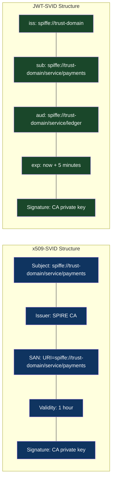
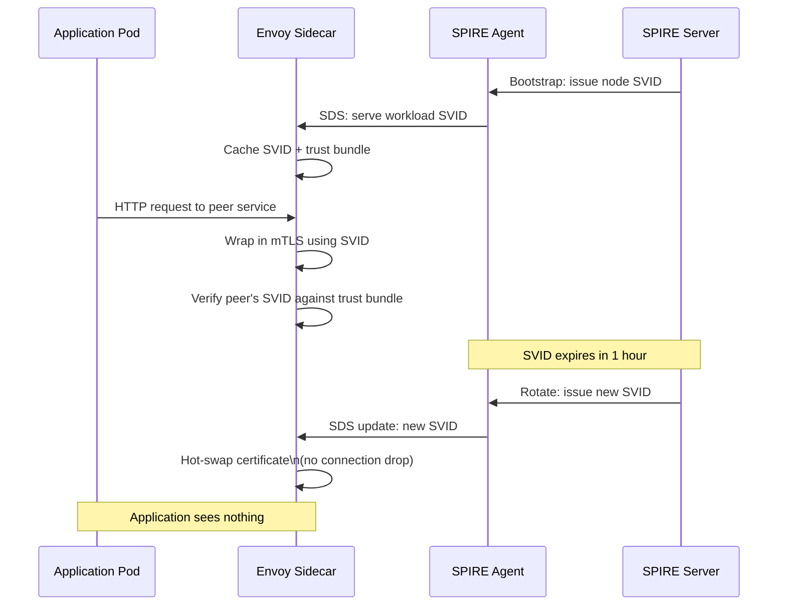

# CH-63: Zero-Trust Networking — SPIFFE/SPIRE and Workload Identity at Scale

**"IP address-based trust models break when workloads move between nodes, pods restart with new IPs, and your 'internal network' contains 10,000 microservices from 50 teams."**

---

## Cold Open

The firewall rule was fourteen years old. Nobody knew who wrote it. The JIRA ticket reference in the comment pointed to a project that had been archived in 2013. The rule said: `10.4.0.0/16 → 10.8.0.0/16 ALLOW`. It was a blanket allow between two subnets that, in 2010, corresponded to "the payments cluster" and "the data warehouse cluster." By 2024, those subnets had been reallocated four times, routed to six different VPCs across three AWS regions, and both the payments cluster and the data warehouse had been rebuilt on Kubernetes three years prior. The subnets now contained roughly 400 pods from 23 different teams.

The security team discovered the rule during an audit. They flagged it. The network team said they could not delete it without knowing what depended on it. The platform team said they did not know which pods were in which subnet at any given time — Kubernetes schedules pods wherever nodes have capacity, and the pod CIDR is cluster-wide, not team-aligned. The audit finding sat in the backlog for eight months. Nobody had the blast radius analysis to safely delete the rule, and nobody had time to build the blast radius analysis.

This is the foundational failure of perimeter-based network security in a Kubernetes world. The perimeter model assumes that network location is a meaningful security boundary. Inside the VPC, you trust traffic. Outside, you distrust it. In a multi-tenant Kubernetes cluster, "inside the VPC" includes every pod from every team, every CI/CD runner, every debug pod that an engineer spawned and forgot to delete, and every compromised workload that managed to get scheduled before anyone noticed. The network perimeter is not a security boundary. It is a liability that creates the illusion of security.

The payments service needs to call the ledger service. The right security model is not "allow traffic from the payments subnet to the ledger subnet." The right model is "allow traffic from a workload that can cryptographically prove it is the payments service to a workload that can cryptographically prove it is the ledger service." The network path is irrelevant. The identity is everything. That is SPIFFE.

---

## Uncomfortable Truth

SPIFFE and SPIRE are specifications and implementations that most engineers have heard of and few have actually deployed. The documentation is correct but assumes familiarity with PKI, X.509 certificates, and trust bundle management that many Kubernetes-fluent engineers do not have. The result is that most organizations use service meshes (Istio, Linkerd) that implement SPIFFE under the hood without exposing the SPIFFE API directly — and then have no idea what is happening when certificate rotation fails or when workload attestation rejects a pod.

The uncomfortable truth is that zero-trust networking, as actually practiced, is usually "mTLS between services via a service mesh with certificates managed by the mesh's internal CA." This is meaningfully better than nothing. It is not zero-trust in the rigorous sense. The mesh's internal CA is a single point of trust. If the CA is compromised, every service-to-service certificate in the cluster is compromised. SPIFFE with a properly federated SPIRE deployment addresses this by making the trust anchor auditable and rotatable without downtime — but "properly federated SPIRE" is a harder operational target than "install Istio."

The deeper issue is that identity is not just about the certificate. Identity is about the chain of attestation. When SPIRE issues a certificate to a pod, it does so because the SPIRE agent on that node has attested that the pod matches certain selectors: specific Kubernetes namespace, specific service account, specific pod labels. If those selectors are wrong — if the workload selector is too broad, like `k8s:ns:production` — then any pod in production gets the same SVID. The certificate is authentic but the identity claim is meaningless. SPIFFE is a framework for getting workload identity right. Getting it right requires care.

---

## Mental Model: The Physical Badge System

SPIFFE/SPIRE works exactly like a corporate physical badge system, except the badges are cryptographic and the guard is a software daemon.

When you join a company, HR (the SPIRE Server, acting as the trust anchor) issues you a badge (an SVID — SPIFFE Verifiable Identity Document). The badge contains your identity claim (your SPIFFE ID: `spiffe://company.com/employee/jenish`) and is signed by the company's CA key. To enter a room, you present your badge to a reader (the mTLS handshake). The reader verifies your badge's signature against the company's public CA (the trust bundle). If valid, you enter. The room does not care which building entrance you used or which hallway you walked through. It cares only that your badge is valid.

The guard who initially issues the badge does not just take your word for who you are. The guard (SPIRE Agent) checks your employee ID against HR's system (node attestation), then checks your physical appearance against your badge photo (workload attestation). Only when both checks pass does the agent countersign a certificate request to HR for your badge.

**Label: The Cryptographic Badge System** — workload identity is not about network location; it is about a chain of attestation that begins at hardware and ends at an X.509 certificate that the workload carries into every connection it makes.

```mermaid
graph TD
    A[SPIRE Server\nTrust Anchor + CA] --> B[Trust Bundle\nRoot CA Certificate]
    A --> C[Registration Entries\nSpiffe IDs + Selectors]
    D[SPIRE Agent\nRuns on each node] --> E[Node Attestation\nAWS IID / k8s SAT]
    D --> F[Workload API\nUnix domain socket]
    E --> A
    G[Pod / Workload] --> F
    F --> H{Workload\nAttestation}
    H --> I[Check k8s selectors\nnamespace, sa, labels]
    I --> A
    A --> J[Issue x509-SVID\nfor spiffe://domain/workload]
    J --> G
    G --> K[mTLS connection\nto another service]
    K --> L[Peer presents SVID\nverified against trust bundle]

    style A fill:#8b0000,color:#fff
    style B fill:#1a1a2e,color:#fff
    style C fill:#1a1a2e,color:#fff
    style D fill:#0f3460,color:#fff
    style E fill:#0f3460,color:#fff
    style F fill:#0f3460,color:#fff
    style G fill:#1a472a,color:#fff
    style H fill:#1a472a,color:#fff
    style I fill:#1a472a,color:#fff
    style J fill:#8b0000,color:#fff
    style K fill:#1a1a2e,color:#fff
    style L fill:#1a1a2e,color:#fff
```





---

## Dissection

### Naive: Static Certificate Files Mounted as Kubernetes Secrets

The naive workload identity model is to generate a certificate for each service, store it as a Kubernetes Secret, and mount it into the pod as a file. The application reads the certificate on startup and presents it for mTLS. This works for approximately one year, which is the typical certificate validity period.

After one year, the certificate expires. Either someone notices before expiration and manually rotates (fraught — you must update the Secret, which triggers pod restarts, and if you miss one service the mTLS handshake fails), or the certificate expires and everything that depends on mTLS breaks at 3 AM on a Tuesday. The manual rotation also requires access to the private CA, which is typically locked behind a manual process. At Uber, before their SPIRE migration, quarterly certificate rotation was a full-day operation involving three teams, a runbook with forty-two steps, and a maintenance window.

### Why It Breaks: The Stale Identity Problem

Static certificates have three fundamental problems. First, they are long-lived (1 year typical) — a compromised certificate gives an attacker a year-long credential that is indistinguishable from a legitimate one. Second, they are not tied to the workload's runtime identity — a certificate for `payments-service` mounted as a Secret can be copied to any pod that has Secret-read access. Third, rotation requires coordination that scales linearly with the number of services.

At 10,000 services, manual certificate rotation is not a quarterly operation. It is a full-time job. And it is a job that cannot be done continuously — certificates cannot all expire at different times on different schedules without a system that tracks expiry, triggers rotation, validates the new certificate, and confirms the old certificate is no longer presented. That system is SPIRE.

### SPIRE Architecture in Detail

SPIRE has two components: the SPIRE Server and the SPIRE Agent.

The **SPIRE Server** is the trust anchor and the CA. It holds the root key material (or delegates to an upstream CA like Vault). It maintains a database of registration entries — mappings from SPIFFE IDs to workload selectors. A registration entry looks like:

```yaml
# spire-entry.yaml — registration entry for the payments service
spiffeID: spiffe://prod.example.com/service/payments
parentID: spiffe://prod.example.com/k8s-node/ip-10-0-1-42
selectors:
  - type: k8s
    value: "ns:payments"
  - type: k8s
    value: "sa:payments-service"
  - type: k8s
    value: "pod-label:app:payments"
```

When all three selectors match a pod, SPIRE will issue an SVID for `spiffe://prod.example.com/service/payments`. If any selector fails — wrong namespace, wrong service account, missing label — no SVID is issued.

The **SPIRE Agent** runs as a DaemonSet on every node. It performs two attestation steps. Node attestation establishes the agent's own identity — on AWS, this uses the EC2 Instance Identity Document (IID): the agent presents the IID to the server, the server verifies it against the AWS API, and issues a node SVID. Workload attestation happens when a pod calls the Workload API (a Unix domain socket at `/run/spire/sockets/agent.sock`). The agent inspects the calling process via the `/proc` filesystem to determine which pod and container made the call, then checks that pod's metadata against the registration entries.

```go
// Go workload using SPIRE Workload API SDK
package main

import (
    "context"
    "crypto/tls"
    "crypto/x509"
    "log"
    "net/http"

    "github.com/spiffe/go-spiffe/v2/spiffeid"
    "github.com/spiffe/go-spiffe/v2/spiffetls"
    "github.com/spiffe/go-spiffe/v2/workloadapi"
)

func main() {
    ctx := context.Background()

    // Connect to SPIRE agent workload API
    source, err := workloadapi.NewX509Source(ctx,
        workloadapi.WithClientOptions(
            workloadapi.WithAddr("unix:///run/spire/sockets/agent.sock"),
        ),
    )
    if err != nil {
        log.Fatalf("Unable to create X509Source: %v", err)
    }
    defer source.Close()

    // source.GetX509SVID() returns the current SVID and auto-rotates it
    svid, err := source.GetX509SVID()
    if err != nil {
        log.Fatalf("Unable to fetch SVID: %v", err)
    }
    log.Printf("Got SVID: %s (expires: %s)", svid.ID, svid.Certificates[0].NotAfter)

    // Make an mTLS call to the ledger service, only trusting the ledger's SPIFFE ID
    ledgerID := spiffeid.RequireIDFromString("spiffe://prod.example.com/service/ledger")

    tlsConfig := spiffetls.MTLSClientConfig(source, source, spiffetls.AuthorizeID(ledgerID))

    client := &http.Client{
        Transport: &http.Transport{
            TLSClientConfig: tlsConfig,
        },
    }

    resp, err := client.Get("https://ledger.payments.svc.cluster.local/balance")
    if err != nil {
        log.Fatalf("mTLS call failed: %v", err)
    }
    log.Printf("Response: %d", resp.StatusCode)
}
```

### Envoy Integration: SPIFFE Without Application Changes

Most applications cannot be modified to call the Workload API directly. SPIRE integrates with Envoy via the SDS (Secret Discovery Service) API. The SPIRE Agent implements SDS and serves SVIDs to Envoy sidecars. Envoy uses the SVID for all outbound mTLS connections, verifying peer SVIDs against the SPIFFE trust bundle. The application talks to Envoy on localhost, sees plaintext, and has no knowledge of the certificate rotation happening beneath it.



### Tradeoffs

**x509-SVID vs JWT-SVID**: x509-SVIDs are used for mTLS — they authenticate both ends of a connection at the transport layer. JWT-SVIDs are used for HTTP bearer tokens — they authenticate a request at the application layer and can be passed through proxies. Use x509 for service-to-service calls, JWT when a service needs to call an external API that does not support mTLS.

**Short-lived SVIDs (1h vs 24h)**: One-hour SVIDs minimize the window of a compromised credential. The SPIRE agent rotates automatically at half the TTL (30 minutes), so no application ever sees an expired certificate. The cost is more frequent CA operations. The benefit is that if an SVID is compromised, it is useless within an hour.

**SPIRE vs Cert-Manager**: Cert-manager issues certificates for Kubernetes workloads using ACME or an internal CA. It does not do workload attestation — any Kubernetes entity with RBAC access to create Certificate objects can get a certificate for any identity. SPIRE's workload attestation model is stricter: only pods that match the registered selectors get the corresponding SVID.

---

## War Room

**Incident**: Uber's certificate rotation migration — a quarterly 8-hour operation condensed to zero-downtime automation.

```mermaid
gantt
    title Uber Certificate Rotation: Before and After SPIRE
    dateFormat  YYYY-MM-DD
    axisFormat  %b %d

    section Before SPIRE (Q3 2022)
    Maintenance window announced        :done, ann, 2022-09-01, 3d
    Certificate generation (manual)     :crit, gen, 2022-09-10, 1d
    Secret update across 400 services   :crit, upd, 2022-09-11, 1d
    Rolling restart of all pods         :crit, rst, 2022-09-12, 6h
    Validation + smoke tests            :crit, val, 2022-09-12, 2h
    Partial outage: 3 services missed   :crit, out, 2022-09-12, 40m
    Rollback + re-rotation              :crit, rb, 2022-09-12, 2h
    Full validation                     :done, fv, 2022-09-12, 3h

    section SPIRE Migration
    SPIRE server deployment             :done, spire, 2022-10-01, 14d
    Pilot: 20 services migrated         :done, pilot, 2022-10-15, 14d
    Rollout: 400 services               :done, rollout, 2022-11-01, 30d
    SPIRE fully operational             :milestone, m1, 2022-12-01, 0d

    section After SPIRE (Q1 2023)
    Automatic rotation (continuous)     :active, auto, 2023-01-01, 90d
    Zero maintenance windows            :active, zero, 2023-01-01, 90d
```

**Before SPIRE**: Every quarter, Uber's infrastructure team conducted a certificate rotation involving generating new certificates for approximately 400 microservices, updating Kubernetes Secrets in three clusters, triggering rolling restarts, and validating mTLS connectivity. The process took eight hours with a full team on call. In Q3 2022, the rotation missed three services. Those services continued presenting the old certificate after the trust bundle was updated to no longer include the old CA. The result was a 40-minute partial outage where those three services could not establish mTLS connections to any of their dependencies.

**Root cause**: The rotation was a state machine with no idempotency. The script that updated Secrets read a static list of services. Three services had been added to the mesh after the list was last updated. The script did not fail — it succeeded for 397 services and silently skipped the three that were not in its list. The monitoring detected the outage at the application level (increased 503 errors), not at the certificate level.

**After SPIRE**: Certificate rotation became a background process. SPIRE agents rotate SVIDs at half the TTL with no application involvement. Adding a new service to the mesh requires one registration entry. The quarterly 8-hour operation was replaced by a Terraform resource that takes 30 seconds to apply.

**The cultural finding**: The SPIRE migration was technically straightforward. The hard part was getting 50 application teams to add the Workload API socket mount to their pod specs. The platform team solved this by building a mutating admission webhook that automatically injected the SPIRE socket mount into any pod with a specific annotation (`spiffe.io/inject: "true"`). Eventually they made the injection opt-out rather than opt-in.

---

## Lab: Deploy SPIRE and Verify mTLS Between Two Pods

**Objective**: Deploy SPIRE on a kind cluster, issue SVIDs to two pods, and verify mTLS is enforced between them.

```bash
# 1. Create kind cluster
kind create cluster --name spire-lab

# 2. Deploy SPIRE using official Kubernetes quickstart
kubectl apply -f https://raw.githubusercontent.com/spiffe/spire/v1.9.0/support/k8s/quickstart/spire-namespace.yaml
kubectl apply -f https://raw.githubusercontent.com/spiffe/spire/v1.9.0/support/k8s/quickstart/server-account.yaml
kubectl apply -f https://raw.githubusercontent.com/spiffe/spire/v1.9.0/support/k8s/quickstart/server-cluster-role.yaml
kubectl apply -f https://raw.githubusercontent.com/spiffe/spire/v1.9.0/support/k8s/quickstart/server-configmap.yaml
kubectl apply -f https://raw.githubusercontent.com/spiffe/spire/v1.9.0/support/k8s/quickstart/server-statefulset.yaml
kubectl apply -f https://raw.githubusercontent.com/spiffe/spire/v1.9.0/support/k8s/quickstart/server-service.yaml

# 3. Deploy SPIRE Agent
kubectl apply -f https://raw.githubusercontent.com/spiffe/spire/v1.9.0/support/k8s/quickstart/agent-account.yaml
kubectl apply -f https://raw.githubusercontent.com/spiffe/spire/v1.9.0/support/k8s/quickstart/agent-cluster-role.yaml
kubectl apply -f https://raw.githubusercontent.com/spiffe/spire/v1.9.0/support/k8s/quickstart/agent-configmap.yaml
kubectl apply -f https://raw.githubusercontent.com/spiffe/spire/v1.9.0/support/k8s/quickstart/agent-daemonset.yaml

kubectl -n spire wait --for=condition=ready pod -l app=spire-server --timeout=60s
kubectl -n spire wait --for=condition=ready pod -l app=spire-agent --timeout=60s

# 4. Register workload entries
SPIRE_SERVER=$(kubectl -n spire get pod -l app=spire-server -o jsonpath='{.items[0].metadata.name}')

# Register the client workload
kubectl -n spire exec $SPIRE_SERVER -- \
  /opt/spire/bin/spire-server entry create \
  -spiffeID spiffe://example.org/service/client \
  -parentID spiffe://example.org/ns/spire/sa/spire-agent \
  -selector k8s:ns:default \
  -selector k8s:sa:client-sa

# Register the server workload
kubectl -n spire exec $SPIRE_SERVER -- \
  /opt/spire/bin/spire-server entry create \
  -spiffeID spiffe://example.org/service/server \
  -parentID spiffe://example.org/ns/spire/sa/spire-agent \
  -selector k8s:ns:default \
  -selector k8s:sa:server-sa

# 5. Create service accounts
kubectl create serviceaccount client-sa
kubectl create serviceaccount server-sa

# 6. Deploy a simple server that validates mTLS with SPIFFE
kubectl apply -f - <<'EOF'
apiVersion: v1
kind: Pod
metadata:
  name: spiffe-server
  namespace: default
spec:
  serviceAccountName: server-sa
  containers:
  - name: server
    image: ghcr.io/spiffe/spiffe-helper:latest
    command: ["/bin/sh", "-c"]
    args:
    - |
      # Use spiffe-helper to fetch SVID and run a TLS server
      cat > /tmp/helper.conf <<CONF
      agentAddress = "/run/spire/sockets/agent.sock"
      cmd = "openssl s_server -accept 8443 -cert /tmp/svid.pem -key /tmp/key.pem -CAfile /tmp/bundle.pem -Verify 1"
      certDir = "/tmp"
      renewSignal = "SIGUSR1"
      svidFileName = "svid.pem"
      svidKeyFileName = "key.pem"
      svidBundleFileName = "bundle.pem"
      CONF
      /opt/spiffe-helper/spiffe-helper -config /tmp/helper.conf
    volumeMounts:
    - name: spire-agent-socket
      mountPath: /run/spire/sockets
      readOnly: true
  volumes:
  - name: spire-agent-socket
    hostPath:
      path: /run/spire/sockets
      type: Directory
EOF

# 7. Verify SVID was issued to server pod
kubectl exec spiffe-server -- \
  /opt/spire/bin/spire-agent api fetch x509 \
  -socketPath /run/spire/sockets/agent.sock \
  2>&1 | grep -E "SPIFFE ID|Expiry"
```

**Expected output**:

```
SPIFFE ID: spiffe://example.org/service/server
Expiry    : 2024-02-15 14:32:07 +0000 UTC (in 59 minutes 43 seconds)
```

The key observation: the SVID is issued within seconds of the pod starting, rotates automatically before expiry, and is scoped to the exact pod identity registered in SPIRE. No human action required after the initial registration entry is created.

---

## Loose Thread

SPIFFE solves the naming problem. It gives every workload in every cluster in every cloud a name that is cryptographically bound to its runtime identity — not its IP address, not its hostname, but its actual identity as a software artifact running in a known, attested environment. The name is a URI: `spiffe://trust-domain/path`. It is elegant in its simplicity and ferocious in its implications. When every service carries a certificate that proves who it is and every peer can verify that proof without trusting the network, the 14-year-old firewall rule becomes irrelevant. Not because you deleted it. Because nothing depends on it anymore.

But a certificate is only as strong as its rotation story. The next chapter is about certificates at scale — ten thousand of them, rotating continuously, with no downtime allowed.
