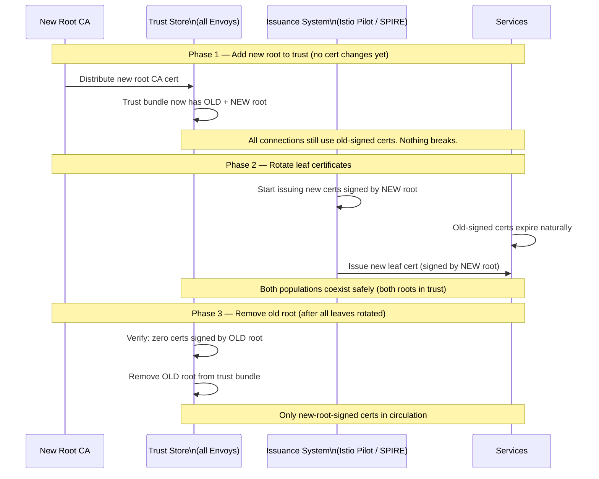
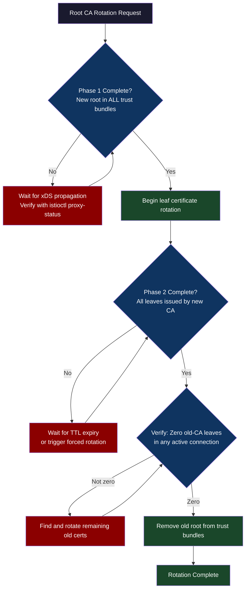
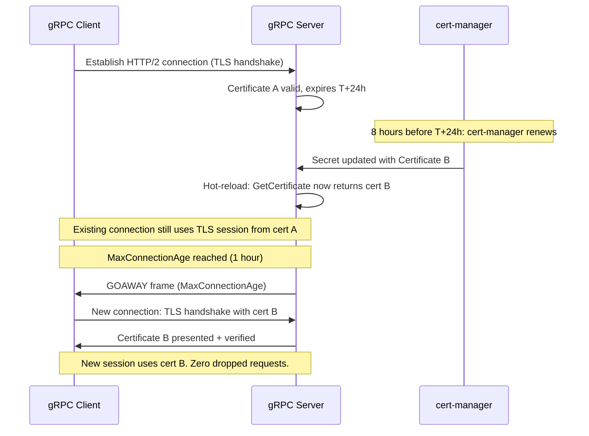

# CH-64: mTLS at Scale — Certificate Rotation Without Downtime

**"mTLS between 10,000 services means 10,000 certificates, each expiring on its own schedule, with no downtime allowed for rotation. This is a distributed systems problem, not a security problem."**

---

## Cold Open

The outage started at 2:14 AM Pacific on a Thursday. The on-call engineer for Lyft's payments infrastructure was paged thirty seconds after the first 503 responses appeared. The alert said: "payments-gateway: error rate > 5% (current: 34%)." By the time she had her laptop open, the error rate was 61%.

The grafana dashboard showed something unusual: the errors were not uniform. Some payments-gateway pods were healthy. Others were failing every request. The failures correlated with pod age — specifically, pods that had been running for more than four hours were failing, while recently restarted pods were healthy. That pattern meant one thing: certificate expiration. But the certificates were supposed to have a 24-hour validity with automatic rotation at the 12-hour mark. It was 2 AM. A certificate issued at 2 PM the previous day had rotated at 2 AM this morning. Something in that rotation had gone wrong.

The root cause took forty minutes to find. Lyft had recently migrated their service mesh CA from the Istio default self-signed CA to a new organization CA, rotated as part of a corporate security compliance project. The migration had rotated the root CA — but the rotation order was wrong. The new root CA was deployed. Istio's Pilot CA started issuing leaf certificates signed by the new root. But the trust bundle — the set of root CAs that each Envoy proxy trusts for peer verification — had not yet propagated to all nodes. The trust bundle distribution in Istio goes through the xDS push mechanism, which fans out to all Envoy sidecars asynchronously. Nodes with high network latency or high CPU load received the trust bundle update later than others.

For approximately forty minutes, two populations of Envoy sidecars coexisted in the cluster: those with the new root in their trust bundle, and those without. When a new-cert service called an old-trust-bundle service, the handshake succeeded — the old trust bundle still included the old root, and the new cert might have been signed by the old root if it predated the CA rotation. When a new-cert service called another new-cert service on a node that hadn't received the trust bundle update, the handshake failed: the caller presented a certificate signed by the new root CA, which the peer's trust bundle did not recognize.

The fix was operationally simple: wait for the trust bundle to fully propagate (confirmed via `istioctl proxy-status`), then restart the handful of pods that had received new certificates before the trust bundle was fully distributed. The total outage duration was 40 minutes. The prevention was procedural: never rotate the root CA before confirming trust bundle propagation is complete and verified on all nodes.

---

## Uncomfortable Truth

mTLS is not a feature you turn on. It is a distributed cryptographic protocol that requires every participant — every client, every server, every proxy — to maintain synchronized state about which certificates are valid at any given moment. "Synchronized state" in a system with 10,000 services and millions of connections does not mean "simultaneously update everything." It means "carefully manage the overlap window between old and new trust so that no transition breaks any active connection."

The rotation problem is a consensus problem in disguise. You are trying to get a distributed system to agree on the set of valid signing authorities at a specific point in time. Unlike a database transaction, you cannot lock the network while you rotate. Services are making connections continuously. You cannot declare a maintenance window — that would mean taking the mTLS mesh offline, which defeats its purpose. The only safe rotation strategy is additive before subtractive: add the new CA to the trust bundle before issuing any certificates signed by the new CA, then issue new certificates, then remove the old CA from the trust bundle only after every certificate signed by the old CA has been replaced.

This three-phase process — add new CA, rotate leaves, remove old CA — takes time proportional to the certificate TTL. If leaf certs are valid for 24 hours, you must wait 24 hours between "issue new leaf certs" and "remove old root CA." If leaf certs are valid for 1 hour (the SPIRE model), the full rotation completes in 3-4 hours. Short certificate TTLs are not just a security improvement. They are an operational improvement that reduces the blast radius of a mistaken rotation and shortens the time required to fully complete a CA rotation.

---

## Mental Model: The Overlapping Key Ceremony

A CA rotation is like changing the locks on every door in a 10,000-room building while people are continuously walking through those doors. The naive approach — change all locks simultaneously at 3 AM — requires a maintenance window and leaves anyone mid-door with a broken key. The correct approach is a three-phase key ceremony.

Phase 1: Distribute new keys to everyone. Every resident gets a new key in addition to their old key. Both keys open their door. No locks have changed yet. Phase 2: Change the locks to accept both old and new keys. Anyone with either key can now enter any room. Phase 3: After every resident has proven they can open doors with their new key, remove the old key. Nobody needs the old key anymore.

In TLS terms: Phase 1 is distributing the new root CA certificate to all trust bundles. Phase 2 is issuing new leaf certificates signed by the new root CA — during this phase, old-root-signed and new-root-signed certs are both valid because both roots are in the trust bundle. Phase 3 is removing the old root CA from trust bundles only after every leaf certificate has been rotated to the new CA.

**Label: The Three-Phase Key Ceremony** — a CA rotation is an additive-then-subtractive operation; subtracting the old trust before rotating all leaves is how 40-minute outages are made.





---

## Dissection

### TLS Handshake Mechanics (What Matters for Operations)

The TLS 1.3 handshake takes two round trips for a new connection (1.5 RTT), or zero round trips if 0-RTT is enabled. For mTLS, both sides present certificates. The sequence matters operationally:

1. Client sends ClientHello with supported cipher suites and supported_groups.
2. Server responds with ServerHello, its certificate chain, and a CertificateVerify signature.
3. Client verifies the server certificate against its trust bundle. If verification fails, the connection closes immediately with a TLS alert.
4. Client sends its own certificate chain and CertificateVerify.
5. Server verifies the client certificate against its trust bundle. If the server does not have the client's signing CA in its trust bundle, the connection fails.

Step 3 and step 5 are where CA rotation failures manifest. If the server presents a certificate signed by a new CA that the client's trust bundle doesn't include, step 3 fails. If the client presents a certificate signed by a new CA that the server's trust bundle doesn't include, step 5 fails. Both failures look the same from the application layer: a connection refused or a TLS error.

The overhead of a TLS handshake is approximately 0.5ms on a local network (dominated by CPU for crypto operations, not RTT). For long-lived gRPC connections, this handshake cost is amortized over millions of requests. For short-lived HTTP/1.1 connections that open a new TCP connection per request, TLS handshake cost can dominate latency. This is one reason service meshes use HTTP/2 (persistent connections with multiplexed streams) for service-to-service communication.

### cert-manager: Kubernetes-Native Certificate Lifecycle

cert-manager automates certificate issuance and rotation in Kubernetes by watching `Certificate` CRDs and reconciling them against an `Issuer` or `ClusterIssuer`. The rotation mechanism is proactive: cert-manager renews certificates when `renewBefore` time before expiry (default: 2/3 of the certificate's duration).

```yaml
# cert-manager Certificate for a service
apiVersion: cert-manager.io/v1
kind: Certificate
metadata:
  name: payments-gateway-tls
  namespace: payments
spec:
  secretName: payments-gateway-tls-secret
  duration: 24h
  renewBefore: 8h        # Renew 8 hours before expiry (at 16h mark)
  subject:
    organizations:
      - example.com
  privateKey:
    algorithm: ECDSA
    size: 256
    rotationPolicy: Always  # Generate new key on each renewal
  dnsNames:
    - payments-gateway.payments.svc.cluster.local
  issuerRef:
    name: internal-ca-issuer
    kind: ClusterIssuer
---
# The corresponding ClusterIssuer using Vault as the upstream CA
apiVersion: cert-manager.io/v1
kind: ClusterIssuer
metadata:
  name: internal-ca-issuer
spec:
  vault:
    path: pki/sign/payments-service
    server: https://vault.infra.svc.cluster.local:8200
    caBundle: <base64-encoded-vault-CA>
    auth:
      kubernetes:
        role: cert-manager
        mountPath: /v1/auth/kubernetes
        serviceAccountRef:
          name: cert-manager
```

When cert-manager renews a certificate, it updates the Kubernetes Secret in-place. Any application that reads the certificate file from the mounted Secret path must handle the file changing beneath it. Most TLS libraries support watching for file changes and hot-reloading certificates — but applications must explicitly implement this. An application that reads the cert once at startup and never checks again will present expired certificates until it restarts.

```go
// Go: TLS server with automatic certificate hot-reload
package main

import (
    "crypto/tls"
    "log"
    "net/http"
    "sync"
    "time"
)

// HotReloadCertificate wraps a tls.Certificate with file-watching reload.
type HotReloadCertificate struct {
    mu       sync.RWMutex
    cert     *tls.Certificate
    certFile string
    keyFile  string
}

func NewHotReloadCertificate(certFile, keyFile string) (*HotReloadCertificate, error) {
    h := &HotReloadCertificate{certFile: certFile, keyFile: keyFile}
    if err := h.reload(); err != nil {
        return nil, err
    }
    go h.watchAndReload()
    return h, nil
}

func (h *HotReloadCertificate) reload() error {
    cert, err := tls.LoadX509KeyPair(h.certFile, h.keyFile)
    if err != nil {
        return err
    }
    h.mu.Lock()
    h.cert = &cert
    h.mu.Unlock()
    log.Printf("Certificate reloaded, expires: %s",
        cert.Leaf.NotAfter.Format(time.RFC3339))
    return nil
}

func (h *HotReloadCertificate) watchAndReload() {
    // In production, use fsnotify. For simplicity, poll every 5 minutes.
    ticker := time.NewTicker(5 * time.Minute)
    for range ticker.C {
        if err := h.reload(); err != nil {
            log.Printf("Certificate reload failed: %v", err)
        }
    }
}

// GetCertificate satisfies tls.Config.GetCertificate — called on each handshake
func (h *HotReloadCertificate) GetCertificate(_ *tls.ClientHelloInfo) (*tls.Certificate, error) {
    h.mu.RLock()
    defer h.mu.RUnlock()
    return h.cert, nil
}

func main() {
    hotCert, err := NewHotReloadCertificate("/certs/tls.crt", "/certs/tls.key")
    if err != nil {
        log.Fatalf("Failed to load certificate: %v", err)
    }

    tlsConfig := &tls.Config{
        GetCertificate: hotCert.GetCertificate,
        MinVersion:     tls.VersionTLS13,
        ClientAuth:     tls.RequireAndVerifyClientCert,
    }

    server := &http.Server{
        Addr:      ":8443",
        TLSConfig: tlsConfig,
    }

    log.Fatal(server.ListenAndServeTLS("", "")) // cert/key handled by GetCertificate
}
```

### Connection Draining During Rotation

Long-lived HTTP/2 or gRPC connections survive certificate rotation — the TLS session negotiated at connection establishment is not re-negotiated when the certificate changes. This is mostly a feature: no connection drops during rotation. The edge case is when a connection has been alive for longer than the certificate validity period — the peer's certificate has expired on the wire but the TLS session is still active.

TLS does not automatically close a connection when a peer's certificate expires. The connection continues until closed by either side. In a high-security environment, you may want to enforce maximum connection age: close connections older than the certificate TTL to force re-authentication. gRPC supports this via `MaxConnectionAge` on the server:

```go
import "google.golang.org/grpc/keepalive"

grpc.NewServer(
    grpc.KeepaliveParams(keepalive.ServerParameters{
        MaxConnectionAge:      time.Hour,       // Force reconnect every hour
        MaxConnectionAgeGrace: time.Minute * 5, // Give 5 minutes to drain
    }),
)
```



### ALPN and Protocol Negotiation

ALPN (Application-Layer Protocol Negotiation) is a TLS extension that lets client and server negotiate which application protocol (HTTP/1.1, h2, etc.) to use during the TLS handshake, avoiding an extra round trip. In service meshes, ALPN is used to distinguish mTLS traffic from regular TLS: Istio's Envoy sidecars negotiate `istio-peer-exchange` as the ALPN protocol for mTLS connections between Envoy proxies. This lets Envoy route mTLS-authenticated traffic differently from non-mTLS traffic without inspecting the application layer.

### Tradeoffs

**24h vs 1h TTL**: 24-hour certificates mean one rotation per day, with minimal CA load. A compromise credential is valid for up to 24 hours. One-hour certificates mean 24 rotations per day, higher CA load, but a one-hour blast radius on compromise. SPIRE defaults to 1 hour. cert-manager defaults to 90 days (Let's Encrypt style). For internal mTLS, 24 hours with a rotation trigger at the 16-hour mark is a reasonable balance.

**ECDSA vs RSA**: ECDSA-P256 certificates are smaller (fewer bytes to transmit) and generate/verify faster than RSA-2048. For high-throughput mTLS where handshakes happen frequently (HTTP/1.1 per-request), ECDSA makes a measurable difference. RSA-2048 handshake: ~1ms CPU on modern hardware. ECDSA-P256: ~0.15ms.

**Istio Pilot CA vs External CA**: Istio's built-in CA (istiod) is operationally simple but creates a cluster-local trust root. Two clusters cannot verify each other's certificates without federation. An external CA (Vault, AWS PCA, Google CAS) creates a cross-cluster trust root that can be shared across clusters and environments without per-cluster CA management.

---

## War Room

**Incident**: Lyft root CA rotation causing 40-minute partial mTLS outage.

```mermaid
gantt
    title Lyft CA Rotation Incident Timeline
    dateFormat  HH:mm
    axisFormat  %H:%M

    section Pre-Incident
    Root CA rotation approved          :done, plan, 01:00, 30m
    New root CA deployed to Pilot CA   :done, deploy, 01:30, 20m
    Trust bundle push initiated        :done, push, 01:50, 24m

    section The Outage Window
    First 503 errors detected          :crit, err1, 02:14, 1m
    PagerDuty alert fires              :milestone, page, 02:14, 0m
    New leaf certs issued by new CA    :crit, newcerts, 02:14, 40m
    Old-trust nodes reject new-CA certs:crit, reject, 02:14, 40m
    On-call engineer begins triage     :active, triage, 02:15, 40m

    section Discovery
    Pod-age correlation found          :milestone, corr, 02:35, 0m
    Trust bundle propagation confirmed :done, prop, 02:45, 5m
    Root cause identified              :milestone, rca, 02:50, 0m

    section Recovery
    Affected pods restarted            :done, restart, 02:54, 10m
    Error rate returns to baseline     :milestone, recover, 03:04, 0m
    Incident bridge closed             :milestone, close, 03:15, 0m

    section Follow-up
    Post-mortem written                :done, pm, 03:00, 2880m
    Rotation runbook updated           :done, runbook, 03:00, 2880m
    Propagation verification tool built:done, tool, 03:00, 4320m
```



**The sequence of errors**: When Lyft's Pilot CA started issuing certificates signed by the new root CA, some Envoy proxies — those whose trust bundle update had already propagated — accepted these new certificates. Other Envoy proxies — those on high-CPU nodes where the xDS push was delayed — still had only the old root CA in their trust bundle. When a service running on an "old trust" node received a connection from a service whose certificate had just been rotated to the new root, the handshake failed at step 5 (client cert verification), because the client's new certificate was signed by a CA not in the server's trust bundle.

**Why the trust bundle propagation was uneven**: xDS (the Envoy control plane protocol) uses a push model from Istio's Pilot. The push is not atomic — it fans out to all connected Envoy proxies sequentially. Under high cluster load, some proxies received the push within seconds. Others, on nodes with high CPU or network congestion, received it 40 minutes later. There was no mechanism to verify propagation completeness before proceeding with leaf certificate rotation.

**The prevention**: After the incident, the rotation runbook gained a mandatory verification step:

```bash
# Verify trust bundle propagation before rotating leaf certs
# All proxies must show the new root CA in their trust bundle
istioctl proxy-config secret -n istio-system $(kubectl -n istio-system get pods -l app=istiod -o jsonpath='{.items[0].metadata.name}') \
  --output json | jq '.dynamicActiveSecrets[] | select(.name == "ROOTCA") | .secret.validationContext.trustedCa.filename'

# Check all data plane proxies are synced
istioctl proxy-status | grep -v SYNCED
# Must return empty before proceeding
```

---

## Lab: cert-manager Auto-Rotation Verification

**Objective**: Deploy cert-manager, issue a short-lived certificate, observe automatic rotation, and verify no connection drops using a persistent test client.

```bash
# 1. Create cluster
kind create cluster --name mtls-lab

# 2. Install cert-manager
kubectl apply -f https://github.com/cert-manager/cert-manager/releases/download/v1.14.0/cert-manager.yaml
kubectl -n cert-manager wait --for=condition=ready pod -l app=cert-manager --timeout=120s

# 3. Create a self-signed ClusterIssuer and CA Certificate
kubectl apply -f - <<'EOF'
apiVersion: cert-manager.io/v1
kind: ClusterIssuer
metadata:
  name: selfsigned-bootstrap
spec:
  selfSigned: {}
---
apiVersion: cert-manager.io/v1
kind: Certificate
metadata:
  name: lab-root-ca
  namespace: cert-manager
spec:
  isCA: true
  secretName: lab-root-ca-secret
  duration: 168h   # 7 days
  privateKey:
    algorithm: ECDSA
    size: 256
  subject:
    organizations: ["lab-org"]
  commonName: lab-root-ca
  issuerRef:
    name: selfsigned-bootstrap
    kind: ClusterIssuer
---
apiVersion: cert-manager.io/v1
kind: ClusterIssuer
metadata:
  name: lab-ca-issuer
spec:
  ca:
    secretName: lab-root-ca-secret
EOF

# 4. Issue a short-lived certificate (5-minute TTL for demo)
kubectl apply -f - <<'EOF'
apiVersion: cert-manager.io/v1
kind: Certificate
metadata:
  name: test-service-tls
  namespace: default
spec:
  secretName: test-service-tls-secret
  duration: 5m        # 5-minute TTL
  renewBefore: 2m     # Renew at 3-minute mark
  privateKey:
    algorithm: ECDSA
    size: 256
    rotationPolicy: Always
  dnsNames:
    - test-service.default.svc.cluster.local
  issuerRef:
    name: lab-ca-issuer
    kind: ClusterIssuer
EOF

# 5. Watch certificate rotation in real time
echo "Watching certificate events and expiry..."
kubectl get certificate test-service-tls -n default -w &
WATCH_PID=$!

# 6. Monitor the certificate's NotAfter timestamp changing
for i in $(seq 1 6); do
    sleep 60
    EXPIRY=$(kubectl get secret test-service-tls-secret -n default \
        -o jsonpath='{.data.tls\.crt}' | base64 -d | \
        openssl x509 -noout -enddate 2>/dev/null | cut -d= -f2)
    echo "[$(date +%H:%M:%S)] Certificate expires: $EXPIRY"
done

kill $WATCH_PID
```

**Expected output** (observe the expiry timestamp advancing every ~3 minutes):

```
[14:00:01] Certificate expires: Feb 15 14:05:00 2024 GMT
[14:01:01] Certificate expires: Feb 15 14:05:00 2024 GMT
[14:02:01] Certificate expires: Feb 15 14:05:00 2024 GMT
[14:03:01] Certificate expires: Feb 15 14:08:23 2024 GMT  <- rotated!
[14:04:01] Certificate expires: Feb 15 14:08:23 2024 GMT
[14:05:01] Certificate expires: Feb 15 14:08:23 2024 GMT
```

The certificate rotated at the 3-minute mark (when 2 minutes remained), exactly as configured by `renewBefore: 2m`. No pods were restarted. The Secret was updated in-place. Any application using `GetCertificate` hot-reload would have picked up the new certificate on its next 5-minute poll cycle — seamlessly, without downtime.

---

## Loose Thread

The rotation problem is not solved by making certificates short-lived. Short TTLs reduce the blast radius but increase the rate of rotation, which increases the probability of a rotation window being open at any given moment. The Lyft outage happened during a rotation. More rotations means more opportunities for the rotation procedure to fail. The correct answer is not to stop rotating — it is to make rotation so reliable, so automated, and so thoroughly verified at each phase that the rotation procedure has the same failure rate as any other background daemon. That is what SPIRE achieves: rotation so continuous it ceases to be an event and becomes a heartbeat.

A heartbeat, however, still needs to be attested. The next question is not "can we rotate certificates automatically?" but "can we prove that the hardware running the software that holds the certificate is who it claims to be?" That question requires hardware attestation — and the hardware it requires is increasingly the hardware you are already renting.
