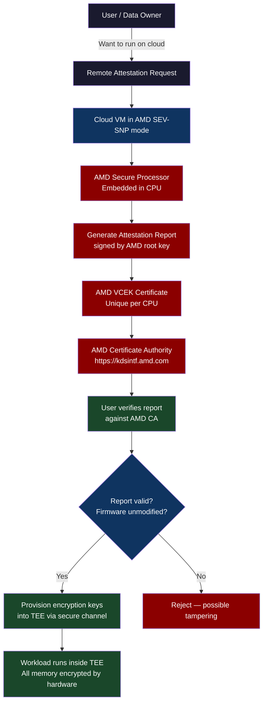
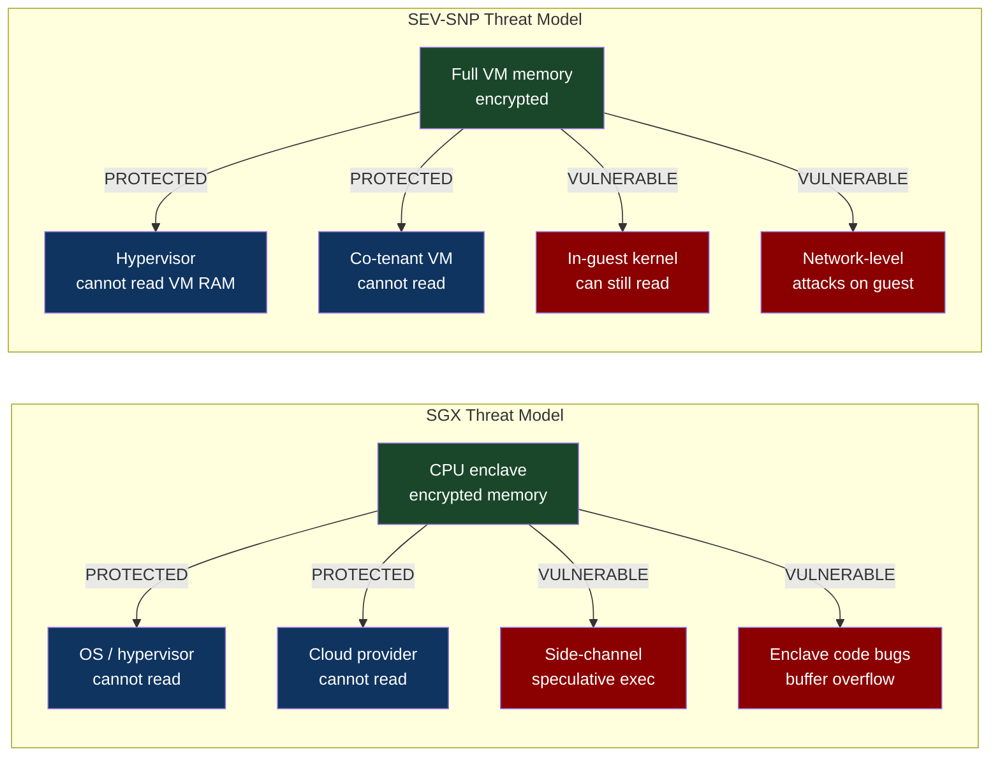

# CH-65: Confidential Computing — Intel SGX, AMD SEV-SNP, and Trusted Execution

**"Your cloud provider's engineers can theoretically read your VM's memory. Confidential computing makes that physically impossible — verified by hardware attestation."**

---

## Cold Open

The paper appeared on the IACR ePrint server on a Tuesday morning in 2019. Its title was "SGX-ROP: Practical Enclave Malware with Intel SGX." The abstract was eight sentences long. By Tuesday afternoon it had been shared in every security Slack channel at every company running SGX workloads in production. The authors — researchers at Graz University of Technology — had demonstrated something that the entire SGX security model was supposed to prevent: extracting secrets from an Intel SGX enclave using a speculative execution side-channel attack from outside the enclave.

SGX is Intel's answer to the insider threat problem. An SGX enclave is a region of process memory encrypted and integrity-protected by the CPU's Memory Encryption Engine. Code inside the enclave can access plaintext. Code outside — including the operating system, the hypervisor, and the BIOS — sees only encrypted bytes. Not even the cloud provider's engineers, with root access to the physical host, can read enclave memory. That is the guarantee. It is enforced in silicon. It is verified via a hardware attestation protocol that chains from the CPU manufacturer to the workload.

The SGX-ROP attack did not break the memory encryption. The authors could not read enclave memory directly. What they did was more subtle: they used speculative execution to cause the processor to transiently execute code that loaded enclave secrets into CPU registers, then extracted those secrets via a cache side-channel measurement before the CPU retired the speculative execution and cleared the registers. The attack was successful against real-world enclaves. It required no kernel vulnerability, no hypervisor exploit, and no physical access. It required only code that could run on the same physical CPU as the target enclave.

Intel patched SGX microcode. The patches mitigated the specific attack vector. New attack variants appeared within months. The SGX-ROP paper's lasting contribution was not the specific attack but the demonstration that hardware security boundaries do not eliminate side-channel attack surfaces — they relocate them. SGX protected against direct memory access attacks but created a more subtle attack surface via the CPU's speculative execution engine. AMD SEV-SNP took a different architectural approach — full VM memory encryption rather than enclave isolation — and has a different side-channel profile. Neither is invulnerable. Both are categorically better than nothing.

The implication for production deployments is not "do not use SGX" or "do not use SEV-SNP." It is: understand the threat model your workload requires, understand the specific attack surface of the hardware you are running on, and size the encryption boundary to the threat. SGX is excellent for key management (small enclave, well-defined interface, limited attack surface). It is less suitable for large ML inference workloads (large EPC footprint, complex memory access patterns, larger side-channel surface).

---

## Uncomfortable Truth

Confidential computing is heavily marketed as "mathematically proven security" or "hardware-enforced isolation." The fine print is that the mathematical proofs cover specific components of the system, not the entire stack. The attestation protocol proves that the CPU is genuine Intel/AMD hardware running unmodified firmware. It does not prove that the software inside the enclave is correct, free of vulnerabilities, or handling secrets safely. An SGX enclave that has a buffer overflow is exploitable regardless of memory encryption. The encryption protects the enclave from the outside. It does not protect the inside from itself.

The more dangerous misconception is about the threat model. Confidential computing addresses one specific threat: a malicious or compromised cloud provider (or cloud employee) reading VM memory, reading disk, or intercepting network traffic between VMs. For most organizations, this is a theoretical threat. For healthcare AI (model trained on patient data), financial risk models (proprietary trading algorithms), and multi-party computation (competitive companies collaborating on a model without exposing their data), this threat is real and the compliance requirements are explicit. For running a standard web application, confidential computing adds cost and complexity for a threat model that is not relevant.

Performance overhead is real. SGX: 10-30% overhead for enclave operations, significant for large workloads because EPC (Enclave Page Cache) size is limited (256MB in older hardware, 512MB in newer) and thrashing EPC causes expensive memory encryption/decryption on every page fault. AMD SEV-SNP: 5-10% for most workloads, less variable than SGX because it encrypts full VM memory rather than isolating an enclave. NVIDIA H100 Confidential Compute: 5-10% for inference. The overhead is the cost of the cryptographic operations the memory controller performs on every memory access.

---

## Mental Model: The Sealed Room

Traditional VMs are like offices inside a building the landlord owns. The landlord has a master key. They could walk in while you are away, read your documents, copy your files, and you would never know. Confidential computing is like a room with a built-in safe where the safe's combination is derived from the architectural blueprints of the room itself — a combination nobody chose, that emerges from the physical structure. The landlord has the master key to the door. But everything important is in the safe. And the safe only opens from the inside.

The attestation protocol extends this analogy: before you put anything important in the safe, you ask the safe manufacturer (Intel/AMD) to verify that this particular safe was genuinely built at their factory, with the correct specifications, and has not been modified. The manufacturer issues a signed certificate (the attestation report) that you can verify against the manufacturer's public key. Only then do you send your secrets inside.

**Label: The Sealed Room with Manufacturer Attestation** — the isolation boundary is hardware-enforced, but the trust chain begins at the silicon manufacturer and the security guarantee is exactly as broad as the manufacturer's attestation protocol, no broader.





---

## Dissection

### Intel SGX: Enclave Architecture

SGX (Software Guard Extensions) isolates a region of process memory — the enclave — using the CPU's Memory Encryption Engine (MEE). Enclave pages are stored in the Enclave Page Cache (EPC), a reserved region of DRAM that the OS manages but cannot read. When a CPU core executes code inside the enclave, it can access EPC pages in plaintext. When any other agent — OS, hypervisor, DMA device — accesses EPC memory, it sees AES-encrypted content.

The EPC size is the critical limitation. On pre-Ice Lake Intel Xeon, EPC is 128MB-512MB. On Ice Lake and later, EPC can be up to 512GB with the SGX v2 extensions. Before SGX v2, running a large workload in an enclave required EPC paging — moving enclave pages in and out of EPC to/from regular DRAM (encrypted). Each EPC page fault incurs a ~50µs penalty. A 2GB workload on a 256MB EPC with poor locality can slow down by 30x from paging alone.

The SGX programming model requires splitting your application into trusted and untrusted portions. The trusted portion (inside the enclave) has no OS access — no file I/O, no network, no `malloc`. All OS interactions go through the untrusted portion via `ocall` (outside call). The trusted portion calls the untrusted portion via `ecall` (enclave call). This creates a well-defined, auditable interface — the attack surface is the set of all ecall/ocall interfaces.

```c
// EDL (Enclave Definition Language) — defines the enclave interface
enclave {
    trusted {
        // Functions callable from outside (untrusted code → enclave)
        public int ecall_inference(
            [in, size=input_len] const uint8_t* input,
            size_t input_len,
            [out, size=output_len] uint8_t* output,
            size_t output_len
        );
    };
    untrusted {
        // Functions callable from inside (enclave → untrusted code)
        void ocall_print_string([in, string] const char* str);
    };
};
```

### AMD SEV-SNP: Full VM Encryption

AMD SEV-SNP (Secure Encrypted Virtualization — Secure Nested Paging) takes a coarser-grained approach: encrypt the entire VM's memory using a key known only to the AMD Secure Processor (ASP), not the hypervisor. From the hypervisor's perspective, the guest VM's RAM is encrypted ciphertext. The hypervisor can still control CPU scheduling, I/O routing, and interrupt delivery — but cannot read or modify VM memory without the VM detecting the modification (SNP adds integrity protection on top of SEV's encryption).

SNP adds the Reverse Map Table (RMP) — a hardware-enforced structure that tracks which VM owns each 4KB memory page. Any attempt by the hypervisor to map a guest's page into another VM triggers a hardware fault. This prevents the hypervisor from remapping guest memory to extract its contents — an attack that was possible against SEV (the predecessor to SEV-SNP) and was demonstrated in practice.

### AWS Nitro Enclaves

AWS's approach to confidential computing on EC2 is Nitro Enclaves — isolated VMs that run as a partition of an EC2 instance with no persistent storage, no interactive access, and no external network. The parent EC2 instance communicates with the enclave via a local VSOCK channel only. Nitro Enclaves generate attestation documents that chain to the Nitro Hypervisor, which is a separate trust domain from AWS's management plane.

The use case Nitro Enclaves are designed for: decrypting secrets. Your application runs on the parent EC2 instance. The key material needed to decrypt sensitive data lives in the Nitro Enclave. The parent sends encrypted data to the enclave via VSOCK. The enclave decrypts and returns the result. The parent never has access to the key material. AWS KMS can be configured to only release keys to a specific Nitro Enclave attestation document hash — meaning the key can only be used by your specific, unmodified code running in a genuine Nitro Enclave.

```python
# Python: AWS Nitro Enclave attestation verification (parent side)
import boto3
import base64
import json
from cryptography.hazmat.primitives import hashes
from cryptography.hazmat.backends import default_backend
from cryptography.x509 import load_pem_x509_certificate

def verify_enclave_attestation(attestation_doc_bytes: bytes) -> dict:
    """
    Verify a Nitro Enclave attestation document.
    Returns the decoded claims if valid, raises if invalid.
    """
    import cbor2
    from cryptography.hazmat.primitives.asymmetric.ec import ECDSA

    # Parse COSE_Sign1 structure
    decoded = cbor2.loads(attestation_doc_bytes)
    protected_header = cbor2.loads(decoded[0])
    payload = cbor2.loads(decoded[2])

    # Extract certificate chain from payload
    cert_chain = payload['cabundle']
    leaf_cert_der = payload['certificate']

    # Load Nitro root CA (pinned — never changes)
    # In production, fetch from https://aws-nitro-enclaves.amazonaws.com/AWS_NitroEnclaves_Root-G1.zip
    nitro_root_ca = load_nitro_root_ca()

    # Verify certificate chain
    leaf_cert = load_pem_x509_certificate(leaf_cert_der)
    verify_cert_chain(cert_chain, leaf_cert, nitro_root_ca)

    # Verify COSE signature
    public_key = leaf_cert.public_key()
    # ... COSE verification ...

    # Extract PCR values — hash of the enclave's code + config
    pcrs = payload['pcrs']
    print(f"Enclave PCR0 (code measurement): {pcrs[0].hex()}")
    print(f"Enclave PCR1 (kernel+bootstrap): {pcrs[1].hex()}")
    print(f"Enclave PCR2 (application):      {pcrs[2].hex()}")

    return {
        'module_id': payload['module_id'],
        'timestamp': payload['timestamp'],
        'pcrs': pcrs,
        'user_data': payload.get('user_data'),
    }


def request_kms_key_with_enclave_policy(enclave_pcr0: str):
    """
    Configure KMS to only decrypt using a specific enclave PCR measurement.
    """
    kms = boto3.client('kms')

    # Key policy: only allow decrypt from the specific enclave code measurement
    key_policy = json.dumps({
        "Version": "2012-10-17",
        "Statement": [{
            "Effect": "Allow",
            "Principal": {"AWS": "arn:aws:iam::123456789012:role/enclave-role"},
            "Action": "kms:Decrypt",
            "Condition": {
                "StringEqualsIgnoreCase": {
                    "kms:RecipientAttestation:PCR0": enclave_pcr0
                }
            }
        }]
    })
    return key_policy
```

### The Fortanix SGX-ROP Lesson

The SGX-ROP attack (and subsequent variants including Plundervolt, SGX-BOMB, ÆPIC Leak) demonstrate a pattern: hardware isolation boundaries create new attack surfaces at the interface between isolation domains. SGX isolated enclave memory from the OS — but the CPU's speculative execution engine operates across the isolation boundary. The CPU speculatively executes instructions that would "not be allowed" by the isolation model, then rolls back the architectural state — but the rollback does not erase microarchitectural state (cache entries, TLB entries, branch predictor state). Side-channel analysis of that microarchitectural state leaks information across the isolation boundary.

The engineering response is defense in depth: use SGX for isolation, use side-channel mitigations (constant-time code, SWAPGS barrier, LFENCE barriers at ecall/ocall boundaries), limit the enclave's interface surface, and — critically — do not put code in the enclave that handles secrets in a way that produces measurable timing differences based on the secret value.

### Tradeoffs

**SGX vs SEV-SNP**: SGX offers finer-grained isolation (enclave within a process) but requires code modification and has EPC size limits. SEV-SNP encrypts an entire VM with no code changes required, but the trust boundary is the VM rather than the enclave. For key management services, SGX's fine-grained isolation is better. For lifting an entire existing application into a confidential environment, SEV-SNP is more practical.

**Attestation freshness**: Attestation reports contain a timestamp and a nonce (provided by the verifier). Replay attacks using old attestation reports are prevented by the nonce — the verifier generates a random nonce, sends it to the TEE, the TEE includes it in the attestation report, and the verifier checks the nonce matches. Attestation reports have a practical validity window of seconds to minutes.

**Cloud vs On-Premise**: Cloud confidential computing (Azure CVM, AWS Nitro, GCP Confidential VMs) trusts the cloud provider to have implemented the confidential computing features correctly. For threat models that include the cloud provider itself, on-premise hardware with a fully air-gapped attestation chain is required. For most organizations, the threat model is "cloud employee with root access to a hypervisor host" — and cloud confidential computing addresses this.

---

## War Room

**Incident**: Fortanix SGX-ROP paper — side-channel attack demonstrates limits of hardware attestation.

```mermaid
gantt
    title SGX-ROP Discovery and Industry Response
    dateFormat  YYYY-MM
    axisFormat  %Y-%m

    section Research
    Spectre/Meltdown disclosed          :done, spec, 2018-01, 1M
    SGX side-channel research begins    :done, res, 2018-03, 12M
    SGX-ROP paper drafted              :done, draft, 2019-01, 6M
    Coordinated disclosure to Intel    :done, disc, 2019-06, 3M

    section Disclosure
    Paper published (IACR ePrint)      :milestone, pub, 2019-09, 0M
    Industry response begins           :crit, resp, 2019-09, 2M
    Intel microcode patch released     :done, patch, 2019-11, 1M

    section Post-Disclosure
    Follow-up attacks published        :crit, follow, 2020-01, 12M
    ÆPIC Leak disclosed               :crit, aepc, 2022-06, 1M
    Intel SGX deprecation announced   :milestone, dep, 2022-07, 0M
    AMD SEV-SNP gains market share    :active, sev, 2022-07, 36M

    section Vendor Response
    Azure: SGX-capable DCsv3 series    :done, azure, 2021-01, 6M
    Azure: SEV-SNP Confidential VMs    :done, azsevsn, 2022-06, 6M
    AWS: Nitro Enclaves GA             :done, nitro, 2020-10, 3M
    NVIDIA: H100 CC mode announced     :done, nvcc, 2022-11, 6M
```

**Impact**: The SGX-ROP paper did not cause any immediate production incidents — the attack required co-location on the same physical CPU, which an external attacker cannot guarantee in a cloud environment where VM placement is not under attacker control. The impact was philosophical and strategic. Intel's position had been that SGX provided absolute memory isolation verified by hardware attestation. After SGX-ROP (and subsequent ÆPIC Leak in 2022), Intel acknowledged that SGX does not protect against side-channel attacks and deprecated SGX in 12th-generation desktop processors. Server SGX continued in Xeon processors with updated microcode mitigations.

**AMD's advantage**: AMD SEV-SNP's architecture has a different side-channel profile. Because it encrypts full VM memory rather than isolating an enclave within a process, the attack surface for cross-enclave side-channel attacks is smaller. SEV-SNP is vulnerable to different attacks (including some memory corruption attacks on the SNP firmware), but the practical exploitability in cloud environments is lower than SGX's speculative execution side-channels.

**The lasting lesson**: Hardware attestation proves that the hardware is genuine and the firmware is unmodified. It does not prove that the running software is secure. The chain of trust ends at the TEE boundary. What happens inside — memory safety, side-channel-resistant code, safe secret handling — is entirely the application developer's responsibility.

---

## Lab: AMD SEV-SNP Attestation Verification

**Objective**: On an Azure confidential VM (DCas_v5 series), verify the SEV-SNP attestation report and measure overhead.

```bash
# Prerequisites: Azure CLI, an Azure DCas_v5 (AMD SEV-SNP) VM
# The DCas_v5 series uses AMD EPYC with SEV-SNP enabled

# 1. Verify SEV-SNP is active on the VM
dmesg | grep -i "sev"
# Expected: [    1.234567] AMD Memory Encryption Features active: SEV SEV-ES SEV-SNP

# 2. Install the Azure Attestation tools
sudo apt-get install -y az-dcap-client
pip3 install azure-confidentialledger

# 3. Fetch the SEV-SNP attestation report
cat > /tmp/fetch_attestation.py << 'PYEOF'
import base64
import json
import struct
import urllib.request

# Azure IMDS endpoint for SNP attestation
IMDS_URL = "http://169.254.169.254/acc/cvm/v1/attest/maa"

# Generate a nonce (in production, the verifier provides this)
import os
nonce = base64.b64encode(os.urandom(32)).decode()

data = json.dumps({"maa_endpoint": "sharedcus.cus.attest.azure.net", "runtime_data": {"nonce": nonce}}).encode()

req = urllib.request.Request(IMDS_URL, data=data,
    headers={"Content-Type": "application/json", "Metadata": "true"},
    method="POST")

with urllib.request.urlopen(req) as resp:
    result = json.loads(resp.read())

print(f"Attestation token received: {len(result['token'])} bytes")

# Decode the JWT (attestation token)
import jwt
parts = result['token'].split('.')
header = json.loads(base64.b64decode(parts[0] + '=='))
payload = json.loads(base64.b64decode(parts[1] + '=='))

print(f"Token issuer:    {payload.get('iss')}")
print(f"Issued at:       {payload.get('iat')}")
print(f"VM type:         {payload.get('x-ms-compliance-status')}")
print(f"SEV-SNP version: {payload.get('x-ms-sevsnpvm-snpfw-svn')}")
print(f"Guest SVN:       {payload.get('x-ms-sevsnpvm-guestsvn')}")

# Measurement: hash of initial guest memory (firmware + bootloader)
measurement = payload.get('x-ms-sevsnpvm-launchmeasurement')
print(f"Launch measurement: {measurement}")
PYEOF
python3 /tmp/fetch_attestation.py

# 4. Benchmark overhead: AES operations with and without SEV-SNP
# Using openssl speed to measure memory bandwidth (dominated by encryption overhead)
echo "=== Baseline memory bandwidth ==="
sysbench memory --memory-block-size=1M --memory-total-size=10G run 2>/dev/null | \
    grep "transferred"

echo "=== AES-256-GCM encryption overhead (CPU cost) ==="
openssl speed -seconds 5 aes-256-gcm 2>/dev/null | tail -3
```

**Expected attestation output**:

```
Attestation token received: 2847 bytes
Token issuer:    https://sharedcus.cus.attest.azure.net
Issued at:       1707999234
VM type:         azure-compliant-cvm
SEV-SNP version: 8
Guest SVN:       0
Launch measurement: 7f3a9d2c1b4e8f6a5c2d9e1f3b7a4c8d...
```

The launch measurement is the SHA-384 hash of the initial VM memory — including the UEFI firmware and bootloader — computed by the AMD Secure Processor at VM launch. This value is reproducible: identical firmware + bootloader on identical hardware produces the same measurement. An external verifier can check this measurement against a known-good value to confirm the VM is running unmodified software.

---

## Loose Thread

Confidential computing solves the landlord problem. The cloud provider has keys to your building, but not to your safe. That is meaningful for data that must remain secret even from infrastructure operators — medical records in an AI inference pipeline, cryptographic key material in a KMS, proprietary model weights in an inference service. For those workloads, the hardware attestation chain from silicon to certificate is the only evidence that the security guarantee is real.

The limits are also real. The attestation proves that the hardware is genuine and the firmware is unmodified. The side-channel surface is an orthogonal problem that hardware manufacturers address incrementally with each silicon generation. The application running inside the enclave is still responsible for its own memory safety, its own secret handling, and its own resistance to attacks from the network and the untrusted portion of its own code.

The next chapter extends the confidential computing boundary to the GPU — because the most valuable secrets in most modern AI companies are not RSA keys. They are model weights.
