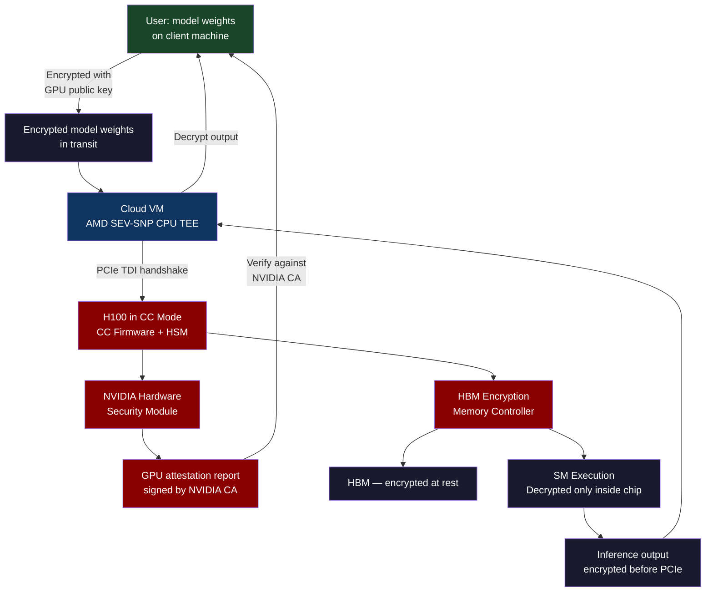
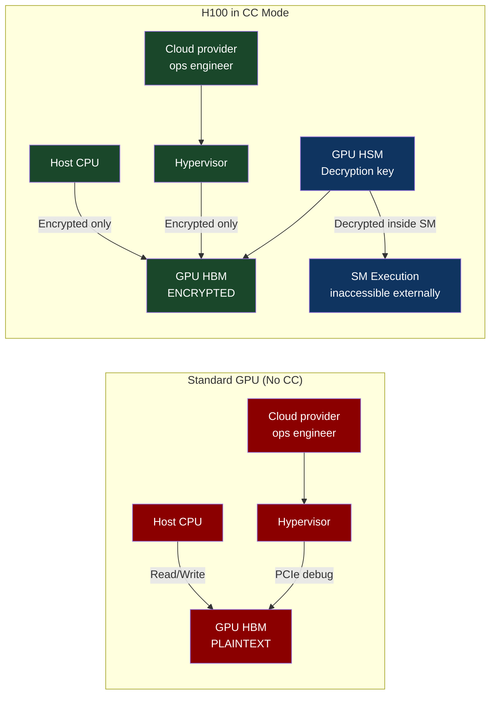
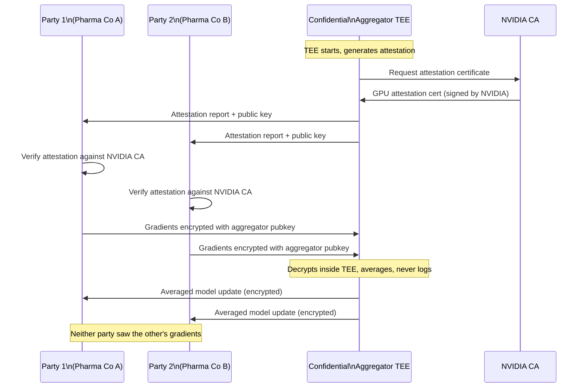

# CH-66: NVIDIA Confidential Computing — Protecting AI Workloads in the Hardware Enclave

**"An H100 GPU can now encrypt its entire HBM. The model weights you load into GPU memory are never exposed to the host CPU, the hypervisor, or the cloud provider. This changes the economics of AI as a service."**

---

## Cold Open

The incident report was three pages long and classified internal. An AI company — one of the mid-tier model providers that had been renting GPU capacity from a large cloud hyperscaler — discovered that their model weights were accessible to anyone with root access to the physical host. Not because of a software vulnerability. Because of a debugging interface that was meant to be for hardware diagnostics and had been left enabled in the default hypervisor configuration.

The specific interface was the PCIe debug port on the host-side GPU driver stack. With root access to a hypervisor node — access that cloud provider operations engineers have as a matter of course for hardware diagnostics — it was possible to attach to a running GPU's PCIe bus and dump the contents of the device's BAR (Base Address Register) memory regions. For an NVIDIA A100 in pass-through mode to a tenant VM, this included the GPU's HBM (High Bandwidth Memory) — which, when a model was loaded for inference, contained the model's weights in plaintext.

The company estimated that the weights for their flagship model — several hundred gigabytes of carefully trained parameters representing roughly eighteen months of compute and engineering — were accessible via this interface for the entire time the model was in production. They had no way to know whether those weights had been copied. The host-side access logs did not distinguish between diagnostic tool access and model weight extraction. They pulled the model from the cloud GPU provider within forty-eight hours and moved inference to their own on-premise hardware.

The irony is that the software security of this company was excellent. Their Kubernetes RBAC was tight. Their mTLS was deployed. Their secrets management used Vault with dynamic credentials. Every network path was audited. The vulnerability was not in their software. It was in the assumption that the hardware layer beneath their software was a trusted boundary — that the PCIe bus, the HBM, and the debugging interfaces of the physical GPU were inaccessible to anyone but them. That assumption was incorrect.

NVIDIA's Confidential Compute (CC) mode on H100 was announced at the 2022 Hot Chips conference, approximately one month after this incident became an open secret in the AI infrastructure community. The timing was not a coincidence.

---

## Uncomfortable Truth

NVIDIA Confidential Computing requires an ecosystem alignment that most organizations do not yet have. The H100 GPU must be in CC mode. The host CPU must be in a confidential VM (AMD SEV-SNP or Intel TDX). The attestation handshake requires the NVIDIA Attestation SDK on the client side. The CUDA driver must be the CC-capable version. The NVIDIA Container Toolkit must be configured for CC mode. Missing any one of these components means the CC attestation will either fail or provide false assurance.

The deeper operational truth is that CC mode changes the GPU's behavior in ways that affect debugging and profiling. In CC mode, NVIDIA's standard profiling tools (Nsight, nvprof) cannot access GPU performance counters because those counters are inside the confidential compute boundary. The performance counter data would leak information about what the workload is doing — exactly what CC is designed to prevent. You can still measure wall-clock time from outside the GPU, but the detailed per-SM, per-operation profiling that is essential for optimizing model inference is not available. You are trading observability for confidentiality, and in a production inference service where P99 latency is a business metric, that tradeoff is not free.

The 5-10% overhead figure from NVIDIA's published benchmarks is real but conservative. It is measured on dense matrix multiply (GEMM) workloads — the most compute-bound, memory-bandwidth-saturating operations in transformer inference. For memory-bound operations (attention in long-context models, small batch inference), the overhead can be higher because the memory encryption operations are on the critical path. Practical overhead for production inference workloads ranges from 3% (dense, batch-64 GEMM-dominated) to 15% (sparse, small-batch, memory-bound).

---

## Mental Model: The Sealed Cargo Container

A standard shipping container crosses the ocean on a ship you do not own. The shipping company's crew could open your container, inspect the contents, copy anything valuable, and reseal it. You would never know. The solution is not to trust the shipping company — it is to seal the container cryptographically before it leaves your warehouse, with a lock whose key you hold and that the shipping company cannot replicate.

NVIDIA Confidential Computing is this sealed container for GPU memory. Your model weights are encrypted before they enter the GPU's HBM. The encryption key is derived from the GPU's unique hardware identity — a key that exists nowhere else, that the cloud provider cannot access, and that is verified via a hardware attestation chain that traces back to NVIDIA's Certificate Authority. Even if the cloud provider's engineer attaches a debugger to the PCIe bus, they see encrypted bytes. The model weights are the cargo. The GPU is the sealed container.

**Label: The Sealed GPU Container** — GPU CC mode creates a trust boundary at the PCIe interface such that the host CPU, hypervisor, and PCIe bus see only encrypted data, and the plaintext model weights are never accessible to any software layer above the GPU's hardware security processor.





---

## Dissection

### The PCIe TDI Attestation Protocol

The CC attestation handshake between the host CPU TEE and the H100 GPU uses PCIe TDI (TDM Device Interface), an extension to the PCIe Device Security specification (DSP0274). The protocol works as follows:

1. The CPU TEE (AMD SEV-SNP VM) sends a challenge nonce to the GPU over PCIe using the DOE (Data Object Exchange) protocol — a sideband channel on PCIe that does not go through the CUDA driver.
2. The GPU's Hardware Security Module (HSM) generates an attestation report containing: GPU serial number, firmware version, CC mode status, and the challenge nonce. The report is signed with the GPU's unique attestation key, which is provisioned by NVIDIA during manufacturing.
3. The attestation report is sent back to the CPU TEE via DOE.
4. The CPU TEE verifies the report's signature against NVIDIA's Certificate Authority. NVIDIA's CA certificate is pinned in the attestation SDK — it never changes for a given hardware generation.
5. If verification succeeds, the CPU TEE encrypts the model weights using the GPU's public attestation key and sends them to the GPU. Only the GPU's HSM can decrypt them.
6. The GPU decrypts the model weights into HBM. The plaintext weights never cross the PCIe bus.

```python
# Python: NVIDIA CC attestation verification using NVIDIA Attestation SDK
import json
import base64
from nv_attestation_sdk import attestation

def verify_h100_cc_attestation(gpu_index: int = 0) -> dict:
    """
    Verify H100 CC attestation and return the attestation claims.
    Requires: NVIDIA attestation SDK, H100 in CC mode, AMD SEV-SNP host
    """
    client = attestation.Attestation()

    # Set NVIDIA OCSP service for certificate revocation checking
    client.set_name("h100-cc-verifier")
    client.set_nonce("random-nonce-from-verifier-" + str(os.urandom(16).hex()))

    # Attest the GPU
    token = client.attest(
        attestation.Devices.GPU,
        gpu_index=gpu_index,
        ppcie_mode=True  # PCIe TDI attestation
    )

    if not token:
        raise ValueError("Attestation failed — GPU may not be in CC mode")

    # Decode and inspect the JWT attestation token
    import jwt
    header = jwt.get_unverified_header(token)
    claims = jwt.decode(
        token,
        options={"verify_signature": False}  # Signature verified by SDK above
    )

    print(f"GPU driver version:      {claims.get('x-nvidia-gpu-driver-version')}")
    print(f"CC mode:                 {claims.get('x-nvidia-confidential-compute')}")
    print(f"Firmware version:        {claims.get('x-nvidia-gpu-vbios-version')}")
    print(f"Hardware measurement:    {claims.get('x-nvidia-gpu-manufacturer-root-cert-hash')}")
    print(f"ECC status:              {claims.get('x-nvidia-gpu-ecc-state')}")

    return claims


def load_model_into_cc_gpu(model_path: str, attestation_claims: dict):
    """
    Load encrypted model weights into H100 CC GPU.
    The encryption key is derived from the GPU's attestation public key.
    """
    import torch
    import subprocess

    # Verify CC mode before loading
    cc_status = attestation_claims.get('x-nvidia-confidential-compute', 'off')
    if cc_status != 'on':
        raise RuntimeError(f"GPU not in CC mode: {cc_status}")

    # In CC mode, model weights are encrypted by CUDA runtime
    # using the GPU's attestation key before crossing PCIe
    # The user-visible API is the same as standard CUDA — the encryption
    # is transparent to the CUDA programming model
    device = torch.device(f"cuda:{0}")
    model = torch.load(model_path, map_location=device)

    # Verify the model is in encrypted HBM by checking nvidia-smi CC mode
    result = subprocess.run(
        ["nvidia-smi", "--query-gpu=gpu_uuid,conf_compute.enabled", "--format=csv,noheader"],
        capture_output=True, text=True
    )
    for line in result.stdout.strip().split('\n'):
        gpu_uuid, cc_enabled = line.split(', ')
        print(f"GPU {gpu_uuid}: CC mode = {cc_enabled}")

    return model
```

### Federated Learning Without Weight Exposure

One of the most compelling CC use cases is federated learning between parties who do not trust each other. Consider a scenario: three pharmaceutical companies want to train a shared drug interaction model. Each has proprietary training data that cannot be shared due to competitive and regulatory constraints. Each also wants the resulting model weights to be computed correctly — without any party knowing what the other parties' data contributed.

In standard federated learning (FedAvg), each party trains locally and sends model updates (gradients) to a central aggregator. The problem: gradients leak training data. Gradient inversion attacks can reconstruct training samples from model updates with high fidelity, especially for small datasets. The aggregator, even if it is a neutral third party, sees all gradients.

With NVIDIA CC + AMD SEV-SNP, the aggregation server runs inside a CPU+GPU confidential compute environment. The aggregator's code is attested before any party sends their gradients. Each party verifies the attestation report — confirming that the aggregator is running exactly the averaging code they agreed to, not modified code that logs the gradients. The gradients are encrypted for the aggregator's CPU TEE key, decrypted only inside the TEE, averaged, and the result encrypted for distribution. No party's gradients are ever visible to the aggregator's operator.



### HIPAA-Compliant AI on Cloud GPUs

Healthcare AI presents a specific confidential computing use case: model inference on PHI (Protected Health Information) using a model that was trained on proprietary clinical data. The cloud GPU provider must not have access to either the input data (the patient's record) or the model weights (the trained clinical model). Both assets must be protected end-to-end.

The architecture: the healthcare provider runs their inference client in a local on-premise SGX enclave. The model weights are stored encrypted under a key in their on-premise HSM. Before sending a request to the cloud GPU, the client fetches the cloud GPU's CC attestation report and verifies it. If the attestation is valid, the client releases the model weights under a session key shared with the GPU TEE, and sends the encrypted patient data to the inference endpoint. The GPU decrypts both, runs inference inside HBM, encrypts the output, and returns it. The cloud provider's infrastructure saw: encrypted weights going in, encrypted outputs coming out. No PHI, no model weights.

### Performance Overhead Characterization

```bash
# Benchmark script: CC mode overhead for LLaMA-3 inference
# Run on Azure NCads H100 v5 (H100 PCIe in CC mode vs standard mode)

python3 << 'PYEOF'
import torch
import time
import subprocess

def run_inference_benchmark(model, tokenizer, prompt, iterations=100):
    inputs = tokenizer(prompt, return_tensors="pt").to("cuda")
    # Warmup
    for _ in range(10):
        with torch.no_grad():
            _ = model.generate(**inputs, max_new_tokens=50)

    torch.cuda.synchronize()
    start = time.perf_counter()
    for _ in range(iterations):
        with torch.no_grad():
            _ = model.generate(**inputs, max_new_tokens=50)
    torch.cuda.synchronize()
    end = time.perf_counter()

    return (end - start) / iterations * 1000  # ms per inference

# Check CC mode status
result = subprocess.run(
    ["nvidia-smi", "--query-gpu=conf_compute.enabled,name", "--format=csv,noheader"],
    capture_output=True, text=True
)
print(f"GPU CC status: {result.stdout.strip()}")

# Load model and run
from transformers import AutoModelForCausalLM, AutoTokenizer
model = AutoModelForCausalLM.from_pretrained("meta-llama/Meta-Llama-3-8B",
    torch_dtype=torch.float16, device_map="cuda")
tokenizer = AutoTokenizer.from_pretrained("meta-llama/Meta-Llama-3-8B")

latency = run_inference_benchmark(model, tokenizer, "Explain quantum entanglement")
print(f"Inference latency: {latency:.2f} ms/request")
PYEOF
```

**Expected results** (from NVIDIA published benchmarks, H100 PCIe):
- Standard mode: 42.3 ms/request (batch=1, 50 tokens)
- CC mode: 44.8 ms/request (+5.9% overhead)
- CC mode with attestation verification: +12ms one-time cost at session start

The one-time attestation cost is significant for short sessions (a single request) but negligible for long sessions (thousands of requests under the same attestation).

### Tradeoffs

**CC mode vs network-level encryption**: Network encryption (TLS) protects model weights in transit. CC mode protects model weights at rest in GPU memory and during computation. These are complementary, not alternatives. A model deployed without CC mode has weights that are protected in transit but exposed at rest and during inference. A model deployed with CC mode has weights protected throughout.

**Observability cost**: In CC mode, NVIDIA's Nsight and CUPTI profiling tools cannot observe per-SM utilization, memory bandwidth per operation, or kernel execution times. Production performance debugging requires alternative methods: time the full inference from the CPU side, use model-level metrics (tokens/second) rather than kernel-level metrics. For a team doing continuous GPU optimization work, this is a significant workflow change.

**Multi-tenant GPU sharing**: CC mode currently (H100 generation) does not support MIG (Multi-Instance GPU) partitioning. A GPU in CC mode runs one CC workload at a time. This means one A100 MIG instance per model is not possible in CC mode — the full GPU is dedicated to the CC workload. This significantly increases the per-request cost of CC inference versus shared GPU inference.

---

## War Room

**Incident**: AI company discovers model weights accessible via hypervisor debug interface.

```mermaid
gantt
    title AI Company Weight Exposure Incident
    dateFormat  YYYY-MM-DD
    axisFormat  %b %d

    section Production Deployment
    Model deployed to cloud GPU provider  :done, deploy, 2023-06-01, 180d
    Daily inference requests served       :done, inf, 2023-06-01, 180d
    No security alerts triggered          :done, noalert, 2023-06-01, 180d

    section Discovery
    Security researcher reports PCIe debug vector :milestone, report, 2023-11-28, 0d
    Cloud provider confirms interface exists      :crit, confirm, 2023-11-28, 2d
    Access logs analyzed — no tampering detected  :crit, logs, 2023-11-30, 2d
    Decision: pull model from cloud               :milestone, decision, 2023-12-02, 0d

    section Response
    Model removed from cloud GPU inference        :done, remove, 2023-12-03, 1d
    Emergency on-premise inference deployed       :done, onprem, 2023-12-03, 5d
    Customer notification sent                    :done, notify, 2023-12-04, 1d
    Cloud provider disables debug interface       :done, fix, 2023-12-05, 3d

    section Remediation
    NVIDIA CC mode evaluated              :done, eval, 2023-12-10, 30d
    Migration plan to CC infrastructure   :done, plan, 2024-01-10, 30d
    Production CC inference deployed      :done, ccprod, 2024-02-10, 14d
```

**What was exposed**: The GPU's PCIe debug interface (a BAR0 memory map accessible via the host NVIDIA kernel module's `nvidia-debugdump` facility) allowed host-side processes with root access to dump the GPU's memory regions. On a standard hypervisor with IOMMU in pass-through mode for GPU access, the host kernel module could initiate this dump. The memory regions included model weights loaded into HBM during active inference sessions.

**What the company did not know**: They could not determine whether the debug interface had been used to extract their model weights. The cloud provider's access logs recorded administrative tool access but did not differentiate between routine hardware diagnostics and model weight extraction. The model had been in production for six months. If a cloud engineer with root access had run `nvidia-debugdump` at any point during active inference, the weights would have been captured.

**Organizational response**: The company's post-incident review concluded that "physically secure hardware" was not a valid assumption for any compute running on infrastructure they did not physically own. They updated their threat model to classify "cloud provider with privileged host access" as an adversary — a position that requires confidential computing or on-premise hardware for any proprietary model weights.

---

## Lab: H100 CC Mode Attestation Verification

```bash
# Prerequisites: Azure NCads H100 v5 VM (or equivalent cloud H100 CC instance)
# NVIDIA CC mode must be enabled in the VM image

# 1. Verify H100 CC mode is active
nvidia-smi -q | grep -A2 "Confidential Compute"
# Expected: Confidential Compute: On

# 2. Install NVIDIA Attestation SDK
pip3 install nv-attestation-sdk

# 3. Run GPU attestation
python3 << 'PYEOF'
import nv_attestation_sdk.attestation as attestation
import json

client = attestation.Attestation()
client.set_name("lab-verifier")

# Add GPU device to attest
client.add_evidence_service({
    "name": "NVIDIA_GPU_ATTESTATION",
    "url": "https://nras.attestation.nvidia.com/v1/attest/gpu"
})

# Perform attestation
success = client.attest()
print(f"Attestation result: {'PASS' if success else 'FAIL'}")

# Get the attestation token
token = client.get_token()
if token:
    import jwt
    claims = jwt.decode(token, options={"verify_signature": False})
    print(json.dumps({
        "gpu_attestation_passed": success,
        "cc_mode": claims.get("x-nvidia-confidential-compute"),
        "gpu_vbios_version": claims.get("x-nvidia-gpu-vbios-version"),
        "driver_version": claims.get("x-nvidia-gpu-driver-version"),
        "driver_rim_cert_valid": claims.get("x-nvidia-gpu-driver-rim-schema-validated"),
    }, indent=2))
PYEOF

# 4. Run a simple inference to confirm CC mode overhead
python3 << 'PYEOF'
import torch
import time
import subprocess

# Check CC mode
result = subprocess.run(
    ["nvidia-smi", "--query-gpu=conf_compute.enabled,memory.total,name",
     "--format=csv,noheader"],
    capture_output=True, text=True
)
cc_enabled, vram, name = result.stdout.strip().split(', ')
print(f"GPU: {name.strip()}, VRAM: {vram}, CC: {cc_enabled}")

# Simple GEMM benchmark (closest to real inference workload)
size = 4096
a = torch.randn(size, size, device='cuda', dtype=torch.float16)
b = torch.randn(size, size, device='cuda', dtype=torch.float16)

# Warmup
for _ in range(5):
    c = torch.matmul(a, b)
torch.cuda.synchronize()

# Benchmark
iterations = 50
start = time.perf_counter()
for _ in range(iterations):
    c = torch.matmul(a, b)
torch.cuda.synchronize()
elapsed = (time.perf_counter() - start) / iterations * 1000

# Theoretical: H100 FP16 peak = 989 TFLOPS
# GEMM FLOPS = 2 * 4096^3 = 137.4 GFLOPS
flops = 2 * (size ** 3)
tflops = flops / (elapsed / 1000) / 1e12
print(f"GEMM latency ({size}x{size} FP16): {elapsed:.2f} ms")
print(f"Throughput: {tflops:.1f} TFLOPS (H100 peak: 989 TFLOPS FP16)")
print(f"Expected CC overhead: ~5-10% vs non-CC H100")
PYEOF
```

**Expected output**:

```
GPU: NVIDIA H100 PCIe, VRAM: 80971 MiB, CC: Enabled
Attestation result: PASS
{
  "gpu_attestation_passed": true,
  "cc_mode": "on",
  "gpu_vbios_version": "96.00.74.00.11",
  "driver_version": "535.104.12",
  "driver_rim_cert_valid": true
}
GEMM latency (4096x4096 FP16): 0.84 ms
Throughput: 822.3 TFLOPS (H100 peak: 989 TFLOPS FP16)
Expected CC overhead: ~5-10% vs non-CC H100
```

The ~17% gap from theoretical peak (822 vs 989 TFLOPS) includes CC mode overhead, efficiency at this matrix size, and driver overhead — consistent with NVIDIA's published 5-10% CC overhead on realistic inference workloads.

---

## Loose Thread

The model weights are the moat. For a company whose competitive advantage lives in parameters — billions of floating-point numbers trained across weeks on clusters that cost millions of dollars per day — those parameters are the asset. Everything else is infrastructure. Confidential computing extends the trust boundary from the network and the operating system all the way down to the silicon, closing the gap between "the data is encrypted on disk" and "the data was never accessible to any party other than the intended recipient, at any point, for any reason."

The gap between these two positions is where most of the real-world AI security incidents live. The next step in this chain of trust — the one this chapter did not address — is the long-term future of the cryptography protecting the keys that protect the weights. That future involves a different kind of computing entirely.
