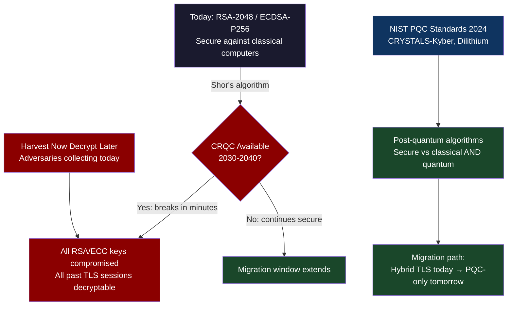
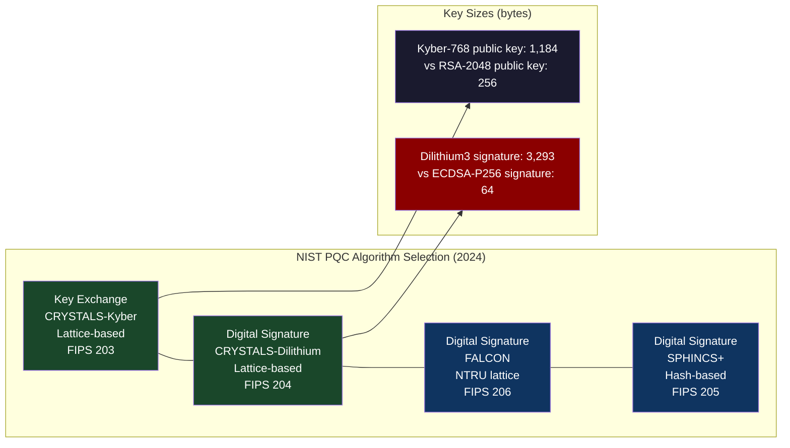
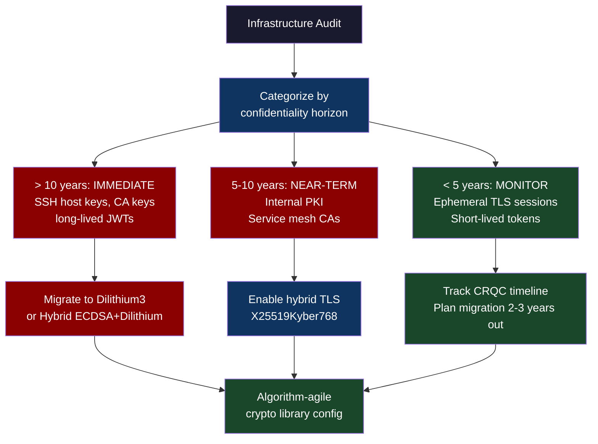

# CH-67: Quantum Infrastructure — What Engineers Actually Need to Know Right Now

**"Quantum computing will break RSA. That's the headline. The engineering question is: which specific systems in your infrastructure are vulnerable, on what timeline, and what do you do about it today?"**

---

## Cold Open

The NIST submission deadline for post-quantum cryptography candidates was November 30, 2017. By the time it closed, NIST had received eighty-two candidate algorithms from research groups around the world. The evaluation process was designed to take five to seven years — careful analysis by the global cryptography community, multiple rounds of analysis, public comment, and eventual standardization. The process ran according to plan until July 2022, when a researcher at KU Leuven uploaded a paper with a title that caused cryptographers to read it three times before believing it: "An Efficient Key Recovery Attack on SIDH."

SIDH (Supersingular Isogeny Diffie-Hellman) was one of the four NIST-selected finalists in the key encapsulation category. It was considered one of the most promising post-quantum candidates. The key recovery attack in the paper was not a quantum algorithm. It was a classical algorithm. It ran on a single-core laptop in thirty-two minutes and broke SIDH completely. A separate attack published the same month reduced the key recovery time to under a minute. SIKE, the NIST submission based on SIDH, was eliminated from consideration.

The SIKE breakage was not a failure of the NIST process. It was the NIST process working correctly — sustained cryptographic scrutiny identified a fatal flaw that had survived five years of previous analysis. But the timeline of the break communicated something more important than "SIKE is broken." It communicated that "quantum-safe" is not a binary property. An algorithm is either provably secure against a specified class of adversaries (classical, quantum, or both) or it is not. SIKE had been submitted as quantum-safe because it was believed to resist quantum attacks. It was broken by a classical attack that nobody had thought of before. The correct response is not cynicism about post-quantum cryptography — the surviving candidates (CRYSTALS-Kyber, CRYSTALS-Dilithium, FALCON, SPHINCS+) are well-analyzed and NIST-standardized. The correct response is epistemic humility: security assumptions are as strong as the cryptanalysis they have survived.

For platform engineers, the SIKE incident is not an abstract concern. It is a reminder that the RSA and ECDSA certificates currently protecting your mTLS mesh, your JWT signing keys, your TLS termination at load balancers, and your SSH host keys are themselves operating under a security assumption: that factoring large integers and solving the discrete logarithm problem are computationally hard. Shor's algorithm, running on a cryptographically relevant quantum computer, breaks that assumption in polynomial time. The question is not whether to migrate. The question is when, and which systems first.

---

## Uncomfortable Truth

The 2030-2040 timeline for "cryptographically relevant quantum computers" (CRQCs) — machines large and error-corrected enough to run Shor's algorithm against RSA-2048 in practical time — is a median estimate from experts who disagree about the range by more than a decade. IBM's quantum roadmap projects 100,000 physical qubits by 2033. Researchers estimate that breaking RSA-2048 with Shor's algorithm requires roughly 4,000 logical qubits. With current quantum error correction codes (surface code), achieving 4,000 logical qubits requires approximately 4 million physical qubits. IBM's 2033 target of 100,000 physical qubits is two orders of magnitude short.

The honest engineering answer is that nobody knows when CRQCs will be available, and the uncertainty range spans two decades. This makes migration planning structurally awkward: migrate too early and you carry the cost and complexity of post-quantum algorithms before the threat is real; migrate too late and your long-lived secrets — TLS certificates, SSH keys, JWT signing keys used for ten-year tokens — have been encrypted by an adversary today who will decrypt them with a quantum computer tomorrow.

The "harvest now, decrypt later" (HNDL) attack is the threat that makes the migration timeline non-negotiable for specific data categories. An adversary who is recording your TLS-encrypted traffic today — and nation-state adversaries have been doing this for two decades — can store that ciphertext and decrypt it with a CRQC when one becomes available in 2035 or 2040. The harm occurs in the future, but the collection occurs now. For data whose confidentiality matters for more than 10-15 years — government classified information, long-term financial records, medical records, proprietary research — the migration window is already partially closed. For data whose confidentiality horizon is shorter — most web application sessions, most API tokens — the migration can wait for the threat to materialize, with a reasonable safety margin.

---

## Mental Model: The Time-Locked Vault

Classical cryptography is a combination lock whose combination is impossible to guess in the lifetime of the universe — using classical computation. Quantum cryptography (specifically Shor's algorithm) is a combination lock that a sufficiently powerful quantum computer can open in minutes, because Shor's algorithm finds the factors of the combination's mathematical structure exponentially faster than any classical algorithm.

The vault is a time-locked vault. The lock works perfectly against all classical pickers and will continue to work for decades. But if quantum computers reach CRQC capability, the lock opens. Post-quantum cryptography replaces the mathematical problem underlying the lock — replacing integer factorization (RSA) or discrete logarithm (ECDSA) with lattice problems (CRYSTALS-Kyber, CRYSTALS-Dilithium), hash functions (SPHINCS+), or other problems for which no efficient quantum algorithm is known.

**Label: The Time-Locked Vault** — the correct engineering decision is not "my vault is secure today"; it is "will the lock hold for the entire window during which the locked data matters?"





---

## Dissection

### Shor's Algorithm: Why It Breaks RSA

RSA security rests on the assumption that factoring a large semiprime (a number that is the product of two large primes) is computationally infeasible for classical computers. RSA-2048 uses a 2048-bit modulus, the product of two 1024-bit primes. The best known classical algorithm for factoring such a number (General Number Field Sieve) requires roughly 2^112 operations — computationally infeasible for any classical machine.

Shor's algorithm factors in O((log N)^3) quantum operations — polynomial in the bit length of the number. This is an exponential speedup over the best known classical algorithm. On a fault-tolerant quantum computer with enough logical qubits, factoring RSA-2048 takes hours, not the age of the universe. The resource requirements are the limiting factor: running Shor's against RSA-2048 requires approximately 4,000 logical qubits, each built from thousands of physical qubits with active error correction.

ECDSA (Elliptic Curve Digital Signature Algorithm) is also broken by Shor's algorithm via a variant that solves the elliptic curve discrete logarithm problem. ECDSA-P256, currently the dominant signature algorithm for TLS certificates, has an equivalent quantum security of ~0 bits against Shor's on a CRQC. Both RSA and ECDSA need to be replaced.

### CRYSTALS-Kyber and Dilithium: The Replacement Algorithms

CRYSTALS-Kyber (FIPS 203) is a key encapsulation mechanism based on the hardness of the Module Learning With Errors (MLWE) problem. No efficient quantum algorithm is known for MLWE. Kyber-768 provides ~180 bits of classical security and ~180 bits of quantum security. The key sizes are larger than ECDSA: Kyber-768 public keys are 1,184 bytes (vs 65 bytes for ECDSA-P256), and ciphertexts are 1,088 bytes. The KEM handshake is computationally fast — faster than ECDH on many modern CPUs.

CRYSTALS-Dilithium (FIPS 204) is a digital signature algorithm based on MLWE. Dilithium3 (128-bit security) produces signatures of 3,293 bytes — 51x larger than ECDSA-P256 signatures (64 bytes). This size difference has real operational implications: TLS certificate chains become substantially larger, JWT tokens with Dilithium signatures are significantly bigger, and TLS handshake bandwidth increases.

The TLS overhead comparison for a single handshake:

| Algorithm | Certificate + Sig size | Handshake bytes added |
|-----------|----------------------|----------------------|
| ECDSA-P256 | ~1KB cert chain | baseline |
| RSA-2048 | ~2KB cert chain | +1KB |
| Dilithium3 | ~4KB cert chain | +3KB |
| Hybrid (ECDSA + Dilithium3) | ~5KB cert chain | +4KB |

For a service making 100K TLS handshakes per second, the Dilithium cert chain adds 300MB/s of bandwidth on the handshake path. For most services, this is negligible. For services with very high handshake rates and bandwidth-constrained paths, it is worth profiling.

### Harvest-Now-Decrypt-Later: The Immediate Threat

The HNDL attack is asymmetric in its timing: the collection happens now, the decryption happens later. This means that for data categories with long confidentiality horizons, the effective migration deadline is today minus the decryption horizon.

For example: an API token signed with ECDSA-P256, with an expiry of 10 years, is being used to authenticate requests to a government system handling classified data. If an adversary records one of those authentication exchanges today (the TLS handshake contains the ECDSA signature in the Certificate Verify message), and a CRQC becomes available in 2035, the adversary can use the CRQC to recover the signing key from the signature and forge new tokens. The 10-year token's confidentiality was breached retroactively.

Infrastructure migration priority list, ordered by HNDL urgency:

1. **Long-lived signing keys (SSH host keys, JWT signing keys with long expiry)** — migrate immediately. These are the seeds that, once compromised via quantum, break the entire authentication chain they sign.
2. **TLS certificate authorities** — migrate intermediate and root CAs to Dilithium first. Leaf certificate signatures are short-lived enough that HNDL risk is low, but CA keys sign thousands of certificates and may have multi-year lifetimes.
3. **Long-lived session tokens and API keys** — audit expiry policies. Tokens with multi-year expiry that protect sensitive resources should be migrated to PQC-signed variants.
4. **Ephemeral TLS sessions for public web traffic** — lowest priority. Session keys are negotiated fresh per connection (Perfect Forward Secrecy), so HNDL against session keys recovers only that session's data, not the signing key.

### Hybrid TLS: Migration Without Breaking Compatibility

The recommended migration strategy is hybrid cryptography: use both a classical algorithm and a post-quantum algorithm simultaneously, with security requiring breaking both. TLS 1.3 supports this via the hybrid key exchange mechanism (RFC 8446 Section 4.2.8, using the `supported_groups` extension with hybrid groups like `X25519Kyber768`).

```go
// Go: Enable hybrid post-quantum TLS with X25519Kyber768
package main

import (
    "crypto/tls"
    "net/http"

    // CIRCL implements X25519Kyber768Draft00 hybrid KEM
    "github.com/cloudflare/circl/kem/hybrid"
    "github.com/cloudflare/circl/kem/kyber/kyber768"
)

func newPostQuantumTLSClient() *http.Client {
    // Configure TLS with hybrid X25519 + Kyber768 key exchange
    // The server must also support this curve group
    tlsConfig := &tls.Config{
        MinVersion: tls.VersionTLS13,
        // CurvePreferences: prefer hybrid PQ over classical
        // Note: as of Go 1.23, GODEBUG=tlskyber=1 enables this automatically
        CurvePreferences: []tls.CurveID{
            // X25519Kyber768 hybrid — ID 0x6399 (IANA assigned)
            tls.CurveID(0x6399),
            tls.X25519,         // Fallback for servers without PQ support
            tls.CurveP256,
        },
    }

    return &http.Client{
        Transport: &http.Transport{
            TLSClientConfig: tlsConfig,
        },
    }
}

// Server configuration for hybrid TLS
func newPostQuantumTLSServer(certFile, keyFile string) *http.Server {
    tlsConfig := &tls.Config{
        MinVersion: tls.VersionTLS13,
        CurvePreferences: []tls.CurveID{
            tls.CurveID(0x6399), // X25519Kyber768
            tls.X25519,
        },
    }

    return &http.Server{
        Addr:      ":443",
        TLSConfig: tlsConfig,
    }
}
```

### The SIKE Lesson in Context

The SIKE break is a reminder that post-quantum security is not guaranteed by the label "post-quantum." It requires the underlying mathematical problem to be genuinely hard against both classical and quantum adversaries. SIKE's SIDH problem was believed to be hard. It was not. CRYSTALS-Kyber's MLWE problem has been analyzed for decades (the LWE problem was introduced by Regev in 2005) and no classical or quantum efficient algorithm is known. This does not mean CRYSTALS-Kyber is proven secure — it means it has survived sustained cryptanalysis. The NIST process is designed to accumulate that analysis.

The engineering response to this uncertainty is algorithm agility: design your cryptographic infrastructure so that the specific algorithm is a configuration parameter, not a hardcoded dependency. A TLS library that lets you swap cipher suites, a JWT library that supports multiple signing algorithms, a PKI that can issue certificates with different signature algorithms. Algorithm agility costs some implementation complexity but reduces the migration blast radius from "rebuild everything" to "update config + rotate keys."



### Tradeoffs

**Migrate now vs wait**: Migrating to PQC now means carrying larger certificates, slower handshakes (marginal), and compatibility testing across your entire service mesh. Waiting means accumulating HNDL exposure for long-lived secrets. The correct answer is a tiered migration based on secret lifetime.

**Pure PQC vs hybrid**: Pure CRYSTALS-Dilithium signatures provide quantum security but break compatibility with clients that only support classical algorithms. Hybrid (ECDSA + Dilithium) provides quantum security while maintaining compatibility. The cost is larger signatures. Use hybrid for the transition period; plan to drop the classical component within 5-7 years as PQC becomes ubiquitous.

**Key size increase**: Kyber-768 public keys are 18x larger than ECDSA-P256 keys. Dilithium3 signatures are 51x larger. These sizes matter for constrained environments: IoT devices, embedded systems, protocols with strict message size limits (DNS, DNSSEC). For most cloud-native services, the bandwidth impact is negligible.

---

## War Room

**Incident**: NIST SIKE finalist broken by classical computer days after submission.

```mermaid
gantt
    title SIKE Breakage: Timeline of Discovery and Response
    dateFormat  YYYY-MM
    axisFormat  %Y-%m

    section NIST PQC Process
    NIST PQC competition opens          :done, open, 2017-11, 2M
    82 candidates submitted             :done, sub, 2017-12, 1M
    Round 1: 26 candidates survive      :done, r1, 2019-01, 1M
    Round 2: 15 candidates survive      :done, r2, 2020-07, 1M
    Round 3 finalists: SIKE selected    :done, r3, 2020-07, 24M
    NIST announces finalists            :done, fin, 2022-07, 1M

    section SIKE Break
    Castryck-Decru attack paper         :crit, paper, 2022-07, 1M
    SIKE break confirmed by NIST        :crit, confirm, 2022-08, 1M
    SIKE eliminated from competition    :milestone, elim, 2022-09, 0M
    Second attack (< 1 minute)         :crit, atk2, 2022-09, 1M

    section Final Standards
    CRYSTALS-Kyber selected (FIPS 203)  :done, kyber, 2022-07, 24M
    CRYSTALS-Dilithium (FIPS 204)       :done, dilith, 2022-07, 24M
    FALCON (FIPS 206)                   :done, falcon, 2022-07, 24M
    Standards published                 :milestone, std, 2024-08, 0M

    section Industry Response
    OpenSSL: PQC provider integration   :done, openssl, 2024-01, 12M
    Go: GODEBUG=tlskyber experimental   :done, golang, 2023-09, 12M
    AWS ACM: PQC certificate support    :active, acm, 2024-06, 12M
    Cloudflare: X25519Kyber768 deployed :done, cf, 2023-10, 12M
```

**The engineering lesson**: SIKE had survived five years of cryptanalytic scrutiny from hundreds of researchers worldwide. The break came from a relatively elementary observation about the algebraic structure of isogenies — a connection that had simply not been made before. The most important practical takeaway for platform engineers: the security argument for any algorithm is "no efficient attack is known," which is an empirical statement about the current state of cryptanalysis, not a mathematical proof. CRYSTALS-Kyber and Dilithium have a stronger history of analysis (lattice problems have been studied since the 1980s), but they too rest on the assumption that no efficient classical or quantum algorithm will be discovered.

**Why the platform engineer cares**: After SIKE's elimination, no viable NIST-approved key encapsulation mechanism based on non-lattice problems existed. If CRYSTALS-Kyber were broken tomorrow, the migration story would be complicated. This is why algorithm agility — the ability to swap the algorithm without rebuilding infrastructure — is not academic. It is the engineering hedge against cryptographic surprise.

---

## Lab: Post-Quantum TLS Certificate Generation and Benchmarking

```bash
# Requires: OQS-OpenSSL (OpenSSL with liboqs integration)
# Installation: https://github.com/open-quantum-safe/openssl

# 1. Build OQS-OpenSSL (or use docker)
docker pull openquantumsafe/oqs-ossl3

docker run --rm -it openquantumsafe/oqs-ossl3 bash << 'EOF'

echo "=== Post-Quantum Certificate Generation ==="

# Generate Dilithium3 CA key and certificate
openssl genpkey -algorithm dilithium3 -out /tmp/pq-ca.key
openssl req -x509 -new -key /tmp/pq-ca.key \
  -days 365 -subj "/CN=PQ-Lab-CA/O=LabOrg" \
  -out /tmp/pq-ca.crt

# Generate Dilithium3 server key and CSR
openssl genpkey -algorithm dilithium3 -out /tmp/pq-server.key
openssl req -new -key /tmp/pq-server.key \
  -subj "/CN=server.example.com/O=LabOrg" \
  -out /tmp/pq-server.csr

# Sign with PQ CA
openssl x509 -req -days 90 \
  -in /tmp/pq-server.csr \
  -CA /tmp/pq-ca.crt -CAkey /tmp/pq-ca.key \
  -out /tmp/pq-server.crt

echo ""
echo "=== Certificate sizes comparison ==="
echo "Dilithium3 CA cert size:"
wc -c < /tmp/pq-ca.crt

# Generate RSA-2048 for comparison
openssl genpkey -algorithm rsa -pkeyopt rsa_keygen_bits:2048 -out /tmp/rsa-ca.key 2>/dev/null
openssl req -x509 -new -key /tmp/rsa-ca.key \
  -days 365 -subj "/CN=RSA-Lab-CA/O=LabOrg" \
  -out /tmp/rsa-ca.crt

echo "RSA-2048 CA cert size:"
wc -c < /tmp/rsa-ca.crt

echo ""
echo "=== TLS Handshake Benchmark ==="
# Benchmark Dilithium3 vs RSA-2048 signature operations
openssl speed -seconds 5 dilithium3 2>/dev/null || true
openssl speed -seconds 5 rsa2048 2>/dev/null

echo ""
echo "=== Inspect PQ certificate ==="
openssl x509 -in /tmp/pq-ca.crt -noout -text | grep -E "Signature Algorithm|Public Key Algorithm|Public-Key:"

EOF
```

**Expected output**:

```
=== Certificate sizes comparison ===
Dilithium3 CA cert size: 2876 bytes
RSA-2048 CA cert size:   1115 bytes

=== TLS Handshake Benchmark ===
Doing dilithium3 ops for 5s:
dilithium3  sign:  42874 ops/s  (23.3 us/op)
dilithium3  verify: 138291 ops/s  (7.2 us/op)

Doing rsa2048 ops for 5s:
rsa2048     sign:    2847 ops/s  (351.2 us/op)
rsa2048     verify: 119284 ops/s  (8.4 us/op)

=== Inspect PQ certificate ===
Signature Algorithm: dilithium3
Public Key Algorithm: dilithium3
Public-Key: (256 bytes) [lattice key]
```

The critical number: Dilithium3 signing is 15x faster than RSA-2048 signing (42,874 vs 2,847 ops/s). The certificate size increases (2,876 vs 1,115 bytes for the CA cert), but the computational cost of signature operations actually decreases substantially for signing operations. Verification speed is comparable. For high-certificate-issuance workloads (certificate authorities, SPIRE deployments doing rapid SVID rotation), the migration to Dilithium3 reduces CPU load on the CA — the opposite of what most engineers expect.

---

## Loose Thread

The SIKE break was not a failure. It was science working. The researchers who broke SIKE did not cause harm — they identified a flaw before the algorithm was deployed at scale, allowing the community to remove it and strengthen the remaining candidates. This is the correct process. The algorithms that survived the NIST process — CRYSTALS-Kyber, Dilithium, FALCON, SPHINCS+ — are better trusted because of the scrutiny they survived, not despite the scrutiny that eliminated SIKE.

The infrastructure migration is not urgent for most organizations today. It is urgent for anyone holding long-lived secrets whose confidentiality must hold beyond the CRQC horizon. The engineering work is not technically hard — the libraries exist, the certificates can be generated today, the handshake overhead is manageable. The hard part is the audit: knowing which systems hold secrets with long confidentiality horizons, which signing keys have multi-year validity, and which API tokens will still matter in 2035. That audit is the work. Start it now. The algorithms are already waiting.

The next chapter closes the book. It asks the question that makes everything in every preceding chapter coherent: not "what should we build?" but "what does a system look like when the building never stops?"
