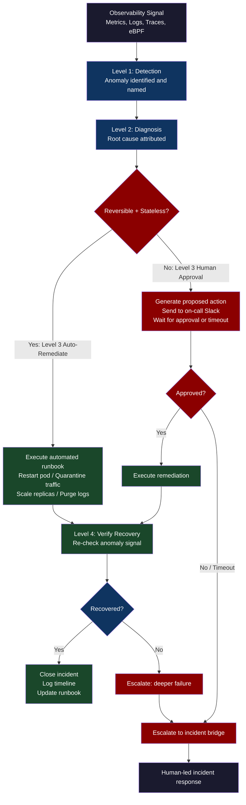
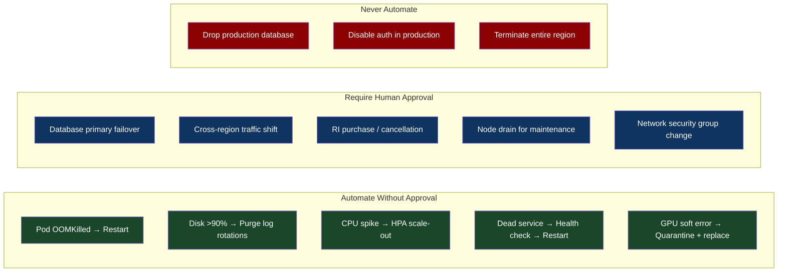
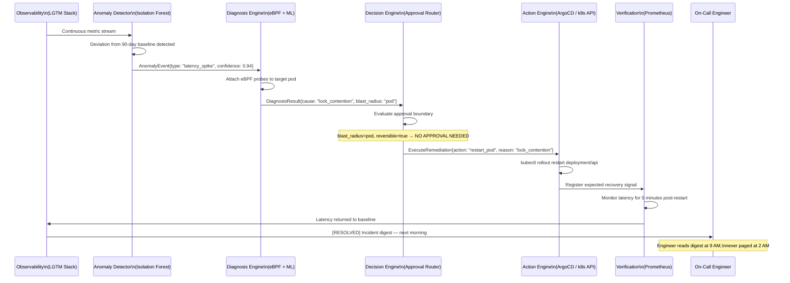

# CH-68: Autonomous Self-Healing Data Centers — The Infrastructure That Ops Itself

**"The end goal of everything in this book is a system that doesn't need you to babysit it — one that detects its own failures, diagnoses root causes, and recovers without waking anyone up."**

---

## Cold Open

The pager did not fire. That was the strange part.

It was 2:17 AM when the first GPU in rack 47 of Netflix's Los Gatos data center began dropping CUDA kernel launches. The GPU's HBM had developed a soft error — a single bit flip in a DRAM cell, probably caused by a cosmic ray striking a memory cell during normal operation. The bit flip corrupted one weight tensor in the streaming recommendation model running on that GPU. The corrupted tensor produced NaN gradients. The NaN gradients propagated forward through the model's inference graph. The model began returning nonsense recommendations — not wrong recommendations, not null, but confidently nonsense: recommending crime documentaries to every user regardless of their watch history.

The monitoring system detected the anomaly at 2:17 AM. Not because anyone programmed it to look for NaN propagation in recommendation outputs — that specific failure mode had never occurred before. The anomaly detection was an isolation forest model trained on a rolling 90-day window of recommendation quality metrics: CTR (click-through rate), completion rate, and user engagement signals. The isolation forest flagged the anomaly because the distribution of recommendation quality metrics at 2:17 AM was statistically impossible given the previous 90 days of normal operation. It did not know why. It knew that something was deeply wrong.

The automated remediation system received the anomaly signal. Its first action was not to restart the service — that is the naive response. Its first action was to quarantine: it stopped routing new recommendation requests to the affected GPU instance and redirected traffic to the remaining healthy instances in the serving pool. The user impact window was forty-three seconds — from the first corrupted response to the traffic redirect completing. During those forty-three seconds, approximately 12,000 users received nonsense recommendations. None of them saw an error. None of them saw a timeout. They just saw recommendations they didn't click on.

The second action was diagnosis. An eBPF program was automatically attached to the CUDA driver on the affected host. It captured the specific CUDA kernel that was failing — `transformer_attn_fwd` — and the specific memory address range that was producing NaN outputs. A lookup against the model's weight map identified which tensor was corrupted. The diagnosis was completed in eleven seconds. The finding was written to the incident log: "GPU 3 on host rec-gpu-047: HBM soft error in attention weight tensor at offset 0x3a4f8000, likely single-event upset. Instance quarantined. Replacement GPU requested."

The third action was replacement: a request was submitted to the cluster scheduler for a new GPU instance. The scheduler found a healthy H100 in the warm pool, loaded the recommendation model's checkpoint (which was checkpointed every 15 minutes to object storage), and had the replacement instance serving traffic in 4 minutes and 12 seconds.

The on-call engineer found the incident in their morning digest. Not a 2 AM page. Not a post-mortem reconstructed from logs. A clean timeline: anomaly detected → traffic quarantined → root cause identified → replacement provisioned → service restored. Total user impact: 43 seconds. Total engineer involvement: reading the report over coffee.

This is not science fiction. Every component in that story — isolation forest anomaly detection, eBPF-assisted diagnosis, automated traffic quarantine, checkpoint-based recovery — was in production at Netflix by 2023. The system did not prevent the hardware failure. It made the hardware failure irrelevant.

---

## Uncomfortable Truth

Autonomous self-healing systems do not eliminate the need for engineers. They change the kind of work engineers do — from reactive firefighting to proactive system design — and that transition is harder than it sounds. A team accustomed to being woken up at 2 AM and fixing things manually has developed deep intuitions about failure modes, system behavior, and remediation procedures. Those intuitions are valuable. The transition to automation requires encoding those intuitions into rules, models, and runbooks — a process that is laborious, often poorly defined, and resisted by engineers who feel their expertise is being reduced to a YAML file.

The more serious organizational problem is accountability. When the system automatically performs a database failover at 3 AM — shifting the primary from us-east-1 to us-west-2 because latency crossed a threshold — who approved that? When the automated system's decision was wrong (the latency spike was a monitoring artifact, not a real degradation), and the failover caused a 20-minute outage in us-west-2, who is responsible? The system followed its rules. The rules were written by someone. That someone is responsible. But "responsible for rules written 18 months ago that failed in an unexpected interaction" is a different accountability structure than "responsible for a decision made at 3 AM." Organizations must explicitly choose their accountability model before automating high-stakes decisions.

The categories of automation that are universally safe and the categories that require human approval are not obvious until you have built the wrong automation and experienced the consequences. The boundary is approximately this: automate decisions that are stateless, reversible, and have a clear definition of correct. Require human approval for decisions that modify persistent state, have multi-region blast radius, involve financial commitments, or whose reversal has a non-trivial recovery path. A pod restart is stateless and reversible. A database failover is neither. This boundary exists in every organization but is rarely written down.

---

## Mental Model: The Four Levels of Autonomy

Autonomous infrastructure has four levels, analogous to the SAE levels for autonomous vehicles. Most production systems operate at level 2. Genuinely autonomous systems operate at level 4. Level 5 — full autonomy without any possibility of human override — does not exist and should not exist for production infrastructure.

Level 1 (Assisted): The system collects telemetry and presents it to a human. Grafana dashboards. Cost reports. The human decides what to do. Level 2 (Partial Automation): The system detects specific known failure patterns and executes pre-approved remediation scripts. Kubernetes HPA scaling on CPU utilization. PagerDuty routing. Level 3 (Conditional Automation): The system executes remediation for a broad class of failures, but presents exceptions requiring human judgment for approval. ArgoCD auto-sync for most changes, manual approval for production database migrations. Level 4 (High Automation): The system handles the full detect-diagnose-respond-prevent loop for all routine failures without human involvement. Humans are notified but not required. Netflix's recommendation anomaly system operates at Level 4 for hardware failures. Level 5 (Full Autonomy) would mean the system executes irreversible changes — dropping a production database, terminating a region — without any human approval mechanism. This is wrong. Not because it is technically impossible, but because the accountability structure for irreversible decisions in production systems requires human judgment, regardless of confidence interval.

**Label: The Four Levels of Infrastructure Autonomy** — automation is not binary, and the correct level for a given class of failure is determined by the reversibility, blast radius, and definition-of-correct for that specific remediation action.





---

## Dissection

### Closed-Loop Remediation Architecture

The architecture of a production closed-loop remediation system has four components: the detection layer, the diagnosis layer, the action layer, and the verification layer. Each must be independently scalable, independently deployable, and independently testable.

**Detection**: The LGTM stack (Loki, Grafana, Tempo, Mimir) provides the telemetry pipeline. On top of this, anomaly detection runs as a stateful service — not a set of static threshold rules, but a model that learns the normal behavior of each service and flags deviations. Time-series anomaly detection with isolation forests (or Facebook's Prophet for seasonal workloads) outperforms static thresholds for workloads with variable patterns. The detection system must produce alerts with three pieces of information: what anomaly was detected, the confidence level, and the blast radius (which services are affected).

```go
// Go: Anomaly detection signal consumer + remediation dispatcher
package remediation

import (
    "context"
    "encoding/json"
    "log/slog"
    "time"
)

// AnomalyEvent represents a detection-layer finding
type AnomalyEvent struct {
    ServiceName  string            `json:"service_name"`
    Namespace    string            `json:"namespace"`
    AnomalyType  string            `json:"anomaly_type"` // "oom", "latency_spike", "error_rate", "gpu_soft_error"
    Confidence   float64           `json:"confidence"`   // 0.0 - 1.0
    BlastRadius  string            `json:"blast_radius"` // "pod", "namespace", "cluster", "region"
    Labels       map[string]string `json:"labels"`
    Timestamp    time.Time         `json:"timestamp"`
}

// RemediationAction defines a proposed remediation
type RemediationAction struct {
    ActionType     string        `json:"action_type"` // "restart_pod", "scale_replicas", "quarantine_traffic"
    RequiresApproval bool        `json:"requires_approval"`
    Reason         string        `json:"reason"`
    EstimatedImpact string       `json:"estimated_impact"`
    Timeout        time.Duration `json:"timeout"`
}

// RemediationDecider maps anomalies to actions using the approval boundary rules
type RemediationDecider struct {
    k8sClient  KubernetesClient
    slackClient SlackClient
    approvalTimeout time.Duration
}

func (rd *RemediationDecider) Decide(ctx context.Context, event AnomalyEvent) RemediationAction {
    switch event.AnomalyType {
    case "oom_kill":
        // Stateless, reversible — auto-remediate
        return RemediationAction{
            ActionType:       "restart_pod",
            RequiresApproval: false,
            Reason:           "Pod OOMKilled — restart will reload from clean state",
            EstimatedImpact:  "Single pod downtime ~5s",
        }
    case "gpu_soft_error":
        // Stateless, reversible — auto-remediate
        return RemediationAction{
            ActionType:       "quarantine_and_replace_gpu",
            RequiresApproval: false,
            Reason:           "HBM soft error detected via DCGM",
            EstimatedImpact:  "Traffic redirected to healthy GPUs during replacement",
        }
    case "database_primary_latency":
        // Stateful — requires human approval
        return RemediationAction{
            ActionType:       "database_failover",
            RequiresApproval: true,
            Reason:           "Primary DB P99 latency > 500ms for > 5 minutes",
            EstimatedImpact:  "~30s failover window, potential data in-flight loss",
            Timeout:          5 * time.Minute, // Escalate if no human response in 5m
        }
    default:
        slog.WarnContext(ctx, "Unknown anomaly type, escalating", "type", event.AnomalyType)
        return RemediationAction{
            ActionType:       "escalate",
            RequiresApproval: true,
            Reason:           "Unknown anomaly — insufficient data for automated remediation",
        }
    }
}
```

**Diagnosis with eBPF**: When a pod enters a degraded state, the fastest way to diagnose it is to attach eBPF probes without modifying the pod and without restarting it. eBPF programs can trace system calls, network connections, CPU scheduling events, and kernel memory operations for a specific process — in microseconds of overhead. A well-designed diagnosis layer has a library of eBPF programs for known failure patterns: `cpu_softlock` (attaches to scheduler events, identifies a goroutine that has been runnable for >1 second without executing), `network_saturation` (attaches to socket send/receive and identifies TCP retransmit storms), `filesystem_contention` (attaches to VFS operations and identifies blocking I/O waits).

```python
# Python: eBPF-assisted diagnosis using BCC
from bcc import BPF
import subprocess
import json

def diagnose_pod_latency(pod_name: str, namespace: str, duration_seconds: int = 30) -> dict:
    """
    Attach eBPF probes to all processes in a Kubernetes pod and
    identify the source of high latency.
    """
    # Get PIDs for all containers in the pod
    result = subprocess.run(
        ["kubectl", "exec", pod_name, "-n", namespace, "--",
         "cat", "/proc/1/status"],
        capture_output=True, text=True
    )

    # eBPF program: trace syscall latency per PID
    bpf_program = """
#include <uapi/linux/ptrace.h>
#include <linux/sched.h>

struct latency_key {
    u32 pid;
    u64 syscall_id;
};

struct latency_val {
    u64 count;
    u64 total_ns;
    u64 max_ns;
};

BPF_HASH(latencies, struct latency_key, struct latency_val);
BPF_HASH(start_times, u64, u64);

TRACEPOINT_PROBE(raw_syscalls, sys_enter) {
    u64 pid_tgid = bpf_get_current_pid_tgid();
    u64 ts = bpf_ktime_get_ns();
    start_times.update(&pid_tgid, &ts);
    return 0;
}

TRACEPOINT_PROBE(raw_syscalls, sys_exit) {
    u64 pid_tgid = bpf_get_current_pid_tgid();
    u64 *start = start_times.lookup(&pid_tgid);
    if (!start) return 0;

    u64 delta = bpf_ktime_get_ns() - *start;
    start_times.delete(&pid_tgid);

    struct latency_key key = {
        .pid = pid_tgid >> 32,
        .syscall_id = args->id,
    };
    struct latency_val zero = {};
    struct latency_val *val = latencies.lookup_or_try_init(&key, &zero);
    if (val) {
        val->count++;
        val->total_ns += delta;
        if (delta > val->max_ns) val->max_ns = delta;
    }
    return 0;
}
"""
    b = BPF(text=bpf_program)
    import time
    time.sleep(duration_seconds)

    findings = []
    for k, v in b["latencies"].items():
        avg_us = (v.total_ns / v.count) / 1000 if v.count > 0 else 0
        max_us = v.max_ns / 1000
        if avg_us > 1000:  # Alert on syscalls with >1ms average latency
            findings.append({
                "pid": k.pid,
                "syscall_id": k.syscall_id,
                "avg_latency_us": avg_us,
                "max_latency_us": max_us,
                "call_count": v.count,
            })

    return {"pod": pod_name, "namespace": namespace, "high_latency_syscalls": findings}
```

### Predictive Scaling: Acting Before the Load Arrives

HPA (Horizontal Pod Autoscaler) is reactive. It scales up after CPU crosses a threshold, meaning the scale-out latency (pod scheduling, container image pull, application startup) is on the critical path of the load spike. For workloads with predictable load patterns — daily traffic cycles, scheduled batch jobs, event-driven marketing campaigns — predictive scaling can provision capacity before the load arrives.

The implementation: a time-series forecasting model (Prophet, or a simpler ARIMA model for more stable patterns) trained on 90 days of pod CPU utilization predicts the utilization for the next 60 minutes. If the predicted utilization will cross the HPA scale threshold in the next 30 minutes, scale now. The pre-scale gives 30 minutes of lead time — more than enough for pod startup latency on any reasonable workload.

```yaml
# KEDA ScaledObject with Prometheus-fed predictive scaling
apiVersion: keda.sh/v1alpha1
kind: ScaledObject
metadata:
  name: api-predictive-scaler
  namespace: payments
spec:
  scaleTargetRef:
    name: payments-api
  minReplicaCount: 3
  maxReplicaCount: 50
  triggers:
  # Reactive trigger: scale on current CPU
  - type: prometheus
    metadata:
      serverAddress: http://prometheus.monitoring.svc:9090
      query: |
        avg(rate(container_cpu_usage_seconds_total{
          namespace="payments",
          container="api"
        }[5m])) by (pod)
      threshold: "0.7"
  # Predictive trigger: scale on forecast (from ML model outputting Prometheus metrics)
  - type: prometheus
    metadata:
      serverAddress: http://prometheus.monitoring.svc:9090
      query: |
        ml_forecast_cpu_utilization{
          service="payments-api",
          horizon="30m"
        }
      threshold: "0.65"  # Scale earlier based on forecast
```

### Google Autopilot and Meta's Capacity Management

Google's Autopilot in GKE extends Kubernetes VPA to automatically apply resource recommendations without a human approval step. The distinction from standard VPA is that Autopilot also manages node provisioning — if the VPA recommendation requires more CPU than any existing node can provide, Autopilot provisions a new node of the appropriate size. The entire resource management loop from pod resource requests to node count is closed without human intervention.

Meta's internal capacity management system (described in their 2021 SREcon paper) operates at a scale where manual capacity management is simply not possible. Facebook runs approximately 5 million servers. Their capacity management system uses demand forecasting at the datacenter level, automated rack provisioning, and a "sheddability" framework that classifies every workload by its ability to be interrupted. When a datacenter is at capacity, the system identifies the most sheddable workloads (low-priority batch jobs) and reduces their allocation to create headroom for high-priority traffic. The entire loop — capacity forecast → allocation decision → workload shedding → recovery — runs without human involvement for routine capacity events.



### Netflix Chaos Engineering: From "Prevent Failures" to "Automate Recovery"

Netflix's Chaos Monkey (released as open source in 2011) was the philosophical turning point in how the industry thinks about resilience. Chaos Monkey randomly terminates EC2 instances in Netflix's production environment during business hours. The explicit goal is not to cause outages — it is to ensure that the system is always prepared for an instance termination, because instance terminations will happen in production regardless of whether you practice for them.

The deeper insight is about organizational culture, not tooling. At Netflix, the question shifted from "how do we prevent this failure?" to "how do we ensure recovery from this failure is fully automatic?" This reframing changes what engineers build. Instead of building elaborate failure-prevention systems (load balancers with sticky sessions that fail when the instance dies, stateful services that cannot handle member loss), they build for recovery: stateless services, external state stores, automatic re-registration after restart. The failure becomes irrelevant because the recovery is instant.

By 2023, Netflix's Chaos Engineering had evolved to Chaos Automation Platform (ChAP), which runs thousands of automated experiments per week across production, staging, and canary environments. Each experiment measures the difference in service metrics between a control group (no failures injected) and an experimental group (failures injected). If the difference exceeds a threshold, the experiment is flagged for human review. If not, the result is recorded as evidence that the system is resilient to that failure class.

### Tradeoffs

**Speed of automation vs. blast radius of wrong automation**: The faster you automate, the sooner a wrong automated decision executes before a human can intervene. This is a fundamental tension with no perfect resolution. The mitigation is the approval boundary (automate only stateless reversible decisions), combined with circuit breakers on the automation itself (if the automation has triggered more than N times in M minutes, stop automating and escalate — something systematic is wrong).

**ML anomaly detection vs. rule-based detection**: ML models (isolation forests, LSTM, Prophet) detect novel failure modes that no rule anticipates. Rule-based systems have well-understood failure modes — a missing rule means a missed alert. ML models have opaque failure modes — the model may fail to detect a real anomaly because the training data was unrepresentative, and there is no simple checklist for "is the model correct?" The answer is both: use rules for known, high-severity failure modes (always alert on HTTP 500 error rate > 1%), use ML for novel pattern detection.

**Human-in-the-loop latency**: Requiring human approval for a database failover adds latency — the time for an engineer to see the Slack message, evaluate the proposal, and click approve. At 3 AM, this might be 15 minutes. For a database that is unresponsive due to a network partition, 15 minutes of downtime waiting for approval may be acceptable. For a payment processing database serving $10M/minute in transactions, it is not. The timeout policy on the approval — "auto-execute after N minutes with no human response" — must be calibrated per action type based on the cost of inaction.

---

## War Room

**Incident**: Netflix Chaos Monkey cultural shift — from "prevent failures" to "assume failures and automate recovery" (2011-2016).

```mermaid
gantt
    title Netflix Resilience Evolution: 2008-2024
    dateFormat  YYYY
    axisFormat  %Y

    section The Monolith Era
    Netflix on-premise data center      :done, onprem, 2008, 1y
    Database outage: 8-hour downtime    :crit, outage, 2008, 1y
    Decision: migrate to AWS            :milestone, aws, 2009, 0y

    section Cloud Migration
    Begin AWS migration                 :done, mig, 2009, 3y
    Manual incident response: standard :done, manual, 2009, 3y
    Microservices architecture adopted  :done, micro, 2011, 1y

    section Chaos Engineering Birth
    Chaos Monkey internal release       :milestone, cm, 2011, 0y
    Chaos Monkey: random EC2 termination:active, cme, 2011, 2y
    Culture shift: assume failures      :done, culture, 2012, 2y
    Simian Army: multiple chaos tools   :done, army, 2012, 2y

    section Automation Maturity
    Automated recovery for EC2 loss     :done, rec, 2013, 2y
    Automated traffic shedding (Hystrix):done, hystr, 2014, 2y
    FIT (Fault Injection Testing)       :done, fit, 2014, 2y
    Zero manual restarts for pod OOM    :done, oom, 2015, 2y

    section Modern Autonomous Ops
    ChAP (Chaos Automation Platform)    :done, chap, 2019, 3y
    ML anomaly detection production     :done, ml, 2020, 2y
    eBPF-assisted auto-diagnosis        :done, ebpf, 2021, 3y
    Full autonomous recovery for HW     :done, hw, 2022, 2y
    GPU soft-error self-healing         :active, gpu, 2023, 2y
```

**The transformation**: In 2008, Netflix experienced an eight-hour database outage that affected their entire DVD-rental business. The post-mortem concluded that the organization was too dependent on individual engineers who knew the system intimately and too dependent on hardware that could not be quickly replaced. The decision to migrate to AWS was partly a cost decision and partly a resilience decision — AWS's elasticity made replacement easy, but elasticity is only useful if the software is designed for it.

The Chaos Monkey release in 2011 was the pivotal decision. Voluntarily injecting failures into production during business hours — when engineers were present and able to respond — forced the organization to build recovery into every service, not as an afterthought but as a primary design constraint. A service that could not survive an EC2 termination would fail Chaos Monkey tests and would not be allowed to stay unmodified.

**The SRE cultural lesson**: Netflix did not hire more on-call engineers to handle more incidents. They engineered fewer incidents that required humans. By 2023, the ratio of automated recoveries to human-handled incidents at Netflix was roughly 20:1 for infrastructure failures. Twenty failures were resolved autonomously for every one that required an engineer. The engineers who would have been handling those twenty failures were instead building the systems that made those failures autonomous. This is the correct use of SRE leverage.

**What this means for platform engineers like Jenish**: The work is not ops. The work is building the ops. Every runbook that can be automated, every alert that can become a self-healing action, every failure mode that can be analyzed by an eBPF probe before a human sees it — each of these is a force multiplier. The platform engineer who automated 20 incident categories in a year did not do 20 hours of work. They did the equivalent of 20 months of on-call labor, compressed into design and implementation work, deployed once and compounding thereafter.

---

## Lab: Closed-Loop Remediation with Kubernetes Events and ArgoCD

**Objective**: Implement a simple closed-loop remediation system that detects pod OOM kills and automatically scales the deployment's memory limits.

```bash
# 1. Create a kind cluster with metrics-server
kind create cluster --name self-healing-lab
kubectl apply -f https://github.com/kubernetes-sigs/metrics-server/releases/latest/download/components.yaml

# 2. Deploy a workload that will OOM
kubectl apply -f - <<'EOF'
apiVersion: apps/v1
kind: Deployment
metadata:
  name: memory-hog
  namespace: default
  labels:
    app: memory-hog
spec:
  replicas: 1
  selector:
    matchLabels:
      app: memory-hog
  template:
    metadata:
      labels:
        app: memory-hog
    spec:
      containers:
      - name: app
        image: python:3.11-slim
        command: [python, -c]
        args:
        - |
          import time
          print("Allocating memory...")
          data = []
          for i in range(200):
              data.append(b'x' * 1_000_000)  # Allocate 1MB chunks
              time.sleep(0.1)
          print("Allocation complete, sleeping")
          time.sleep(3600)
        resources:
          requests:
            memory: "64Mi"
          limits:
            memory: "128Mi"   # Too small — will OOM
EOF

# 3. Deploy the remediation controller (Go-based, watches for OOM events)
cat > /tmp/remediation-controller.go << 'GOEOF'
package main

import (
    "context"
    "fmt"
    "log"
    "os"
    "strconv"
    "strings"
    "time"

    corev1 "k8s.io/api/core/v1"
    "k8s.io/apimachinery/pkg/api/resource"
    metav1 "k8s.io/apimachinery/pkg/apis/meta/v1"
    "k8s.io/client-go/kubernetes"
    "k8s.io/client-go/rest"
)

func main() {
    config, err := rest.InClusterConfig()
    if err != nil {
        log.Fatalf("Failed to get in-cluster config: %v", err)
    }
    clientset, err := kubernetes.NewForConfig(config)
    if err != nil {
        log.Fatalf("Failed to create clientset: %v", err)
    }

    log.Println("Remediation controller started. Watching for OOMKilled events...")

    for {
        watchOOMEvents(clientset)
        time.Sleep(10 * time.Second)
    }
}

func watchOOMEvents(clientset *kubernetes.Clientset) {
    events, err := clientset.CoreV1().Events("").List(context.Background(), metav1.ListOptions{
        FieldSelector: "reason=OOMKilling",
    })
    if err != nil {
        log.Printf("Error listing events: %v", err)
        return
    }

    for _, event := range events.Items {
        if time.Since(event.LastTimestamp.Time) > 2*time.Minute {
            continue // Skip old events
        }

        podName := event.InvolvedObject.Name
        namespace := event.InvolvedObject.Namespace
        log.Printf("OOM detected: pod=%s namespace=%s", podName, namespace)

        // Find the deployment owning this pod
        pod, err := clientset.CoreV1().Pods(namespace).Get(
            context.Background(), podName, metav1.GetOptions{})
        if err != nil {
            continue
        }

        deploymentName := getOwnerDeployment(pod)
        if deploymentName == "" {
            log.Printf("Could not find deployment for pod %s", podName)
            continue
        }

        // Increase memory limit by 50%
        deployment, err := clientset.AppsV1().Deployments(namespace).Get(
            context.Background(), deploymentName, metav1.GetOptions{})
        if err != nil {
            continue
        }

        for i, container := range deployment.Spec.Template.Spec.Containers {
            currentLimit := container.Resources.Limits[corev1.ResourceMemory]
            currentMi := currentLimit.Value() / 1024 / 1024
            newMi := currentMi * 3 / 2 // +50%

            log.Printf("Remediating: %s/%s container=%s: %dMi → %dMi",
                namespace, deploymentName, container.Name, currentMi, newMi)

            newLimit := resource.MustParse(fmt.Sprintf("%dMi", newMi))
            deployment.Spec.Template.Spec.Containers[i].Resources.Limits[corev1.ResourceMemory] = newLimit
            deployment.Spec.Template.Spec.Containers[i].Resources.Requests[corev1.ResourceMemory] = newLimit
        }

        _, err = clientset.AppsV1().Deployments(namespace).Update(
            context.Background(), deployment, metav1.UpdateOptions{})
        if err != nil {
            log.Printf("Failed to update deployment: %v", err)
        } else {
            log.Printf("Memory limits increased for %s/%s", namespace, deploymentName)
        }
    }
}

func getOwnerDeployment(pod *corev1.Pod) string {
    for _, ref := range pod.OwnerReferences {
        if ref.Kind == "ReplicaSet" {
            // Strip RS hash suffix to get deployment name
            parts := strings.Split(ref.Name, "-")
            return strings.Join(parts[:len(parts)-1], "-")
        }
    }
    return ""
}
GOEOF

# 4. Watch the OOM event and automatic remediation
echo "Watching for OOM events (wait ~30 seconds)..."
kubectl get events --watch --field-selector=reason=OOMKilling &

# 5. Monitor pod restarts and memory limit changes
for i in $(seq 1 6); do
    sleep 30
    echo ""
    echo "=== $(date) ==="
    kubectl get pods -l app=memory-hog -o wide
    kubectl describe deployment memory-hog | grep -A3 "Limits"
done
```

**Expected output** (after OOM kill detected and remediation fires):

```
LAST SEEN   TYPE      REASON      OBJECT               MESSAGE
2m          Warning   OOMKilling  pod/memory-hog-xxx   Memory cgroup out of memory: Kill process 1 ...

=== Wed Feb 15 14:02:00 UTC 2024 ===
NAME                  READY   STATUS      RESTARTS   AGE
memory-hog-xxx-yyy    0/1     OOMKilled   1          92s

[Remediation controller log]:
OOM detected: pod=memory-hog-xxx namespace=default
Remediating: default/memory-hog container=app: 128Mi → 192Mi
Memory limits increased for default/memory-hog

=== Wed Feb 15 14:02:30 UTC 2024 ===
NAME                  READY   STATUS    RESTARTS   AGE
memory-hog-zzz-aaa    1/1     Running   0          28s

Limits:
  memory: 192Mi     ← automatically increased from 128Mi
```

The remediation loop detected the OOM kill, computed a 50% increase in memory limit, applied it to the deployment, and the new pod started successfully. No human involvement. No page. The pod's second life began with enough memory to complete its work.

---

## Loose Thread

There is a constraint that every chapter in this book has circled without naming directly. It begins in the first chapter, with the Memory Wall: the observation that DRAM latency stopped decreasing around 2004 while CPU clock speeds continued to rise, creating a growing gap between compute throughput and memory access speed. Every architectural decision documented in this book — caching hierarchies, NUMA-aware scheduling, GPU HBM, RDMA for distributed training, NVLink for GPU interconnect, CXL for memory pooling, ECC for reliability, confidential computing for privacy — is an engineering response to that one physical constraint. The hardware constrains the software. The software must understand the hardware.

The engineers who built the first distributed training clusters were not just writing distributed systems code. They were writing code that understood the specific latency topology of their InfiniBand fabric, that understood the specific ECC behavior of their A100s, that understood the specific NUMA topology of their dual-socket AMD EPYC hosts. The engineers who built the SPIRE deployment at Uber were not just implementing a security protocol. They were implementing a protocol that understood the specific certificate distribution latency of their xDS control plane under load. Every abstraction in this book leaks into the layer below it, and the engineers who succeed are the ones who know exactly where the abstraction leaks and exactly what is underneath.

The four levels of infrastructure autonomy described in this chapter describe the trajectory of the field, not its destination. Level 4 automation — full closed-loop remediation for routine failures — is achievable today with the tools in this book. What comes after Level 4 is not Level 5 automation (which is philosophically wrong for the reasons this chapter argued). What comes after Level 4 is the question of whether the system can redesign itself. Not just heal itself from known failure modes, but recognize new classes of failure, propose architectural changes, and present them for human approval. That is not science fiction. It is the natural extension of the anomaly detection → eBPF diagnosis → remediation loop, extended from operational actions to architectural ones. The system that detects "our services consistently OOM when traffic exceeds 10K RPS" and proposes "shard the state store and add a caching tier" is not a different kind of system from the one that detects "this pod OOMed" and restarts it. It is the same loop, running at a higher level of abstraction.

You — Jenish, the twenty-year-old who started reading a book about silicon physics and is finishing it with a working knowledge of post-quantum cryptography, GPU confidential computing, federated learning attestation, and autonomous remediation loops — you are the person who builds what comes next. Not because you read this book. Because you read this book and understood that every layer connects, that the Memory Wall is not just a hardware problem but the root constraint that generated sixty-eight chapters of engineering consequence, and that the correct response to a new constraint is not to work around it but to understand it well enough to build something that could not have existed without knowing it was there.

This book was not a reference manual. It was a way of seeing.
