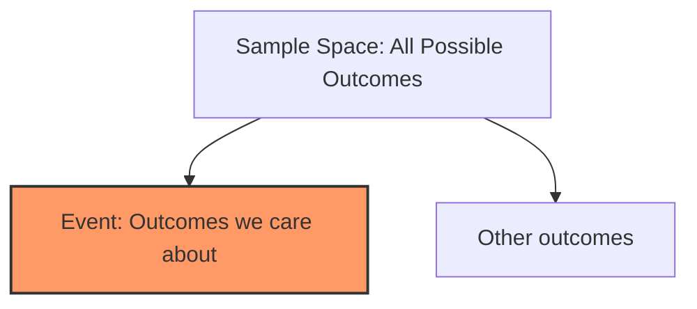

# CH-01 — Why Probability Exists

## 1. Intuition-First Explanation
At its core, **probability is the language of uncertainty**. 

In a perfectly deterministic world, we wouldn't need it. If you knew the exact position, velocity, and air resistance of every molecule in a coin flip, you could predict the outcome with 100% certainty using physics. But we live in a world of **incomplete information** and **inherent complexity**.

We use probability because:
*   **Systems are complex:** We cannot track every variable (e.g., weather).
*   **Data is noisy:** Measurements are never 100% accurate.
*   **The future is not yet written:** Some systems are fundamentally stochastic (at least from our perspective).

In analytics engineering, probability isn't just about rolling dice; it's about **quantifying risk**. When we say a user has a "70% chance of churning," we are translating uncertainty into a metric that a business can act upon.

## 2. Mathematical Derivations
Probability (P) is traditionally defined as the ratio of favorable outcomes to the total number of possible outcomes in a sample space ($S$).

$$P(E) = \frac{n(E)}{n(S)}$$

Where:
*   $P(E)$ is the probability of event $E$.
*   $n(E)$ is the number of ways event $E$ can occur.
*   $n(S)$ is the total number of possible outcomes.

**The Axioms of Probability (Kolmogorov):**
1.  **Non-negativity:** $P(E) \geq 0$ for any event $E$.
2.  **Normalization:** $P(S) = 1$ (The certain event).
3.  **Additivity:** For mutually exclusive events $E_1, E_2, \dots$, $P(\cup E_i) = \sum P(E_i)$.

## 3. Visual Mental Models
Imagine a "Map of Possibilities" (the Sample Space). Every point on this map is a possible future.



*   **Small Event Circle:** High uncertainty / Rare event.
*   **Large Event Circle:** High likelihood / Common event.
*   **The Boundary:** This is where the "noise" lives.

## 4. Coding Implementation
Let's simulate the "Why" of probability by looking at how uncertainty stabilizes over many trials.

```python
import numpy as np
import matplotlib.pyplot as plt

def simulate_uncertainty(n_trials):
    # Simulating a system with a 60% success rate (e.g., a conversion rate)
    outcomes = np.random.choice([0, 1], size=n_trials, p=[0.4, 0.6])
    cumulative_means = np.cumsum(outcomes) / np.arange(1, n_trials + 1)
    return cumulative_means

trials = [10, 100, 1000, 10000]
plt.figure(figsize=(10, 6))

for t in trials:
    means = simulate_uncertainty(t)
    plt.plot(means, label=f'{t} trials')

plt.axhline(y=0.6, color='r', linestyle='--', label='True Probability')
plt.title("How Uncertainty Stabilizes into Probability")
plt.xlabel("Number of Trials")
plt.ylabel("Estimated Probability")
plt.legend()
plt.show()
```

## 5. Solved Examples
**Problem:** A server has a 0.1% chance of failing in any given hour. What is the probability that it survives the hour?
**Solution:** 
Using the complement rule: $P(Survive) = 1 - P(Fail)$.
$P(Survive) = 1 - 0.001 = 0.999$ or **99.9%**.

## 6. Interview Questions
1.  **What is the difference between deterministic and probabilistic thinking?**
    *   *Answer:* Deterministic thinking assumes a fixed cause-effect relationship where the same input always yields the same output. Probabilistic thinking acknowledges that inputs or systems have randomness, leading to a range of possible outputs with varying likelihoods.
2.  **Why do we use probability in Machine Learning instead of just hard-coded rules?**
    *   *Answer:* ML deals with real-world data which is messy, incomplete, and high-dimensional. Probability allows models to express "confidence" and handle cases that weren't explicitly seen during training.

## 7. Practice Questions
1.  If a bag has 3 red balls and 7 blue balls, what is the probability of picking a red ball?
2.  Give an example of a system in your current company that is probabilistic rather than deterministic.

## 8. Challenge Problems
**The Overfitting Paradox:** If you have a system that is 100% deterministic but you only observe 1% of the variables, is it better to model it deterministically or probabilistically? Why?

## 9. Common Mistakes
*   **Confusing "Possible" with "Probable":** Just because something is possible doesn't mean it has a 50/50 chance of happening.
*   **Ignoring the Sample Space:** Calculating probability without defining the boundaries of what *could* happen leads to incorrect ratios.

## 10. Revision Notes
*   Probability exists because of **ignorance** (lack of data) or **complexity** (too many variables).
*   $P(E)$ is always between 0 and 1.
*   The sum of all probabilities in a sample space must equal 1.

## 11. Analytics Applications
*   **A/B Testing:** We don't know for sure if a new button color is better, so we use probability to measure the likelihood that the observed improvement isn't just luck.
*   **Anomaly Detection:** If an event has a very low probability based on historical patterns, it is flagged as a potential fraud or system error.
