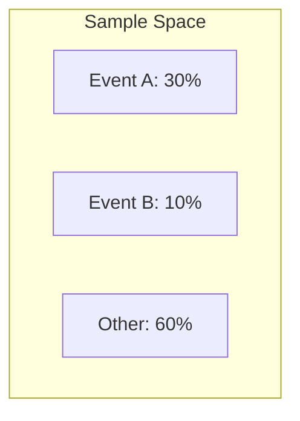

# CH-02 — Probability Vocabulary & Core Concepts

## 1. Intuition-First Explanation
Before we can calculate complex probabilities, we need a shared language. Imagine you are building a simulation for an e-commerce checkout. To understand the "uncertainty" of a user's journey, you first need to define what exactly can happen.

*   **Random Experiment:** The act of observing the user checkout.
*   **Outcomes:** The specific results (User buys, user bounces, user adds to cart but leaves).
*   **Sample Space:** The "Universe" containing every possible outcome.

If you don't define these precisely, your math will be "loose" and your analytics will be unreliable.

## 2. Mathematical Derivations
### Sample Space ($S$)
The set of all possible outcomes.
*   *Example (Coin Flip):* $S = \{H, T\}$
*   *Example (Dice Roll):* $S = \{1, 2, 3, 4, 5, 6\}$

### Event ($E$)
A subset of the sample space. It represents one or more outcomes we are interested in.
*   *Example (Even Dice Roll):* $E = \{2, 4, 6\}$

### Probability Notation
$P(E)$ represents the probability that event $E$ occurs.
The size (cardinality) of a set is denoted by $|S|$ or $n(S)$.
The formula we learned in CH-01 is more formally written as:
$$P(E) = \frac{|E|}{|S|}$$
(This assumes all outcomes in $S$ are **equally likely**).

## 3. Visual Mental Models
Think of the **Sample Space** as a box and **Events** as shapes inside the box.



If an outcome falls inside the circle for "Event A", then Event A has occurred. If it falls outside, it hasn't. The "weight" or area of the shape represents its probability.

## 4. Coding Implementation
Let's define a Sample Space and an Event in Python using Sets.

```python
# Defining the Sample Space for a single die roll
S = {1, 2, 3, 4, 5, 6}

# Defining an Event: Rolling a number greater than 4
E = {outcome for outcome in S if outcome > 4}

print(f"Sample Space (S): {S}")
print(f"Event (E): {E}")

# Calculating probability
prob_E = len(E) / len(S)
print(f"P(E) = {prob_E:.2f}")

# Example 2: E-commerce Outcomes
outcomes = ["Purchase", "Browse", "Bounce", "Add to Cart"]
S_ecommerce = set(outcomes)
E_conversion = {"Purchase"}

prob_conv = len(E_conversion) / len(S_ecommerce)
print(f"Naive P(Conversion) = {prob_conv:.2f}")
```

## 5. Solved Examples
**Problem:** You are drawing a card from a standard deck of 52 cards. What is the probability of drawing a "Heart"?
**Solution:**
1.  **Sample Space ($S$):** All 52 cards. $|S| = 52$.
2.  **Event ($E$):** All hearts in the deck. $|E| = 13$.
3.  **Calculation:** $P(E) = \frac{13}{52} = \frac{1}{4} = 0.25$ or **25%**.

## 6. Interview Questions
1.  **What is a Sample Space?**
    *   *Answer:* A Sample Space is the set of all possible outcomes of a random experiment.
2.  **Can an event be the same as the sample space?**
    *   *Answer:* Yes. This is called a **Certain Event**, and its probability is 1.

## 7. Practice Questions
1.  A jar contains 5 red, 3 green, and 2 blue marbles. Define the sample space $S$ and the event $E$ of picking a green marble.
2.  If you roll two dice, what is the size of the sample space $|S|$?

## 8. Challenge Problems
**Non-Equally Likely Outcomes:** If a website has a 5% conversion rate, can you use the formula $P(E) = \frac{|E|}{|S|}$ where $S = \{\text{Purchase, No Purchase}\}$? Why or why not?

## 9. Common Mistakes
*   **Assuming Equal Likelihood:** The most common mistake is using $\frac{|E|}{|S|}$ for outcomes that don't have the same chance of happening (like the conversion example above).
*   **Overlapping Outcomes:** Forgetting that outcomes in a sample space must be **mutually exclusive** (you can't have "Purchase" and "Bounce" happen in the exact same session outcome).

## 10. Revision Notes
*   **Outcome:** A single result.
*   **Event:** A collection of outcomes.
*   **Sample Space:** All possible results.
*   $0 \leq P(E) \leq 1$.

## 11. Analytics Applications
*   **Funnel Analysis:** Each step in a user funnel is an **Event**. We track the ratio of users in "Event: Checkout" vs "Event: Landing Page" to calculate conversion rates.
*   **Data Validation:** If we see an outcome in our data that isn't in our defined **Sample Space** (e.g., a "Negative Price"), we know there is a data quality issue.
