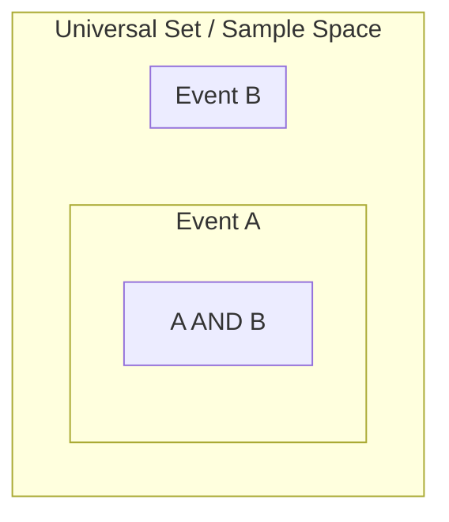

# CH-03 — Set Theory for Probability

## 1. Intuition-First Explanation
If probability is the language of uncertainty, **Set Theory is the grammar**. 

Probability deals with collections of outcomes. Sets allow us to combine, isolate, and compare these collections. For example, if you want to know the probability of a user "Buying a product **OR** Signing up for a newsletter," you are using the concept of a **Union**. If you want to know "Users who bought **AND** came from a referral," you are looking at an **Intersection**.

Mastering set operations is the fastest way to solve complex "multi-event" probability problems.

## 2. Mathematical Derivations
Let $A$ and $B$ be two events (sets of outcomes) in a Sample Space $S$.

*   **Union ($A \cup B$):** Outcomes in $A$ **OR** $B$ (or both).
    *   $A \cup B = \{x \in S \mid x \in A \text{ or } x \in B\}$
*   **Intersection ($A \cap B$):** Outcomes in $A$ **AND** $B$.
    *   $A \cap B = \{x \in S \mid x \in A \text{ and } x \in B\}$
*   **Complement ($A^c$ or $A'$):** Outcomes **NOT** in $A$.
    *   $A^c = \{x \in S \mid x \notin A\}$
*   **Universal Set ($S$ or $U$):** Every possible outcome.
*   **Null Set ($\emptyset$):** An impossible event (no outcomes).
*   **Disjoint Sets:** If $A \cap B = \emptyset$, then $A$ and $B$ have no outcomes in common. They are "Mutually Exclusive."

## 3. Visual Mental Models
Venn Diagrams are the primary tool for visualizing set operations.



*   **Complement:** Everything outside the circle.
*   **Union:** The combined area of both circles.
*   **Intersection:** The overlapping area.

## 4. Coding Implementation
Python's `set` type natively supports these operations.

```python
# Event A: Users who visited the Pricing Page
A = {"User1", "User2", "User3", "User5"}

# Event B: Users who made a Purchase
B = {"User2", "User5", "User6"}

# Intersection: Users who visited pricing AND bought
both = A.intersection(B)
print(f"A ∩ B: {both}")

# Union: Users who either visited pricing OR bought
either = A.union(B)
print(f"A ∪ B: {either}")

# Difference: Users who visited pricing but did NOT buy
visited_only = A.difference(B)
print(f"A \ B: {visited_only}")

# Complement (Assuming we know the total users)
S = {"User1", "User2", "User3", "User4", "User5", "User6", "User7"}
not_bought = S.difference(B)
print(f"B': {not_bought}")
```

## 5. Solved Examples
**Problem:** In a survey of 100 users, 60 use iPhone ($I$), 40 use Android ($A$), and 10 use both. How many use neither?
**Solution:**
1.  Identify $|I| = 60, |A| = 40, |I \cap A| = 10$.
2.  Total using at least one ($I \cup A$): $|I| + |A| - |I \cap A| = 60 + 40 - 10 = 90$.
3.  Neither ($I \cup A$ complement): Total - At least one = $100 - 90 = \mathbf{10}$.

## 6. Interview Questions
1.  **What does it mean for two sets to be disjoint?**
    *   *Answer:* Their intersection is empty ($\emptyset$). In probability terms, they cannot happen at the same time.
2.  **State the inclusion-exclusion principle for two sets.**
    *   *Answer:* $|A \cup B| = |A| + |B| - |A \cap B|$.

## 7. Practice Questions
1.  Given $S = \{1, 2, 3, 4, 5\}$, $A = \{1, 2\}$, $B = \{2, 3\}$. Find $A \cap B$ and $A^c$.
2.  Draw a Venn diagram representing $(A \cap B) \cup C$.

## 8. Challenge Problems
**De Morgan's Laws:** Prove visually or with examples that $(A \cup B)^c = A^c \cap B^c$. Why is this useful in probability?

## 9. Common Mistakes
*   **Double Counting:** The most common mistake is calculating $P(A \cup B)$ as $P(A) + P(B)$ without subtracting the intersection.
*   **Misinterpreting "Or":** In math, "Or" is inclusive (A, B, or Both). In common English, "Or" is often exclusive (A or B, but not both).

## 10. Revision Notes
*   $\cup$ = OR, $\cap$ = AND.
*   Complement ($A^c$) = NOT.
*   Mutually Exclusive = Disjoint = No overlap.
*   Total Probability: $P(A) + P(A^c) = 1$.

## 11. Analytics Applications
*   **Segmentation:** "High Value Users" AND "Returning Users" is a set intersection.
*   **Data Cleaning:** We use set differences to find "IDs present in the source table but NOT in the destination table."
*   **Multi-touch Attribution:** Understanding the overlap ($A \cap B \cap C$) between different marketing channels (Social, Search, Email).
