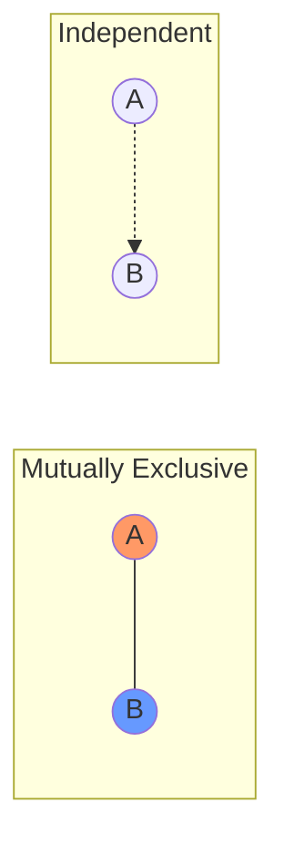

# CH-04 — Mutually Exclusive vs Independent Events

## 1. Intuition-First Explanation
This is the single most common area of confusion for students. 

*   **Mutually Exclusive (ME):** "We cannot both be here at the same time." If I am in London, I cannot be in New York. The events **repel** each other.
*   **Independent (IND):** "What I do doesn't affect what you do." If I flip a coin and it's Heads, it has zero impact on whether it rains in Tokyo. The events **ignore** each other.

The confusion arises because people think "independent" means "disconnected," which sounds like "mutually exclusive." But in probability, if two events are mutually exclusive, they are **highly dependent**. Why? Because if I know Event A happened, I am 100% sure Event B *did not* happen. That is a massive amount of "influence!"

## 2. Mathematical Derivations
### Mutually Exclusive (ME)
Events $A$ and $B$ are ME if they have no overlap.
$$A \cap B = \emptyset \implies P(A \cap B) = 0$$
**Addition Rule for ME:** $P(A \cup B) = P(A) + P(B)$

### Independent (IND)
Events $A$ and $B$ are IND if the occurrence of one does not change the probability of the other.
$$P(A \mid B) = P(A)$$
**Multiplication Rule for IND:** $P(A \cap B) = P(A) \times P(B)$

### The Paradox: Why ME $\neq$ IND
If $A$ and $B$ are ME, then $P(A \cap B) = 0$.
If $A$ and $B$ are IND, then $P(A \cap B) = P(A) \times P(B)$.
For both to be true, either $P(A)$ or $P(B)$ must be 0. 
Therefore, **two non-zero probability events cannot be both Mutually Exclusive and Independent.**

## 3. Visual Mental Models

*   **ME:** Two separate circles. No overlap. One excludes the other.
*   **IND:** Two circles that *might* overlap, but the size of their overlap is exactly the product of their individual sizes.

## 4. Coding Implementation
Let's test for independence in a dataset.

```python
import pandas as pd

# Data: 100 people. 
# A: Uses Python (60 people)
# B: Likes Pizza (80 people)
# Both: (48 people)
n = 100
p_A = 0.6
p_B = 0.8
p_Both = 0.48

# Check for Independence: P(A) * P(B) == P(A ∩ B)
is_independent = (p_A * p_B) == p_Both
print(f"Is Independent? {is_independent} ({p_A * p_B} == {p_Both})")

# Data 2: Mutually Exclusive
# A: Is a Dog
# B: Is a Cat
p_Dog = 0.5
p_Cat = 0.5
p_Both_Pet = 0.0 # You can't be both

is_independent_me = (p_Dog * p_Cat) == p_Both_Pet
print(f"Is ME Independent? {is_independent_me} ({p_Dog * p_Cat} == {p_Both_Pet})")
```

## 5. Solved Examples
**Problem:** Event A has $P(A) = 0.3$, Event B has $P(B) = 0.4$. 
1. If they are ME, what is $P(A \cap B)$?
2. If they are IND, what is $P(A \cap B)$?
**Solution:**
1. ME $\implies P(A \cap B) = \mathbf{0}$.
2. IND $\implies P(A \cap B) = 0.3 \times 0.4 = \mathbf{0.12}$.

## 6. Interview Questions
1.  **Can two events be both mutually exclusive and independent?**
    *   *Answer:* Only if at least one of them has a probability of 0. Otherwise, no.
2.  **How do you prove two events are independent in a dataset?**
    *   *Answer:* Calculate $P(A)$, $P(B)$, and $P(A \cap B)$. If $P(A) \times P(B) = P(A \cap B)$, they are independent.

## 7. Practice Questions
1.  If you roll a die, are "Rolling an even number" and "Rolling a 1" mutually exclusive? Are they independent?
2.  $P(A) = 0.5$, $P(B) = 0.2$. If $P(A \cup B) = 0.6$, are $A$ and $B$ independent? (Hint: Find $P(A \cap B)$ first).

## 8. Challenge Problems
**Conditional Independence:** Can two events be dependent globally but independent given a third event? (Example: Flashlight A and B both failing because the batteries they share died).

## 9. Common Mistakes
*   **The "Independent implies ME" Trap:** Thinking that because events don't affect each other, they don't overlap.
*   **Summing for Independent Events:** Calculating $P(A \cup B)$ as $P(A) + P(B)$ for independent events without subtracting the overlap $P(A)P(B)$.

## 10. Revision Notes
*   **ME:** $P(A \cap B) = 0$. (Cannot happen together).
*   **IND:** $P(A \cap B) = P(A)P(B)$. (Don't affect each other).
*   Knowledge of an ME event provides perfect information about the other (it didn't happen).

## 11. Analytics Applications
*   **A/B Testing:** We assume users in Group A and Group B are **Independent**. If a user in Group A could affect a user in Group B (e.g., in a social network), we have "interference," and our statistics will be wrong.
*   **Recommendation Systems:** We often assume a user's preference for Movie A and Movie B are independent to simplify models, though in reality, they are usually dependent (if you like Sci-Fi, you likely like both).
*   **Redundancy Planning:** In system design, we want server failures to be **Independent**. If they are dependent (e.g., they share a power source), the probability of total system failure is much higher than we think.
