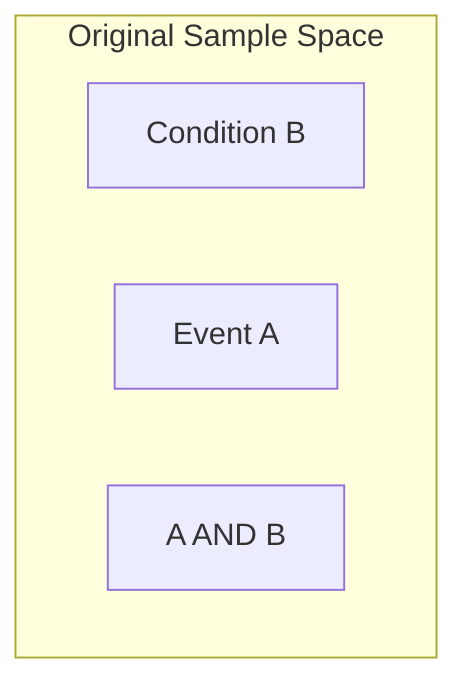

# CH-06 — Conditional Probability

## 1. Intuition-First Explanation
Most probabilities we encounter in the real world are **Conditional**. 

A raw probability like "What is the chance it rains?" is rarely useful. Instead, we ask "What is the chance it rains **given** that the clouds are dark?" or "What is the probability this user churns **given** they haven't logged in for 10 days?"

Conditional probability is the math of **updating our beliefs based on new evidence**. It involves "shrinking" our Sample Space. When we say "given $B$," we are effectively throwing away every outcome in our universe that isn't part of $B$. $B$ becomes our new, smaller universe.

## 2. Mathematical Derivations
The probability of event $A$ occurring given that $B$ has already occurred is denoted as $P(A \mid B)$.

$$P(A \mid B) = \frac{P(A \cap B)}{P(B)}$$

Where:
*   $P(A \cap B)$ is the probability that both $A$ and $B$ occur.
*   $P(B)$ is the probability of the condition (must be $> 0$).

**Deriving the Multiplication Rule:**
By rearranging the formula, we get:
$$P(A \cap B) = P(B) \times P(A \mid B)$$
This tells us that to find the probability of two things happening, we multiply the probability of the first by the probability of the second *after the first has happened*.

## 3. Visual Mental Models
Imagine a Venn Diagram where the "Universe" (Sample Space) is a large square. 



When we say "Given $B$":
1.  Everything outside the $B$ circle is deleted.
2.  The $B$ circle is "stretched" to fill the entire square (it becomes the new $100\%$).
3.  The new probability of $A$ is just the portion of $A$ that survived inside the $B$ circle.

## 4. Coding Implementation
Let's calculate conditional probability using a real-world dataset scenario: **Fraud Detection**.

```python
import pandas as pd

# Creating a synthetic dataset of 1000 transactions
data = {
    'is_fraud': [1]*50 + [0]*950,
    'is_international': [1]*40 + [0]*10 + [1]*100 + [0]*850
}
df = pd.DataFrame(data)

# 1. Total P(Fraud)
p_fraud = df['is_fraud'].mean()

# 2. P(International)
p_inter = df['is_international'].mean()

# 3. P(Fraud AND International)
p_both = len(df[(df['is_fraud'] == 1) & (df['is_international'] == 1)]) / len(df)

# 4. P(Fraud | International)
p_fraud_given_inter = p_both / p_inter

print(f"Baseline P(Fraud): {p_fraud:.2%}")
print(f"P(Fraud | International): {p_fraud_given_inter:.2%}")
print(f"Risk Multiplier: {p_fraud_given_inter / p_fraud:.1f}x")
```

## 5. Solved Examples
**Problem:** In a class, 40% of students like Math ($M$), 30% like Science ($S$), and 10% like both. If a student likes Science, what is the probability they also like Math?
**Solution:** 
$P(M \mid S) = \frac{P(M \cap S)}{P(S)} = \frac{0.10}{0.30} = \frac{1}{3} \approx \mathbf{33.3\%}$.

## 6. Interview Questions
1.  **Explain Conditional Probability to a non-technical stakeholder.**
    *   *Answer:* It's the probability of something happening after we've already learned something else. For example, the chance of a flight being delayed is much higher *if* we already know there is a snowstorm.
2.  **How is $P(A \mid B)$ different from $P(B \mid A)$?**
    *   *Answer:* They are fundamentally different (the "Inverse"). $P(\text{Clouds} \mid \text{Rain})$ is nearly 100%, but $P(\text{Rain} \mid \text{Clouds})$ is much lower. Confusing these is called the "Prosecutor's Fallacy."

## 7. Practice Questions
1.  $P(A) = 0.6, P(B) = 0.3, P(A \cap B) = 0.18$. Find $P(A \mid B)$. Are $A$ and $B$ independent?
2.  A user visits the pricing page ($P$). 20% of all users visit pricing. 5% of all users buy ($B$). All buyers visited the pricing page. Find $P(B \mid P)$.

## 8. Challenge Problems
**The Monty Hall Problem:** You are on a game show with 3 doors. Behind one is a car, others are goats. You pick Door 1. The host (who knows what's behind the doors) opens Door 3 to reveal a goat. Should you switch to Door 2? Use conditional probability to prove your answer.

## 9. Common Mistakes
*   **The Inverse Confusion:** Thinking $P(A \mid B) = P(B \mid A)$. 
*   **Ignoring the Base Rate:** Forgetting that if $B$ is extremely rare, even a high $P(A \mid B)$ might not mean $A$ is likely in absolute terms.

## 10. Revision Notes
*   **Given** = Shrink the sample space.
*   $P(A \mid B) = \frac{P(A \cap B)}{P(B)}$.
*   If $A$ and $B$ are independent, $P(A \mid B) = P(A)$.

## 11. Analytics Applications
*   **Modern Research — LLMs (Large Language Models):** Transformers like GPT-4 work entirely on conditional probability. They calculate $P(\text{Next Token} \mid \text{Previous Tokens})$. The entire "intelligence" of the AI is a massive, high-dimensional conditional probability distribution.
*   **Causal Inference (Directed Acyclic Graphs):** In companies like Uber or Netflix, researchers use "Do-calculus" to understand if $X$ causes $Y$ by looking at $P(Y \mid \text{do}(X))$. This separates simple correlation from actual conditional influence.
*   **Recommender Systems:** $P(\text{Click} \mid \text{User History, Time of Day, Device})$.
