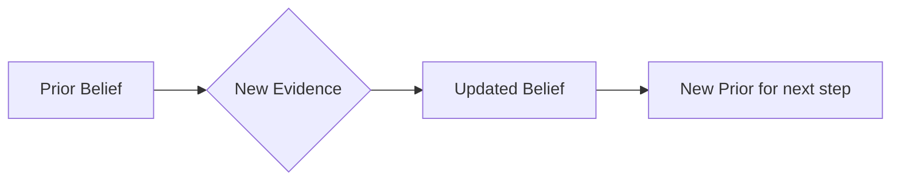

# CH-08 — Bayesian Thinking

## 1. Intuition-First Explanation
Most humans are bad at probability because we are "Frequentists" by nature—we think in terms of how often things happen. **Bayesian Thinking** is different: it's about **degrees of belief**.

In the Bayesian world, probability is not a fixed property of the universe; it's a measure of your *certainty*.
1.  You start with a **Prior** (What you believe before seeing data).
2.  You observe new **Evidence**.
3.  You calculate the **Posterior** (Your updated belief).

If you see a friend walking with an umbrella, your "Prior" belief that it's raining increases. If you then hear thunder, it increases even more. This constant, iterative updating is the core of how modern AI learns.

## 2. Mathematical Derivations
The Bayesian approach is summarized by the **Proportionality Principle**:
$$\text{Posterior} \propto \text{Likelihood} \times \text{Prior}$$

More formally, to update your belief in a hypothesis ($H$) given data ($D$):
$$P(H \mid D) = \frac{P(D \mid H) P(H)}{P(D)}$$

*   $P(H)$: **Prior**. How likely was the hypothesis before the data?
*   $P(D \mid H)$: **Likelihood**. If the hypothesis were true, how likely is this data?
*   $P(D)$: **Evidence**. How likely is this data under *any* hypothesis?
*   $P(H \mid D)$: **Posterior**. How likely is the hypothesis now?

## 3. Visual Mental Models
Think of a scale. On one side is your **Prior**. The **Likelihood** of the new data acts as a weight that tips the scale toward a new **Posterior**.



This is a **Feedback Loop**. Today's posterior is tomorrow's prior.

## 4. Coding Implementation
Let's simulate a Bayesian update for a "Click-Through Rate" (CTR). We start with a guess and update it as we see users click.

```python
import numpy as np
import matplotlib.pyplot as plt
from scipy.stats import beta

# 1. Prior: We think CTR is around 10% (using a Beta distribution)
alpha_prior, beta_prior = 10, 90 

# 2. New Evidence: 100 users saw the ad, 20 clicked (much higher than expected!)
clicks = 20
no_clicks = 80

# 3. Bayesian Update (for Beta-Binomial, it's just adding!)
alpha_post = alpha_prior + clicks
beta_post = beta_prior + no_clicks

# Visualization
x = np.linspace(0, 0.5, 100)
plt.plot(x, beta.pdf(x, alpha_prior, beta_prior), label='Prior (Initial Guess)')
plt.plot(x, beta.pdf(x, alpha_post, beta_post), label='Posterior (After Data)')
plt.title("Bayesian Updating of CTR Belief")
plt.xlabel("CTR Value")
plt.legend()
plt.show()
```

## 5. Solved Examples
**Problem:** A doctor thinks you have a 1% chance of a rare disease (**Prior**). A test comes back positive. If you have the disease, the test is 99% accurate (**Likelihood**). If you don't, the test is 5% false positive.
**Solution:** (Intuition approach)
*   Even though the test is "accurate," the **Prior** is so low (1%) that the **Posterior** (the chance you actually have it) will still be relatively low. We must "weight" the evidence against the prior. (Detailed calculation in CH-09).

## 6. Interview Questions
1.  **What is the difference between Frequentist and Bayesian statistics?**
    *   *Answer:* Frequentists see probability as the long-run frequency of repeatable events (data is random, parameters are fixed). Bayesians see it as a measure of belief (data is fixed, parameters are random/uncertain).
2.  **What is a "Prior" and why does it matter?**
    *   *Answer:* A Prior is your pre-existing knowledge. It matters because it prevents you from "overreacting" to small, noisy datasets.

## 7. Practice Questions
1.  If you have a very "strong" prior (lots of previous data), how much will a single new data point change your posterior?
2.  Can a Bayesian update ever result in a posterior of 0?

## 8. Challenge Problems
**The Cromwell Rule:** Why should you never set a Prior probability to exactly 0 or 1? (Hint: Look at the multiplication in Bayes' formula).

## 9. Common Mistakes
*   **The Base Rate Fallacy:** Ignoring the Prior entirely and only looking at the Likelihood (e.g., "The test is 99% accurate, so I definitely have the disease").
*   **Subjectivity Bias:** Choosing a Prior that is too biased, which "poisons" the posterior calculation.

## 10. Revision Notes
*   **Bayesian = Updating.**
*   Posterior is your new belief.
*   The more data you have, the less your initial Prior matters.

## 11. Analytics Applications
*   **Modern Research — Bayesian Neural Networks (BNNs):** Unlike standard AI which gives a single "guess," BNNs provide a **distribution** of possible answers. This allows AI to say "I don't know" when it encounters data far from its training set.
*   **A/B Testing (Bayesian Platforms):** Companies like Google and Optimizely use Bayesian A/B testing because it allows for "Early Stopping"—you can stop a test as soon as the posterior reaches a certain confidence, rather than waiting for a fixed sample size.
*   **Spam Filters:** Your email filter starts with a prior (most emails are spam) and updates it based on the words in the email (Evidence).
