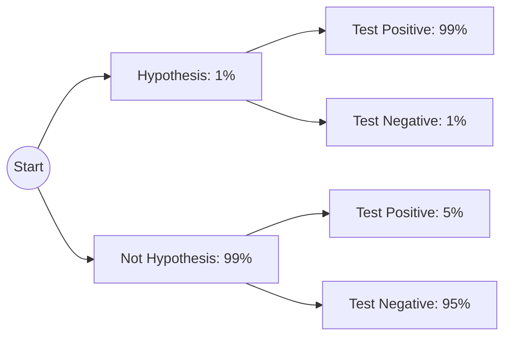

# CH-09 — Bayes Theorem

## 1. Intuition-First Explanation
If Bayesian Thinking (CH-08) is the philosophy, **Bayes Theorem** is the engine.

It is a mathematical formula that allows us to reverse conditional probabilities. It answers the question: "If I know $P(\text{Data} \mid \text{Hypothesis})$, how can I find $P(\text{Hypothesis} \mid \text{Data})$?"

Imagine a smoke detector. 
*   We know $P(\text{Beep} \mid \text{Fire})$—the probability it beeps if there is a fire (very high).
*   We want to know $P(\text{Fire} \mid \text{Beep})$—the probability there is actually a fire if it beeps (often much lower because of burnt toast!).

Bayes Theorem is the bridge between these two.

## 2. Mathematical Derivations
We start with the definition of conditional probability:
1. $P(A \cap B) = P(A \mid B) P(B)$
2. $P(B \cap A) = P(B \mid A) P(A)$

Since $P(A \cap B) = P(B \cap A)$, we can set them equal:
$$P(A \mid B) P(B) = P(B \mid A) P(A)$$

Solving for $P(A \mid B)$, we get **Bayes Theorem**:
$$P(A \mid B) = \frac{P(B \mid A) P(A)}{P(B)}$$

### The Law of Total Probability
To find the denominator $P(B)$, we often need to sum all the ways $B$ can happen:
$$P(B) = P(B \mid A) P(A) + P(B \mid A^c) P(A^c)$$
Substituting this into the main formula gives the "Full" Bayes Theorem.

## 3. Visual Mental Models
The **Probability Tree** is the best way to visualize Bayes Theorem.



To find $P(H \mid Pos)$:
1. Find all paths that lead to "Positive."
2. The answer is the "Hypothesis Positive" path divided by the sum of all "Positive" paths.

## 4. Coding Implementation
Let's build a simple Bayesian Classifier for Sentiment Analysis (Naive Bayes intuition).

```python
def bayes_theorem(p_hyp, p_data_given_hyp, p_data_given_not_hyp):
    # p_hyp: Prior P(H)
    # p_data_given_hyp: Likelihood P(D|H)
    # p_data_given_not_hyp: P(D|~H)
    
    # 1. Calculate Evidence P(D) using Law of Total Probability
    p_not_hyp = 1 - p_hyp
    p_data = (p_data_given_hyp * p_hyp) + (p_data_given_not_hyp * p_not_hyp)
    
    # 2. Calculate Posterior P(H|D)
    p_hyp_given_data = (p_data_given_hyp * p_hyp) / p_data
    return p_hyp_given_data

# Scenario: Spam Detection
# Prior: 20% of emails are spam
# Likelihood: "Free" appears in 80% of spam, but only 10% of ham
result = bayes_theorem(0.2, 0.8, 0.1)
print(f"P(Spam | 'Free'): {result:.2%}")
```

## 5. Solved Examples
**Problem:** A machine produces 1% defective parts. A quality test is 90% accurate (detects 90% of defects) but has a 5% false alarm rate. If a part tests "Defective," what is the probability it actually is?
**Solution:**
1.  $P(D) = 0.01$ (Prior)
2.  $P(T \mid D) = 0.90$ (Likelihood)
3.  $P(T \mid D^c) = 0.05$ (False Positive)
4.  $P(T) = (0.90 \times 0.01) + (0.05 \times 0.99) = 0.009 + 0.0495 = 0.0585$ (Evidence)
5.  $P(D \mid T) = \frac{0.90 \times 0.01}{0.0585} = \frac{0.009}{0.0585} \approx \mathbf{15.38\%}$.
*Note how low this is! Even with a "90% accurate test," the rarity of the defect makes a positive test result only ~15% reliable.*

## 6. Interview Questions
1.  **What is the Law of Total Probability?**
    *   *Answer:* It's a way to find the total probability of an event by summing its conditional probabilities across all mutually exclusive scenarios.
2.  **Why is the denominator in Bayes Theorem called "Evidence"?**
    *   *Answer:* Because it normalizes the result, ensuring the posterior probabilities of all hypotheses sum to 1.

## 7. Practice Questions
1.  A bag has two coins: one fair, one double-headed. You pick one and get Heads. What is the probability you picked the double-headed coin?
2.  If $P(A) = 0.5, P(B \mid A) = 0.8, P(B \mid A^c) = 0.4$, find $P(A \mid B)$.

## 8. Challenge Problems
**The Prosecutor's Fallacy:** In a famous court case, a prosecutor argued that because the chance of a DNA match by luck was 1 in a million, the defendant was 99.9999% likely to be guilty. Use Bayes Theorem to show why this is wrong (Hint: You need the Prior $P(\text{Guilty})$).

## 9. Common Mistakes
*   **Forgetting the Denominator:** Calculating $P(B \mid A) P(A)$ but failing to divide by $P(B)$.
*   **Misidentifying the "Not" Case:** Incorrectly calculating $P(A^c)$ or $P(B \mid A^c)$.

## 10. Revision Notes
*   **Reverse Probability:** $P(A \mid B)$ from $P(B \mid A)$.
*   **Prior** matters immensely.
*   **Total Probability** is used for the bottom of the fraction.

## 11. Analytics Applications
*   **Modern Research — Naive Bayes in NLP:** Despite its name, Naive Bayes is still used in high-performance production systems (like Gmail's spam filter or basic sentiment analysis) because it is incredibly fast and scales linearly with data.
*   **Medical AI:** Diagnostic tools use Bayes Theorem to combine multiple "weak" signals (symptoms, age, genetic markers) into a "strong" posterior for a specific disease.
*   **Autonomous Vehicles:** Sensor fusion (combining Lidar and Camera data) uses a version of Bayes (Kalman Filters) to update the car's belief about its position and the location of obstacles.
