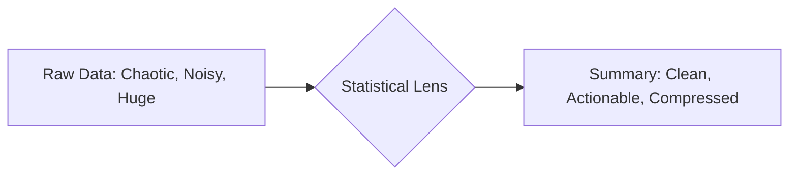

# CH-10 — Introduction to Statistics

## 1. Intuition-First Explanation
If **Probability** is about predicting the future based on a known model (e.g., "I have a fair coin, what will happen?"), then **Statistics** is about looking at the past and trying to figure out what the model is (e.g., "I flipped this coin 100 times and got 70 heads; is it really fair?").

Statistics is the art of **data compression**. We take thousands or millions of raw data points and "compress" them into a few numbers (like the Mean or Variance) that tell a story. Without statistics, we would be drowned in raw logs; with statistics, we have **insights**.

## 2. Mathematical Derivations
Statistics is divided into two primary branches:

### Descriptive Statistics
Summarizing and describing the features of a specific dataset. 
*   **Goal:** To understand "What happened?"
*   **Tools:** Mean, Median, Mode, Standard Deviation, Histograms.

### Inferential Statistics
Using a sample of data to make generalizations about a larger population.
*   **Goal:** To understand "What is likely true for everyone?"
*   **Tools:** Hypothesis testing, P-values, Confidence Intervals, Regression.

**The Fundamental Notation:**
*   $N$: Population size.
*   $n$: Sample size.
*   $\mu$ (mu): Population Mean.
*   $\bar{x}$ (x-bar): Sample Mean.

## 3. Visual Mental Models
Think of Statistics as a **Lens**. 



*   A **Wide Lens** (Descriptive) shows you the whole picture of what you have.
*   A **Telephoto Lens** (Inferential) tries to see beyond your current data into the "population" background.

## 4. Coding Implementation
Let's see how statistics "compresses" a large dataset of website response times.

```python
import numpy as np
import pandas as pd
import matplotlib.pyplot as plt

# Simulating 10,000 server response times (ms)
response_times = np.random.exponential(scale=200, size=10000)

# Descriptive Statistics
mean_rt = np.mean(response_times)
median_rt = np.median(response_times)
std_rt = np.std(response_times)

print(f"Mean Response Time: {mean_rt:.2f}ms")
print(f"Median Response Time: {median_rt:.2f}ms")
print(f"Standard Deviation: {std_rt:.2f}ms")

# Visualizing the distribution
plt.hist(response_times, bins=50, color='skyblue', edgecolor='black')
plt.axvline(mean_rt, color='red', linestyle='dashed', label='Mean')
plt.axvline(median_rt, color='green', linestyle='dashed', label='Median')
plt.title("Distribution of Server Response Times")
plt.legend()
plt.show()
```

## 5. Solved Examples
**Problem:** A company claims their average salary is $100k. You find out that the CEO earns $1M and the 9 employees earn $0. Is the "Average" (Mean) a good statistic here?
**Solution:**
1.  Total Salary = $1M + (9 \times 0) = $1,000,000.
2.  Mean = $1,000,000 / 10 = **$100,000**.
The company is technically correct, but the statistic is misleading because it doesn't represent the "typical" employee. This is why we need to understand *which* statistic to use.

## 6. Interview Questions
1.  **What is the main difference between Descriptive and Inferential statistics?**
    *   *Answer:* Descriptive statistics describe the data you currently have. Inferential statistics use that data to make predictions or conclusions about a larger group (population) that you haven't fully observed.
2.  **Why can't we just look at the raw data instead of using statistics?**
    *   *Answer:* Scale. Humans cannot process millions of rows of data. Statistics provides a simplified mental model that highlights patterns while ignoring irrelevant noise.

## 7. Practice Questions
1.  Identify whether the following is Descriptive or Inferential: "Based on a survey of 100 people, we estimate that 60% of the city supports the new park."
2.  Give an example of a "Population" and a "Sample" in the context of a mobile app.

## 8. Challenge Problems
**The Map-Reduce Philosophy:** How does the "Statistical Lens" concept relate to modern Big Data frameworks like Spark or Hadoop? (Hint: Think about how you aggregate data across multiple servers).

## 9. Common Mistakes
*   **Confusing Sample with Population:** Applying sample formulas to a whole population (or vice versa).
*   **Ignoring the Context:** Using a mean for skewed data where the median would be more appropriate.

## 10. Revision Notes
*   **Probability:** Model $\to$ Data.
*   **Statistics:** Data $\to$ Model.
*   **Descriptive:** Summarize current data.
*   **Inferential:** Predict population from sample.

## 11. Analytics Applications
*   **Observability (SRE/DevOps):** Modern tools like **Prometheus** and **Grafana** rely entirely on descriptive statistics (percentiles, averages, rates) to monitor the health of global cloud systems.
*   **Data Compression:** In high-speed data streaming (like **Apache Kafka**), we often calculate "sketches" or "approximate statistics" because keeping every single data point would be too expensive in terms of storage and compute.
*   **Modern Research — Robust Statistics:** With the rise of "dirty" web-scale data, there is a massive focus on statistics that aren't easily broken by outliers or bot traffic.
