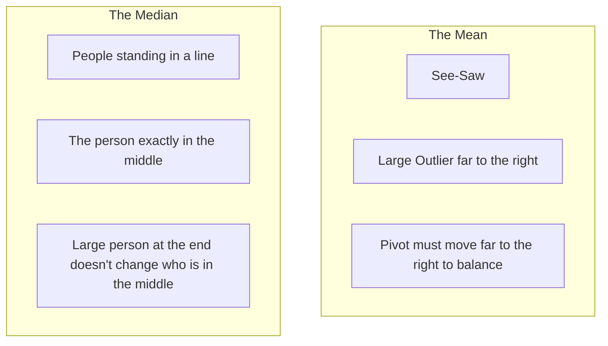

# CH-11 — Measures of Central Tendency

## 1. Intuition-First Explanation
If you had to pick just **one number** to represent an entire dataset, which one would it be? This is the goal of "Central Tendency"—finding the "center" or "typical" value of your data.

However, the "center" can be defined in different ways:
*   **Mean:** The "Balance Point."
*   **Median:** The "Middle Person."
*   **Mode:** The "Most Popular."

Choosing the wrong measure of center is the most common way to "lie with statistics."

## 2. Mathematical Derivations
### The Mean ($\mu$ or $\bar{x}$)
The arithmetic average. It is highly sensitive to every single data point, making it vulnerable to **outliers**.
$$\mu = \frac{\sum_{i=1}^{N} x_i}{N}$$

### The Median
The value that splits the data into two equal halves. To find it, you must **sort** the data first. It is **Robust**—outliers do not affect it.
*   If $N$ is odd: Median is the value at position $(N+1)/2$.
*   If $N$ is even: Median is the average of the two middle values.

### The Mode
The value that appears most frequently. It is the only measure of central tendency that works for **categorical data** (e.g., "Which city has the most users?").

### Weighted Average
When some data points are more important than others.
$$\bar{x}_w = \frac{\sum w_i x_i}{\sum w_i}$$

## 3. Visual Mental Models
Imagine a **See-Saw**.



*   **Symmetric Data:** Mean $\approx$ Median $\approx$ Mode.
*   **Right Skewed:** Mode < Median < Mean.
*   **Left Skewed:** Mean < Median < Mode.

## 4. Coding Implementation
Let's analyze "User Session Durations" which are typically skewed.

```python
import numpy as np
from scipy import stats

# Dataset with a few huge outliers (e.g., bot sessions)
sessions = [10, 15, 12, 14, 18, 11, 10, 10, 500, 600]

mean_val = np.mean(sessions)
median_val = np.median(sessions)
mode_val = stats.mode(sessions, keepdims=True).mode[0]

print(f"Mean: {mean_val} (Heavily influenced by 500, 600)")
print(f"Median: {median_val} (Better representation of a 'normal' user)")
print(f"Mode: {mode_val} (The most common session length)")

# Handling Skewness in Analytics
log_sessions = np.log(sessions)
print(f"Geometric Mean (via Log): {np.exp(np.mean(log_sessions)):.2f}")
```

## 5. Solved Examples
**Problem:** In a week, you have daily active users (DAU) of: 100, 110, 105, 100, 120, 1000, 115. Calculate Mean and Median.
**Solution:**
1.  **Mean:** $(100+110+105+100+120+1000+115) / 7 = 1650 / 7 \approx \mathbf{235.7}$.
2.  **Median:** Sorted data: 100, 100, 105, **110**, 115, 120, 1000. Median = **110**.
*Conclusion:* The mean (235) is misleading because of the spike (1000). The median (110) is a better "typical" day.

## 6. Interview Questions
1.  **When should you use the Median instead of the Mean?**
    *   *Answer:* When the data is skewed or contains outliers (like income, house prices, or web latency).
2.  **What is a "Bimodal" distribution?**
    *   *Answer:* A distribution with two modes (two peaks). This often suggests that your dataset is actually a mixture of two different groups (e.g., "Mobile users" vs "Desktop users").

## 7. Practice Questions
1.  Find the mean, median, and mode of: 5, 8, 12, 5, 10.
2.  If every value in a dataset is increased by 10, what happens to the mean?

## 8. Challenge Problems
**The Harmonic Mean:** When calculating average speed or average price-to-earnings (P/E) ratios, the arithmetic mean fails. Why? (Research the Harmonic Mean and its application in finance).

## 9. Common Mistakes
*   **Mean on Categorical Data:** Trying to calculate the "average" of user IDs or zip codes.
*   **Assuming Mean = Typical:** Forgetting that in skewed data, the mean might be a value that *no one* actually has.

## 10. Revision Notes
*   **Mean:** Sensitive, Balance Point.
*   **Median:** Robust, Middle Value.
*   **Mode:** Frequency, Categorical.
*   **Skewness:** Pulls the Mean toward the tail.

## 11. Analytics Applications
*   **SLA Reporting:** When reporting server performance, using the "Average Latency" (Mean) is dangerous because it hides the few users experiencing terrible lag. Engineers prefer the **Median** (p50) or **Percentiles**.
*   **E-commerce:** "Most frequently bought together" is an application of the **Mode**.
*   **Financial Analytics:** Calculating the "Average Return" on an investment over time requires the **Geometric Mean**, as returns are multiplicative, not additive.
