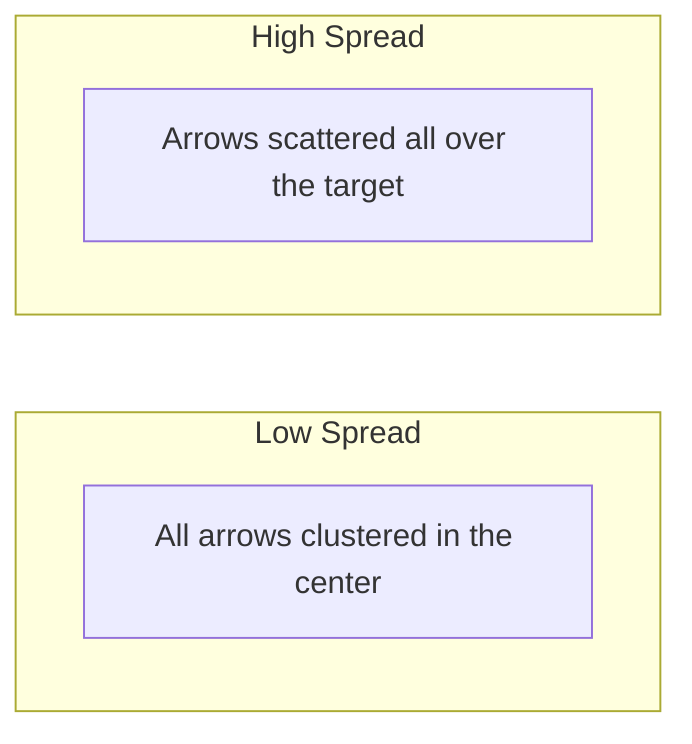

# CH-12 — Measures of Spread

## 1. Intuition-First Explanation
Two datasets can have the exact same "Mean" but look completely different.

*   **Dataset A:** 50, 50, 50 (Mean = 50)
*   **Dataset B:** 0, 50, 100 (Mean = 50)

Dataset A is **stable** and **predictable**. Dataset B is **volatile** and **risky**. Central tendency only tells half the story; **Spread** (or Dispersion) tells you how much you can "trust" that center. If the spread is huge, the mean might be useless.

## 2. Mathematical Derivations
### Range
The simplest measure. The difference between the max and min.
$$\text{Range} = \text{Max} - \text{Min}$$

### Variance ($\sigma^2$ or $s^2$)
The average of the **squared** distances from the mean.
$$\sigma^2 = \frac{\sum (x_i - \mu)^2}{N}$$
*Why square?* To prevent positive and negative distances from canceling each other out, and to penalize large deviations more heavily.

### Standard Deviation ($\sigma$ or $s$)
The square root of the variance. It brings the unit of measurement back to the original scale (e.g., if data is in "meters," variance is in "meters squared," but standard deviation is back in "meters").
$$\sigma = \sqrt{\sigma^2}$$

### Interquartile Range (IQR)
The range of the middle 50% of the data. Like the median, it is **robust** to outliers.
$$\text{IQR} = Q_3 - Q_1$$

## 3. Visual Mental Models
Think of a **Target**.



*   **Standard Deviation:** The "average" distance of an arrow from the bullseye.
*   **Variance:** The "area" of the scatter.

## 4. Coding Implementation
Analyzing the stability of "Daily Revenue."

```python
import numpy as np
import pandas as pd

# Revenue for two different products over 10 days
product_a = [100, 102, 98, 101, 99, 100, 101, 99, 100, 101]
product_b = [10, 200, 5, 150, 20, 300, 0, 50, 25, 240]

print(f"Product A Mean: {np.mean(product_a)}, Std: {np.std(product_a):.2f}")
print(f"Product B Mean: {np.mean(product_b)}, Std: {np.std(product_b):.2f}")

# IQR for Product B (Handling the high volatility)
q1, q3 = np.percentile(product_b, [25, 75])
iqr = q3 - q1
print(f"Product B IQR: {iqr}")
```

## 5. Solved Examples
**Problem:** A dataset is {2, 4, 6}. Find the Variance and Standard Deviation.
**Solution:**
1.  **Mean ($\mu$):** $(2+4+6)/3 = \mathbf{4}$.
2.  **Deviations:** $(2-4)=-2, (4-4)=0, (6-4)=2$.
3.  **Squared Deviations:** $(-2)^2=4, 0^2=0, 2^2=4$.
4.  **Variance ($\sigma^2$):** $(4+0+4)/3 = 8/3 \approx \mathbf{2.67}$.
5.  **Std Dev ($\sigma$):** $\sqrt{2.67} \approx \mathbf{1.63}$.

## 6. Interview Questions
1.  **Why do we use Standard Deviation instead of Variance in reports?**
    *   *Answer:* Units. Variance is in squared units, which are hard to interpret. Standard deviation is in the same units as the data, making it intuitive.
2.  **What does a Standard Deviation of 0 mean?**
    *   *Answer:* It means every single data point is identical to the mean. There is no variation at all.

## 7. Practice Questions
1.  If you multiply every value in a dataset by 2, what happens to the Standard Deviation?
2.  Calculate the IQR for: 1, 2, 5, 6, 7, 9, 12, 15, 18, 20, 25.

## 8. Challenge Problems
**Bessel's Correction:** When calculating the variance of a **Sample** (not the population), we divide by $n-1$ instead of $n$. Why? (Look up "Unbiased Estimator").

## 9. Common Mistakes
*   **Negative Variance:** Variance can never be negative because it's a sum of squares.
*   **Comparing Std Dev of Different Scales:** You can't directly compare the "spread" of weights in grams vs weights in tons without normalizing them (e.g., using the **Coefficient of Variation**).

## 10. Revision Notes
*   **Range:** Max - Min.
*   **Variance:** Squared dispersion.
*   **Std Dev:** Interpretability, $\sqrt{Var}$.
*   **IQR:** Middle 50%, Outlier resistant.

## 11. Analytics Applications
*   **Risk Analysis:** In finance, "Volatility" is literally just the **Standard Deviation** of returns. High spread = High risk.
*   **Quality Control (Six Sigma):** Manufacturing processes aim to minimize spread. "Six Sigma" means the distance from the mean to the nearest "defect" boundary is at least 6 standard deviations.
*   **Anomaly Detection:** A common rule is to flag any data point more than 3 Standard Deviations from the mean as a potential outlier or fraud.
