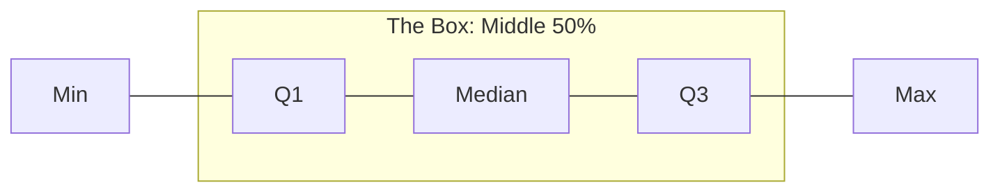

# CH-13 — Percentiles & Quantiles

## 1. Intuition-First Explanation
Knowing your exact score on a test (e.g., 85%) doesn't tell you much. Knowing that you are in the **99th Percentile** tells you everything: you did better than 99% of people.

**Percentiles** and **Quantiles** are about **Ranking**. They tell you the relative position of a value within a distribution. They answer the question: "At what point does $X\%$ of the data fall below this value?"

In Analytics, we use these to set thresholds, define SLAs, and segment users into groups like "Power Users" (top 5%) vs "Casual Users."

## 2. Mathematical Derivations
### Quantiles
A quantile splits the data into equal-sized adjacent subgroups.
*   **Percentiles:** Split data into 100 groups (1% each).
*   **Quartiles:** Split data into 4 groups (25% each).
*   **Deciles:** Split data into 10 groups (10% each).

### Finding the $k$-th Percentile ($P_k$)
1.  **Sort** the data from smallest to largest.
2.  Calculate the rank (index) $L$:
    $$L = \frac{k}{100} \times (N+1)$$
3.  If $L$ is an integer, the percentile is the value at that position. If not, interpolate between the two nearest values.

### The Five-Number Summary
A powerful way to describe any distribution using just five values:
1.  **Minimum**
2.  **$Q_1$ (25th Percentile)**
3.  **Median ($Q_2$ / 50th Percentile)**
4.  **$Q_3$ (75th Percentile)**
5.  **Maximum**

## 3. Visual Mental Models
The **Box Plot** (Whisker Plot) is the visual representation of the Five-Number Summary.



*   **Box:** Represents the IQR ($Q_3 - Q_1$).
*   **Whiskers:** Extend to the min/max (or $1.5 \times \text{IQR}$ to show outliers).
*   **Line in Box:** The Median.

## 4. Coding Implementation
Let's find the "Power Users" in a synthetic app dataset.

```python
import numpy as np
import pandas as pd

# Simulating 1000 users with different 'action_counts'
action_counts = np.random.negative_binomial(n=1, p=0.05, size=1000)

# Calculating Percentiles
p50 = np.percentile(action_counts, 50) # Median
p90 = np.percentile(action_counts, 90)
p99 = np.percentile(action_counts, 99)

print(f"Typical user (p50): {p50} actions")
print(f"Top 10% threshold (p90): {p90} actions")
print(f"Power User threshold (p99): {p99} actions")

# Descriptive summary
print("\nFive Number Summary:")
print(pd.Series(action_counts).describe()[['min', '25%', '50%', '75%', 'max']])
```

## 5. Solved Examples
**Problem:** A dataset is {10, 20, 30, 40, 50}. What is the 80th percentile?
**Solution:**
1.  Data is sorted. $N = 5$.
2.  Index $L = (80/100) \times (5+1) = 0.8 \times 6 = \mathbf{4.8}$.
3.  The 4th value is 40, the 5th is 50.
4.  Interpolate: $40 + 0.8 \times (50-40) = 40 + 8 = \mathbf{48}$.

## 6. Interview Questions
1.  **What is the difference between a Percentile and a Percentage?**
    *   *Answer:* A percentage is a raw score (e.g., 80/100). A percentile is a rank (e.g., you did better than 80% of others).
2.  **Why do SREs care about p99 latency more than the average?**
    *   *Answer:* Because the "average" latency can look fine even if 1% of your users are experiencing total system failure. p99 captures the worst-case scenario that is still a "real" user experience.

## 7. Practice Questions
1.  Given the five-number summary [10, 20, 25, 40, 100], what is the IQR?
2.  If your height is at the 50th percentile, what does that mean?

## 8. Challenge Problems
**Streaming Quantiles:** If you have 1 Billion data points flowing through a pipe every second, you cannot sort them to find the median. How do algorithms like **T-Digest** or **HdrHistogram** approximate percentiles in real-time?

## 9. Common Mistakes
*   **Percentile of 100:** There is technically no "100th percentile" because you can't do better than yourself. Most software approximates this as the "Max."
*   **Small Samples:** Calculating the "99th percentile" on a dataset of only 10 people.

## 10. Revision Notes
*   **Ranking** is the goal.
*   **Q1, Q2, Q3:** 25, 50, 75.
*   **Box Plot:** Visualizes ranking and spread together.

## 11. Analytics Applications
*   **Performance Monitoring:** High-scale systems (like **Amazon** or **Cloudflare**) monitor **p99.9** and **p99.99** latencies to ensure that even their most "unlucky" users have a fast experience.
*   **Growth Marketing:** Identifying "Whales" or "Power Users" by looking at the top 1% of revenue or engagement.
*   **A/B Testing:** Sometimes a feature doesn't change the *average* user behavior, but it significantly improves the experience for the *top 10%* of users. Percentiles help uncover these hidden wins.
