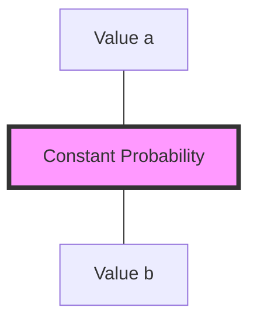

# CH-15 — Uniform Distribution

## 1. Intuition-First Explanation
The **Uniform Distribution** is the "Fairness" distribution. It represents a state of **maximum uncertainty** within a given range.

If a random variable follows a uniform distribution, every single value in its range has the exact same probability of occurring. There are no peaks, no valleys, and no favorites.

In computer science, this is the "default" state of a random number generator (`random.random()`). It's the starting point for simulations and the baseline we use when we have "no idea" what the distribution should be (Principle of Indifference).

## 2. Mathematical Derivations
### Discrete Uniform
If $X$ can take $n$ values $\{x_1, x_2, \dots, x_n\}$:
$$P(X = x_i) = \frac{1}{n}$$
*   **Mean:** $\frac{n+1}{2}$ (for range 1 to $n$).
*   **Variance:** $\frac{n^2-1}{12}$.

### Continuous Uniform
If $X$ can take any value between $a$ and $b$ ($X \sim U(a, b)$):
The Probability Density Function (PDF) is:
$$f(x) = \begin{cases} \frac{1}{b-a} & \text{for } a \leq x \leq b \\ 0 & \text{otherwise} \end{cases}$$
*   **Mean ($E[X]$):** $\frac{a+b}{2}$ (The exact midpoint).
*   **Variance ($Var(X)$):** $\frac{(b-a)^2}{12}$.

## 3. Visual Mental Models
The Uniform distribution looks like a **Rectangle**.



The area of this rectangle must be 1. Therefore, if the range $(b-a)$ is wide, the height (probability) must be low. If the range is narrow, the height must be high.

## 4. Coding Implementation
Generating and testing a Uniform distribution.

```python
import numpy as np
import matplotlib.pyplot as plt

# Generating 100,000 random numbers between 0 and 10
data = np.random.uniform(0, 10, 100000)

plt.hist(data, bins=50, density=True, color='lightgreen', edgecolor='black')
plt.axhline(y=1/10, color='r', linestyle='--', label='Theoretical PDF (1/10)')
plt.title("The Rectangular Shape of a Uniform Distribution")
plt.xlabel("Value")
plt.ylabel("Density")
plt.legend()
plt.show()

# Verifying Mean and Variance
print(f"Empirical Mean: {np.mean(data):.4f} (Theoretical: 5.0)")
print(f"Empirical Var: {np.var(data):.4f} (Theoretical: 8.33)")
```

## 5. Solved Examples
**Problem:** A bus arrives every 15 minutes. You arrive at the bus stop at a random time. What is the probability you wait more than 10 minutes?
**Solution:**
1.  Range: $a=0, b=15$. Range width = 15.
2.  Distribution: $f(x) = 1/15$.
3.  We want $P(X > 10)$.
4.  This is the area from 10 to 15: $(15-10) \times (1/15) = 5/15 = \mathbf{1/3} \approx 33.3\%$.

## 6. Interview Questions
1.  **What is the PDF of a continuous uniform distribution between 0 and 1?**
    *   *Answer:* $f(x) = 1$.
2.  **Why is the variance formula divided by 12?**
    *   *Answer:* This comes from the calculus derivation $\int_{a}^{b} (x - \frac{a+b}{2})^2 \frac{1}{b-a} dx$. The result of this integral is $\frac{(b-a)^2}{12}$.

## 7. Practice Questions
1.  A random number is chosen between 20 and 50. What is the probability it is less than 35?
2.  What is the mean of a discrete uniform distribution for a 6-sided die?

## 8. Challenge Problems
**Probability Integral Transform:** If $U \sim U(0,1)$, how can you use $U$ to generate a random variable from *any* other distribution? (Hint: Think about the Inverse CDF).

## 9. Common Mistakes
*   **Discrete vs Continuous:** Using $1/n$ for continuous ranges or $1/(b-a)$ for discrete sets.
*   **Height $> 1$:** Forgetting that in a continuous distribution, the PDF value can be greater than 1 if the range $(b-a)$ is less than 1.

## 10. Revision Notes
*   **Shape:** Rectangle.
*   **Midpoint:** Mean.
*   **Uncertainty:** Maximum (for a fixed range).
*   **PDF:** $1 / \text{Width}$.

## 11. Analytics Applications
*   **Load Balancing:** In a round-robin or random load balancer, we aim for a **Uniform** distribution of requests across servers to prevent any one server from being overloaded.
*   **A/B Testing Assignment:** We use uniform random numbers to decide whether a user falls into the "Control" or "Variant" group to ensure there is no bias.
*   **Cryptography:** Modern encryption keys must be generated from a "Cryptographically Secure" Uniform distribution. If certain keys are more likely than others, the encryption can be cracked.
