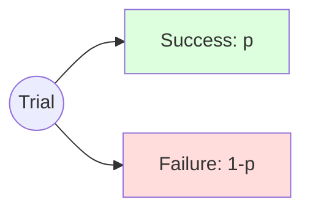

# CH-16 — Bernoulli Trials

## 1. Intuition-First Explanation
Most decisions in engineering and life are binary: Yes/No, Success/Failure, Click/Ignore, Dead/Alive.

A **Bernoulli Trial** is a single experiment with exactly two possible outcomes. We call one outcome "Success" (1) and the other "Failure" (0). 

It is the "Atom" of probability. Almost all complex discrete distributions (Binomial, Geometric, Negative Binomial) are just multiple Bernoulli trials stacked together in different ways. If you understand the Bernoulli trial, you understand the building blocks of counting.

## 2. Mathematical Derivations
A random variable $X$ follows a Bernoulli distribution ($X \sim \text{Bernoulli}(p)$) if:
*   $P(X=1) = p$ (Probability of success)
*   $P(X=0) = 1-p = q$ (Probability of failure)

### The PDF (Probability Mass Function)
A clever way to write this as a single formula:
$$P(X=x) = p^x (1-p)^{1-x} \text{ for } x \in \{0, 1\}$$

### Statistics
*   **Mean ($E[X]$):** $1(p) + 0(1-p) = \mathbf{p}$
*   **Variance ($Var(X)$):** $E[X^2] - (E[X])^2 = (1^2 p + 0^2 q) - p^2 = p - p^2 = \mathbf{p(1-p)}$

## 3. Visual Mental Models
Think of a **Weighted Coin**.



*   If $p=0.5$, the "weight" is balanced.
*   If $p=0.9$, the success outcome is "heavy" and failure is "light."
*   **Variance Insight:** Variance is highest when $p=0.5$ (maximum uncertainty). Variance is 0 if $p=0$ or $p=1$ (perfect certainty).

## 4. Coding Implementation
Simulating Bernoulli trials for a 2% conversion rate.

```python
import numpy as np

# A single trial
p = 0.02
trial = np.random.choice([0, 1], p=[1-p, p])
print(f"Single Trial Outcome: {trial}")

# Running 1000 trials
trials = np.random.binomial(n=1, p=p, size=1000)
empirical_p = np.mean(trials)

print(f"Successes: {np.sum(trials)}")
print(f"Empirical P(Success): {empirical_p:.4f} (Theoretical: {p})")
```

## 5. Solved Examples
**Problem:** A machine has a 5% chance of failing in a day. What is the variance of this failure rate?
**Solution:**
1.  $p = 0.05$ (Success/Fail in this case is 'Failure').
2.  $Var(X) = p(1-p) = 0.05 \times 0.95 = \mathbf{0.0475}$.

## 6. Interview Questions
1.  **What is a Bernoulli Trial?**
    *   *Answer:* An experiment with exactly two outcomes (Success/Failure) where the probability of success is $p$ and stays constant.
2.  **At what value of $p$ is the variance of a Bernoulli trial maximized?**
    *   *Answer:* At $p=0.5$. Intuitively, this is when the outcome is most unpredictable.

## 7. Practice Questions
1.  If $p=0.8$, what is $P(X=0)$?
2.  Calculate the standard deviation of a Bernoulli trial with $p=0.64$.

## 8. Challenge Problems
**The Indicator Variable:** In a group of $N$ people, let $X_i$ be 1 if person $i$ likes coffee and 0 otherwise. If everyone has a 70% chance of liking coffee, what is the expected total number of people who like coffee? (Hint: Use Linearity of Expectation).

## 9. Common Mistakes
*   **Mislabeling Success:** Thinking "Success" always means something "good." In medical stats, "Success" might be "The patient has the virus."
*   **Confusing with Binomial:** A Bernoulli trial is **one** flip. A Binomial distribution is **$n$** flips.

## 10. Revision Notes
*   **Outcomes:** 0 or 1.
*   **Mean:** $p$.
*   **Var:** $p(1-p)$.
*   **Max Uncertainty:** $p=0.5$.

## 11. Analytics Applications
*   **Click-Through Rate (CTR):** Each time a user sees an ad, it's a Bernoulli trial (Click vs No-Click).
*   **Churn Modeling:** At any given time, a user is either "Churned" or "Active."
*   **Reliability Engineering:** Each component in a system can be modeled as a Bernoulli trial (Working vs Failed).
*   **Machine Learning (Logistic Regression):** The output of a Logistic Regression model is the estimated $p$ for a Bernoulli trial.
