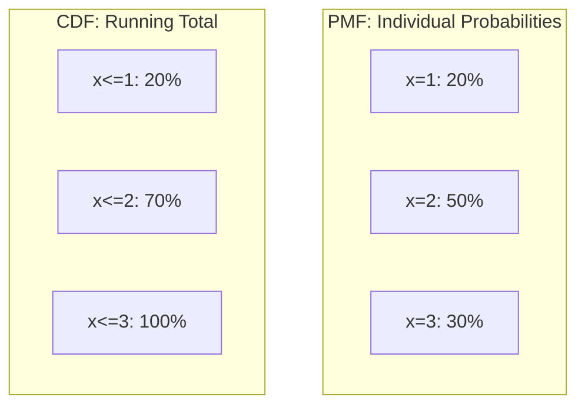

# CH-17 — PMF & CDF

## 1. Intuition-First Explanation
To work with distributions mathematically, we need two "Views":
1.  **The Snapshot (PMF):** "What is the probability of exactly this value?"
2.  **The Story So Far (CDF):** "What is the probability of this value OR anything smaller?"

If you are looking at a histogram of heights:
*   The **PMF** (Probability Mass Function) tells you how tall one specific bar is.
*   The **CDF** (Cumulative Distribution Function) tells you the total area of all bars to the left of a certain point.

In analytics, we use the PMF to find likely outcomes and the CDF to find percentiles and risk thresholds.

## 2. Mathematical Derivations
### Probability Mass Function (PMF) - Discrete
For a discrete random variable $X$:
$$f(x) = P(X = x)$$
*   **Rule:** $\sum f(x_i) = 1$.

### Probability Density Function (PDF) - Continuous
For continuous variables, $P(X=x)$ is technically 0. We use **Density** instead:
$$f(x) = \frac{d}{dx} F(x)$$
*   **Rule:** $\int_{-\infty}^{\infty} f(x) dx = 1$.

### Cumulative Distribution Function (CDF)
Works for both discrete and continuous:
$$F(x) = P(X \leq x)$$
*   **Discrete:** $F(x) = \sum_{t \leq x} P(X = t)$
*   **Continuous:** $F(x) = \int_{-\infty}^{x} f(t) dt$

**Properties of CDF:**
1.  Always non-decreasing (you can't "lose" accumulated probability).
2.  Starts at 0 ($F(-\infty) = 0$).
3.  Ends at 1 ($F(\infty) = 1$).

## 3. Visual Mental Models


*   **PMF Plot:** A series of isolated spikes or bars.
*   **CDF Plot:** A "Staircase" (for discrete) or a smooth "S-curve" (for continuous).

## 4. Coding Implementation
Visualizing the relationship between PMF and CDF for a Dice Roll.

```python
import numpy as np
import matplotlib.pyplot as plt

x = np.array([1, 2, 3, 4, 5, 6])
pmf = np.full(6, 1/6)
cdf = np.cumsum(pmf)

fig, (ax1, ax2) = plt.subplots(1, 2, figsize=(12, 4))

# PMF
ax1.stem(x, pmf, basefmt=" ")
ax1.set_title("PMF: P(X = x)")
ax1.set_ylim(0, 1)

# CDF
ax2.step(x, cdf, where='post')
ax2.set_title("CDF: P(X <= x)")
ax2.set_ylim(0, 1.1)

plt.show()
```

## 5. Solved Examples
**Problem:** A variable $X$ has PMF: $P(0)=0.2, P(1)=0.5, P(2)=0.3$.
1. Find $F(1)$.
2. Find $P(X > 0)$.
**Solution:**
1. $F(1) = P(X \leq 1) = P(0) + P(1) = 0.2 + 0.5 = \mathbf{0.7}$.
2. $P(X > 0) = 1 - P(X \leq 0) = 1 - F(0) = 1 - 0.2 = \mathbf{0.8}$.

## 6. Interview Questions
1.  **Why is $P(X=x) = 0$ for a continuous distribution?**
    *   *Answer:* Because there are infinitely many values. The probability of picking *exactly* 1.765432... is infinitely small. We only calculate probability for **intervals** using the area under the PDF.
2.  **How do you find the Median using the CDF?**
    *   *Answer:* The median is the value $x$ where $F(x) = 0.5$.

## 7. Practice Questions
1.  If $F(x)$ is the CDF, what is $P(a < X \leq b)$ in terms of $F$?
2.  Draw the CDF of a fair coin flip (Heads=1, Tails=0).

## 8. Challenge Problems
**The Inverse CDF (PPF):** If the CDF ($F$) takes a value and gives a probability, what does the Inverse CDF ($F^{-1}$) do? How is this used in computer simulations to generate "random" data?

## 9. Common Mistakes
*   **Non-Decreasing:** Thinking a CDF can go down. It only goes up or stays flat.
*   **PDF Value vs Probability:** Thinking the y-axis of a PDF is a probability. It is a **density**; it can be $> 1$. Only the **area** is a probability.

## 10. Revision Notes
*   **PMF:** $P(X=x)$.
*   **CDF:** $P(X \leq x)$.
*   **Complement Rule:** $P(X > x) = 1 - F(x)$.
*   **Interval Rule:** $P(a < X \leq b) = F(b) - F(a)$.

## 11. Analytics Applications
*   **Thresholding:** "Alert if the response time is in the 99th percentile." This uses the Inverse CDF.
*   **Risk Analysis (Value at Risk):** Banks use the CDF of their portfolio returns to calculate the maximum amount they could lose with 95% confidence.
*   **User Survival (Retention):** The probability that a user stays *at least* $T$ days is $1 - F(T)$, where $F$ is the CDF of the churn distribution.
