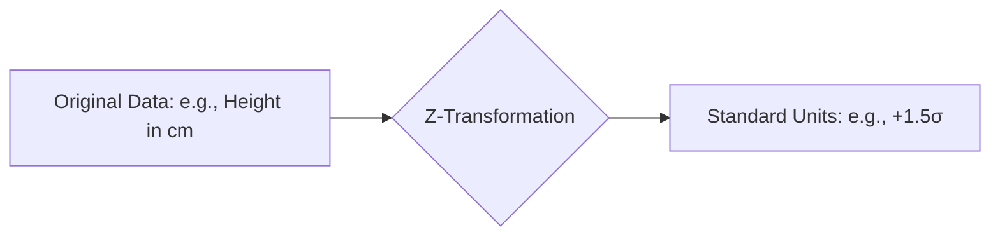

# CH-19 — The Normal Distribution

## 1. Intuition-First Explanation
Because there are an infinite number of possible Bell Curves (different means, different widths), we need a way to compare them. How do you compare a "tall" person in Japan to a "tall" person in the Netherlands? You don't look at their absolute height; you look at how many **Standard Deviations** they are from their local average.

This leads to the **Standard Normal Distribution** ($Z$)—the universal "reference" curve with a mean of 0 and a standard deviation of 1. By converting any Normal distribution into this standard form, we can use a single set of tools (like Z-tables) to solve any problem.

## 2. Mathematical Derivations
### The Z-Score (Standardization)
The Z-score is the number of standard deviations a value ($x$) is from the mean ($\mu$).
$$Z = \frac{x - \mu}{\sigma}$$

*   **Positive Z:** Above the mean.
*   **Negative Z:** Below the mean.
*   **$Z=0$:** Exactly at the mean.

### Standard Normal PDF
When we set $\mu=0$ and $\sigma=1$ in the general formula, we get the simplified PDF for $Z$:
$$\phi(z) = \frac{1}{\sqrt{2\pi}} e^{-\frac{1}{2}z^2}$$

### Linearity
If $X \sim N(\mu, \sigma^2)$, then any linear transformation $Y = aX + b$ is also normal:
$$Y \sim N(a\mu + b, a^2\sigma^2)$$

## 3. Visual Mental Models
The Z-score is a **Ruler**.



Standardization "squashes" and "shifts" any mountain until it perfectly aligns with the standard mountain. This allows for an **Apples-to-Apples Comparison**.

## 4. Coding Implementation
Standardizing data using `scipy.stats` and `scikit-learn`.

```python
import numpy as np
from scipy import stats
from sklearn.preprocessing import StandardScaler

# Raw Data: Test scores for two different classes
class_a = np.array([85, 90, 78, 92, 88])
class_b = np.array([60, 65, 55, 70, 62])

# Manual Standardization for Class A
z_scores_a = (class_a - np.mean(class_a)) / np.std(class_a)
print(f"Class A Z-scores: {z_scores_a}")

# Using Sklearn (Common in ML pipelines)
scaler = StandardScaler()
z_scores_b = scaler.fit_transform(class_b.reshape(-1, 1)).flatten()
print(f"Class B Z-scores: {z_scores_b}")

# P-value from Z-score
# Probability of getting a score higher than 92 in Class A
z_target = (92 - np.mean(class_a)) / np.std(class_a)
p_higher = 1 - stats.norm.cdf(z_target)
print(f"P(X > 92) in Class A: {p_higher:.4f}")
```

## 5. Solved Examples
**Problem:** The average height of adult males in a city is 175cm with a standard deviation of 10cm. What is the Z-score for a man who is 190cm tall?
**Solution:**
$$Z = \frac{190 - 175}{10} = \frac{15}{10} = \mathbf{1.5}$$
This man is 1.5 standard deviations above the average.

## 6. Interview Questions
1.  **What does a Z-score of -2 mean?**
    *   *Answer:* It means the data point is exactly 2 standard deviations below the mean.
2.  **Why do we standardize features in Machine Learning?**
    *   *Answer:* Many algorithms (like SVM, K-Means, or Gradient Descent) are sensitive to the scale of the data. If one feature is in "millions" and another is in "decimals," the model will wrongly prioritize the larger numbers. Standardization puts all features on the same "ruler."

## 7. Practice Questions
1.  If $X \sim N(100, 25)$, what is the Z-score for $x=110$?
2.  If a Z-score is 0, what is the corresponding percentile?

## 8. Challenge Problems
**Mixture Models:** What happens if your data comes from TWO Normal distributions mixed together (e.g., heights of both men and women combined)? Is the resulting distribution still Normal? (Look up "Gaussian Mixture Models").

## 9. Common Mistakes
*   **Using Variance instead of Std Dev:** Dividing by $\sigma^2$ instead of $\sigma$ in the Z-score formula.
*   **Interpreting Z as Probability:** A Z-score is a distance, not a probability. You must pass it through a CDF to get a probability.

## 10. Revision Notes
*   **Standardization:** $Z = (x - \mu) / \sigma$.
*   **Standard Normal ($Z$):** $\mu=0, \sigma=1$.
*   **Relative Position:** Z-scores tell you how extreme a value is relative to its group.

## 11. Analytics Applications
*   **Anomaly Detection in Finance:** High-frequency trading systems look for price movements with a $Z > 3$ (3 standard deviations). Such movements are statistically "impossible" under normal conditions and may trigger a trade.
*   **A/B Testing Power Analysis:** We use Z-scores to determine how large a sample we need to detect a "true" lift in conversion rate versus just seeing random noise.
*   **Recommendation Ranking:** Some systems rank products not by their raw average rating, but by a "Lower Confidence Bound" which uses Z-scores to penalize products with very few reviews (high uncertainty).
