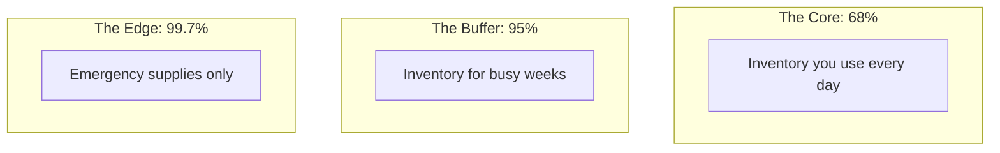

# CH-20 — 68-95-99.7 Rule

## 1. Intuition-First Explanation
How likely is an event in a Normal distribution? Instead of doing complex calculus every time, we use a simple rule of thumb: the **Empirical Rule**.

In any Normal distribution:
*   **68%** of the data falls within **1** standard deviation ($\pm 1\sigma$).
*   **95%** of the data falls within **2** standard deviations ($\pm 2\sigma$).
*   **99.7%** of the data falls within **3** standard deviations ($\pm 3\sigma$).

If you see something that is more than 3 standard deviations away, it's a "3-Sigma" event—extremely rare. If it's more than 6, it's a "6-Sigma" event—practically impossible (unless the system has changed).

## 2. Mathematical Derivations
These percentages come from the integral of the Normal PDF over specific intervals.

$$P(\mu - k\sigma \leq X \leq \mu + k\sigma) = \int_{\mu-k\sigma}^{\mu+k\sigma} \frac{1}{\sigma\sqrt{2\pi}} e^{-\frac{1}{2}\left(\frac{t-\mu}{\sigma}\right)^2} dt$$

For $k=1, 2, 3$:
*   $k=1: \approx 0.6827$
*   $k=2: \approx 0.9545$
*   $k=3: \approx 0.9973$

**The "Tail" Probabilities:**
Since the curve is symmetric, we can also estimate the "one-sided" tails:
*   Outside $\pm 2\sigma$ is 5%. Therefore, the probability of being *above* $+2\sigma$ is **2.5%**.
*   Outside $\pm 3\sigma$ is 0.3%. The probability of being *above* $+3\sigma$ is **0.15%**.

## 3. Visual Mental Models
Think of a **Warehouse**.



The area outside $3\sigma$ is the "Extreme Edge." If a data point lands here, it's a signal that either you've found something amazing or your system is broken.

## 4. Coding Implementation
Let's verify the rule by simulating 1 Million data points.

```python
import numpy as np

# Simulating 1 million points from N(0, 1)
data = np.random.normal(0, 1, 1000000)

# Counting points within 1, 2, and 3 standard deviations
within_1std = np.mean(np.abs(data) <= 1)
within_2std = np.mean(np.abs(data) <= 2)
within_3std = np.mean(np.abs(data) <= 3)

print(f"Percentage within 1 Std Dev: {within_1std:.2%}")
print(f"Percentage within 2 Std Dev: {within_2std:.2%}")
print(f"Percentage within 3 Std Dev: {within_3std:.2%}")

# Identifying 'Rare' events
rare_events = np.sum(np.abs(data) > 3)
print(f"Number of '3-Sigma' events out of 1M: {rare_events}")
```

## 5. Solved Examples
**Problem:** A machine packs sugar into 1kg bags. The weight follows $N(1000g, 10g)$. What percentage of bags weigh between 980g and 1020g?
**Solution:**
1.  Target range: $1000 \pm 20g$.
2.  Standard Deviation ($\sigma$) = 10g.
3.  The range is exactly $\pm 2\sigma$.
4.  According to the rule, **95%** of bags will fall in this range.

## 6. Interview Questions
1.  **What is the 68-95-99.7 rule?**
    *   *Answer:* It describes the percentage of data that falls within 1, 2, and 3 standard deviations of the mean in a Normal distribution.
2.  **If an event is 4 standard deviations away, is it likely?**
    *   *Answer:* No, it is extremely rare (less than 0.01% chance). In many fields, this would be considered a "Black Swan" or a definite outlier.

## 7. Practice Questions
1.  In a Normal distribution, what percentage of data is *greater* than 1 standard deviation above the mean?
2.  If $\mu=50$ and $\sigma=5$, what range covers 99.7% of the data?

## 8. Challenge Problems
**The 6-Sigma Myth:** In Motorola's "Six Sigma" methodology, they define 6-Sigma as 3.4 defects per million. But if you calculate $P(Z > 6)$, the probability is much, much smaller than that. Why the discrepancy? (Research the "1.5 Sigma Shift").

## 9. Common Mistakes
*   **Applying to Non-Normal Data:** The rule *only* works for Normal distributions. If your data is Uniform or Exponential, these percentages will be completely wrong.
*   **Ignoring Symmetry:** Forgetting that if 95% is *inside* $\pm 2\sigma$, then 5% is *outside* (split into 2.5% in each tail).

## 10. Revision Notes
*   **1σ:** 68%
*   **2σ:** 95%
*   **3σ:** 99.7%
*   **Symmetry is key.**

## 11. Analytics Applications
*   **Control Charts (Manufacturing):** Engineers plot the output of a factory on a chart with lines at $\pm 3\sigma$. If a point crosses the $3\sigma$ line, the factory is "out of control" and must be stopped.
*   **Outlier Detection in Data Pipelines:** Automated data quality tools use the $3\sigma$ rule to flag suspicious rows in a table before they reach the production database.
*   **Standardized Testing (SAT/GRE):** These scores are designed so that the mean and standard deviation are fixed, allowing the 68-95-99.7 rule to quickly tell you your relative performance.
