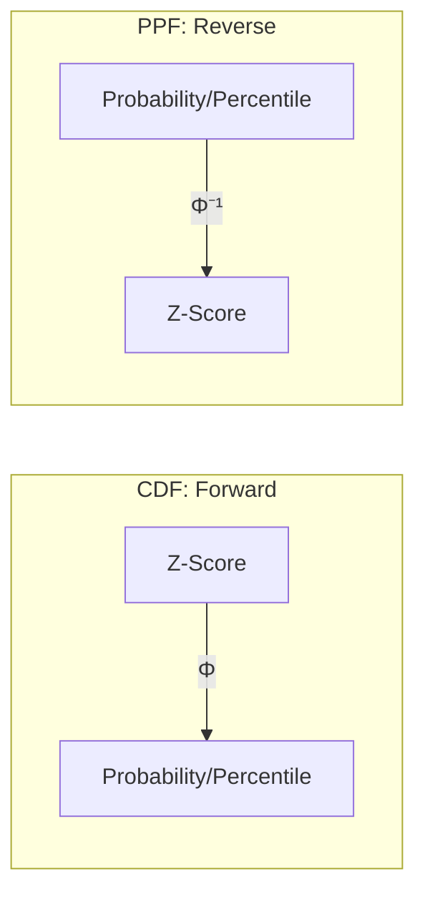

# CH-21 — CDF & PPF in Gaussian Systems

## 1. Intuition-First Explanation
We've used the "Rules of Thumb" (68-95-99.7), but what if you need to know the probability of a specific, non-integer Z-score like $Z = 1.645$? Or what if you want to find the Z-score for the **top 5%** of a distribution?

This is where the **CDF** and its inverse, the **PPF**, come in.
*   **CDF (Cumulative Distribution Function):** Takes a Z-score and gives you the "Area to the Left" (Percentile). It answers: "What is the probability of being less than $Z$?"
*   **PPF (Percent Point Function):** Takes a Percentile (Probability) and gives you the corresponding Z-score. It answers: "What value of $Z$ cuts off the bottom $X\%$ of the distribution?"

Think of the CDF as a "Forward" mapping and the PPF as a "Reverse" mapping.

## 2. Mathematical Derivations
### The Gaussian CDF ($\Phi$)
The CDF for the standard normal distribution is denoted by $\Phi(z)$.
$$\Phi(z) = P(Z \leq z) = \int_{-\infty}^{z} \frac{1}{\sqrt{2\pi}} e^{-\frac{1}{2}t^2} dt$$
Because this integral has no "closed-form" solution (you can't solve it with basic algebra), we use numerical approximations, Z-tables, or software.

### The Gaussian PPF ($\Phi^{-1}$)
Also known as the **Quantile Function**.
If $p = \Phi(z)$, then $z = \Phi^{-1}(p)$.

**Common Thresholds (Critical Values):**
*   **95th Percentile:** $\Phi^{-1}(0.95) \approx \mathbf{1.645}$
*   **97.5th Percentile:** $\Phi^{-1}(0.975) \approx \mathbf{1.96}$ (This is used for the common 95% confidence interval because $0.025$ is left in each tail).
*   **99th Percentile:** $\Phi^{-1}(0.99) \approx \mathbf{2.326}$

## 3. Visual Mental Models


*   **CDF:** You have the "Where" (Z), you want the "How Much" (Area).
*   **PPF:** You have the "How Much" (Area), you want the "Where" (Threshold).

## 4. Coding Implementation
Using `scipy.stats.norm` for precise calculations.

```python
from scipy.stats import norm

# 1. Forward: Finding the Percentile for a Z-score of 2
# (We expect ~97.7% because 95% is within ±2, so 95 + 2.5 = 97.5)
p = norm.cdf(2)
print(f"CDF(2): {p:.4f}")

# 2. Reverse: Finding the Z-score for the top 5%
# (This is the 95th percentile)
z_95 = norm.ppf(0.95)
print(f"95th Percentile Z-score: {z_95:.4f}")

# 3. Practical Example: Setting a threshold
# Mean latency is 200ms, Std Dev is 50ms. 
# At what latency are only 1% of requests slower?
# This is the 99th percentile.
threshold_99 = norm.ppf(0.99, loc=200, scale=50)
print(f"p99 Latency Threshold: {threshold_99:.2f}ms")
```

## 5. Solved Examples
**Problem:** In a normal distribution, what is the probability that $Z$ is between $-1.96$ and $1.96$?
**Solution:**
1.  $P(-1.96 \leq Z \leq 1.96) = \Phi(1.96) - \Phi(-1.96)$.
2.  $\Phi(1.96) = 0.975$.
3.  $\Phi(-1.96) = 0.025$.
4.  Result: $0.975 - 0.025 = \mathbf{0.95}$ or **95%**.
*This is why 1.96 is the "magic number" for 95% confidence intervals.*

## 6. Interview Questions
1.  **What is the difference between PDF and CDF?**
    *   *Answer:* PDF is the density at a single point (the "height"). CDF is the accumulated area from the left up to that point (the "percentile").
2.  **How would you find the top 10% cutoff for a distribution?**
    *   *Answer:* Use the PPF with an input of 0.90 (since the top 10% is above the 90th percentile).

## 7. Practice Questions
1.  Using a Z-table or calculator, find $P(Z < 1.28)$.
2.  Find the Z-score that cuts off the bottom 2.5% of the distribution.

## 8. Challenge Problems
**Non-Gaussian PPFs:** How would you calculate the PPF for a distribution that doesn't have a symmetric bell shape, like the **Log-Normal** distribution? (Hint: Think about transformations).

## 9. Common Mistakes
*   **One-Tailed vs Two-Tailed:** Using $\Phi^{-1}(0.95)$ when you actually need $\Phi^{-1}(0.975)$ to leave 5% total across *both* tails.
*   **Confusing PPF with PDF:** Using the density function to find a threshold.

## 10. Revision Notes
*   **CDF:** $Z \to$ Probability.
*   **PPF:** Probability $\to Z$.
*   **$\Phi(1.96) = 0.975$.**
*   **$\Phi(1.645) = 0.95$.**

## 11. Analytics Applications
*   **Dynamic Thresholding:** Instead of hard-coding a limit (e.g., "Alert at 500ms"), modern systems use the PPF to alert if latency is in the **99.9th percentile** of the last hour's distribution.
*   **Finance (Value at Risk):** Banks use the PPF to calculate the "Maximum Loss" they expect to see 99% of the time.
*   **A/B Testing (Significance):** We compare the observed Z-score to the critical Z-score (from the PPF) to decide if a result is "statistically significant" (usually $p < 0.05$, which corresponds to $Z > 1.96$ for a two-tailed test).
