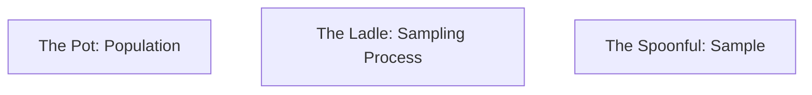

# CH-22 — Population vs Sample

## 1. Intuition-First Explanation
In a perfect world, if you wanted to know the average income of everyone in a country, you would ask everyone. This "everyone" is the **Population**. 

But asking 300 million people is impossible, expensive, and slow. Instead, you ask 1,000 people. This subset is the **Sample**.

Statistics is the science of using a **Sample** to make an educated guess about the **Population**. The "Gap" between what the sample says and what the population actually is, is called **Sampling Error**. Understanding this gap is the only way to avoid being "fooled" by a small, biased subset of data.

## 2. Mathematical Derivations
### Parameters vs Statistics
*   **Parameter:** A numerical summary of a *population* (Fixed, usually unknown).
*   **Statistic:** A numerical summary of a *sample* (Random, calculated from data).

| Feature | Population (Parameter) | Sample (Statistic) |
| :--- | :--- | :--- |
| **Mean** | $\mu$ (mu) | $\bar{x}$ (x-bar) |
| **Variance** | $\sigma^2$ (sigma-sq) | $s^2$ (s-sq) |
| **Std Dev** | $\sigma$ (sigma) | $s$ (s) |
| **Size** | $N$ | $n$ |

### Unbiased Estimators
We want our sample statistic to be an "unbiased" guess of the population parameter.
For the mean: $E[\bar{x}] = \mu$.
For the variance, we use **Bessel's Correction** ($n-1$) to ensure the sample variance isn't systematically too small:
$$s^2 = \frac{\sum (x_i - \bar{x})^2}{n-1}$$

## 3. Visual Mental Models
Think of a **Soup Pot**.



*   If the soup is **well-stirred** (Random Sampling), a single spoonful can tell you perfectly what the whole pot tastes like.
*   If the soup is **not stirred** (Biased Sampling), you might only taste the water at the top and miss the vegetables at the bottom.

## 4. Coding Implementation
Visualizing how a sample mean changes as we take different "spoonfuls" from a population.

```python
import numpy as np
import matplotlib.pyplot as plt

# 1. Create a large Population (e.g., 1 Million users)
population = np.random.exponential(scale=50, size=1000000)
pop_mean = np.mean(population)

# 2. Take 100 different Samples of size n=30
sample_means = [np.mean(np.random.choice(population, size=30)) for _ in range(100)]

plt.figure(figsize=(10, 6))
plt.hist(sample_means, bins=20, color='orange', alpha=0.7, label='Sample Means')
plt.axvline(pop_mean, color='red', linestyle='--', label=f'True Pop Mean ({pop_mean:.2f})')
plt.title("Sampling Variability: Every sample is slightly different")
plt.xlabel("Estimated Mean")
plt.legend()
plt.show()

print(f"Max Sample Mean: {max(sample_means):.2f}")
print(f"Min Sample Mean: {min(sample_means):.2f}")
```

## 5. Solved Examples
**Problem:** You want to know the average rating of a product. The true population mean is 4.5. You take a sample of 5 users and get: 5, 5, 4, 5, 5. Your sample mean is 4.8. What is the sampling error?
**Solution:**
$\text{Sampling Error} = \text{Sample Statistic} - \text{Population Parameter}$
$\text{Error} = 4.8 - 4.5 = \mathbf{0.3}$.
This error isn't a "mistake"; it's a natural result of only seeing a small piece of the puzzle.

## 6. Interview Questions
1.  **What is the difference between a Parameter and a Statistic?**
    *   *Answer:* A parameter is a value that describes a whole population (like $\mu$), while a statistic describes a sample (like $\bar{x}$).
2.  **Why do we divide by $n-1$ in sample variance?**
    *   *Answer:* Using $n$ tends to underestimate the true population variance because the sample is "closer" to the sample mean than to the true population mean. Dividing by $n-1$ (Bessel's Correction) mathematically corrects this bias.

## 7. Practice Questions
1.  If you have the data for *every* customer who has ever used your app, is that a population or a sample?
2.  Calculate the sample variance ($s^2$) for: 2, 4, 6. (Remember to use $n-1$).

## 8. Challenge Problems
**Sampling Bias:** If you only sample "Power Users" to decide on a new feature, how will your estimated mean differ from the true population mean? What is this type of error called? (Research "Selection Bias").

## 9. Common Mistakes
*   **Assuming the Sample IS the Population:** Forgetting that if you took a different sample, you would get a different number.
*   **Small Sample Confidence:** Trusting a sample of size $n=5$ as much as a sample of $n=5000$.

## 10. Revision Notes
*   **Population ($N$):** The whole group.
*   **Sample ($n$):** The subset.
*   **Stir the pot:** Random sampling is mandatory for accuracy.
*   **$n-1$:** Use for sample variance.

## 11. Analytics Applications
*   **A/B Testing:** In a large company like **Amazon**, we don't show a new feature to all 300M customers. We show it to a **Sample** (e.g., 50k) and use statistics to infer how the entire population would react.
*   **Polls and Surveys:** Politicians use samples of ~1,000 voters to predict the behavior of millions.
*   **Data Auditing:** Instead of checking every single transaction for fraud (which is too slow), auditors check a random **Sample** of transactions.
