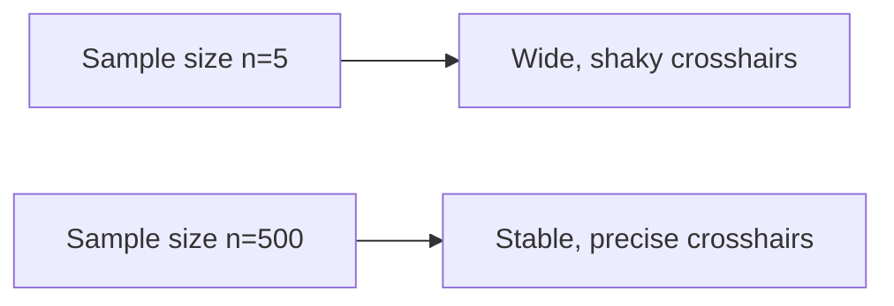

# CH-23 — Standard Error

## 1. Intuition-First Explanation
We know that every sample will give us a slightly different result. But **how much** of a difference should we expect? 

If you take a sample of 5 people, the average will bounce around a lot. If you take a sample of 5,000 people, the average will be very stable. **Standard Error (SE)** is the measure of this "bounciness." It tells you how much the sample mean ($\bar{x}$) is likely to deviate from the true population mean ($\mu$).

High Standard Error = "I don't trust this sample much."
Low Standard Error = "This sample is a very good guess of the population."

## 2. Mathematical Derivations
### The Formula for Standard Error of the Mean (SEM)
The SE is simply the standard deviation of the population divided by the square root of the sample size.
$$SE_{\bar{x}} = \frac{\sigma}{\sqrt{n}}$$

**Why the square root of $n$?**
This is the **Law of Diminishing Returns** in statistics. To cut your uncertainty (SE) in half, you don't need double the data; you need **four times** the data ($2 = \sqrt{4}$). To cut it by 10x, you need 100x the data.

### Estimating with Sample Data
Since we usually don't know the population $\sigma$, we use the sample $s$:
$$SE_{\bar{x}} \approx \frac{s}{\sqrt{n}}$$

## 3. Visual Mental Models
Think of a **Sniper's Scope**.



*   **Numerator ($\sigma$):** The "Noise" in the world. If the population is chaotic, your scope will be shakier.
*   **Denominator ($\sqrt{n}$):** Your "Tripod." The more data you have, the more stable your estimate becomes.

## 4. Coding Implementation
Let's see how the uncertainty of our estimate shrinks as we increase $n$.

```python
import numpy as np
import matplotlib.pyplot as plt

# A population with mean 100 and std dev 50
pop = np.random.normal(100, 50, 1000000)

sample_sizes = [5, 20, 100, 500, 2000]
results = []

for n in sample_sizes:
    # Take 500 different samples of size n
    means = [np.mean(np.random.choice(pop, size=n)) for _ in range(500)]
    results.append(means)

plt.figure(figsize=(10, 6))
plt.boxplot(results, labels=sample_sizes)
plt.title("How Sample Size (n) Shrinks Uncertainty (Standard Error)")
plt.xlabel("Sample Size (n)")
plt.ylabel("Distribution of Sample Means")
plt.show()
```

## 5. Solved Examples
**Problem:** A population has a standard deviation of 20. You take a sample of size $n=100$. What is the Standard Error?
**Solution:**
$$SE = \frac{20}{\sqrt{100}} = \frac{20}{10} = \mathbf{2.0}$$
This means our sample mean is likely to be within $\pm 2.0$ units of the true population mean.

## 6. Interview Questions
1.  **What is the difference between Standard Deviation and Standard Error?**
    *   *Answer:* Standard Deviation describes the spread of **individual data points** in a population. Standard Error describes the spread of **averages (sample means)** calculated from that population. SE is always smaller than SD.
2.  **How do you reduce the Standard Error of an experiment?**
    *   *Answer:* The most effective way is to increase the sample size ($n$). You can also try to reduce the underlying noise ($\sigma$) through better experimental control.

## 7. Practice Questions
1.  If you increase your sample size from 100 to 400, what happens to the Standard Error?
2.  Calculate the SE if $s=15$ and $n=25$.

## 8. Challenge Problems
**The Finite Population Correction:** If your sample size $n$ is a large percentage of your total population $N$ (e.g., more than 5%), the standard error formula changes. Why would your uncertainty decrease if you've already sampled almost everyone? (Research "FPC factor").

## 9. Common Mistakes
*   **Confusing SD and SE:** Using $s$ in a confidence interval formula when you should be using $s/\sqrt{n}$.
*   **Thinking SE is an Error:** SE is not a "mistake" or "bad data." It is a mathematical measure of the inherent uncertainty of sampling.

## 10. Revision Notes
*   **SE:** Uncertainty of the average.
*   **Formula:** $\sigma / \sqrt{n}$.
*   **More data** = Tighter estimate.
*   **4x data** = 2x precision.

## 11. Analytics Applications
*   **A/B Test Duration:** Before starting a test, analytics engineers use the SE formula to calculate how many days they need to run the test to reach a desired level of precision.
*   **Financial Forecasting:** When estimating "Expected Return," the Standard Error helps analysts understand the "Confidence Interval" of their forecast.
*   **Machine Learning (Cross-Validation):** When we report the accuracy of a model, we often report the mean accuracy across different "folds" and the **Standard Error** to show how much the accuracy varies depending on the specific data seen.
