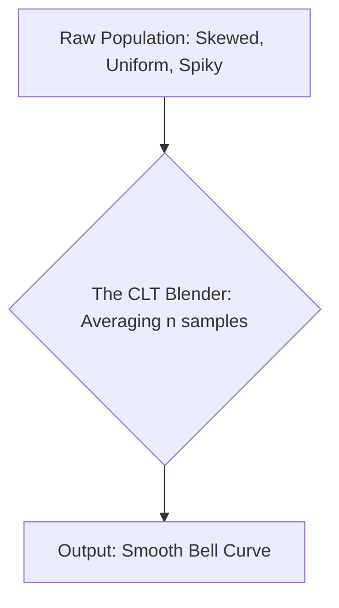

# CH-24 — Central Limit Theorem

## 1. Intuition-First Explanation
The **Central Limit Theorem (CLT)** is the most important theorem in statistics. It is the "Magic Trick" that allows us to use Normal distributions for almost everything, even when the data itself isn't normal.

The CLT states: **No matter what the shape of your population is, the distribution of the sample means ($\bar{x}$) will always be Normal, provided the sample size ($n$) is large enough.**

If you average out the "weirdness" of any dataset (skewed, flat, binary), that average becomes a Bell Curve. This is why we can use Z-scores and 68-95-99.7 rules for things like "Average Click Rate" or "Average Transaction Value," even though the raw data for those is definitely not bell-shaped.

## 2. Mathematical Derivations
Let $X_1, X_2, \dots, X_n$ be a random sample from a population with mean $\mu$ and variance $\sigma^2$.
As $n \to \infty$:
1.  The mean of the sample means is the population mean: $E[\bar{x}] = \mu$.
2.  The variance of the sample means is the population variance divided by $n$: $Var(\bar{x}) = \sigma^2 / n$.
3.  The distribution of $\bar{x}$ converges to a Normal Distribution:
$$\bar{x} \approx N\left(\mu, \frac{\sigma^2}{n}\right)$$

**What is "Large Enough"?**
Usually, $n \geq 30$ is considered the "Magic Number" where the CLT starts to work well for most distributions. If the population is extremely skewed, you might need $n=100$ or more.

## 3. Visual Mental Models
The CLT is a **Blender**.



*   **Raw Data:** Can be any shape.
*   **Sample Mean:** Always becomes a Bell Curve as $n$ grows.

## 4. Coding Implementation
Let's take a highly skewed "Exponential" population and watch the CLT turn it into a Bell Curve.

```python
import numpy as np
import matplotlib.pyplot as plt

# 1. A highly skewed Population
pop = np.random.exponential(scale=10, size=1000000)

sample_sizes = [2, 5, 30, 100]
plt.figure(figsize=(12, 8))

for i, n in enumerate(sample_sizes):
    # Take 5000 samples of size n and calculate their means
    means = [np.mean(np.random.choice(pop, size=n)) for _ in range(5000)]
    
    plt.subplot(2, 2, i+1)
    plt.hist(means, bins=50, color='skyblue', edgecolor='black')
    plt.title(f"Sample Size n = {n}")
    if n == 100:
        plt.xlabel("Sample Mean")

plt.tight_layout()
plt.show()
```

## 5. Solved Examples
**Problem:** A population is highly skewed with $\mu=50$ and $\sigma=10$. If you take a sample of $n=100$, what is the probability that the sample mean is between 49 and 51?
**Solution:**
1.  By CLT, $\bar{x} \sim N(\mu, \sigma/\sqrt{n})$.
2.  $SE = 10 / \sqrt{100} = \mathbf{1.0}$.
3.  The range $49$ to $51$ is exactly $\pm 1$ Standard Error ($\pm 1 \sigma_{SE}$).
4.  By the 68-95-99.7 rule, the probability is **68%**.

## 6. Interview Questions
1.  **Why is the Central Limit Theorem important in Data Science?**
    *   *Answer:* It allows us to perform hypothesis tests and build confidence intervals for the "Average" of any metric, regardless of whether that metric is normally distributed.
2.  **Does the CLT apply to the Median?**
    *   *Answer:* Not the standard CLT. There is a version for the median, but the standard CLT specifically applies to the **Mean** (and the Sum).

## 7. Practice Questions
1.  If your raw data is a Bernoulli distribution (0 or 1), what shape will the distribution of 1,000 sample means have?
2.  If the population variance is 100 and $n=25$, what is the variance of the sampling distribution?

## 8. Challenge Problems
**The Lindeberg-Levy Condition:** The CLT requires that the random variables are "Independent and Identically Distributed" (I.I.D.). What happens if your data points depend on each other (e.g., stock prices over time)? Does the CLT still work?

## 9. Common Mistakes
*   **Thinking the RAW data becomes Normal:** This is the most common error. The population stays skewed; only the **average of samples** becomes Normal.
*   **Assuming $n=30$ is always enough:** For "heavy-tailed" distributions (like income), $n=30$ might still look very skewed.

## 10. Revision Notes
*   **CLT:** Sampling distribution $\to$ Normal.
*   **Condition:** $n$ is large (usually $\geq 30$).
*   **Mean:** $\mu_{\bar{x}} = \mu$.
*   **Std Dev:** $\sigma_{\bar{x}} = \sigma / \sqrt{n}$.

## 11. Analytics Applications
*   **A/B Testing:** The "Lift" we measure in an A/B test is the difference between two sample means. Thanks to the CLT, we can use a Z-test or T-test to find the p-value.
*   **Opinion Polling:** When a poll says "Candidate A is at 45% $\pm 3\%$," they are using the CLT to build a confidence interval around the sample mean (percentage).
*   **Machine Learning (Bagging):** Techniques like Random Forests use "Bootstrap Aggregating" (Bagging), which relies on the idea that averaging many "weak" predictors will lead to a more stable, bell-shaped error distribution.
*   **Modern Research — Bootstrap Methods:** When the math of the CLT is too hard (e.g., for complex statistics like the ratio of two means), we use **Bootstrapping**—repeatedly sampling from our data—to simulate the CLT and find our uncertainty.
