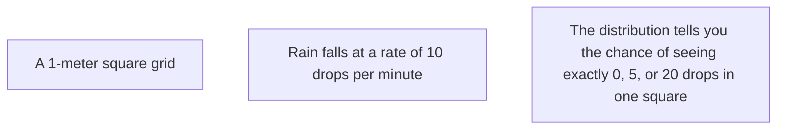

# CH-25 — Poisson Distribution

## 1. Intuition-First Explanation
How many emails will you receive in the next hour? How many users will visit your website in the next minute? How many bugs will you find in 1,000 lines of code?

The **Poisson Distribution** is used to model the number of times an event occurs in a fixed interval of time or space. It is the distribution of **Rare Events**. 

For a Poisson distribution to apply:
1.  Events happen at a constant average rate ($\lambda$).
2.  Events are independent (one email arriving doesn't make another more likely).
3.  Two events cannot happen at the exact same instant.

## 2. Mathematical Derivations
A random variable $X$ follows a Poisson distribution ($X \sim \text{Poisson}(\lambda)$) where $\lambda$ (lambda) is the average number of events in the interval.

### The PMF (Probability Mass Function)
$$P(X = k) = \frac{e^{-\lambda} \lambda^k}{k!}$$
Where:
*   $k$ is the number of occurrences ($0, 1, 2, \dots$).
*   $e$ is Euler's number ($\approx 2.718$).
*   $k!$ is the factorial of $k$.

### Statistics
The Poisson distribution has a unique property: its **Mean and Variance are equal**.
*   **Mean ($E[X]$):** $\lambda$
*   **Variance ($Var(X)$):** $\lambda$
*   **Standard Deviation:** $\sqrt{\lambda}$

## 3. Visual Mental Models
Think of **Raindrops on a Sidewalk**.



*   **Low $\lambda$:** The distribution is highly skewed to the right (mostly 0s and 1s).
*   **High $\lambda$:** The distribution becomes more symmetric and starts to look like a Normal distribution (thanks to the CLT).

## 4. Coding Implementation
Modeling "Server Requests per Second."

```python
import numpy as np
import matplotlib.pyplot as plt
from scipy.stats import poisson

# Average 5 requests per second
lam = 5
x = np.arange(0, 15)
pmf = poisson.pmf(x, lam)

plt.bar(x, pmf, color='purple', alpha=0.7, label=f'Poisson(λ={lam})')
plt.title("Probability of N Server Requests per Second")
plt.xlabel("Number of Requests")
plt.ylabel("Probability")
plt.legend()
plt.show()

# Chance of seeing more than 10 requests (Potential Spike/DDOS)
prob_spike = 1 - poisson.cdf(10, lam)
print(f"Probability of >10 requests: {prob_spike:.4f}")
```

## 5. Solved Examples
**Problem:** A bakery sells an average of 3 cakes per hour. What is the probability they sell exactly 2 cakes in the next hour?
**Solution:**
1.  $\lambda = 3, k = 2$.
2.  $P(X=2) = \frac{e^{-3} 3^2}{2!} = \frac{0.0498 \times 9}{2} = \mathbf{0.2241}$ or **22.4%**.

## 6. Interview Questions
1.  **When should you use Poisson instead of Binomial?**
    *   *Answer:* Use Poisson when you have a constant rate but the number of "trials" is infinite or unknown (e.g., arrivals at a store). Binomial requires a fixed number of trials $n$.
2.  **What is the significance of Mean = Variance in Poisson?**
    *   *Answer:* It means that as the average rate increases, the "spread" or uncertainty also increases at the same rate. If you see a dataset where Variance >> Mean, it's called "Overdispersion," and you might need a Negative Binomial distribution instead.

## 7. Practice Questions
1.  If $\lambda = 0.5$, what is $P(X=0)$?
2.  A call center gets 10 calls/hour. Find the standard deviation of the number of calls.

## 8. Challenge Problems
**Poisson Approximation to Binomial:** If $n$ is very large and $p$ is very small, a Binomial distribution $B(n, p)$ looks exactly like a Poisson distribution with $\lambda = np$. Why is this useful for modeling rare events like "Winning the lottery"?

## 9. Common Mistakes
*   **Wrong Interval:** Using $\lambda$ for 1 hour but calculating probability for 30 minutes. (You must scale $\lambda$ accordingly: if 10/hr, then 5/30min).
*   **Assuming Independence:** Using Poisson for events that "cluster" (like bus arrivals or contagious disease cases).

## 10. Revision Notes
*   **Modeling:** Count of events in an interval.
*   **Parameter:** $\lambda$ (Rate).
*   **Mean = Variance = $\lambda$.**
*   **Skewed right** for small $\lambda$.

## 11. Analytics Applications
*   **Operations & Logistics:** Modeling arrival rates at warehouses, call centers, or hospital ERs to decide on staffing levels.
*   **Cybersecurity:** Detecting DDoS attacks by monitoring if the number of requests in a window deviates too far from the expected Poisson distribution.
*   **AdTech:** Modeling the number of "clicks" an ad gets in a day, especially for low-volume, niche keywords.
*   **Software Engineering:** Estimating the number of defects found per module during code reviews.
