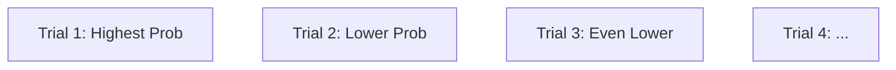

# CH-26 — Geometric Distribution

## 1. Intuition-First Explanation
How many times do you have to try something before you finally succeed?

The **Geometric Distribution** models the number of Bernoulli trials (Success/Failure) required to get exactly **one** success. It answers the question: "How long will I have to wait?"

This is the distribution of **Persistence**. It is used to model things like "How many emails do we need to send before a customer clicks?" or "How many times will a server retry a failed request before it succeeds?"

## 2. Mathematical Derivations
A random variable $X$ follows a Geometric distribution ($X \sim \text{Geometric}(p)$) where $p$ is the probability of success in each trial.

### The PMF (Probability Mass Function)
To succeed for the first time on trial $k$, you must fail $k-1$ times and then succeed once.
$$P(X = k) = (1-p)^{k-1} p \text{ for } k = 1, 2, 3, \dots$$

### The CDF (Cumulative Distribution Function)
The probability of succeeding in $k$ or fewer trials:
$$P(X \leq k) = 1 - (1-p)^k$$
This is intuitive: it's 1 minus the probability of failing $k$ times in a row.

### Statistics
*   **Mean ($E[X]$):** $1/p$ (The expected number of trials).
*   **Variance ($Var(X)$):** $\frac{1-p}{p^2}$

## 3. Visual Mental Models
Think of a **Downward Staircase**.



The probability is always highest on the **first** trial and decreases exponentially. Why? Because to even reach Trial 2, you *must* have failed Trial 1. Every extra trial you add makes the specific sequence (Fail, Fail, Fail... Success) less and less likely.

## 4. Coding Implementation
Modeling "Trials until Conversion."

```python
import numpy as np
import matplotlib.pyplot as plt
from scipy.stats import geom

# Probability of a user converted on any given visit is 10%
p = 0.1
x = np.arange(1, 41)
pmf = geom.pmf(x, p)

plt.bar(x, pmf, color='teal', alpha=0.7)
plt.title("Trials Until First Success (p=0.1)")
plt.xlabel("Number of Visits")
plt.ylabel("Probability")
plt.show()

# Chance of converting within the first 5 visits
prob_5 = geom.cdf(5, p)
print(f"Prob of converting in <= 5 visits: {prob_5:.2%}")
```

## 5. Solved Examples
**Problem:** A salesperson has a 20% success rate per call. What is the expected number of calls they need to make to get their first sale? What is the probability they get it on exactly the 3rd call?
**Solution:**
1.  **Expected Value:** $E[X] = 1/p = 1/0.2 = \mathbf{5}$ calls.
2.  **Exactly 3rd Call:** $P(X=3) = (0.8)^2 \times (0.2) = 0.64 \times 0.2 = \mathbf{0.128}$ or **12.8%**.

## 6. Interview Questions
1.  **What is the "Memoryless Property"?**
    *   *Answer:* It means the probability of succeeding in the *next* trial doesn't care about how many times you've failed already. $P(X > s+t \mid X > s) = P(X > t)$. If you've failed 10 times, the chance of succeeding on the 11th is still just $p$.
2.  **Where is the Mode of a Geometric distribution?**
    *   *Answer:* It is always at $k=1$. You are always most likely to succeed on your very first try (relative to any other specific later try).

## 7. Practice Questions
1.  If $p=0.5$ (a fair coin), what is the probability that the first "Heads" appears on the 4th flip?
2.  If the expected number of trials is 10, what is $p$?

## 8. Challenge Problems
**Coupons Collector's Problem:** If there are $N$ different types of coupons and each box contains one random coupon, how many boxes do you expect to buy to collect all $N$? (Hint: This is the sum of several Geometric distributions with different $p$ values).

## 9. Common Mistakes
*   **$k$ vs $k-1$:** Some definitions count the number of *failures* before success (starting at $k=0$), while others count the *total trials* (starting at $k=1$). Always check which one you are using.
*   **Ignoring Independence:** Using Geometric for trials that aren't independent (e.g., drawing cards *without* replacement).

## 10. Revision Notes
*   **Modeling:** "Time" (Trials) until first success.
*   **Shape:** Exponentially decaying.
*   **Mean:** $1/p$.
*   **Key Property:** Memoryless.

## 11. Analytics Applications
*   **User Retention/Conversion:** "How many sessions does it take for a new user to make their first purchase?"
*   **Retry Logic:** Designing back-off strategies for network requests. If $p$ is very low, you might decide to stop retrying after $k$ attempts (using the CDF to decide the cutoff).
*   **Sales Productivity:** Modeling the "Lead to Close" cycle for a sales team.
*   **Gaming:** Calculating the "Pity Timer" or drop rates in video games (Loot boxes).
