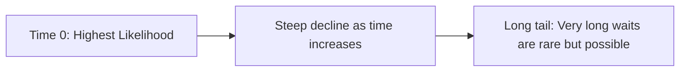

# CH-27 — Exponential Distribution

## 1. Intuition-First Explanation
While the Poisson distribution (CH-25) counts **how many** events happen in an hour, the **Exponential Distribution** measures the **time between** those events.

If arrivals follow a Poisson process (like users hitting a website), the time you have to wait for the next user follows an Exponential distribution. It is the continuous version of the Geometric distribution (CH-26). Instead of counting "discrete trials," we are measuring "continuous time."

It is the distribution of **Wait Times** and **Lifetimes**.

## 2. Mathematical Derivations
A random variable $X$ follows an Exponential distribution ($X \sim \text{Exp}(\lambda)$) where $\lambda$ is the rate parameter (the same $\lambda$ from the Poisson distribution).

### The PDF (Probability Density Function)
$$f(x) = \lambda e^{-\lambda x} \text{ for } x \geq 0$$

### The CDF (Cumulative Distribution Function)
The probability that you wait $x$ or less:
$$F(x) = 1 - e^{-\lambda x}$$

### Statistics
A key characteristic is that the **Mean and Standard Deviation are equal**.
*   **Mean ($E[X]$):** $1/\lambda$ (The average wait time).
*   **Standard Deviation ($\sigma$):** $1/\lambda$
*   **Variance:** $1/\lambda^2$

## 3. Visual Mental Models
Think of a **Sliding Board**.



*   **Memoryless Property:** Just like the Geometric distribution, the Exponential distribution is "Memoryless." If you have already waited 10 minutes for a bus, the probability that you will wait *another* 5 minutes is exactly the same as if you had just arrived. The "past" doesn't change the "future."

## 4. Coding Implementation
Modeling "Time Between Purchases" for a busy store.

```python
import numpy as np
import matplotlib.pyplot as plt
from scipy.stats import expon

# Average rate: 2 purchases per minute (lam = 2)
# In scipy, 'scale' is 1/lam
lam = 2
scale = 1/lam

x = np.linspace(0, 5, 1000)
pdf = expon.pdf(x, scale=scale)

plt.plot(x, pdf, color='crimson', lw=2)
plt.fill_between(x, pdf, color='crimson', alpha=0.2)
plt.title("Time Between Events (Rate λ=2 per min)")
plt.xlabel("Wait Time (Minutes)")
plt.ylabel("Density")
plt.show()

# Probability that the next purchase happens within 30 seconds (0.5 mins)
prob_30s = expon.cdf(0.5, scale=scale)
print(f"Prob of event within 0.5 mins: {prob_30s:.2%}")
```

## 5. Solved Examples
**Problem:** A lightbulb has a mean life of 1,000 hours. What is the probability it fails within the first 500 hours?
**Solution:**
1.  Mean ($E[X]$) = 1000 $\implies \lambda = 1/1000 = 0.001$.
2.  Using the CDF: $F(500) = 1 - e^{-0.001 \times 500} = 1 - e^{-0.5}$.
3.  $1 - 0.6065 = \mathbf{0.3935}$ or **39.4%**.

## 6. Interview Questions
1.  **Explain the relationship between Poisson and Exponential distributions.**
    *   *Answer:* If the number of events in an hour follows a Poisson distribution with rate $\lambda$, then the time between those events follows an Exponential distribution with parameter $\lambda$.
2.  **Why is the Exponential distribution used in Reliability Engineering?**
    *   *Answer:* Because it models systems where the probability of failure is constant over time (due to the memoryless property). It assumes the component doesn't "age"—it only fails due to random external shocks.

## 7. Practice Questions
1.  If the rate $\lambda$ is 4 per hour, what is the mean wait time in minutes?
2.  If $X \sim \text{Exp}(2)$, what is $P(X > 1)$?

## 8. Challenge Problems
**The Bathtub Curve:** In real-world reliability, things often have high failure rates early (infant mortality) and late (wear-out). The Exponential distribution only models the "flat" middle part. What distribution combines all three? (Look up the **Weibull Distribution**).

## 9. Common Mistakes
*   **Confusing $\lambda$ and $1/\lambda$:** Forgetting that $\lambda$ is the *rate* (events/time) and $1/\lambda$ is the *time* (time/event).
*   **PDF vs CDF:** Using the PDF formula to find a probability (you must use the integral/CDF for intervals).

## 10. Revision Notes
*   **Modeling:** Time between Poisson events.
*   **Shape:** Decaying curve.
*   **Mean:** $1/\lambda$.
*   **Property:** Memoryless.

## 11. Analytics Applications
*   **Web Performance:** Modeling the time between user requests to optimize server auto-scaling.
*   **Customer Lifetime Value (CLV):** Modeling the "Time to Churn" for subscribers.
*   **Service Level Agreements (SLAs):** Calculating the probability that a system will stay "Up" for a certain duration (Mean Time Between Failures - MTBF).
*   **Call Centers:** Modeling the duration of phone calls (though the Log-Normal is sometimes a better fit).
