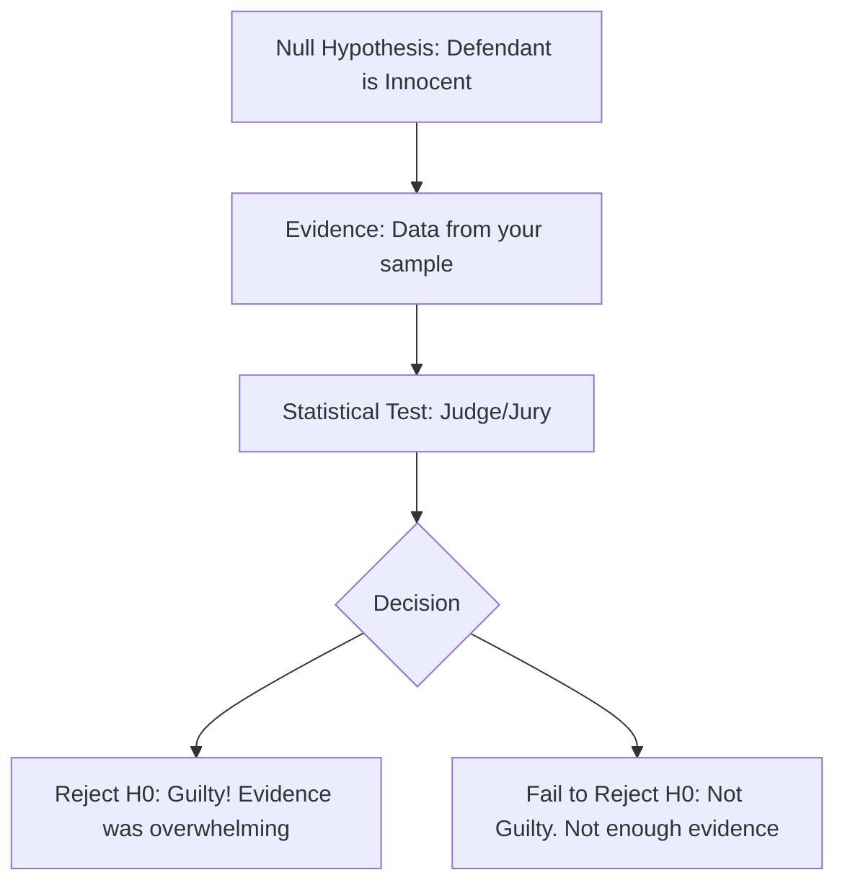

# CH-28 — Introduction to Hypothesis Testing

## 1. Intuition-First Explanation
How do we know if a new drug works? How do we know if a website redesign actually increased sales, or if the change was just due to random luck?

**Hypothesis Testing** is the formal "Legal System" of statistics. In a trial, a person is "Innocent until proven guilty." In statistics, our "Innocent" state is that "Nothing happened" or "The change had no effect." We only switch our belief if the evidence is so overwhelming that it would be extremely unlikely to happen by pure chance.

It is a structured way of making decisions under uncertainty.

## 2. Mathematical Derivations
Every test starts with two competing claims:

### The Null Hypothesis ($H_0$)
The "Status Quo." It assumes there is no effect, no difference, or no relationship.
*   *Example:* $H_0: \mu = 100$ (The new machine is the same as the old one).

### The Alternative Hypothesis ($H_a$ or $H_1$)
The claim we are trying to find evidence for.
*   **Two-Tailed:** $H_a: \mu \neq 100$ (The machine is different).
*   **One-Tailed (Right):** $H_a: \mu > 100$ (The machine is better).
*   **One-Tailed (Left):** $H_a: \mu < 100$ (The machine is worse).

### The Test Statistic
A value calculated from your sample that measures how far your data is from the Null Hypothesis.
$$Z = \frac{\text{Observed} - \text{Expected}}{\text{Standard Error}}$$

## 3. Visual Mental Models
Think of a **Courtroom**.



*   **Crucial Point:** We never "Accept" the Null. We only "Fail to Reject" it. Just like a jury says "Not Guilty" (meaning evidence was insufficient), rather than "Innocent."

## 4. Coding Implementation
Setting up a hypothesis test framework in Python.

```python
import numpy as np
from scipy import stats

# Scenario: Average delivery time was 30 mins. 
# New route claims to be faster.
pop_mean = 30
sample_data = [28, 25, 29, 31, 26, 27, 24, 30, 25, 28]

# 1. State Hypotheses
# H0: mu = 30
# Ha: mu < 30 (One-tailed test)

# 2. Calculate Sample Statistics
n = len(sample_data)
x_bar = np.mean(sample_data)
s = np.std(sample_data, ddof=1)

# 3. Calculate T-Statistic
t_stat = (x_bar - pop_mean) / (s / np.sqrt(n))

print(f"Sample Mean: {x_bar:.2f}")
print(f"T-Statistic: {t_stat:.4f}")

# 4. Find P-Value (using scipy)
p_value = stats.t.cdf(t_stat, df=n-1)
print(f"P-Value: {p_value:.4f}")
```

## 5. Solved Examples
**Problem:** A lightbulb factory claims their bulbs last 1000 hours. You test 50 bulbs and find an average of 980 hours with a standard deviation of 50. State the hypotheses for testing if the bulbs last *less* than claimed.
**Solution:**
*   $H_0: \mu = 1000$
*   $H_a: \mu < 1000$ (One-tailed test).

## 6. Interview Questions
1.  **What is the Null Hypothesis?**
    *   *Answer:* It is the assumption of no effect or no difference. It serves as the baseline that we try to find evidence against.
2.  **Why do we say "Fail to Reject" instead of "Accept"?**
    *   *Answer:* Because absence of evidence is not evidence of absence. Not finding enough proof to convict someone doesn't mean they are 100% innocent; it just means the proof was insufficient.

## 7. Practice Questions
1.  Define $H_0$ and $H_a$ for a test checking if a new fertilizer increases crop yield.
2.  If your test statistic is $Z=0.1$, are you likely to reject the Null? Why or why not?

## 8. Challenge Problems
**The Bayesian Alternative:** If a hypothesis test only tells you the probability of the *data* given the hypothesis $P(D \mid H_0)$, why do most people think it tells them the probability of the *hypothesis* $P(H_0 \mid D)$? How does Bayesian testing (CH-08) solve this?

## 9. Common Mistakes
*   **Swapping $H_0$ and $H_a$:** Putting the effect you want to find into the Null.
*   **Using Sample Data in Hypotheses:** Writing $H_0: \bar{x} = 10$. Hypotheses are always about the **Population** ($\mu$), not the sample.

## 10. Revision Notes
*   **$H_0$:** No effect.
*   **$H_a$:** What you suspect.
*   **Evidence** must be strong to reject $H_0$.
*   **Decisions** are binary: Reject or Fail to Reject.

## 11. Analytics Applications
*   **A/B Testing:** "Does Variation B have a higher conversion rate than the Control?" (Null: No difference).
*   **Quality Control:** "Is this batch of parts within tolerance?" (Null: Within tolerance).
*   **Marketing Attribution:** "Did the ad campaign actually drive the spike in traffic?" (Null: Traffic spike was random).
*   **Modern Research — The Replication Crisis:** Many scientific studies cannot be reproduced because researchers "hunted" for $H_a$ by manipulating their data until they could reject $H_0$ (p-hacking). This has led to stricter standards in modern analytics.
