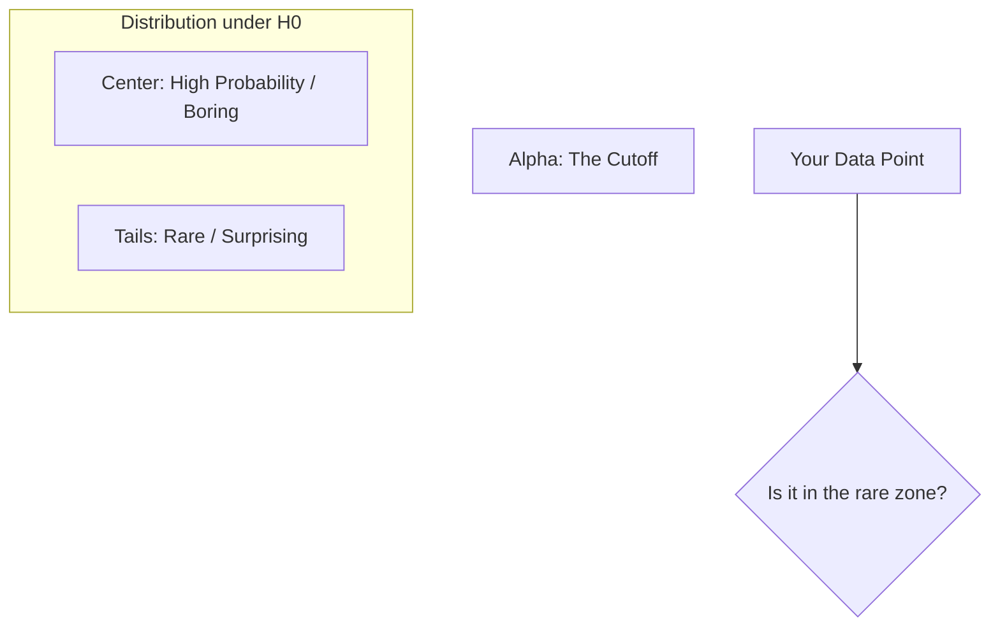

# CH-29 — p-value & Alpha

## 1. Intuition-First Explanation
How "surprising" is your data?

The **p-value** is a measure of surprise. It tells you: "If the Null Hypothesis were true, what is the probability that I would see data at least this extreme?"
*   **Low p-value:** "Wow, this is very unlikely to happen by chance. Maybe $H_0$ is wrong!"
*   **High p-value:** "This could easily happen by chance. I have no reason to doubt $H_0$."

**Alpha ($\alpha$)** is your "Line in the Sand." It's the threshold you decide *before* the experiment. If the p-value is less than alpha, you reject the Null.

## 2. Mathematical Derivations
### The p-value
For a test statistic $T$ and observed value $t$:
*   **One-Tailed (Right):** $p = P(T \geq t \mid H_0)$
*   **Two-Tailed:** $p = 2 \times P(T \geq |t| \mid H_0)$

### Significance Level ($\alpha$)
Commonly set to $0.05$ (5%). This means you are willing to accept a 5% chance of being wrong when you say there is an effect (Type-1 Error).

### Decision Rule
*   If $p \leq \alpha$: **Reject $H_0$** (Statistically Significant).
*   If $p > \alpha$: **Fail to Reject $H_0$** (Not Statistically Significant).

## 3. Visual Mental Models
Think of the **"Rare Zone."**



*   If your data point lands in the extreme tails (beyond the Alpha line), the p-value is small, and you've found something significant.

## 4. Coding Implementation
Calculating p-values for a conversion rate increase.

```python
from scipy import stats

# Control: 10% conversion. Test: 12% conversion.
# Z-statistic calculated: 2.1
z_stat = 2.1
alpha = 0.05

# 1. Calculate P-value (Two-tailed)
p_value = 2 * (1 - stats.norm.cdf(abs(z_stat)))

print(f"Z-Statistic: {z_stat}")
print(f"P-Value: {p_value:.4f}")

# 2. Make decision
if p_value <= alpha:
    print("Decision: Reject H0 (Result is Significant)")
else:
    print("Decision: Fail to Reject H0")
```

## 5. Solved Examples
**Problem:** You conduct a test and get a p-value of $0.03$. Using an $\alpha = 0.05$, what is your conclusion? What if you used $\alpha = 0.01$?
**Solution:**
1.  For $\alpha = 0.05$: $0.03 < 0.05 \implies$ **Reject $H_0$**.
2.  For $\alpha = 0.01$: $0.03 > 0.01 \implies$ **Fail to Reject $H_0$**.
*Conclusion:* The stricter your standards (lower alpha), the harder it is to claim a discovery.

## 6. Interview Questions
1.  **What is a p-value?**
    *   *Answer:* It is the probability of observing a test statistic at least as extreme as the one found in the sample, assuming the Null Hypothesis is true.
2.  **Does a p-value of 0.05 mean there is a 95% chance the Alternative Hypothesis is true?**
    *   *Answer:* **NO.** This is the most common mistake. A p-value is about the *data*, not the hypothesis. It tells you $P(\text{Data} \mid H_0)$, not $P(H_a \mid \text{Data})$.

## 7. Practice Questions
1.  If your p-value is $0.0001$, is your result "highly significant"?
2.  Find the p-value for $Z=1.96$ (two-tailed).

## 8. Challenge Problems
**The p-value Waterfall:** If you run 20 independent tests on random noise, how many of them do you expect to have a p-value $< 0.05$ by pure luck? (Hint: Think about the definition of alpha). How do modern platforms like **Booking.com** handle this when running thousands of A/B tests? (Look up **Bonferroni Correction**).

## 9. Common Mistakes
*   **P-hacking:** Running many tests and only reporting the ones with $p < 0.05$.
*   **Confusing Significance with Importance:** A result can be "Statistically Significant" (p < 0.05) but "Practically Useless" (the effect size is too small to matter to the business).

## 10. Revision Notes
*   **p-value:** Probability of the data given $H_0$.
*   **Alpha ($\alpha$):** Your threshold for "rare."
*   **Small p:** Reject $H_0$.
*   **Significant $\neq$ Important.**

## 11. Analytics Applications
*   **Scientific Research:** The $p < 0.05$ standard has governed science for a century, but is currently being questioned due to reproducibility issues.
*   **A/B Test Guardrails:** Companies use alpha to ensure they don't ship "false wins" that don't actually help users.
*   **Financial Auditing:** Setting a very low alpha (e.g., $0.001$) to ensure that fraud alerts are only triggered for truly anomalous transactions.
