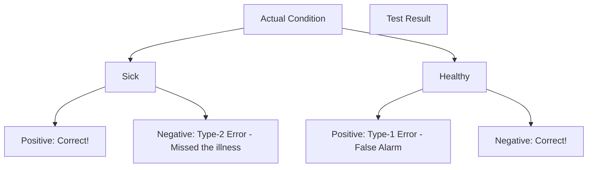

# CH-30 — Type-1 & Type-2 Errors

## 1. Intuition-First Explanation
No statistical test is 100% perfect. Sometimes you will make the wrong decision. In statistics, there are two specific ways to be wrong:

*   **Type-1 Error (False Positive):** You say there is an effect, but there isn't. (The "False Alarm").
*   **Type-2 Error (False Negative):** You say there is no effect, but there actually is. (The "Missed Opportunity").

Life is a constant tradeoff between these two. If you make your smoke detector too sensitive, you get lots of False Alarms (Type-1). If you make it too quiet, you might miss a real fire (Type-2). You can't minimize both at the same time without getting more data.

## 2. Mathematical Derivations
| Decision | $H_0$ is True | $H_a$ is True |
| :--- | :--- | :--- |
| **Fail to Reject $H_0$** | Correct Decision ($1-\alpha$) | **Type-2 Error ($\beta$)** |
| **Reject $H_0$** | **Type-1 Error ($\alpha$)** | Correct Decision (Power: $1-\beta$) |

### Type-1 Error ($\alpha$)
This is the probability of rejecting $H_0$ when it is actually true. We control this by choosing our significance level ($\alpha$).

### Type-2 Error ($\beta$)
This is the probability of failing to reject $H_0$ when $H_a$ is actually true. 

### Statistical Power ($1 - \beta$)
Power is the probability that your test will correctly find an effect if it exists.
**To Increase Power:**
1.  Increase Sample Size ($n$).
2.  Increase the Effect Size (the difference you are looking for).
3.  Decrease the Noise ($\sigma$).

## 3. Visual Mental Models
Think of a **Medical Test**.



*   **Alpha ($\alpha$):** The price you pay for being "Bold."
*   **Beta ($\beta$):** The price you pay for being "Cautious."

## 4. Coding Implementation
Let's see how increasing $n$ increases the **Power** of a test.

```python
import numpy as np
from statsmodels.stats.power import TTestIndPower

# 1. Setup parameters
effect_size = 0.5  # Medium effect
alpha = 0.05
power = 0.8        # Standard target power

# 2. Calculate required sample size
analysis = TTestIndPower()
required_n = analysis.solve_power(effect_size=effect_size, 
                                  alpha=alpha, 
                                  power=power, 
                                  ratio=1.0)

print(f"To detect an effect size of {effect_size} with 80% power,")
print(f"you need a sample size of n = {required_n:.2f} per group.")

# 3. What if we only had n=10?
low_n_power = analysis.solve_power(effect_size=effect_size, 
                                   alpha=alpha, 
                                   nobs1=10, 
                                   ratio=1.0)
print(f"With n=10, the Power is only {low_n_power:.2%}")
```

## 5. Solved Examples
**Problem:** A security system has $\alpha = 0.01$ and $\beta = 0.10$. What is the Power of the system? If a real threat occurs, what is the chance the system misses it?
**Solution:**
1.  **Power:** $1 - \beta = 1 - 0.10 = \mathbf{0.90}$ or **90%**.
2.  **Missed Threat:** This is the Type-2 Error ($\beta$), which is **10%**.

## 6. Interview Questions
1.  **Which error is worse: Type-1 or Type-2?**
    *   *Answer:* It depends on the context. In a criminal trial, a Type-1 error (convicting an innocent person) is usually considered worse. In a cancer screening, a Type-2 error (missing the cancer) is much worse.
2.  **How can you reduce both Type-1 and Type-2 errors at the same time?**
    *   *Answer:* The only way to reduce both simultaneously is to **increase the sample size**. More data provides more information, allowing for a clearer distinction between noise and signal.

## 7. Practice Questions
1.  If you set $\alpha = 0.01$ instead of $0.05$, what happens to the probability of a Type-2 error?
2.  What is the "Power" of a test if $\beta = 0.05$?

## 8. Challenge Problems
**The Significance/Power Paradox:** If you find a statistically significant result ($p < 0.05$) in a test that had very low power (e.g., small sample), is the result *more* or *less* likely to be true? (Look up **Winner's Curse** and **Positive Predictive Value**).

## 9. Common Mistakes
*   **Ignoring Power:** Running an A/B test without calculating $n$ first, resulting in a "Fail to Reject" simply because the sample was too small to see the effect.
*   **Confusing Alpha and Beta:** Thinking they must sum to 1. They don't; they are probabilities of different scenarios.

## 10. Revision Notes
*   **Type-1:** False Positive ($\alpha$).
*   **Type-2:** False Negative ($\beta$).
*   **Power:** $1-\beta$ (Ability to find the truth).
*   **Tradeoff:** Lower $\alpha$ usually means higher $\beta$.

## 11. Analytics Applications
*   **Fraud Detection:** Balancing the "Type-1" cost (bothering a legitimate customer with a blocked card) against the "Type-2" cost (allowing a thief to steal money).
*   **Search Engines:** Type-1 Error is showing an irrelevant result. Type-2 Error is missing the perfect result. Google optimizes for both using "Precision" and "Recall."
*   **A/B Test Planning:** Before launching a test at **Uber** or **Airbnb**, data scientists must agree on the "Minimum Detectable Effect" (MDE) and the desired Power to calculate how long the test must run.
*   **Legal Systems:** The "Beyond a reasonable doubt" standard is an attempt to set $\alpha$ very low, accepting that some Type-2 errors (guilty people going free) will occur to prevent Type-1 errors.
