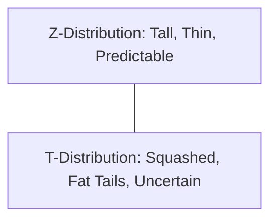

# CH-31 — Z Distribution vs T Distribution

## 1. Intuition-First Explanation
The Z-distribution (Standard Normal) is perfect when you know everything about the world—specifically, the population standard deviation ($\sigma$). But in real-world engineering, you almost never know $\sigma$. You only have your small sample and its standard deviation ($s$).

When you use $s$ to estimate $\sigma$, you introduce extra uncertainty. This is especially true for small samples ($n < 30$). To account for this "uncertainty of our uncertainty," we use the **T-distribution**.

Think of the T-distribution as a "Heavy-Tailed" version of the Normal distribution. It is wider and flatter to allow for more extreme "unlucky" samples. As your sample size grows, your estimate of the variance becomes more precise, and the T-distribution slowly morphs back into the Z-distribution.

## 2. Mathematical Derivations
### The T-Statistic
Instead of the Z-formula, we use the T-formula:
$$t = \frac{\bar{x} - \mu}{s / \sqrt{n}}$$

### Degrees of Freedom ($df$)
The T-distribution isn't just one curve; it's a family of curves. Each one is defined by its **Degrees of Freedom**. For a one-sample test:
$$df = n - 1$$
*   **Low $df$:** The tails are very "fat" (high uncertainty).
*   **High $df$:** The curve approaches the Normal distribution ($Z$).

### The PDF of the T-Distribution
For the curious, the PDF involves the Gamma function ($\Gamma$):
$$f(t) = \frac{\Gamma(\frac{\nu+1}{2})}{\sqrt{\nu\pi}\Gamma(\frac{\nu}{2})} \left(1 + \frac{t^2}{\nu}\right)^{-\frac{\nu+1}{2}}$$
Where $\nu = df$. You don't need to memorize this, but notice that as $\nu \to \infty$, the term $\left(1 + \frac{t^2}{\nu}\right)^{-\frac{\nu+1}{2}}$ approaches the $e^{-\frac{1}{2}t^2}$ of the Normal distribution.

## 3. Visual Mental Models
Think of a **Squashed Balloon**.



*   **T-Distribution:** The "safety net." It makes it harder to reject the Null Hypothesis because it expects more noise. It prevents you from being overconfident when you only have a few data points.

## 4. Coding Implementation
Visualizing the difference between Z and T distributions.

```python
import numpy as np
import matplotlib.pyplot as plt
from scipy.stats import norm, t

x = np.linspace(-4, 4, 1000)

plt.figure(figsize=(10, 6))
plt.plot(x, norm.pdf(x), 'r', lw=2, label='Normal (Z)')
plt.plot(x, t.pdf(x, df=2), 'b--', label='T (df=2)')
plt.plot(x, t.pdf(x, df=10), 'g:', label='T (df=10)')

plt.title("Z vs T: The 'Fat Tail' effect of small samples")
plt.xlabel("Standard Deviations")
plt.legend()
plt.show()
```

## 5. Solved Examples
**Problem:** You have a sample of size $n=5$. You calculated a test statistic of 2.5. Using a Z-table, the area to the right is 0.006. Using a T-table ($df=4$), the area is 0.033. Which one should you use?
**Solution:**
Since $n$ is very small and you likely used the sample standard deviation $s$, you **must** use the T-distribution. The Z-distribution would make you think the result is much more significant ($p=0.006$) than it actually is ($p=0.033$).

## 6. Interview Questions
1.  **When do you use a T-test instead of a Z-test?**
    *   *Answer:* Use a T-test when the population standard deviation ($\sigma$) is unknown (which is almost always) and the sample size is small ($n < 30$). Even for large samples, the T-test is safer as it converges to the Z-test.
2.  **What are "Degrees of Freedom" in simple terms?**
    *   *Answer:* It's the number of values in your calculation that are free to vary. If you know the mean of 5 numbers, only 4 of them can be anything; the 5th is "locked" to make the mean correct. Thus, $df = 5-1 = 4$.

## 7. Practice Questions
1.  As $n$ increases, what happens to the gap between the Z and T distributions?
2.  Find the critical t-value for a 95% confidence level with $df=10$ (two-tailed).

## 8. Challenge Problems
**The Guinness Connection:** The T-test was invented by William Sealy Gosset, who worked for the Guinness Brewery. Why did he have to publish under the pseudonym "Student"? (Look up the history of "Student's T-Test").

## 9. Common Mistakes
*   **Using $n$ instead of $n-1$:** Forgetting that the distribution depends on the degrees of freedom.
*   **Assuming T-Tests are only for small samples:** T-tests work perfectly for large samples too! There is almost never a reason *not* to use a T-test if $\sigma$ is unknown.

## 10. Revision Notes
*   **T-Distribution:** More uncertainty, fatter tails.
*   **Used when:** $\sigma$ is unknown.
*   **Parameter:** $df = n-1$.
*   **Convergence:** $T \to Z$ as $n \to \infty$.

## 11. Analytics Applications
*   **Startup A/B Testing:** Early-stage startups often have very low traffic. They can't wait for $n=10,000$. The T-test is their primary tool for deciding if a feature works with only $n=50$ or $n=100$.
*   **Quality Control:** Testing a small batch of expensive hardware components (where destroying the component is part of the test).
*   **Bio-statistics:** Small-scale clinical trials where recruiting patients is difficult and expensive.
