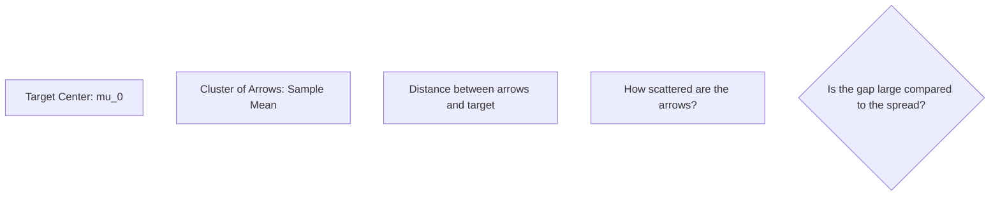

# CH-32 — One Sample T-Test

## 1. Intuition-First Explanation
Is your sample "Normal"? Or is it significantly different from what you expected?

A **One-Sample T-Test** compares the mean of a single sample to a specific "target" value (usually the historical average or a hypothesized population mean). 

Imagine you work for a food delivery app. The historical average delivery time is 30 minutes. You implement a new routing algorithm and test it on a sample of 20 deliveries. The average is 28 minutes. Is those 2 minutes a real improvement, or just "noise" from that specific hour of traffic? The One-Sample T-test gives you the answer.

## 2. Mathematical Derivations
### The Hypotheses
*   $H_0: \mu = \mu_0$ (Sample mean is equal to the target).
*   $H_a: \mu \neq \mu_0$ (Two-tailed) or $\mu > \mu_0$ (One-tailed).

### The Test Statistic
$$t = \frac{\bar{x} - \mu_0}{s / \sqrt{n}}$$
Where:
*   $\bar{x}$ is the sample mean.
*   $\mu_0$ is the target population mean.
*   $s$ is the sample standard deviation.
*   $n$ is the sample size.

### Assumptions for Validity
1.  **Independence:** Each data point in the sample is independent of the others.
2.  **Normality:** The population distribution is approximately Normal (or $n$ is large enough for CLT).
3.  **Random Sampling:** Data was collected randomly.

## 3. Visual Mental Models
Think of a **Target Practice**.



If the arrows are tightly clustered but far from the center, you have a significant result. If they are scattered all over the place, a large gap might just be bad luck.

## 4. Coding Implementation
Testing if a new feature increased user session length.

```python
import numpy as np
from scipy import stats

# Target: Historical average session length was 5.0 minutes
mu_0 = 5.0

# Sample: 15 sessions with the new feature
sample_sessions = [5.5, 4.8, 6.2, 5.1, 5.9, 4.7, 5.3, 6.0, 5.4, 5.2, 4.9, 5.8, 6.1, 5.0, 5.6]

# 1. Perform One-Sample T-Test
t_stat, p_value = stats.ttest_1samp(sample_sessions, mu_0)

print(f"Sample Mean: {np.mean(sample_sessions):.2f}")
print(f"T-Statistic: {t_stat:.4f}")
print(f"P-Value: {p_value:.4f}")

# 2. Decision
alpha = 0.05
if p_value < alpha:
    print("Decision: Reject H0. The new feature significantly changed session length.")
else:
    print("Decision: Fail to Reject H0.")
```

## 5. Solved Examples
**Problem:** A coffee machine is supposed to dispense 250ml. You measure 10 cups and get a mean of 245ml with $s=10$. Test if the machine is under-filling at $\alpha=0.05$.
**Solution:**
1.  $H_0: \mu = 250, H_a: \mu < 250$.
2.  $t = (245 - 250) / (10 / \sqrt{10}) = -5 / 3.16 = -1.58$.
3.  $df = 9$. One-tailed $p$-value for $t = -1.58$ is $\approx 0.07$.
4.  Since $0.07 > 0.05$, we **Fail to Reject $H_0$**. We don't have enough evidence to say it's under-filling.

## 6. Interview Questions
1.  **What does the T-statistic physically represent?**
    *   *Answer:* It represents the signal-to-noise ratio. The "Signal" is the difference between the sample mean and the target. The "Noise" is the standard error. A high T-value means the signal is much stronger than the random noise.
2.  **What happens if your data isn't Normal?**
    *   *Answer:* If $n$ is large (e.g., $>30$), the CLT protects you. If $n$ is small and data is non-normal, you might need a non-parametric test like the **Wilcoxon Signed-Rank Test**.

## 7. Practice Questions
1.  $n=25, \bar{x}=105, s=10, \mu_0=100$. Calculate the T-statistic.
2.  If you use a 99% confidence level instead of 95%, does it get harder or easier to reject the Null?

## 8. Challenge Problems
**Effect Size (Cohen's d):** A T-test tells you if a result is significant, but not how *big* it is. Calculate Cohen's d for the coffee machine example above. Is it a small, medium, or large effect?

## 9. Common Mistakes
*   **Two-tailed vs One-tailed:** Using a two-tailed p-value when your hypothesis was specifically that the mean was "greater than" the target.
*   **Outliers:** A single extreme outlier in a small sample can completely ruin a T-test by inflating the standard deviation $s$, making the T-statistic tiny.

## 10. Revision Notes
*   **One-Sample:** Compare mean to a number.
*   **Formula:** $(\bar{x} - \mu_0) / SE$.
*   **Assumptions:** Independence and Normality.
*   **Output:** T-statistic and P-value.

## 11. Analytics Applications
*   **Benchmark Testing:** Comparing your app's load time to the industry standard (e.g., 2 seconds).
*   **Financial Auditing:** Checking if the average transaction value in a day deviates from the historical norm (anomaly detection).
*   **Survey Analysis:** Testing if the average user rating of a new feature is significantly higher than a "neutral" score of 3 out of 5.
