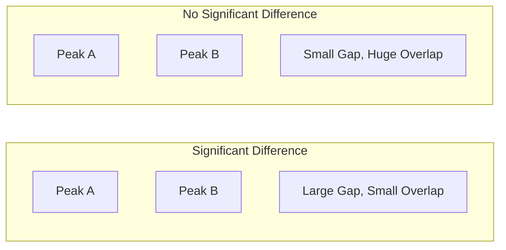

# CH-33 — Two Sample T-Tests

## 1. Intuition-First Explanation
Is Group A really better than Group B?

Most analytics questions involve comparisons:
*   "Did users on Android spend more than users on iOS?" (**Independent Samples**)
*   "Did the same group of users spend more *after* we gave them a coupon than *before*?" (**Paired Samples**)

The **Two-Sample T-test** is the statistical tool for these comparisons. It filters out the "natural" variation in both groups to see if the difference between them is truly meaningful. It's the engine behind almost every A/B testing platform on earth.

## 2. Mathematical Derivations
### Independent T-Test (Two-Sample)
Used when the two groups are completely separate (different people).
$$t = \frac{\bar{x}_1 - \bar{x}_2}{\sqrt{\frac{s_1^2}{n_1} + \frac{s_2^2}{n_2}}}$$
*   **Degrees of Freedom ($df$):** Complex formula (Welch's T-test), but software handles this.

### Paired T-Test (Dependent)
Used when the same individuals are measured twice (e.g., Before and After). We calculate the difference ($d$) for each person.
$$t = \frac{\bar{d} - 0}{s_d / \sqrt{n}}$$
Where $\bar{d}$ is the mean of the differences and $s_d$ is the standard deviation of the differences.

### Hypotheses
*   $H_0: \mu_1 = \mu_2$ (No difference).
*   $H_a: \mu_1 \neq \mu_2$ (Difference exists).

## 3. Visual Mental Models
Think of **Overlapping Peaks**.



A T-test is just a way to quantify how much these two "mountains" overlap. If the overlap is tiny, we reject the Null.

## 4. Coding Implementation
Performing both Independent and Paired T-tests.

```python
import numpy as np
from scipy import stats

# 1. Independent T-test: Android vs iOS Revenue
android_rev = [20, 25, 22, 30, 28, 18, 24]
ios_rev = [35, 40, 32, 38, 45, 30, 36]

t_ind, p_ind = stats.ttest_ind(android_rev, ios_rev)
print(f"Independent Test P-Value: {p_ind:.6f}")

# 2. Paired T-test: Before vs After Feature Launch (Same Users)
before = [10, 12, 9, 15, 11]
after = [14, 15, 13, 18, 16]

t_paired, p_paired = stats.ttest_rel(before, after)
print(f"Paired Test P-Value: {p_paired:.6f}")

# Decision
if p_ind < 0.05:
    print("iOS users spend significantly more than Android users.")
```

## 5. Solved Examples
**Problem:** In an A/B test, Group A (Control) has a mean conversion of 5% and Group B (Variant) has 6%. The p-value is 0.08. What is the conclusion at $\alpha=0.05$?
**Solution:**
Since $0.08 > 0.05$, we **Fail to Reject $H_0$**. Even though 6% looks better than 5%, the difference is not statistically significant. We cannot rule out that the 1% "lift" was just luck.

## 6. Interview Questions
1.  **What is the difference between an Independent and a Paired T-test?**
    *   *Answer:* Independent T-tests compare two different groups (e.g., Men vs Women). Paired T-tests compare the same group at two different times or under two different conditions (e.g., Weight before and after a diet).
2.  **Why do Paired T-tests often have more power?**
    *   *Answer:* Because they control for individual variation. Since you are comparing a person to themselves, you remove the "noise" of differences between people, making it easier to see the "signal" of the treatment.

## 7. Practice Questions
1.  You want to test if a new website layout increases click rate. You show Layout A to 100 people and Layout B to another 100 people. Which test should you use?
2.  If the variance in Group B is much higher than Group A, which version of the T-test should you use? (Hint: Welch's).

## 8. Challenge Problems
**Standard Error of the Difference:** Derive why the denominator of the independent T-test is $\sqrt{\frac{s_1^2}{n_1} + \frac{s_2^2}{n_2}}$. (Hint: Think about the properties of Variance for the sum of two independent variables).

## 9. Common Mistakes
*   **Using Independent for Paired Data:** This is a "waste of power" and often leads to False Negatives because you aren't accounting for the correlation between pairs.
*   **Assuming Equal Variance:** Standard T-tests assume both groups have the same spread. In real life, they often don't. Always default to **Welch's T-test** (`equal_var=False` in scipy) to be safe.

## 10. Revision Notes
*   **Independent:** Group A vs Group B.
*   **Paired:** Before vs After.
*   **Welch's T-test:** The modern default for independent samples.
*   **P-value < 0.05:** Reject Null.

## 11. Analytics Applications
*   **A/B Testing:** Comparing "Conversion Rate" or "Average Order Value" between Control and Variant.
*   **Marketing ROI:** Comparing the performance of users acquired via Facebook vs those acquired via Google Search.
*   **Product Analytics:** Measuring the change in user engagement metrics (e.g., time in app) before and after a major UI redesign.
*   **Modern Research — Multiple Comparisons:** When you test 10 different variants against one control, your chance of a False Positive (Type-1 Error) sky-rockets. This requires the **Bonferroni** or **Benjamini-Hochberg** corrections.
