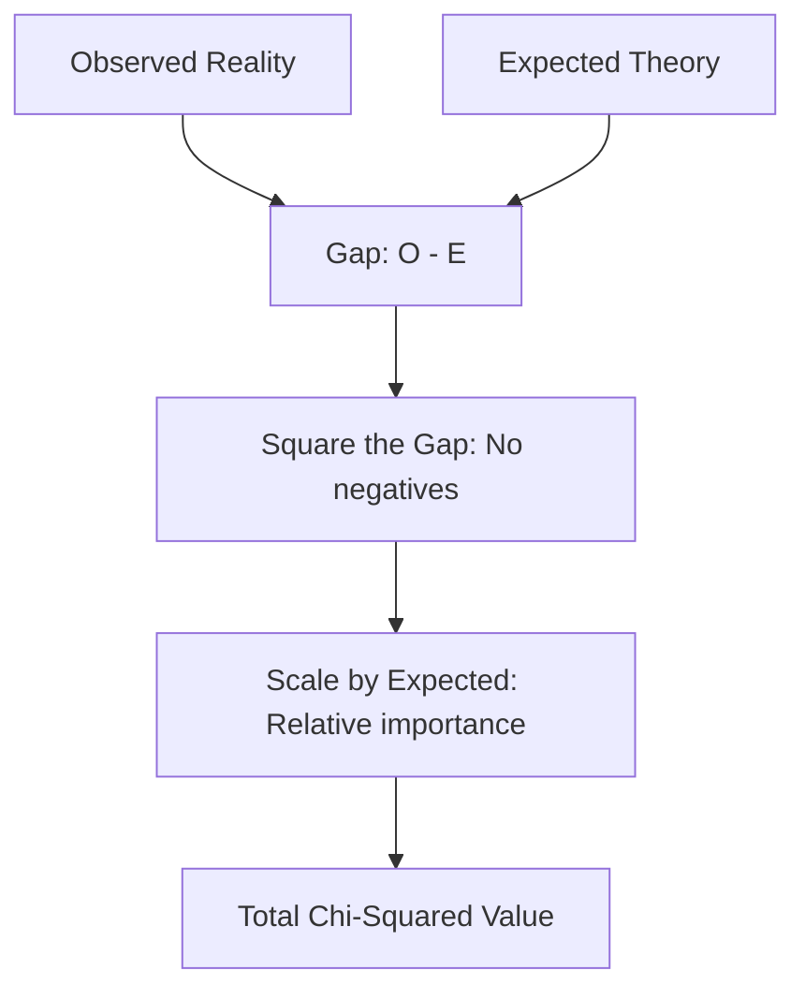

# CH-34 — Chi Distribution & Degrees of Freedom

## 1. Intuition-First Explanation
How do you "measure" the difference between categories? 

If you roll a die 60 times, you expect each number to come up 10 times. But what if you see '6' twenty times? Is the die "broken" or just lucky? You can't use a T-test here because the outcomes are categories (1, 2, 3, 4, 5, 6), not a continuous measurement.

The **Chi-Squared ($\chi^2$) Distribution** is the math of **Squared Deviations**. It measures the gap between what you *observed* and what you *expected*. Because we square the gaps, the value is always positive. The larger the $\chi^2$ value, the more "suspicious" the difference between your categories becomes.

## 2. Mathematical Derivations
### The Chi-Squared Statistic
$$\chi^2 = \sum \frac{(O_i - E_i)^2}{E_i}$$
Where:
*   $O_i$ is the Observed frequency in category $i$.
*   $E_i$ is the Expected frequency in category $i$.

### The Distribution
The Chi-Squared distribution is actually the sum of squared standard normal variables ($Z^2$). If you take $k$ independent $Z$ variables and square them, their sum follows a $\chi^2$ distribution with $k$ degrees of freedom.

### Degrees of Freedom ($df$)
For a "Goodness of Fit" test:
$$df = \text{number of categories} - 1$$
For a "Test of Independence" (Table):
$$df = (\text{rows} - 1) \times (\text{columns} - 1)$$

## 3. Visual Mental Models
Think of a **Heat Map of Mismatches**.



The Chi-Squared distribution is always **right-skewed**. As $df$ increases, it becomes more symmetric and eventually looks Normal (another CLT victory!).

## 4. Coding Implementation
Visualizing the Chi-Squared distribution for different $df$.

```python
import numpy as np
import matplotlib.pyplot as plt
from scipy.stats import chi2

x = np.linspace(0, 20, 1000)

plt.figure(figsize=(10, 6))
plt.plot(x, chi2.pdf(x, df=2), label='df=2')
plt.plot(x, chi2.pdf(x, df=5), label='df=5')
plt.plot(x, chi2.pdf(x, df=10), label='df=10')

plt.title("The shape of Chi-Squared changes with df")
plt.xlabel("Chi-Squared Value")
plt.ylabel("Probability Density")
plt.legend()
plt.show()
```

## 5. Solved Examples
**Problem:** You expect a 50/50 split of male/female users. You observe 60 males and 40 females. Calculate the $\chi^2$ statistic.
**Solution:**
1.  Expected ($E$): 50 males, 50 females.
2.  $\chi^2 = \frac{(60-50)^2}{50} + \frac{(40-50)^2}{50}$
3.  $\chi^2 = \frac{100}{50} + \frac{100}{50} = 2 + 2 = \mathbf{4.0}$.
4.  $df = 2 - 1 = 1$. (A $\chi^2$ of 4.0 with $df=1$ corresponds to $p \approx 0.045$, which is significant at $\alpha=0.05$).

## 6. Interview Questions
1.  **What does a Chi-Squared value of 0 mean?**
    *   *Answer:* It means your observed data perfectly matches your expected model. There is zero difference.
2.  **Why do we divide by $E_i$ in the formula?**
    *   *Answer:* To normalize the scale. A difference of 10 is huge if you only expected 5 items, but tiny if you expected 1,000,000 items. Dividing by $E_i$ puts the "surprise" into relative terms.

## 7. Practice Questions
1.  If you have a $3\times3$ contingency table, what are the degrees of freedom?
2.  Is the Chi-Squared distribution ever negative? Why?

## 8. Challenge Problems
**The Relationship to Normal:** Prove that if $Z \sim N(0,1)$, then $Z^2 \sim \chi^2(1)$. (Hint: Use the CDF method for transformation of variables).

## 9. Common Mistakes
*   **Low Expected Frequencies:** The Chi-Squared test is unreliable if any expected frequency $E_i$ is less than 5. In that case, use **Fisher's Exact Test**.
*   **Using Percentages:** You **must** use raw counts (frequencies) in the formula, not percentages or ratios.

## 10. Revision Notes
*   **Categories, not Numbers.**
*   **Formula:** $\sum (O-E)^2 / E$.
*   **df:** $n - 1$.
*   **Right-skewed.**

## 11. Analytics Applications
*   **Recommendation Systems:** Checking if the distribution of recommended genres matches the user's historical preference distribution.
*   **Data Quality:** Identifying "Benford's Law" violations (checking if the first digits of financial data follow the expected distribution).
*   **A/B/n Testing:** When you have 5 different variants and want to see if the distribution of "Conversion vs Bounce" is independent of the variant chosen.
