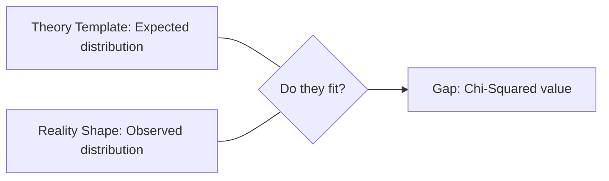

# CH-35 — Goodness of Fit Testing

## 1. Intuition-First Explanation
"Does reality match the theory?"

The **Goodness of Fit** test is used to determine if a set of observed categorical data matches a specific theoretical distribution. 

Imagine you own a casino and suspect a roulette wheel is rigged. You expect each of the 38 numbers to come up exactly 1/38th of the time. You record 1,000 spins. The Goodness of Fit test will calculate exactly how likely your observed results are if the wheel were truly fair. It's the ultimate "BS-detector" for categorical data.

## 2. Mathematical Derivations
### The Hypotheses
*   $H_0$: The data follows the specified distribution (e.g., "The die is fair").
*   $H_a$: The data does **not** follow the specified distribution.

### Calculation Steps
1.  **Collect Observed Counts ($O_i$):** Raw frequency of each category.
2.  **Calculate Expected Counts ($E_i$):** Total $n \times P(\text{category}_i)$.
3.  **Calculate $\chi^2$ Statistic:** $\sum \frac{(O_i - E_i)^2}{E_i}$.
4.  **Determine P-value:** Use the $\chi^2$ distribution with $df = k - 1$ (where $k$ is the number of categories).

### Requirement: Independent Trials
Each observation must be independent of the others. You can't use this test if one person provides multiple data points that are linked (e.g., "Favorite color" and "Second favorite color" from the same person).

## 3. Visual Mental Models
Think of **fitting a puzzle piece**.



If the "Gap" is small, the puzzle piece fits, and we Fail to Reject the Null. If the "Gap" is large and jagged, the piece doesn't fit, and we Reject the Null—the reality does not match the theory.

## 4. Coding Implementation
Testing if a 6-sided die is fair.

```python
import numpy as np
from scipy import stats

# 1. Observed counts after 60 rolls
# We expect 10 for each side [1, 2, 3, 4, 5, 6]
observed = [8, 12, 11, 9, 7, 13]
expected = [10, 10, 10, 10, 10, 10]

# 2. Perform Goodness of Fit Test
chi_stat, p_value = stats.chisquare(f_obs=observed, f_exp=expected)

print(f"Chi-Squared Statistic: {chi_stat:.4f}")
print(f"P-Value: {p_value:.4f}")

# 3. Decision
if p_value < 0.05:
    print("Conclusion: Reject H0. The die is likely unfair.")
else:
    print("Conclusion: Fail to Reject H0. The die appears fair.")
```

## 5. Solved Examples
**Problem:** A city's population is 30% Gen Z, 40% Millennials, and 30% Boomers. You survey 100 people and find 25 Gen Z, 45 Millennials, and 30 Boomers. Does your sample represent the city at $\alpha=0.05$?
**Solution:**
1.  **Expected:** 30, 40, 30.
2.  **$\chi^2$:** $\frac{(25-30)^2}{30} + \frac{(45-40)^2}{40} + \frac{(30-30)^2}{30} = \frac{25}{30} + \frac{25}{40} + 0 \approx 0.833 + 0.625 = \mathbf{1.458}$.
3.  **df:** $3 - 1 = 2$.
4.  **P-value:** For $\chi^2 = 1.458$ and $df=2$, $p \approx 0.48$.
5.  **Conclusion:** $0.48 > 0.05$, **Fail to Reject $H_0$**. The sample is a good representation.

## 6. Interview Questions
1.  **What is the "Null Hypothesis" in a Goodness of Fit test?**
    *   *Answer:* The Null Hypothesis is that there is no significant difference between the observed frequencies and the expected frequencies (i.e., the data fits the model).
2.  **Can you use a Chi-Squared test for a continuous variable like Height?**
    *   *Answer:* Not directly. You would first need to "bin" the continuous data into categories (e.g., 150-160cm, 160-170cm, etc.) to create a frequency table.

## 7. Practice Questions
1.  Calculate the degrees of freedom for a Goodness of Fit test with 10 categories.
2.  What happens to the Chi-Squared statistic if you double both the observed and expected counts?

## 8. Challenge Problems
**The Power of Large Samples:** If you have 1 Million data points, even a tiny, unimportant difference from the expected distribution will become "statistically significant" ($p < 0.05$). How do you differentiate between a "Bad Model" and a "Tiny but Significant Deviation"? (Look up **Effect Size for Chi-Squared: Cramer's V**).

## 9. Common Mistakes
*   **Assuming the Expected is always "Equal":** Thinking $E_i$ must be the same for all categories. $E_i$ can be anything, as long as they sum to the total $n$.
*   **Ignoring the "No Categories < 5" rule:** Running the test when your expected counts are too small, leading to an inflated and unreliable $\chi^2$ value.

## 10. Revision Notes
*   **Goodness of Fit:** One sample vs One theory.
*   **df:** Categories - 1.
*   **Counts only:** No percentages.
*   **Unfairness detector.**

## 11. Analytics Applications
*   **Algorithm Fairness:** Testing if a resume-screening AI selects candidates from different demographic groups in the same proportion as they appear in the applicant pool.
*   **Genetic Testing:** Comparing observed offspring traits to the expected Mendelian ratios (e.g., 3:1).
*   **Marketing Strategy:** Testing if the day-of-the-week traffic distribution has changed after a major ad campaign.
*   **Inventory Management:** Checking if the distribution of product sizes sold (S, M, L, XL) matches the inventory stock levels.
