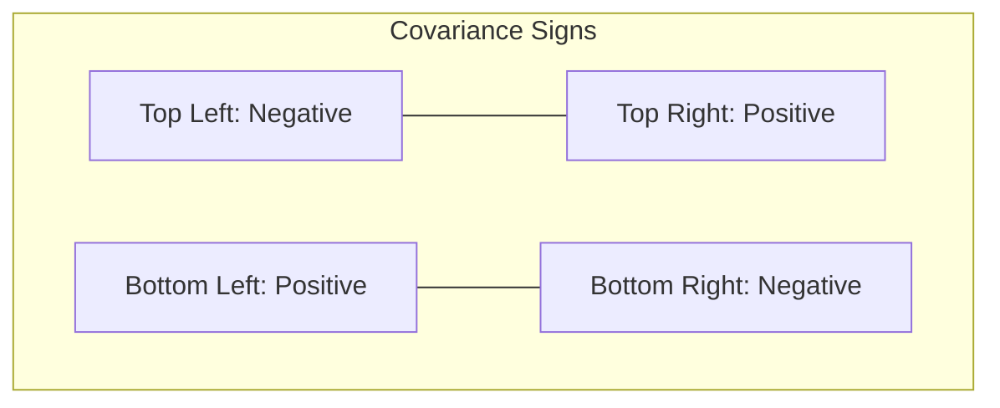

# CH-36 — Covariance

## 1. Intuition-First Explanation
Up until now, we've mostly looked at one variable at a time (e.g., Height). But what happens when we look at two variables together (e.g., Height and Weight)?

**Covariance** measures how two variables "move together."
*   If you are taller, are you usually heavier? If yes, Height and Weight have **Positive Covariance**.
*   If you increase the price of a product, do sales usually drop? If yes, Price and Sales have **Negative Covariance**.
*   If shoe size has nothing to do with IQ, they have **Zero Covariance**.

Covariance is the mathematical foundation for understanding relationships in data.

## 2. Mathematical Derivations
Remember the formula for Variance ($Var(X)$)? It was the average of $(X - \bar{x})^2$, which is just $(X - \bar{x})(X - \bar{x})$.

Covariance ($Cov(X, Y)$) just swaps one $X$ for a $Y$:
$$Cov(X, Y) = \frac{\sum_{i=1}^{n} (x_i - \bar{x})(y_i - \bar{y})}{n-1}$$

*   If $X$ is above its mean *and* $Y$ is above its mean, the product is **Positive**.
*   If $X$ is below its mean *and* $Y$ is below its mean, the product (negative $\times$ negative) is **Positive**.
*   If one is above and the other is below, the product is **Negative**.

Summing these up tells you the overall "directional trend."

## 3. Visual Mental Models
Think of a **Scatter Plot with Four Quadrants** (centered on the means of X and Y).



If most of your data points fall in the Top-Right and Bottom-Left, the variables move together (Positive Covariance). If they fall in the Top-Left and Bottom-Right, they move oppositely (Negative Covariance).

## 4. Coding Implementation
Calculating covariance using NumPy.

```python
import numpy as np

# Marketing Spend vs Revenue
spend = [100, 200, 300, 400, 500]
revenue = [150, 300, 280, 550, 600]

# np.cov returns a Covariance Matrix
cov_matrix = np.cov(spend, revenue)

print("Covariance Matrix:")
print(cov_matrix)

# The off-diagonal element is the Cov(X, Y)
cov_xy = cov_matrix[0, 1]
print(f"\nCovariance(Spend, Revenue): {cov_xy:.2f}")

if cov_xy > 0:
    print("Direction: Positive (As Spend increases, Revenue tends to increase)")
```

## 5. Solved Examples
**Problem:** Given data points $(X,Y)$: (1, 2), (2, 4), (3, 6). Calculate the Covariance.
**Solution:**
1.  Means: $\bar{x} = 2$, $\bar{y} = 4$.
2.  Deviations X: $(-1, 0, 1)$.
3.  Deviations Y: $(-2, 0, 2)$.
4.  Products: $(-1 \times -2) = 2, (0 \times 0) = 0, (1 \times 2) = 2$.
5.  Sum of Products = 4.
6.  $Cov = 4 / (3-1) = 4 / 2 = \mathbf{2.0}$. (Positive).

## 6. Interview Questions
1.  **What is a Covariance Matrix?**
    *   *Answer:* It's a grid showing the covariance between every pair of variables in a dataset. The diagonal elements show the Variance of each individual variable ($Cov(X, X) = Var(X)$).
2.  **What is the main limitation of Covariance?**
    *   *Answer:* It is heavily dependent on the **scale** (units) of the variables. A covariance of 1,000 might sound big, but if the variables are measured in millimeters, the actual relationship might be very weak. This is why we need Correlation.

## 7. Practice Questions
1.  If $X$ and $Y$ are completely independent, what is their expected covariance?
2.  If you convert $X$ from meters to centimeters (multiply by 100), what happens to $Cov(X, Y)$?

## 8. Challenge Problems
**Portfolio Variance:** In finance, the variance (risk) of a portfolio containing two stocks ($A$ and $B$) is not just $Var(A) + Var(B)$. It is $Var(A) + Var(B) + 2 \times Cov(A, B)$. Why does a negative covariance between two stocks make the portfolio *less* risky?

## 9. Common Mistakes
*   **Confusing Zero Covariance with "No Relationship":** Covariance only measures *linear* relationships. $X$ and $Y$ could have a perfect U-shape (quadratic) relationship, but their Covariance would be 0.
*   **Interpreting the Magnitude:** Assuming a covariance of 500 is "stronger" than a covariance of 5. You cannot compare magnitudes across different datasets without standardizing them first.

## 10. Revision Notes
*   **Covariance:** Direction of the relationship.
*   **Positive:** Move together.
*   **Negative:** Move opposite.
*   **Zero:** No linear relationship.
*   **Scale-dependent:** Magnitude is hard to interpret.

## 11. Analytics Applications
*   **Financial Diversification:** Investors look for assets with **Negative Covariance**. If tech stocks go down, but gold goes up, holding both reduces your overall risk.
*   **Dimensionality Reduction (PCA):** Principal Component Analysis (a core ML technique) works by calculating the Covariance Matrix of all features and finding the "directions" where the variance is highest.
*   **Genetics:** Understanding how the expression of one gene co-varies with another to identify biological pathways.
