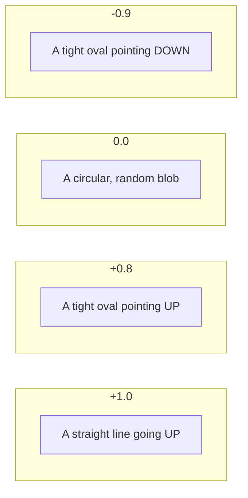

# CH-37 — Correlation

## 1. Intuition-First Explanation
Covariance (CH-36) tells you the *direction* of a relationship (positive or negative). But its size is meaningless because it depends on the units (e.g., dollars vs pennies).

**Correlation** fixes this. It is a **standardized** version of covariance. It squashes the relationship onto a fixed scale from $-1$ to $+1$.
*   **$+1$:** Perfect positive linear relationship (If $X$ goes up, $Y$ goes up in lockstep).
*   **$-1$:** Perfect negative linear relationship (If $X$ goes up, $Y$ goes down in lockstep).
*   **$0$:** No linear relationship (Random scatter).

Correlation tells you both the **Direction** (the sign) and the **Strength** (the magnitude) of the relationship.

## 2. Mathematical Derivations
The most common type of correlation is the **Pearson Correlation Coefficient ($r$ or $\rho$)**.

To get rid of the units, we divide the Covariance of $X$ and $Y$ by the product of their individual Standard Deviations.

$$r = \frac{Cov(X, Y)}{s_x s_y}$$
$$r = \frac{\sum (x_i - \bar{x})(y_i - \bar{y})}{\sqrt{\sum (x_i - \bar{x})^2} \sqrt{\sum (y_i - \bar{y})^2}}$$

### R-Squared ($r^2$)
If you square the correlation coefficient, you get the **Coefficient of Determination** ($R^2$). This tells you the *percentage of variance* in $Y$ that can be explained by $X$. (e.g., If $r=0.8$, then $R^2 = 0.64$. This means 64% of the variation in weight can be explained by height).

## 3. Visual Mental Models
Think of a **Cloud of Points**.



The tighter the points hug a straight line, the closer the correlation is to $\pm 1$.

## 4. Coding Implementation
Calculating and visualizing a correlation matrix using `pandas` and `seaborn` (conceptually).

```python
import numpy as np
import pandas as pd

# Creating a dataset with three variables
# Age, Income (highly correlated with Age), and Shoe Size (random)
np.random.seed(42)
age = np.random.randint(20, 60, 100)
income = age * 1000 + np.random.normal(0, 5000, 100) # Strong positive
shoe_size = np.random.normal(9, 1, 100) # No correlation

df = pd.DataFrame({'Age': age, 'Income': income, 'Shoe_Size': shoe_size})

# Calculate the Correlation Matrix
corr_matrix = df.corr()

print("Correlation Matrix:")
print(corr_matrix.round(2))

# Extract specific correlation
r_age_income = corr_matrix.loc['Age', 'Income']
print(f"\nCorrelation(Age, Income): {r_age_income:.2f} (Strong Positive)")
```

## 5. Solved Examples
**Problem:** $Cov(X, Y) = 50$. The standard deviation of $X$ is 10, and the standard deviation of $Y$ is 8. What is the correlation?
**Solution:**
1.  $r = \frac{Cov(X, Y)}{s_x s_y}$
2.  $r = \frac{50}{10 \times 8} = \frac{50}{80} = \mathbf{0.625}$.
This indicates a moderate-to-strong positive linear relationship.

## 6. Interview Questions
1.  **What does "Correlation does not imply Causation" mean?**
    *   *Answer:* Just because two variables move together doesn't mean one causes the other. Ice cream sales and shark attacks are highly correlated (they both peak in summer), but ice cream doesn't cause shark attacks. The "summer heat" is a hidden **confounder**.
2.  **Can the correlation coefficient be greater than 1?**
    *   *Answer:* No. Mathematically, it is bounded between -1 and +1 by the Cauchy-Schwarz inequality.

## 7. Practice Questions
1.  If $r = -0.95$, is the relationship weak or strong?
2.  If $X$ and $Y$ have a perfect circle shape in a scatter plot, what is their Pearson correlation?

## 8. Challenge Problems
**Anscombe's Quartet:** There are four famous datasets that have the exact same mean, variance, and correlation ($r \approx 0.816$), but when graphed, they look completely different (one is a line, one is a curve, one has a massive outlier). What does this teach us about relying purely on the $r$ statistic without plotting the data?

## 9. Common Mistakes
*   **Assuming 0 Correlation means No Relationship:** Pearson correlation only detects *linear* (straight line) relationships. If $Y = X^2$ (a U-shape), $r$ will be 0, even though the relationship is perfect.
*   **Outlier Sensitivity:** A single extreme outlier can artificially inflate or destroy a Pearson correlation.

## 10. Revision Notes
*   **Standardized:** Always between -1 and 1.
*   **Direction:** Sign (+/-).
*   **Strength:** Distance from 0.
*   **Linear only:** Fails on curves.
*   **Not Causation.**

## 11. Analytics Applications
*   **Feature Selection in ML:** Before building a predictive model, engineers calculate a correlation matrix to drop features that are highly correlated with each other (Multicollinearity) to simplify the model.
*   **Marketing:** Correlating "Email Open Rates" with "Lifetime Value" to see if engagement actually drives long-term revenue.
*   **Product Analytics:** If "Time spent on page" has a negative correlation with "Purchase Rate," the page might be confusing users rather than engaging them.
