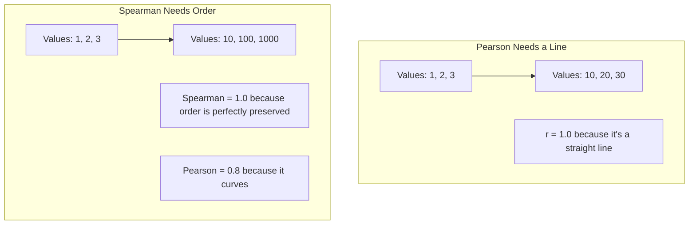

# CH-38 — Pearson vs Spearman Correlation

## 1. Intuition-First Explanation
What if your data isn't a straight line? What if it's an exponential curve? Or what if your data is "Ranked" (e.g., 1st place, 2nd place) rather than measured in exact units?

*   **Pearson Correlation:** Measures how well a **Straight Line** fits the data. It assumes the variables have a linear relationship and are normally distributed.
*   **Spearman Correlation:** Measures how well a **Monotonic Curve** fits the data. It doesn't care if the line is straight, only that "As X goes up, Y *always* goes up." It works by converting the raw data into **Ranks** before doing the math.

Spearman is the "Robust" alternative to Pearson. It ignores the exact scale and focuses purely on the *order* of the data.

## 2. Mathematical Derivations
### Spearman Rank Correlation ($\rho_s$)
1.  Take your raw $X$ and $Y$ data.
2.  Convert $X$ into ranks (1st smallest, 2nd smallest, etc.). Call this $R(X)$.
3.  Convert $Y$ into ranks. Call this $R(Y)$.
4.  Run the standard Pearson formula on the *Ranks* instead of the raw data.

A simplified formula (if there are no tied ranks):
$$\rho_s = 1 - \frac{6 \sum d_i^2}{n(n^2 - 1)}$$
Where $d_i = R(X_i) - R(Y_i)$ is the difference in ranks for each pair.

## 3. Visual Mental Models


If the relationship is exponential ($Y = e^X$), Pearson will be less than 1, but Spearman will be exactly 1, because the ranks never cross each other.

## 4. Coding Implementation
Comparing Pearson and Spearman on exponential data with an outlier.

```python
import numpy as np
import pandas as pd
from scipy.stats import pearsonr, spearmanr

# Exponential data
x = np.arange(1, 20)
y = np.exp(x/4) # Non-linear relationship

# Add a massive outlier
x = np.append(x, 21)
y = np.append(y, 10000)

p_corr, _ = pearsonr(x, y)
s_corr, _ = spearmanr(x, y)

print(f"Pearson Correlation (Linear): {p_corr:.3f}")
print(f"Spearman Correlation (Rank): {s_corr:.3f}")
print("\nConclusion: Spearman is much more robust to the non-linear curve and the massive outlier.")
```

## 5. Solved Examples
**Problem:** You have data: $X = [1, 2, 300]$, $Y = [10, 20, 30]$.
**Solution:**
1.  The relationship is strictly increasing, so **Spearman = 1.0**.
2.  Because $X=300$ is a massive leap compared to $Y=30$, a straight line will fit poorly, so **Pearson < 1.0**.

## 6. Interview Questions
1.  **When should you use Spearman instead of Pearson?**
    *   *Answer:* Use Spearman when the data is not normally distributed, when there are extreme outliers, when the relationship is non-linear but monotonic, or when the data is ordinal (e.g., Star Ratings from 1 to 5).
2.  **What does a monotonic relationship mean?**
    *   *Answer:* It means the trend only goes in one direction. It never reverses. It goes up and stays up, or goes down and stays down.

## 7. Practice Questions
1.  If $Y = X^3$ for positive values of X, what is the Spearman correlation?
2.  Will an extreme outlier affect Pearson or Spearman more?

## 8. Challenge Problems
**Kendall's Tau ($\tau$):** There is a third type of correlation called Kendall Rank Correlation. It counts "Concordant" and "Discordant" pairs. When is Kendall preferred over Spearman? (Hint: It relates to small sample sizes and tied ranks).

## 9. Common Mistakes
*   **Defaulting to Pearson:** Most software (`df.corr()`) defaults to Pearson. If you have survey data (1-10 scales), you should explicitly ask for Spearman (`df.corr(method='spearman')`).
*   **Assuming Spearman fixes "U-shapes":** Spearman fixes curves, but it does *not* fix U-shapes. If data goes down then up, both Pearson and Spearman will be close to 0.

## 10. Revision Notes
*   **Pearson:** Linear, sensitive to outliers, raw values.
*   **Spearman:** Monotonic, robust to outliers, uses Ranks.
*   Both are bounded between $-1$ and $+1$.

## 11. Analytics Applications
*   **Recommendation Systems:** Evaluating a ranking algorithm. If the algorithm ranks an item #1, did the user also rank it #1? We use Spearman to measure the "Ranking Quality."
*   **Survey Analytics:** Analyzing Likert scales (e.g., "On a scale of 1-5, how satisfied are you?"). These numbers aren't "real" distances (the gap between 4 and 5 isn't necessarily the same as 1 and 2), so we use rank-based Spearman.
*   **Financial Metrics:** Analyzing the correlation between market cap rank and revenue rank across thousands of companies, avoiding the distortion of trillion-dollar outliers like Apple or Microsoft.
