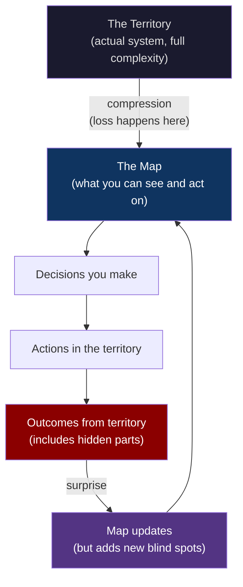
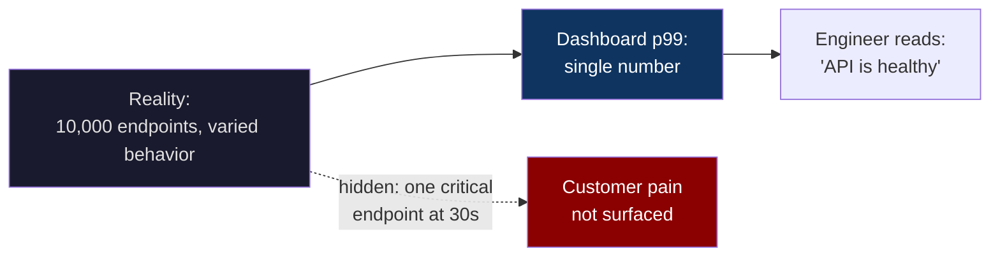
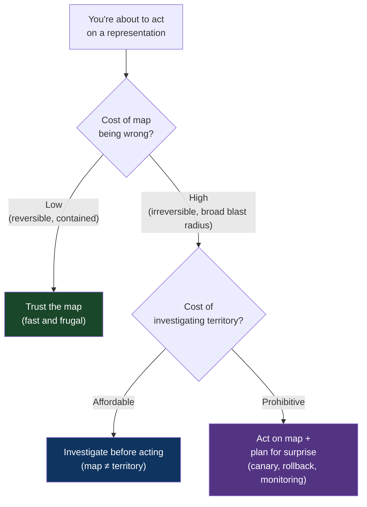

# CH-01: The Map Is Not the Territory
### *Why your most trusted diagram is the thing most likely to deceive you*

> **Part 1 of 5 · Seeing the Problem Before You Solve It**
> **Model Type:** `perception`

---

## The Misread

A senior infrastructure engineer at a growing fintech walks into a Friday afternoon incident review with a printed architecture diagram. The diagram is good — color-coded, shows every service, every queue, every database. The CEO has it pinned in his office. The team built it together over a quarter; everyone signed off.

Tuesday's outage took ninety-four minutes. The trigger was a config change to a service that, according to the diagram, owned its own user-state table and depended on nothing downstream. The blast radius, by the diagram, should have been one screen for a small fraction of users.

The actual blast radius was the entire checkout flow.

The engineer walks the room through the postmortem. The config change had altered a feature flag value. The flag was read at boot by an old library — three versions behind, deprecated, still in use — that cached the value in a process-local map and shared the map across requests via a singleton that the original author had quietly used in a sister service for "performance reasons." That sister service was the checkout service. None of this was on the diagram. None of this was on *anyone's* diagram. The dependency had no name, no entry in the service catalog, no owner. It existed only in the running binary.

The team's instinct is to update the diagram. Add the dependency. Add a check. The engineer agrees but pauses. Because the same thing happened eighteen months ago with a different invisible dependency. And eight months before that with a third. Each time the response was: update the diagram. Each time the next failure came from somewhere the updated diagram didn't show.

The diagram is not the bug. The diagram is doing exactly what diagrams do.

## The Blind Spot

The brain conflates *legibility* with *truth*. When we can see something clearly — a clean diagram, a tidy mental model, a structured plan — we feel we understand it. The clarity of the representation transfers, illicitly, to the represented thing. This wiring is not a flaw; it is what made cognition possible. Brains that treated every representation with the same skepticism as raw sensory data would never finish thinking. We had to evolve to trust our maps because we had to act, and we had to act faster than first-principles reasoning would allow.

The cost is that we lose the ability, at the moment of action, to remember that the map was always a compression. The lossiness is the *point* of the map — a one-to-one map is just the territory again, useless. But the lossy parts are exactly where reality bites, because reality contains the parts we threw away.

## The Model, Precisely

**Map ≠ Territory.**

Every model, diagram, dashboard, document, or mental representation is a *lossy compression* of the reality it describes. The compression is intentional — it makes the model usable — but it removes information. Reality will eventually surface that information through the gap, and you will be surprised. The skill is not building better maps; it is *remembering, in the moment of using a map, what kind of map it is and what it threw away.*

What this model lets you see that you couldn't see before: every artifact in your work — every diagram, every metric, every config file, every job description — is a lens with a built-in blind spot. The blind spot is not a defect to fix. It is structural. Your job is not to eliminate the blind spot. Your job is to *know where it is.*

Spatially, think of fog over a coastline. The map shows the coastline as a smooth line. The territory has rocks, currents, kelp beds, and a tide that changes the entire shape twice a day. You sail with the map. You also keep one hand on the keel and one ear on the depth sounder, because the map is silent about exactly the things that will sink you.

## Three Domains, One Model

### Domain 1: Engineering

A monitoring dashboard shows API latency at p99, p95, p50. The team treats "p99 latency is green" as "the API is healthy." But the dashboard aggregates across all endpoints. A specific endpoint — used by 0.3% of traffic but critical to enterprise customers — has been serving 30-second responses for a week. Nobody notices because the aggregate p99 is dominated by the 99.7% of requests that are fast. The map (the dashboard) was built to answer "is the API healthy in general?" and it answers that question correctly. The team's misuse was treating the answer to that question as the answer to "is any user being hurt?" — a different question that requires a different map.

The intervention is not "build a better dashboard." It is to ask, for every dashboard you trust: *what question was this built to answer, and what questions does it silently refuse to answer?*

### Domain 2: Organization

The org chart shows reporting lines. It's accurate. It's also useless as a map of how decisions actually get made. The real decision graph includes: who has lunch with whom, who was at the founding, who the CEO defers to without realizing, who has the institutional memory that makes them unfireable, which two managers privately decide architectural direction in Slack DMs. None of this is on the org chart. The org chart was built to answer "who is responsible for whom?" — which is a real question with a real answer. It does not answer "who actually decides things?" — which is a different question with a stranger answer.

New hires who treat the org chart as the decision map waste their first six months going through correct-but-irrelevant channels. Tenured employees who navigate the real graph make things happen and seem mysterious to the newcomers, who attribute it to politics or personality. It is neither. It is the difference between a map and a territory.

### Domain 3: Cartography Itself

The Mercator projection — the world map you grew up with — preserves angles, which made it useful for ocean navigation in 1569. It distorts area severely: Greenland appears the size of Africa, when Africa is actually fourteen times larger. For four hundred years, schoolchildren in the West learned global geography from a map optimized for a navigation use case nobody in their lives would ever have. The map's lie about size shaped how generations imagined the relative importance of regions. Colonial empires were not designed by the map, but the map made them imaginable in proportions that flattered them.

This is the deep version of the lesson: a map is a *tool*, and tools shape the user. The lossy compression of any model doesn't just hide things; it actively trains the user's intuition to weight things in the proportions the model presents. You become what your maps allow you to see.

## Where The Model Breaks

**The hidden assumption:** there is a territory distinguishable from the map. That assumption holds for physical systems, organizations, and most engineering. It does not always hold.

Consider pure mathematics. The statement "every even integer greater than two is the sum of two primes" (Goldbach's conjecture) refers to a territory that is itself entirely defined by a model — the model *is* the territory. There is no rocky coastline hiding behind the formal definition of "prime." For purely formal systems, the map is approximately complete by construction. Map–territory distinction loses force.

Consider also financial markets at certain moments. When enough participants act on the same model, the market starts to *behave according to the model*, because the model has become the territory's dominant causal force. This is reflexivity, in George Soros's sense. If everyone believes a stock will rise because their model says it will, it rises. The map briefly is the territory. Until it isn't, and the unwind is catastrophic.

There is also a softer failure: maps that are accurate enough to act on for all practical purposes. The London Underground map is famously not geographically accurate, but it is *correct for the purpose of riding the tube.* Insisting on map–territory skepticism here is overhead with no payoff. The map is good enough.

**The signal you're in the break zone:** when the cost of investigating the territory exceeds the worst-case cost of the map being wrong. When you're choosing which subway line to take, the map is the territory. When you're deciding what software to bet your company on for the next five years, it isn't.

## The Collision

**This model says:** distrust your representations; the unmapped is where you'll be hurt.
**Heuristics and biases as features (Gigerenzer, "fast and frugal" reasoning) says:** trust your reductions; in most decisions, the unmapped doesn't matter and the cost of investigating it dwarfs the cost of being slightly wrong.

The conflict is real. Map–territory says "the diagram is a lie." Heuristics says "the diagram is fine, ship it." Both are correct, in different territories. The mistake is applying one when you needed the other.

A specific scenario where they collide: a team is reviewing a deployment runbook. The runbook is a map. Map–territory thinking says: "this runbook is a representation; the real deploy has variations the runbook doesn't capture; we must walk every step assuming reality differs." Fast-and-frugal says: "this runbook has worked 400 times; the cost of treating every deploy as a research project is enormous; just run it."

**The meta-skill:** decide *consciously* which mode you're in. The failure is not picking wrong; the failure is not noticing you picked. Most outages have a moment where someone treated a map as the territory because they didn't pause to check which mode they were in. Most decision paralysis has a moment where someone treated a routine action as a research problem for the same reason.

## The Retrofit

**Event:** The 2010 Flash Crash. On May 6, 2010, the Dow Jones dropped 9% in minutes and recovered most of it within an hour, evaporating nearly a trillion dollars of paper value in the interval. The SEC's report eventually identified a large algorithmic sell order by a single mutual fund as the trigger, but the trigger only explains the spark; the explosion required the conditions.

Re-reading through the map–territory lens: every algorithmic trader in the market was operating on a model of the market that included assumptions about liquidity — specifically, that there would be a buyer at some price for any sell order, because there always had been. This assumption was so deep in the models that it was not even stated as an assumption. It was baked into the structure of "this is how markets work."

The territory, briefly, did not contain that property. When enough algorithms began selling at once, the market-makers' algorithms — which had pulled back, by their own protective logic — left the order book briefly empty. There was, momentarily, no buyer at any price. The maps did not contain this state. The maps did not contain the *concept* of this state. So the algorithms continued executing strategies that assumed liquidity, draining the territory further. The feedback loop ran in microseconds and humans noticed when prices had already collapsed.

**What was invisible:** the assumption of liquidity was not a parameter the algorithms read from the market. It was a property the algorithms inherited from the models they were built on. It was a part of the map that the modelers had not noticed was a part of the map, because the territory had reliably provided it for decades.

**The intervention point:** if any actor had been holding the map–territory distinction consciously — and asking "what does my model assume about the market that is currently true but is not guaranteed by anything?" — they would have flagged liquidity as a single point of failure. The SEC's post-crash interventions (circuit breakers that pause trading when prices move too fast) are essentially admissions that the territory needed safeguards the maps didn't include. The market now has a manual override for the map being wrong.

## The Practice Rep

> **Duration:** 48 hours
> **What you're training:** noticing when you are reading from a map and treating it as the territory

**The exercise:**
For the next 48 hours, every time you reference a document, diagram, dashboard, runbook, ticket, or any other artifact at work — pause for ten seconds and name out loud (or in a notes app) *one specific thing this artifact is not showing you that could matter.*

Examples: "This dashboard isn't showing me per-customer latency." "This architecture diagram isn't showing me the cron job that depends on this table." "This PR description isn't showing me the assumption about deploy order." "This standup update isn't showing me whether the engineer is blocked emotionally vs technically."

**What to look for:**
The first day will feel mechanical and you'll generate weak observations. The second day, observations will start to surprise you — you'll find at least one thing where the unmapped territory is actually load-bearing for a decision you were about to make. That moment is the model running. When it surprises you, the lens is installed.

**The log:**
At the end of 48 hours, write one sentence: "I saw Map ≠ Territory at work when [the specific thing the artifact hid that mattered]."
