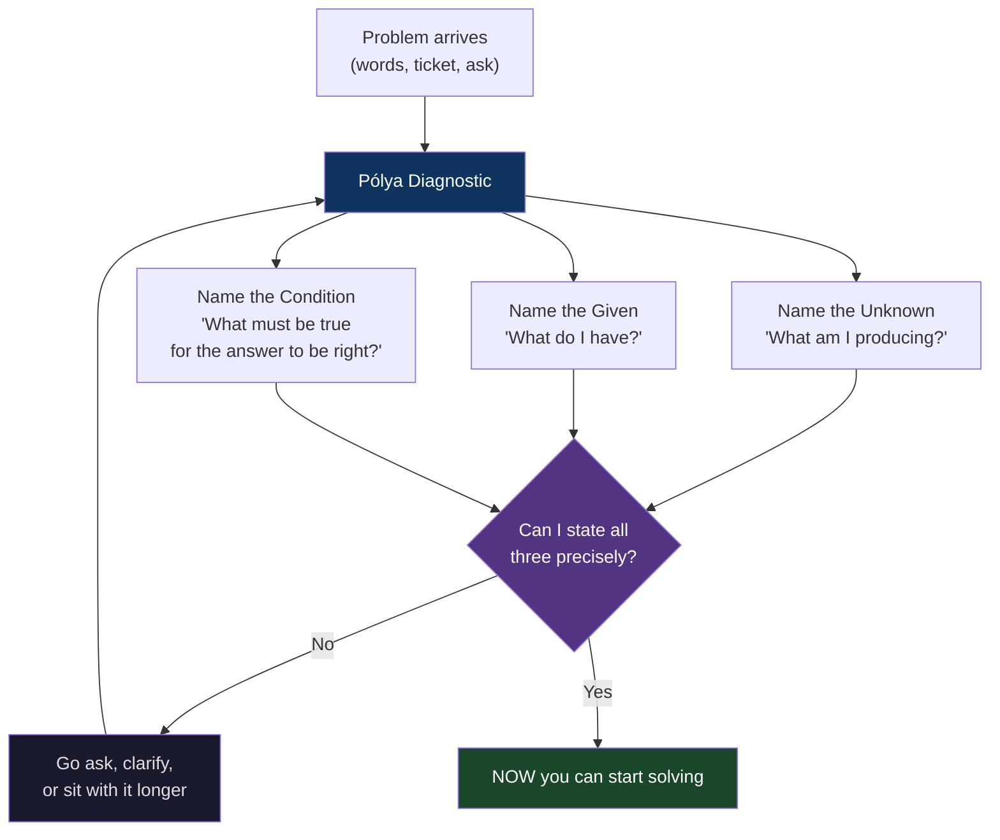
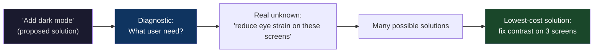
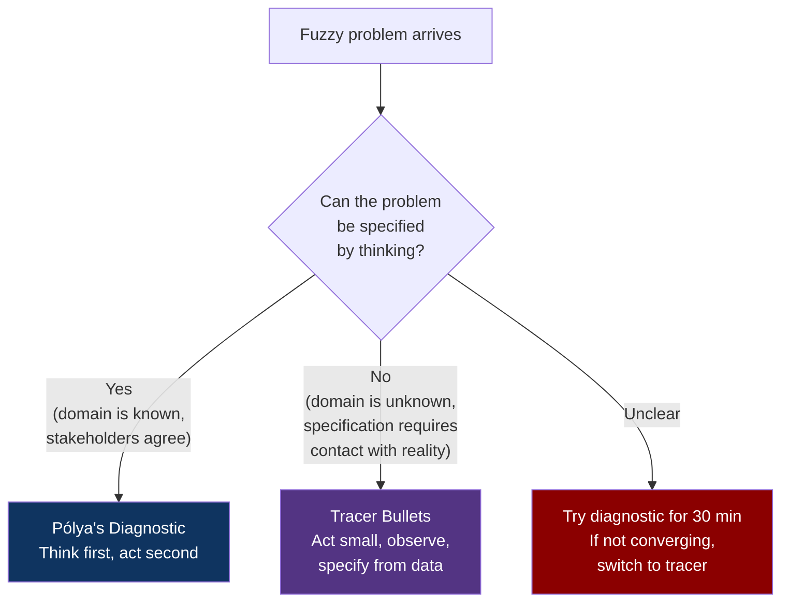

# CH-02: What Is the Unknown?
### *The diagnostic step everyone skips because it doesn't feel like work*

> **Part 1 of 5 · Seeing the Problem Before You Solve It**
> **Model Type:** `meta`

---

## The Misread

A junior engineer is handed a ticket: *"Speed up the search page."*

She reads it once. She knows the search page. She opens the codebase, profiles the page, finds that a database query is taking 800ms, identifies a missing index, adds the index, sees the query drop to 40ms, ships the change. End-to-end: three days, including review. She is proud. The ticket gets closed. Her manager nods approvingly in the next 1:1.

Two weeks later, the same ticket is reopened by a different stakeholder: *"Search is still slow."*

She is confused and slightly defensive. The query is 20x faster. She pulls up the dashboards to prove it. The dashboards confirm: the query is 40ms. She loops in the stakeholder and shows them the numbers. The stakeholder is patient. He says: "The page still takes four seconds to load."

It does. She measures end-to-end now. Four seconds. She had only ever measured the query. The four seconds were dominated by a frontend bundle that pulled in an unused 1.8MB JavaScript library, a synchronous analytics call, and a render path that waited for the user's profile image before painting anything. The database query she optimized was *fast enough already*. It had never been the problem. She had taken three days, gotten a code review, deployed to production — and improved nothing the user would ever notice.

The work was good. The code was clean. The PR was reviewed. The problem was never diagnosed.

## The Blind Spot

The brain treats *I understand the words in the prompt* as equivalent to *I understand the problem.* This is the most expensive shortcut in knowledge work, and it is invisible because the moment of skipping the diagnostic step *feels exactly like understanding.* You read the prompt, a plausible solution comes to mind immediately, the solution feels coherent, and you start executing.

The diagnostic step doesn't feel like work because it doesn't produce visible output. There is no commit, no code, no Slack message. There is only sitting with a question for an uncomfortable amount of time, asking it from different angles, refusing to start until you can state what success looks like with precision. Every brain in every culture is biased against this because it looks like procrastination from the outside and feels like anxiety from the inside. The fix is not motivation. The fix is a structured prompt that forces the diagnostic to happen on the page.

## The Model, Precisely

**Pólya's Diagnostic.** Before attempting to solve any problem, write down three things:

1. **What is the unknown?** What specific thing am I trying to determine, find, or change?
2. **What is given?** What information, constraints, or resources do I currently have?
3. **What is the condition?** What relationship must hold between the given and the unknown for the answer to be correct?

What this model makes visible: about half of the problems that arrive at you are *underspecified by the person who delivered them.* The diagnostic exposes this. The other half are specified correctly but the solver hasn't internalized the spec — the diagnostic exposes that too. In both cases, the diagnostic catches the misalignment *before* the work, when correcting is cheap, instead of *after*, when it requires reopening and redoing.

Spatially: a problem is a puzzle. The Unknown is the missing piece. The Given is the surrounding pieces you've already placed. The Condition is the shape of the missing piece's edges — what must match for it to fit. Most people start trying to push pieces into the puzzle before they've looked at the edges of the hole.

## Three Domains, One Model

### Domain 1: Engineering — Debugging

A bug report says: *"The user's avatar isn't showing up."*

A junior engineer reads this and starts checking the avatar service. A senior engineer pauses and runs the diagnostic.
- **Unknown:** Is the avatar (a) not being served, (b) being served but not received, (c) being received but not rendered, (d) being rendered but invisible due to CSS, or (e) being rendered correctly but the user is looking at the wrong place?
- **Given:** A user report, possibly the user's ID, possibly a timestamp, possibly a screenshot.
- **Condition:** A correct fix changes the user's experience such that the avatar appears where the user expects it, on the device they reported the issue from.

The diagnostic immediately reveals: the report doesn't even let us tell which of (a)–(e) is happening. Asking the user for a screenshot, or having them open dev tools, takes five minutes. Without it, the engineer could spend hours instrumenting the avatar service before discovering the issue was a CSS bug introduced last Thursday.

The diagnostic is the cheapest possible bug-fixing tool. It is also the most consistently skipped one.

### Domain 2: Organization — The Stakeholder Ask

A product manager sends a Slack message: *"Can we add a 'dark mode' toggle? Users are asking for it."*

Without the diagnostic, the engineer says yes, plans the work, builds the toggle, and finds out two months later that the actual problem was that the marketing landing page was unreadable against a screenshot of a competitor's product, which the PM had been comparing against, and "dark mode" was the shape of the solution she'd already half-decided on.

With the diagnostic:
- **Unknown:** What user need is "dark mode" trying to satisfy?
- **Given:** "Users are asking for it." How many? What did they actually say? Which segments?
- **Condition:** The right solution makes those users stop being unhappy in a way the PM can measure.

Asking the diagnostic out loud — "I want to make sure I'm building the right thing; can you tell me which users asked and what they said exactly?" — does not look like obstruction. It looks like care. It is care. It often turns "build dark mode" into "fix the contrast on three specific screens," which is a day of work instead of two months.

### Domain 3: Criminal Investigation

Sherlock Holmes' famous "Data, data, data! I cannot make bricks without clay" line is Pólya's diagnostic in literary form. In *The Adventure of the Copper Beeches*, Holmes refuses to theorize before he has the diagnostic facts: what is the unknown (what really happened), what is given (the client's report, the physical evidence, the prior history), what is the condition (the explanation must account for *all* the given facts, not just the dramatic ones).

What separates Holmes from the average detective in the stories is not raw intelligence. It is his refusal to start solving before the unknown, given, and condition are written down. Other characters leap to plausible theories — "the gypsy did it" — and then bend the evidence to fit. Holmes refuses. He holds the diagnostic open until the evidence forces the conclusion. The stories are essentially Pólya tutorials disguised as entertainment.

The same pattern shows up in real investigations: the most reliable failure mode in homicide investigation is anchoring on the first plausible suspect (a form of substitution we'll meet in CH-03). The countermeasure used by trained investigators is exactly the Pólya diagnostic, formalized as a checklist: name the question, name what you have, name what would have to be true for any given suspect to be the actual answer.

## Where The Model Breaks

**The hidden assumption:** the problem is sufficiently well-defined that "the unknown," "the given," and "the condition" each have a stateable answer.

This assumption fails for what Horst Rittel called **wicked problems** — problems where defining the problem is itself part of the problem, where the criteria for a correct solution can only be discovered by attempting solutions, and where each attempt changes the problem.

Examples: "Should our company pivot to enterprise?" There is no single Unknown. The Given changes as the market changes. The Condition is unstateable until you've already tried and seen what "success" looked like in practice. Pólya's diagnostic, run rigorously here, produces a frozen team that never decides anything.

Other examples: early product-market fit, organizational culture change, scientific research at the frontier. In each, the diagnostic step can become a procrastination engine — endless attempts to specify a problem that can only be specified retroactively, after you've done something.

The signal: you can't get past the Unknown step. You write five candidate Unknowns and each feels equally plausible. When this happens, the diagnostic is the wrong tool. You need to *act* — small, cheap, reversible — to generate information that will let you specify the problem later. (This is the entry point for CH-08 Wishful Thinking and the "tracer bullets" mentioned in the Collision below.)

**The signal you're in the break zone:** the diagnostic step takes more than thirty minutes and you're not converging. At that point, switch modes. Either escalate to someone who can decide the Unknown for you, or pick the smallest experiment that would reveal what the right Unknown is, and run that. Don't keep diagnosing.

## The Collision

**This model says:** never start solving until the problem is diagnosed.
**Tracer Bullets (Hunt & Thomas) says:** in unclear terrain, fire small live rounds at the suspected target as fast as you can, and let the trajectory teach you where the target is.

These are direct opposites in some situations. Pólya says: think first, act second. Tracer bullets says: act small, think *from* the action.

Specific scenario: you're prototyping a new internal tool, and you have a fuzzy sense of what it should do but no clarity on the priorities. Pólya's diagnostic says: sit with the stakeholders, write down the Unknown, refuse to code until it's clear. Tracer bullets says: build the ugliest possible version in two days, ship it to one user, see what they actually ask for.

**The meta-skill:** the deciding signal is whether the problem's *definition* lives inside your head or inside the world. If the definition is in your head and just needs to be made explicit — Pólya. If the definition is in the world and can only be discovered by poking the world — tracer. Most engineers default to whichever mode their personality prefers. The skill is forcing yourself, every time, to ask which mode the situation actually demands.

## The Retrofit

**Event:** The Mars Climate Orbiter, September 1999. A $327 million NASA spacecraft, after a nine-month journey, fired its main thruster to enter Mars orbit. It entered the Martian atmosphere at the wrong altitude and was destroyed.

The cause is famous: the spacecraft's navigation team at JPL used metric units (newtons) for thruster output. The contracted software from Lockheed Martin that calculated trajectory data used imperial units (pound-force). The numerical values flowed cleanly between systems. The interfaces all passed validation. The unit mismatch — a factor of 4.45 — was never explicit anywhere in the data exchange. Nobody had stated the Condition.

Re-reading through Pólya's diagnostic:
- **The Unknown:** the thruster impulse needed to enter Mars orbit at the correct altitude.
- **The Given:** thruster output values from the Lockheed software; the spacecraft's mass; the Martian gravitational field.
- **The Condition:** *all numerical values exchanged between systems must be in agreed units, and the units must be documented at the interface.*

The Condition was the part everyone assumed. The Condition was the part nobody wrote down. The Condition was the part that, written down, would have surfaced the discrepancy in a thirty-second review during the integration phase.

**What was invisible:** the entire diagnostic had a missing Condition. The teams had treated unit-consistency as a property of the world rather than a property they needed to verify. The system would have worked for any internally-consistent unit choice. It failed because the choice was not *jointly* made.

**The intervention point:** at any interface review during development, a checklist of "what must be true about the data crossing this boundary for the answer to be correct?" — Pólya's third question, applied to system integration — would have caught this. The post-mortem from NASA's investigation board essentially recommended exactly this. Aerospace integration reviews now include explicit unit verification as a first-class check. The model didn't have to be invented; it just had to be applied. It hadn't been applied, because nobody had treated the integration boundary as a place where the Condition needed to be explicit.

## The Practice Rep

> **Duration:** 48 hours
> **What you're training:** the discipline of writing down the Unknown, Given, and Condition before you start solving

**The exercise:**
For the next 48 hours, every task that takes more than 30 minutes of focused work begins with three sentences, written down (notes app, scratch file, post-it — any medium that requires you to *write them*, not just think them):

1. "Unknown: I am trying to determine / produce / change ____."
2. "Given: I have ____."
3. "Condition: The answer is correct when ____."

The Condition sentence is the one that matters most. It is also the one your brain will most want to skip. Force it.

**What to look for:**
At least once in the 48 hours, the Condition sentence will be the thing that stops you from doing the wrong work. You will write it down, look at it, and realize that what you were about to build doesn't satisfy it. That moment — the moment your fingers were already on the keyboard and you stopped — is the model running. The cost saved in that moment is the entire reason the diagnostic exists.

You may also experience the opposite: you'll write the three sentences and they'll be trivially obvious, and the diagnostic feels like overhead. That's fine. The cost of doing it when unneeded is seconds. The cost of skipping it when needed is days.

**The log:**
At the end of 48 hours, write one sentence: "I saw Pólya's Diagnostic at work when [the specific moment I avoided wrong work because the Condition was written down]."
