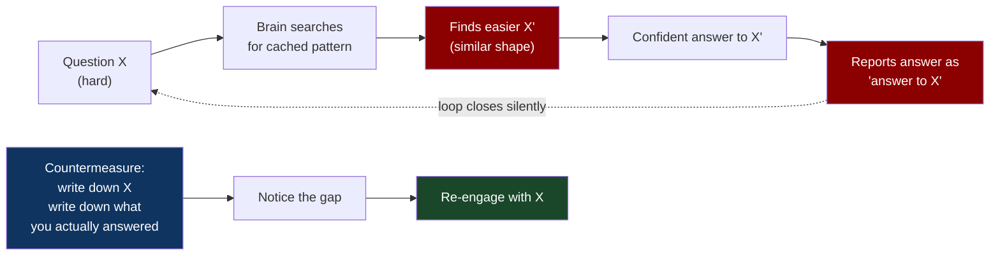
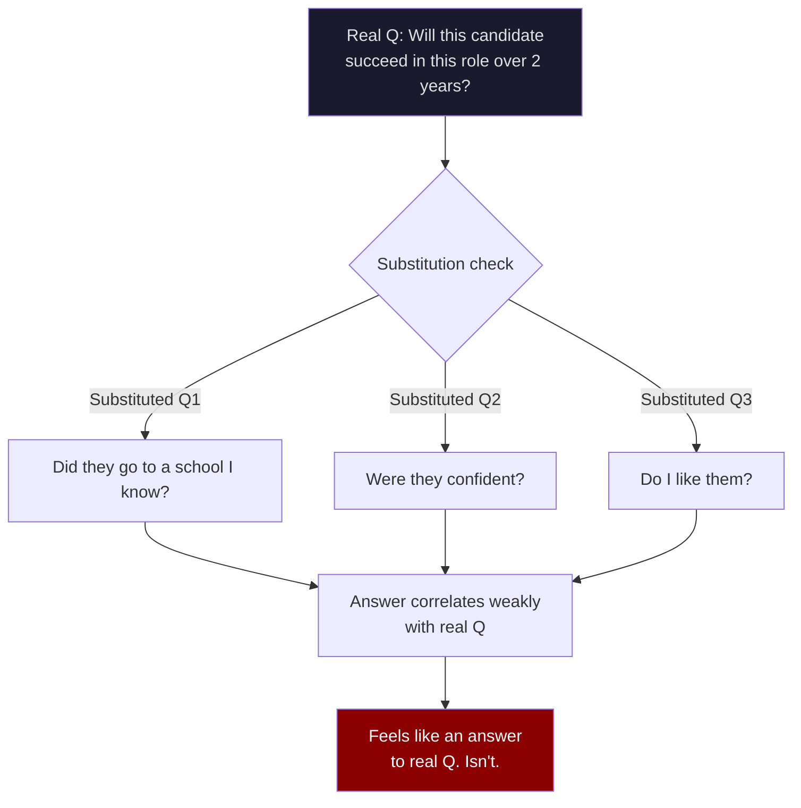
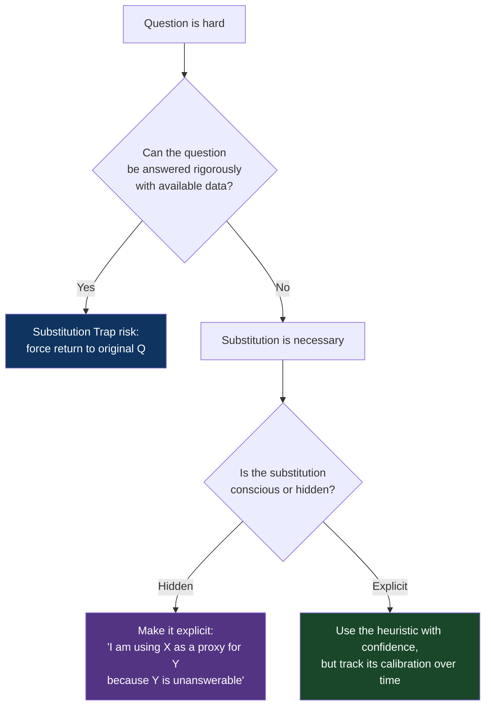

# CH-03: The Substitution Trap
### *Why you almost never answer the question you were actually asked*

> **Part 1 of 5 · Seeing the Problem Before You Solve It**
> **Model Type:** `perception`

---

## The Misread

A platform team is deciding whether to migrate their on-prem Kafka cluster to a managed cloud equivalent. They schedule a working session. Three senior engineers attend. The agenda item, written on the whiteboard, is: *"Should we move to managed Kafka?"*

Two hours later, the meeting ends with strong consensus. They will move to managed Kafka. The justifications, recorded in the minutes:
- "It's what the industry is doing."
- "Our SRE team is overworked and managed services reduce ops burden."
- "The CTO has indicated he wants more infrastructure to be cloud-managed."
- "The cost is comparable when you factor in our engineering time."

Each justification is reasonable. Each is also an answer to a slightly different question than the one on the whiteboard. The actual question — *should we move to managed Kafka?* — would require: comparing the specific failure modes of the two architectures against this team's specific workload, calculating the migration cost in calendar time and risk, modeling the price curve as data volume grows over 24 months, evaluating lock-in risk against the provider's pricing power, and stress-testing the assumption that the managed service's SLA will actually hold for *their* traffic shape.

None of that happened. The team did not lie to themselves. They did not skip the work because they were lazy. They believed, while talking, that they were answering the question on the board. They were answering, quietly and consistently, four different easier questions: *Is this the industry trend? Will this make our day easier? Will this please leadership? Is the headline price acceptable?* Each had a confident answer. The original question never received one.

Six months into the migration, the team encountered a workload-specific issue that none of the easier questions could have surfaced. The fix was expensive. In the retrospective, someone said, "We didn't really evaluate this, did we?" No one disagreed.

## The Blind Spot

Kahneman called this *attribute substitution.* When the brain encounters a hard question, it searches for an easier related question with a confident answer, answers the easier one, and reports the confident answer as if it were an answer to the hard one. The substitution happens *below the threshold of conscious awareness*. You do not catch yourself doing it because there is no moment of "I will now substitute." Your brain just produces an answer, and the answer feels like the answer to the question you were asked.

This is not stupidity; it is efficiency. The brain economizes by reusing whatever cached or accessible answer fits the shape. The economizing was adaptive in environments where being approximately right fast usually beat being precisely right slow. In knowledge work, where the question and the substituted question often have wildly different answers, the economizing becomes a structural bug.

The blind spot is the *invisibility of the swap*. You can detect a bias if you can name it. You cannot detect substitution unless you have a habit of asking, after answering: *was this an answer to the actual question?*

## The Model, Precisely

**Substitution Trap.**

When asked a hard question X, the brain often answers an easier related question X' and presents the answer as if it were to X. The substitution is automatic, unconscious, and indistinguishable from "I just thought about X." The countermeasure is a deliberate two-step: (1) state the question, (2) state the question you actually answered, and compare them.

What this model lets you see that you couldn't before: a huge proportion of confident answers — yours, your team's, your industry's — are answers to questions other than the ones being asked. Once you can see this, half the conversations you participate in become more efficient, because the first move becomes "what question are we actually answering?"

The spatial metaphor: think of the brain as a search engine optimizing for fast responses. The query "is this Kafka migration the right choice for our specific workload over the next 24 months given lock-in risk and our team capacity?" returns no fast result. The engine doesn't return "I don't know." It returns the closest cached query — "is managed Kafka popular?" — and presents the answer as relevant. The cost of "I don't know" is, in cognitive economics, higher than the cost of a confident wrong answer.

## Three Domains, One Model

### Domain 1: Engineering — Code Review

The question: *"Does this PR introduce a subtle correctness bug that will surface under specific edge cases?"*

The question many reviewers actually answer: *"Does this code look like other code I would write?"*

The substituted question is fast: pattern-matching on style and structure runs in seconds. The original question requires holding the data flow in your head, enumerating edge cases, considering concurrent access patterns, and stress-testing assumptions about input distribution. That is twenty minutes of focused work per file. Most reviews don't get twenty minutes per file.

The result is approvals that signal "this code looks normal" instead of "this code is correct." Subtle bugs survive review because the reviewer answered the wrong question. The bugs surface in production, often weeks later, often blamed on the author of the PR — but the reviewer's signature was also there, attesting to something they hadn't actually verified.

The countermeasure is small: before opening the review, write down "the question I am answering is: does this PR introduce a subtle correctness bug?" After reviewing, ask: "did I actually answer that, or did I check style?" The gap is usually large. Naming it is the entire intervention.

### Domain 2: Organization — Hiring

The question: *"Will this candidate succeed in this specific role on this specific team over the next two years?"*

The questions hiring panels often actually answer:
- "Did they go to a school I recognize?"
- "Did they pattern-match on the kind of engineer I think of as 'smart'?"
- "Were they confident in the interview?"
- "Do I like them?"

Each substituted question has a fast, confident answer. The original question requires modeling the role's actual demands, the team's actual gaps, the candidate's actual trajectory, and the two-year uncertainty about all three. Almost no hiring decision gets that work. Most get the substituted versions, reported as "I think they'd be great."

The most damaging part of the substitution is that *the substituted questions are not noise*. They correlate, weakly, with the real question. Smart-seeming people sometimes succeed. Confident people sometimes succeed. The correlation is enough that the substituted answers don't feel wrong — they feel reasonable. This is what makes substitution durable. If the easier question had zero correlation with the harder one, the failure mode would surface fast and the substitution would die. It survives precisely because it's *almost* useful.

### Domain 3: Election Polling

The question: *"Who will win the election?"*

The question many informal predictors answer: *"Who do my friends like?"*

This substitution is the entire engine of "I can't believe X won." Your friend group is a non-random sample of the voting population. Answering "who do my friends like" is fast and confident. Answering "who will win the election" requires understanding turnout models, regional dynamics, base rate of polling error, and how the median voter differs from your social graph. The gap between the two questions is enormous, but the substituted answer is so satisfying that millions of otherwise reasonable people produce it without noticing.

The 2016 US election is the canonical example for this generation, but the same substitution had produced "Dewey defeats Truman" in 1948. The substitution is older than polling. It is the brain doing what the brain does. The countermeasure — explicit base-rate awareness, deliberate sampling — is not natural and must be installed.

## Where The Model Breaks

**The hidden assumption:** the substituted question is *meaningfully different* from the original question, and the difference matters for the decision being made.

When the original question is genuinely unanswerable in any practical sense, the substituted question may be the best available signal. "Will this five-year strategic bet pay off?" is essentially unanswerable in advance. Substituting "does this bet align with the trend of the market?" is not laziness — it's the rational thing to do when the original question has no actual mechanism for being answered. Calling this "the substitution trap" would be diagnosis without a treatment, because there's no original question to return to.

Gigerenzer's *fast and frugal heuristics* program is built on this observation: many "biases" in Kahneman's sense are actually well-calibrated substitutions, where the heuristic outperforms more elaborate reasoning in real-world environments because the more elaborate reasoning is operating on more noise than signal. The recognition heuristic — "if I recognize one option and not the other, pick the recognized one" — beats sophisticated analysis in many domains, not because recognition is the right answer but because the alternatives are *not actually computable* with the data available.

**The signal you're in the break zone:** you've tried to answer the original question rigorously and you genuinely cannot get traction — the data isn't there, the time isn't there, the mechanism isn't there. At that point, the substituted question is not a trap; it's the tool. The mistake is *not knowing you're using it.* When you substitute deliberately — "I cannot answer the real question, so I'm using this proxy and I know I'm using a proxy" — the failure mode is contained. When you substitute unconsciously, the failure mode is unbounded.

## The Collision

**This model says:** notice when you've substituted; return to the original question.
**Fast and Frugal Heuristics (Gigerenzer) says:** the substituted question is often better; use it deliberately and stop pretending you can answer the original.

The conflict is specific: substitution-trap thinking will tell you to do more analysis. Fast-and-frugal will tell you to do less. Both are sometimes right. The decision criterion is which environment you're in.

Scenario where they collide: you're choosing which startup to join. The real question is "will this company succeed and will I personally benefit?" — a five-year question with massive uncertainty and approximately no reliable signals. Substitution-trap thinking says: stop substituting "do I like the founders" for "will this company succeed" and do real diligence. Fast-and-frugal says: "do I trust these founders' judgment" is a remarkably good predictor and elaborate diligence will mostly produce noise dressed as signal.

**The meta-skill:** for every important question, do a one-line audit: *is this answerable in principle?* If yes, fight substitution. If no, make the substitution explicit. The failure mode common to both camps is unconscious substitution dressed as rigorous answering.

## The Retrofit

**Event:** The 2008 financial crisis, specifically the role of credit rating agencies in mispricing mortgage-backed securities and collateralized debt obligations (CDOs).

The real question, faced by every institutional investor buying CDOs: *"What is the probability of this specific CDO defaulting under conditions of correlated housing market decline across multiple US regions?"*

Answering this required modeling housing market correlations, understanding the mortgage origination quality of the specific tranches, stress-testing against historical scenarios that did not exist (broad correlated decline was not in the historical data because it had not happened at scale before), and quantifying the assumption that mortgage default rates were independent across regions.

The substituted question, used by essentially the entire industry: *"What rating did Moody's, S&P, or Fitch give it?"*

The substituted question was fast, confident, defensible to investment committees, and approximately useless for the actual decision. The rating agencies had used models trained on data from a market regime that no longer existed; they had structural conflicts of interest in being paid by the issuers; they had given AAA ratings to CDOs whose underlying mortgages would have failed in any reasonable stress test. None of this would have been visible if you only answered the substituted question. All of it was visible if you actually engaged the original.

A small number of investors — Michael Burry, the Cornwall Capital team, John Paulson — *did* answer the original question. They read the underlying mortgage documents. They modeled default correlation. They asked what would happen if housing prices stopped rising. They saw what the substituted question hid. They made billions.

**What was invisible:** the rating itself, treated as the answer, hid the fact that the agencies had not done the work of answering the original question either. The entire industry had run a substitution chain — investors substituted ratings for analysis; agencies substituted their old models for new analysis; regulators substituted "the market knows what it's doing" for direct examination. Each link in the chain was someone confidently answering an easier question and passing the answer downstream as if it were the answer to the harder one.

**The intervention point:** any participant at any level who had stopped and asked "is the rating an answer to the question I actually need answered?" would have seen the gap. Burry and the others were not smarter; they were less willing to substitute. They were also, notably, treated as cranks until they were proven right.

## The Practice Rep

> **Duration:** 48 hours
> **What you're training:** detecting the silent swap between the question you were asked and the question you answered

**The exercise:**
For the next 48 hours, after every meeting, every decision, every Slack reply where you gave a confident answer to something nontrivial, write down two lines:

1. "I was asked: ____."
2. "I actually answered: ____."

The first line should be the literal question. The second should be the question your answer was a genuine answer to. If they match, you're fine. If they don't, note which they were.

**What to look for:**
The pattern that will surprise you most is not the obvious one. It is the cases where the two questions are nearly identical — close enough that you wouldn't have noticed the substitution — but answer differently in the specific situation. Those are the dangerous ones. The blatant substitutions are easy to catch; the subtle ones drive most of the bad decisions.

Count the cases over 48 hours. Most people, doing this honestly, find that 30–50% of their confident answers were to subtly different questions. The number itself is the lesson.

**The log:**
At the end of 48 hours, write one sentence: "I saw the Substitution Trap at work when [the specific moment I noticed I had answered a different question than the one I was asked]."
