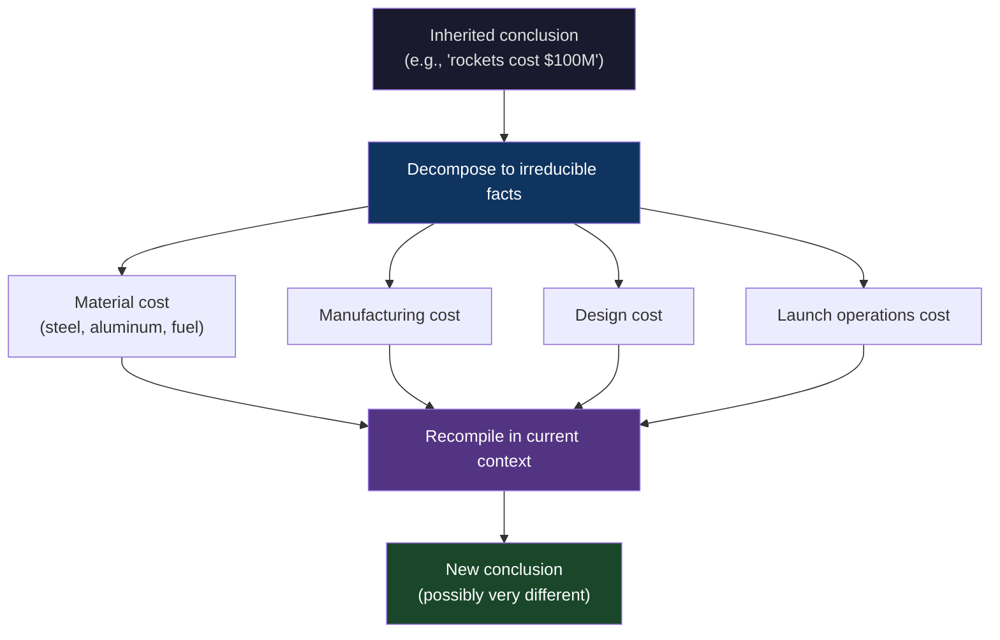
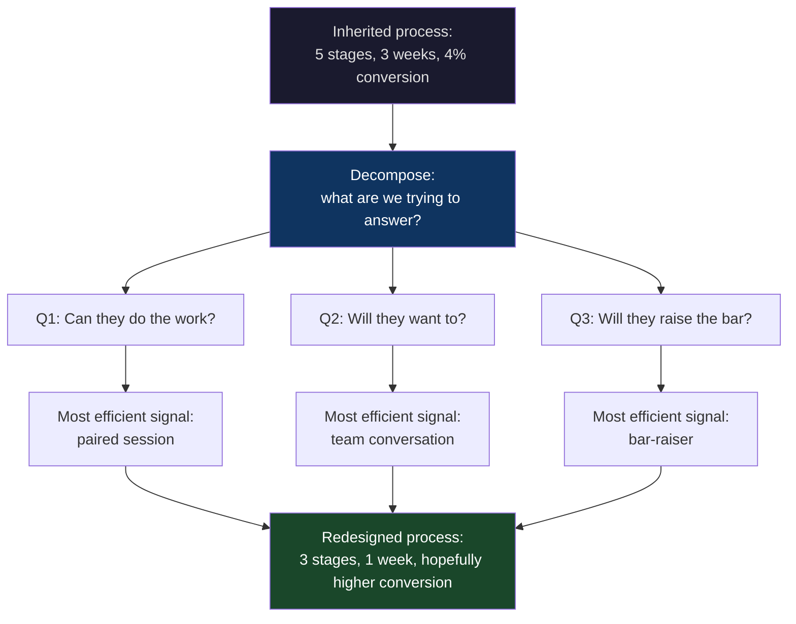
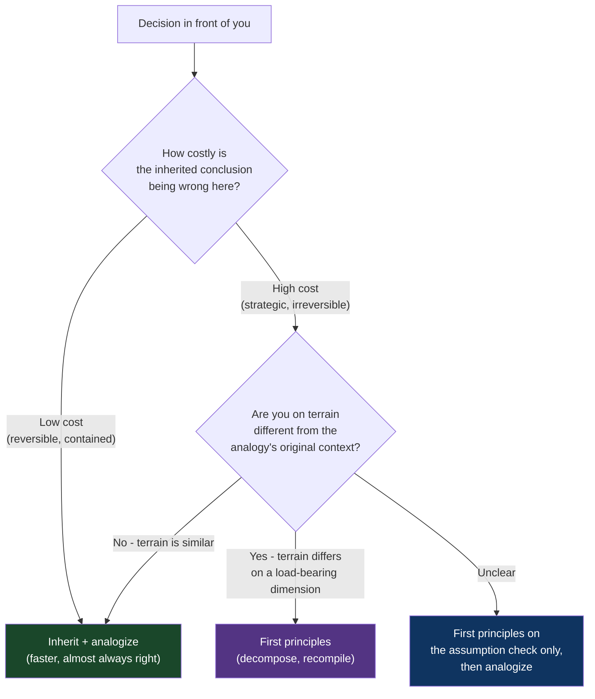

# CH-04: First Principles (and Their Limits)
### *Why decomposing a belief to its atoms is the most expensive — and most overrated — thinking move you have*

> **Part 1 of 5 · Seeing the Problem Before You Solve It**
> **Model Type:** `meta`

---

## The Misread

A small startup is deciding how to architect its new product. The technical lead, a thoughtful engineer with five years at a FAANG company, opens the planning doc with a section titled "How [FAANG] does it." She has watched her former employer scale to a billion users. She knows the patterns. The doc proposes: a microservice architecture with twelve services, a Kafka backbone, a dedicated data platform team, a custom internal RPC framework, a multi-region active-active deployment topology.

The team agrees. They've all heard of these patterns. They're impressed by the rigor of the doc. The CTO is impressed by the borrowed credibility. The plan ships.

Eighteen months later, the startup has 4,000 users and a platform that takes six engineers full-time to operate. Every release requires coordination across services nobody owns end-to-end. The Kafka cluster, sized for a workload they will not reach for five years if they're lucky, costs more per month than the salary of the engineer who maintains it. The custom RPC framework, which was the right call at a billion users, is a strict tax at 4,000.

In the post-mortem (which they call a "platform retrospective" because nobody is dead, but it has the feel of one), someone asks: "Why did we make these choices, originally?"

The technical lead says, honestly: "Because that's how it's done at scale."

A junior engineer, who has been at the company six months and has nothing to lose, says: "But we're not at scale."

The room is quiet. The answer was inherited — borrowed wholesale from a context where the conclusions were correct, deployed in a context where the conclusions are absurd. The technical lead is brilliant. The mistake was not stupidity. The mistake was reasoning by analogy in a situation where the analogy didn't hold, and not noticing because the analogy was so prestigious it didn't *occur* to anyone to check.

## The Blind Spot

The brain inherits conclusions much faster than it can verify them. This is mostly good: civilization's knowledge accumulation depends on us being able to use facts established by others without re-deriving them every time. You don't reprove that pi is irrational before using it in a calculation. You inherit it. The inheritance is the entire reason knowledge compounds.

The cost is that *the assumptions a conclusion rests on are inherited along with the conclusion, invisibly.* When the original context held those assumptions, the conclusion was correct. When you import the conclusion into a new context, you also import the assumptions — but you don't know you imported them, because they were never named. The conclusion feels portable. The assumptions don't travel well, and you only find out when the conclusion produces nonsense in the new context.

First principles is the deliberate countermeasure: decompose the inherited conclusion back to the irreducible facts it's built on, and recompile in the current context. The reason this is uncommon is not that it's hard intellectually. It's that it's expensive. Doing it for every belief is impossible. Doing it for the wrong belief is waste. The skill is knowing when to spend the cost.

## The Model, Precisely

**First Principles Reasoning.**

Decompose a claim or decision down to the *irreducible facts* — the things that are true by definition, by physical law, or by direct observation in the current context — and recompile the conclusion from those facts. The output is a conclusion that is *yours*, not one inherited from a context whose assumptions you can't see. The cost is time and cognitive load. The benefit is finding moves that nobody borrowing conclusions can see.

What this model makes visible: most "best practices" are conclusions in a foreign context's reference frame. When you decompose them, some survive intact (the underlying facts are also true here) and some collapse (the underlying facts are different here). The collapsed ones are where your competitive advantage lives, because everyone is still inheriting the conclusion.

Spatially: think of an inherited conclusion as a finished building. You can walk into it and use it. First principles is taking the building apart down to the bricks, examining each brick to see if it's still a brick on *your* ground, and rebuilding. Most of the time the building is fine and the work is wasted. Sometimes the ground has changed and the original foundation can't hold the structure — and only the decomposition reveals this.

## Three Domains, One Model

### Domain 1: Engineering — SpaceX Rocket Cost

The story is famous, so we'll be brief and precise. Elon Musk, in 2002, wanted to send a payload to Mars. Industry conclusion: rockets cost ~$65M for the relevant payload class. Decomposed by Musk and the early SpaceX team: what are the *materials* in a rocket? Mostly aluminum, some titanium, some carbon fiber, fuel. What do those materials cost on the open market, in the masses required? Roughly 2% of the rocket's sale price.

The decomposition surfaced a question nobody had bothered to ask: *if the materials are 2% of the price, what is the other 98% paying for?* Answer: design overhead, manufacturing inefficiencies, single-use disposability, and contractor markups that had accumulated over decades when nobody was applying price pressure because the customer was always the government and the government was always patient. None of these were laws of physics. All of them were *historical conditions of the aerospace industry* that the conclusion ("rockets cost $65M") had inherited invisibly.

SpaceX's strategy — vertical integration, in-house manufacturing, and reusable boosters — was not a clever new business idea. It was the obvious move that became visible only after the cost decomposition. Anyone with the same decomposition could have seen it. Almost nobody had decomposed.

### Domain 2: Organization — Hiring Process Redesign

A mid-stage company's hiring process is: recruiter screen → coding challenge (4 hours, take-home) → technical phone screen → on-site (5 hours, four interviews) → debrief → offer. The pipeline takes three weeks. Conversion from top-of-funnel to offer is 4%. The team complains about the cost. They consider tweaks: shortening the take-home, removing one interview, automating scheduling.

A first-principles decomposition would ask: *what are the irreducible questions any hiring process must answer?*

1. Can this person do the work?
2. Will they want to do the work here, with these people, for the compensation we offer?
3. Will they make the team better than the median current member, on dimensions that matter?

That's it. Three questions. Every stage of the process exists to answer one of them. Decomposed, the take-home and on-site are both attempting to answer question 1, and they answer it redundantly because the take-home is a proxy for solo work and the on-site is a proxy for collaborative work — but both ultimately surface the same skills. The 4-hour take-home, in particular, exists because *another company in 2014 introduced it* and the industry inherited it. Whether it actually adds signal above the on-site is a question almost no team has tested.

A redesign from first principles might be: one paired-programming session (90 minutes), one team-fit conversation (45 minutes), one bar-raiser interview (45 minutes). Same three irreducible questions, same signal, ~75% reduction in candidate burden, ~70% reduction in process duration. The reason most companies don't do this is not that they've thought about it and rejected it. It's that they've inherited the conclusion.

### Domain 3: The History of Physics — Galileo vs Aristotle

Aristotle's physics, formulated in the 4th century BCE, held that heavier objects fall faster than lighter ones in direct proportion to their weight. This was *inherited as truth* for nearly two thousand years, taught in universities across Europe, defended by theologians, woven into the worldview of educated people across multiple civilizations. It was wrong.

It was wrong because Aristotle had reasoned from observation in an environment where air resistance dominated for most everyday objects, and had not decomposed the question into "what makes things fall?" plus "what slows them?" He observed the joint phenomenon and ascribed the entire effect to weight. The conclusion was inherited for two millennia not because nobody could test it — anyone with a tower and two stones of different weights could have tested it in five minutes — but because the conclusion had Aristotle's authority on it and nobody thought to decompose.

Galileo did the decomposition. He separated the *cause of falling* (gravity, acting equally on all masses) from the *cause of slowing* (air resistance, acting in proportion to surface area and velocity). With the decomposition, the prediction became: in the absence of air resistance, all objects fall at the same rate. He could not test this directly in 1600 (vacuums were hard), but he tested it as closely as he could, with inclined planes that reduced the effect of air resistance, and the prediction held. Apollo 15's hammer-and-feather drop on the Moon in 1971 was, in a sense, Galileo's experiment in its purest form, 370 years later.

The lesson is not that Aristotle was stupid. The lesson is that *the cost of inheriting a conclusion is silent for centuries until someone decomposes.* The decomposition, when it happens, often takes far less intellectual horsepower than the inheritance had displayed. Galileo wasn't smarter than Aristotle. He was less willing to inherit.

## Where The Model Breaks

**The hidden assumption:** decomposing the conclusion is *cheaper* than inheriting it and tolerating the inheritance's inaccuracy. This assumption is *usually false.*

The vast majority of conclusions you inherit are correct enough in your context that first-principles re-derivation is pure waste. You inherit "wash hands before surgery." You do not first-principles re-derive germ theory before each operation. You inherit "don't store passwords in plaintext." You do not re-derive cryptographic best practices each time you write a login form. Inheritance is not a bug; it is the entire mechanism by which civilization scales knowledge. First principles, applied indiscriminately, is *intellectual narcissism* — the belief that your decomposition will routinely outperform the accumulated debugging of generations.

There is a second failure mode: incomplete decomposition. First-principles reasoning that *thinks* it has reached the irreducible facts but actually still has assumptions buried two levels down produces conclusions that feel rigorous but are subtly wrong, and often more dangerous than the inherited version, because the inheritance came with cultural error-checking and the first-principles version comes with the reasoner's confidence in their own work. The most expensive bad decisions in startups are made by smart people who first-principles'd their way to a conclusion an experienced practitioner would have recognized as already-disproven, but who didn't know enough to know what they were missing.

A third failure: first principles is *slow.* Decomposing every important decision takes weeks. Most decisions don't have weeks. Choosing first principles when you needed speed is its own form of failure, indistinguishable in outcome from analysis paralysis.

**The signal you're in the break zone:** you're applying first principles to a question that thousands of practitioners have already answered, you're not finding flaws in the consensus, but you're continuing to decompose because the decomposition feels rigorous. Stop. The consensus is probably right. You are paying the cost of decomposition for the satisfaction of having done it, not for the answer.

## The Collision

**This model says:** decompose the inherited conclusion; rebuild from the facts.
**Reasoning by Analogy says:** the inherited conclusion is the distilled wisdom of every prior solver of this problem; use it, save the cost of re-derivation, save your decomposition energy for the rare cases where the analogy genuinely doesn't hold.

The conflict is sharp in startups. First-principles thinkers say: "Everything our industry takes for granted is potentially wrong; question it all." Analogy thinkers say: "Most startups die from poor execution of known patterns; spend your finite weirdness budget on the 1–2 things that actually need to be different, and inherit everything else."

Both are sometimes right. Both, applied universally, are wrong.

Scenario where they collide: you're choosing a database for a new service. First-principles says: "What are the access patterns? What are the durability requirements? What are the latency targets? Derive the right storage engine." Analogy says: "Postgres is fine. It's fine for almost everything. Use Postgres and move on. The case where Postgres is wrong is rare enough that the decomposition will mostly produce 'Postgres' as the answer anyway."

**The meta-skill:** the deciding signal is *whether your current context shares the load-bearing assumptions of the analogy's original context.* If yes, inherit. If no, decompose. Most failures of analogy-based reasoning are not "the analogy was bad" but "the analogy was good in its native context and was deployed in a context that differed on one critical dimension the borrower didn't notice." The opening Misread of this chapter is exactly that: FAANG architecture in a 4,000-user startup. The analogy is fine. The terrain isn't.

## The Retrofit

**Event:** Henry Ford's introduction of the assembly line and the $5/day wage, 1908–1914. By the conventions of his industry, what Ford did was insane. Carriage-makers had built each vehicle bespoke, by skilled craftsmen, for high-end customers. The inherited conclusion was: cars are luxury goods; production is craft; workers are interchangeable cogs paid as little as the labor market allows.

Ford decomposed. *What is a car, irreducibly?* A set of standardized parts assembled in a specific order. *Why are cars expensive?* Because each car is assembled bespoke by a craftsman who has to walk to fetch parts and switch between many tasks. *What if we held the worker still and brought the parts to them, each worker specializing in one task?* The assembly line. Production time per Model T dropped from 12.5 hours to 93 minutes.

But the deeper decomposition was about wages. The inherited conclusion was that you paid workers as little as the market would tolerate. Ford asked: *what is a wage for?* If it's only to compensate labor, then minimum is the market rate. But if the worker is also the customer — if you are building a mass-market product that requires mass-market buying power to absorb your supply — then *the wage and the price are coupled.* Pay workers $5/day (more than double the prevailing wage), and they could afford the cars they were assembling. The whole industry's worth expanded.

Re-reading through first principles: every piece of Ford's strategy was visible to anyone who decomposed "what is a car," "what is production," and "what is a wage" down to their irreducible questions and recompiled in the new context of mass manufacturing and a rising middle class. The conclusions of the carriage industry — bespoke production, skilled craftsmen, low wages, luxury pricing — were inherited from an era when those answers were correct. The era had changed. The conclusions had not been updated.

**What was invisible:** every other automaker was *competing within the inherited frame.* They were trying to make slightly better luxury cars at slightly lower prices using slightly more efficient craftsmen. None of them had decomposed the question. Ford didn't out-execute them. He out-decomposed them. By the time competitors caught up, Ford had a decade of lead, a brand, and the dominant market share. The decomposition was the entire moat.

**The intervention point:** any rival who had asked, in 1908, "why exactly do cars cost what they cost?" and decomposed honestly would have seen the same answers Ford saw. The decomposition was free. The cost was social — admitting that the industry's conventions were not laws. Most people would rather inherit conventions than face the social cost of questioning them. This is true in 1908 and true now.

## The Practice Rep

> **Duration:** 48 hours
> **What you're training:** the discipline of asking "why is this true here, exactly?" for one inherited belief at a time, and tolerating the discomfort when the decomposition reveals the belief is inherited and unexamined

**The exercise:**
Pick one belief about your work that you hold strongly and that you have inherited from somewhere — a "best practice," a "pattern we always use," a "rule of thumb," a piece of advice from a senior engineer you respect. Just one.

Write at the top of a page: "I believe ____."

Then write, below it, three sentences:

1. "I believe this because ____." (The original source — where did this conclusion come from?)
2. "This conclusion rested on the following facts being true: ____." (Decompose to the irreducible inputs the conclusion required.)
3. "In my current context, those facts are: [still true / partially true / no longer true]." (Recompile.)

You will be tempted to pick a belief you already suspect is wrong. Don't. Pick one you're confident about. The exercise only works if the decomposition might genuinely overturn the conclusion.

**What to look for:**
You will encounter one of three outcomes. (a) The decomposition confirms the belief — the underlying facts are still true here. Great; the belief is now *yours*, not inherited. (b) The decomposition partially overturns it — the belief was right in its original context but only partially holds here. (c) The decomposition overturns it entirely — the underlying facts don't hold and the conclusion was being inherited blindly. Outcome (c) is rare per belief but transformative when it happens, because it surfaces a part of your map that was wrong on terrain you walk daily.

The other thing you'll notice: the decomposition was *exhausting.* Two or three sentences of honest decomposition takes thirty to ninety minutes. This is why no one does it routinely. The exhaustion is the cost. The cost is real. Spend it on a few high-stakes beliefs, not all of them.

**The log:**
At the end of 48 hours, write one sentence: "I saw First Principles at work when [the specific belief whose decomposition changed how I thought about it]."
