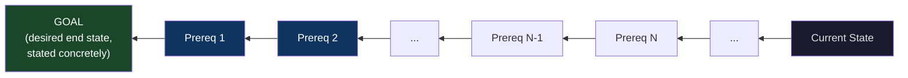
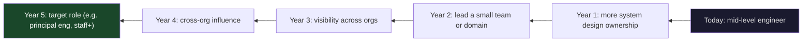
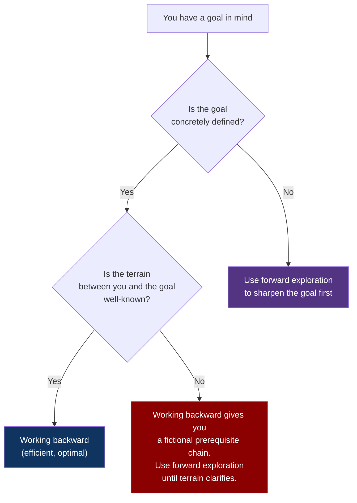

# CH-05: Working Backward
### *Why starting from the goal prunes the search space that starting from "now" cannot*

> **Part 2 of 5 · The Solver's Toolkit**
> **Model Type:** `decision`

---

## The Misread

An engineering org has been "improving onboarding" for three quarters. The work has been continuous. They've revamped the documentation portal twice. They've built an internal wiki. They've added automated checklist tools. They've hired a developer-experience engineer. They've run two off-sites on the topic. The deck shown to leadership uses words like "iterative" and "compounding."

A new VP joins. She asks, in her first week, a question that sounds either naive or pointed: "What does success look like, concretely?"

The room responds with words. "Faster ramp-up." "Less frustration." "Better experience." She nods, takes notes, and asks again at the next meeting, more specifically: "If onboarding worked perfectly, what would happen on day 1, day 7, and day 30 for a new hire that doesn't happen now?"

This time the room is slower. People offer fragments. After thirty minutes of conversation, a definition emerges: a new hire should ship a code change to production in their first week. Currently the median is 21 days; the 90th percentile is 60 days.

The VP asks: "What has to be true for a new hire to ship in week one?"

People start naming things. They need access to the repo. They need a local dev environment. They need to understand the deployment process. They need a manager who has triaged a starter task for them. They need code-review responsiveness within 24 hours.

The VP writes these on the board. Then she asks, for each one: "What's blocking that today?"

Within forty-five minutes, the team has identified that 80% of the 21-day median is consumed by *two specific bottlenecks*: a manual access-provisioning process that takes 4–9 business days, and the absence of a "starter task" pipeline in roughly 60% of teams.

Three quarters of work on onboarding had not surfaced either bottleneck because the work had been done *forward* — starting from "what could we improve?" and adding things. The two bottlenecks were obvious the moment someone worked *backward* from "ship in week one" and asked what must be true. The forward work had improved many things that didn't matter. The backward work, in a single meeting, identified the two things that did.

## The Blind Spot

Forward thinking *explores*. It starts at the current state and considers what could be added, removed, or modified. The exploration is unbounded — every action could be done, and ranking them requires comparing things that are not naturally comparable. Forward thinking is the default cognitive mode for "improving" a system, and it produces enormous amounts of activity. The activity is often uncorrelated with progress toward any specific goal because *no specific goal was used to filter it.*

Backward thinking *constrains*. It starts at the desired end state and asks: what must be true the step before this? And the step before that? The recursion produces a chain of prerequisites that ends at the current state — or fails to end at the current state, revealing the gap that must be closed. Either way, the output is a finite, ordered, prerequisite list. The space being searched is dramatically smaller, because most possible actions don't satisfy any prerequisite in the chain and can be ignored.

The blind spot is that forward thinking *feels productive* and backward thinking *feels reductive*. Adding things to a list feels generative; subtracting from infinite possibility by constraint feels conservative. Most teams default to forward because the meeting energy is higher. The energy is uncorrelated with progress.

## The Model, Precisely

**Working Backward.**

Start from the desired end state, stated as concretely as possible. Ask: *what must be true the step immediately before this end state, for the end state to occur?* Recurse: for each prerequisite, ask the same question. Continue until the chain terminates at the current state or at a clearly missing capability. The result is a finite ordered list of prerequisites; the difference between that list and the current reality is the work.

What this model makes visible: every goal has a *small* set of true prerequisites and a *large* set of nice-to-have improvements that don't actually move the goal. Forward thinking can't tell them apart. Backward thinking exposes which is which.

Spatially: forward search is light flooding out from a flashlight at the entrance to a maze, illuminating every possible path. Backward search is a thread tied to the exit; pulling on the thread, only the paths that actually reach the exit are revealed. Forward search costs O(branching ^ depth); backward search costs O(depth) if the goal is well-defined.

The Pólya version of this move: "Try to think of a familiar problem having the same or a similar unknown. Or: think of a problem related to yours and solved before. Can the result be used? Can the method be used? Can you formulate the problem in reverse?"

## Three Domains, One Model

### Domain 1: Engineering — Formal Methods and Proof Construction

When a mathematician wants to prove that some theorem T is true, they have two options. Forward proof starts from the axioms and applies inference rules, exploring the space of derivable theorems, hoping to stumble on T. The space of derivable theorems is, in any nontrivial system, infinite. The probability of forward proof finding T by chance is essentially zero.

Backward proof starts from T and asks: *what would I need to have already proven to derive T directly?* Each candidate becomes a sub-goal. The sub-goals are recursed on. The proof tree grows from the conclusion toward the axioms. When every leaf of the tree is an axiom or a previously proven theorem, the proof is complete.

This is so central to mathematics that we often don't notice it. Every proof you've read was probably *constructed* backward and *presented* forward. The presentation is forward because that's how proofs are read; the construction was backward because no other approach is computationally feasible. Modern automated theorem provers (Coq, Lean, Isabelle) use heavy backward chaining for the same reason: the forward search space is intractable, the backward search space is manageable.

The engineering analog: when you need to debug a deeply nested system, forward debugging from the input often gets lost in a maze of intermediate states. Backward debugging from the wrong output — "what must have been true in the previous step for this wrong output to occur?" — prunes the search space dramatically. Most experienced debuggers work backward without naming it; teaching it explicitly transfers the skill faster.

### Domain 2: Organization — Career Planning

The forward version: "I'm a mid-level engineer; what should I do this year to grow?" Answers include: take a course, find a mentor, read more, ask for more responsibility, work on side projects, attend conferences. All reasonable. None comparable. None obviously prioritized.

The backward version: "In five years, what role do I want? What does someone in that role *do* day to day? What do they know how to do that I don't currently know how to do? What experience do they have that I lack? What relationships do they have that I haven't built?" The answers to these questions form a chain of prerequisites. Each prerequisite suggests a specific action. The actions are ordered: relationships take longest to build, so they should start first; specific technical skills can be acquired in months; certain experiences can only be gotten by changing roles, so the timing of moves becomes visible.

The backward version doesn't produce more "growth activities." It produces *fewer*, ordered, justified ones. Most career coaches teach this implicitly. The pattern is recognizable: every framework with "begin with the end in mind" is a working-backward primitive.

### Domain 3: Chess Endgame Theory

Chess endgames are mathematically *solved* in the literal sense: for any position with 7 or fewer pieces remaining on the board, the optimal move (and the eventual outcome with perfect play) is known and stored in tablebases. The tablebases were not built by playing forward from every position. They were built by working backward from every possible checkmate.

The construction is precise: start with all positions where the next move is checkmate (depth 0). Then enumerate all positions from which a forced move leads to a depth-0 position (depth 1). Then all positions from which all opponent moves lead to depth-1 positions (depth 2). Continue. After enough iterations, every reachable position has a known optimal move and a known outcome. This is *retrograde analysis*, and it is the only computationally feasible way to build endgame knowledge. Forward search from every starting position would require more compute than the universe contains.

Top human players study endgames using the same backward principle. The skill being trained is *recognizing*, from the current position, the chain of prerequisites that leads to a known winning endgame. The forward player asks "what good move can I make?" and computes branching futures. The backward player asks "what winning endgame can I steer this toward?" and prunes their move selection accordingly. The backward player consistently wins.

## Where The Model Breaks

**The hidden assumption:** the goal is *well-defined* and *correct*.

If the goal is fuzzy, working backward gives you a chain of fuzzy prerequisites, each of which is harder to verify than a forward action. "Build a great company" is a goal in the same sense that "be happy" is — it has no concrete enough definition to work backward from. Trying to work backward from "be happy" produces philosophy, not a plan. The working-backward method requires the goal to be sharp enough that "what must be true the step before this?" has an actual answer.

The deeper failure mode: working backward *efficiently* from the *wrong* goal. If your goal is wrong — and you do not know it is wrong — working backward will get you to the wrong place fast and confidently. Forward exploration has the property that you can sometimes stumble into a better goal along the way ("oh wait, *this* is what we should have been doing"). Backward chaining doesn't stumble; it executes. When the goal is wrong, backward chaining is a high-precision wrong-answer generator.

A third failure: in domains with high uncertainty about the terrain, backward chaining produces plans whose prerequisites depend on facts that won't hold. "To launch in market X, we'll need partnerships A, B, and C." Beautiful plan. Partnership A doesn't exist because market X doesn't have the regulatory structure you assumed. Now the entire chain is broken at step one. Forward exploration would have surfaced the regulatory issue early through cheap experiments; backward chaining hides it inside an assumed prerequisite.

**The signal you're in the break zone:** you can state the goal clearly, but the prerequisites you derive feel suspiciously crisp — too crisp for the actual uncertainty of the domain. Or: every time you try to state the goal precisely, it changes shape. In both cases, switch to forward exploration (tracer bullets, small experiments) until the goal stabilizes.

## The Collision

**This model says:** start from the goal; work backward.
**Forward Exploration / Tracer Bullets says:** start with action; let the goal sharpen as the terrain reveals itself.

The collision is identical in shape to the one in CH-02, but at a different scale: there it was about defining the problem; here it's about planning the solution. Both forms surface the same underlying tension between *thinking before acting* and *acting before knowing.*

Specific scenario where they collide: a small startup is trying to find product-market fit. Working backward says: "In two years we want $1M ARR. That requires X paying customers at Y price. That requires Z deals per month. That requires a sales motion that produces W qualified leads per month. That requires marketing spend of V…" The plan is internally consistent and largely fictional, because the prices, conversion rates, and willingness-to-pay are all unknowns. Forward says: "Build the simplest version, sell it to one customer at any price, learn what they'll pay, what they want, who else has the pain. Iterate."

**The meta-skill:** the deciding signal is whether the *terrain* between current state and goal is well-understood. If you can name the prerequisites with confidence, work backward. If your "prerequisites" are guesses dressed as facts, you need forward exploration to verify the terrain before backward chaining will produce a real plan instead of a beautiful fiction. The worst mistake is producing a backward-chained plan from a guessed terrain and *acting on it as if the terrain were verified.* Most strategic plans in startups are exactly this failure mode.

## The Retrofit

**Event:** The Apollo program, 1961–1969. President Kennedy's May 1961 announcement was a stunning piece of working-backward goal-setting: "achieving the goal, before this decade is out, of landing a man on the Moon and returning him safely to the Earth."

The goal had three properties that made backward chaining feasible: it was *concrete* (a specific event), it was *measurable* (you can verify whether a human is on the Moon), and it had a *deadline* (nine years, which made the prerequisite chain have to terminate on a fixed date). NASA's program structure was then constructed almost entirely by working backward.

What had to be true to land a human on the Moon and return safely? A landing module capable of landing in lunar gravity. A command module capable of round-trip transit. A launch vehicle capable of escaping Earth gravity with the combined payload. Life support for the duration. Navigation accurate to lunar-orbit precision. Communications between Earth and lunar distance. Re-entry capable of withstanding the speeds involved. And dozens more.

Each prerequisite spawned sub-prerequisites. The lunar lander required testing in vacuum chambers, which required vacuum chambers of that scale to exist. The Saturn V required engines of unprecedented thrust, which required new materials and manufacturing techniques. The mission required astronauts trained for procedures that had never been performed, which required simulators that had to be built. The chain of prerequisites went thousands of items deep.

NASA's program — Mercury, Gemini, Apollo — was structured as a sequence of intermediate verifications, each of which proved out one or more prerequisites. Mercury proved humans could survive orbital flight. Gemini proved orbital rendezvous, EVA, and longer-duration missions. By the time Apollo flew, each prerequisite had been verified independently. The integration was tight because each component had been engineered against a chain that ended at the goal.

**What was invisible:** the political competitor of the Apollo program was the Soviet space program, which was technically excellent but, crucially, did not have a single concrete goal with a deadline. The Soviet approach was more incremental, more forward-exploratory, more "let's see what we can do." When the Soviets attempted a lunar program in the late 1960s, they had to do the backward-chaining work in a much shorter time frame and with much less coherent direction. They never landed a human on the Moon. The American program's backward chaining was the institutional advantage that nine years of focused work could not produce by pure forward effort.

**The intervention point:** Kennedy's speech is famous for its rhetoric. Its more important property — the property that made it a successful program rather than a successful slogan — was that *the goal was specified concretely enough that backward chaining could produce a plan.* A vague goal ("America should lead in space") would have produced ten years of activity and no Moon landing. The specificity of "a man on the Moon and returning him safely, before this decade is out" was the engineering decision that made the political ambition executable.

## The Practice Rep

> **Duration:** 48 hours
> **What you're training:** the discipline of stating goals concretely enough that backward chaining produces a real prerequisite list

**The exercise:**
Pick one goal you have for the next 30 days. Could be at work, personal, anything — but it has to be a real goal you've been working on (or vaguely intending to work on).

Step 1: Write the goal in one sentence so concretely that anyone could tell, on day 30, whether it was achieved. If your sentence has any of the words "improve," "better," "more," "grow," "develop," it is not concrete enough. Rewrite until it has none of these words.

Step 2: Write five sentences, each starting with "The step immediately before [the goal] occurring will require: ____." List five prerequisites.

Step 3: For each prerequisite, write one sentence: "For [prerequisite] to be true, [smaller prerequisite] must already be true."

You now have a tree, two levels deep, of prerequisites. Look at the leaves. The leaves should be things you can either start today or know how to verify.

**What to look for:**
You will almost certainly notice one of two things. (a) Your original goal was much fuzzier than you realized, and Step 1 took longer than you expected. The fuzziness was the entire reason you'd been making no progress: you had been working forward, generating activity, but no activity was clearly a prerequisite to the goal because the goal was undefined. (b) The prerequisite chain reveals a leaf you've been avoiding — a specific conversation, a specific decision, a specific small piece of work — that is blocking the entire chain. The avoidance was invisible while the chain was forward and exploratory. Backward chaining makes it visible.

**The log:**
At the end of 48 hours, write one sentence: "I saw Working Backward at work when [the specific leaf-level prerequisite that I had been avoiding because it wasn't visible in the forward view]."
