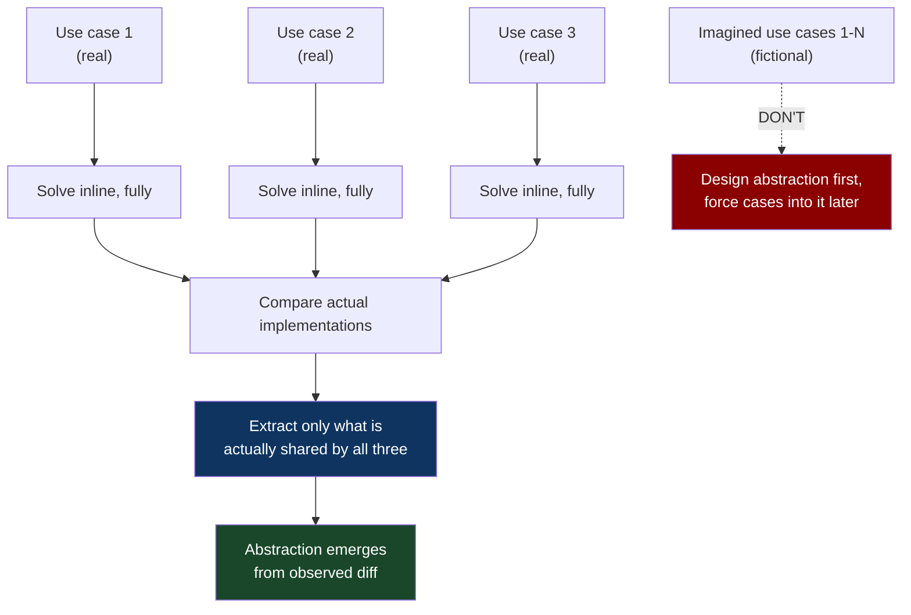
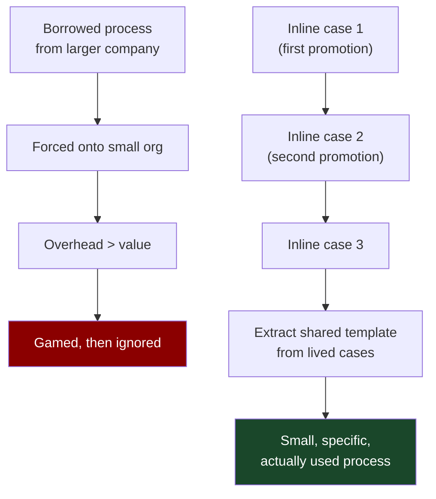
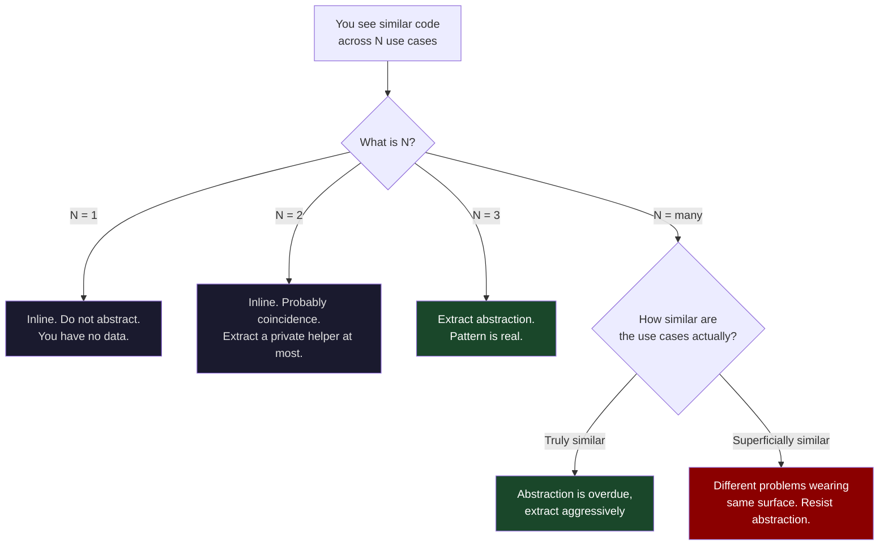

# CH-06: Specialize, Then Generalize
### *Why the abstraction you imagine before living the specific case is almost always the wrong abstraction*

> **Part 2 of 5 · The Solver's Toolkit**
> **Model Type:** `decision`

---

## The Misread

A platform team has been asked to build "a notification system" — something the company can use to send alerts, transactional emails, marketing messages, in-app banners, and SMS. The team's tech lead is sharp and has been burned before by systems that didn't scale to new use cases. He decides, correctly, that the system needs to be designed for extensibility.

The team spends six weeks on architecture. They produce a beautiful design: a pluggable channel abstraction, a templating engine that supports five renderers, a routing layer with priority queues, a delivery-tracking subsystem, a retry policy framework, an internationalization module, an audit log. The doc is forty pages. The architecture is reviewed twice. Senior engineers from other teams praise it. The tech lead is, briefly, very proud.

The team starts implementation. Six months later, they have implemented the framework and one use case: a transactional email for password resets. The framework is in good shape. It is also enormously over-engineered for the one use case that exists.

Then the second use case arrives: marketing emails. The team discovers that the templating engine they built doesn't fit. Marketing emails need WYSIWYG editing, A/B tests, dynamic personalization, and an entirely different review workflow. None of these were in the design. They retrofit. The retrofit damages the clean abstraction. The framework's coherence starts to fray.

The third use case is push notifications. The abstraction breaks completely. Push notifications have entirely different delivery semantics — they're best-effort, time-sensitive, fire-and-forget — and the retry-policy framework, which had been designed around email reliability, has to be bypassed entirely. The bypass becomes a second framework inside the first.

By the fourth use case, the team is maintaining a complex framework that doesn't actually unify anything. Each new channel requires more bypass logic. The cost of the framework is paid daily; the benefit it was designed for never materializes.

In the post-mortem, the tech lead says, "We should have built it more generically from the start."

That is exactly wrong.

## The Blind Spot

The brain over-trusts its ability to *imagine the general case* before having lived the specific cases. The imagined general case is a fiction — an interpolation through a handful of made-up data points the brain has invented. The interpolation produces an abstraction whose shape is determined by the *imagined* data, not the real data. Real data, when it arrives, almost never fits the imagined shape, because the imagined shape was constructed from the brain's prior abstractions, not from the territory.

This blind spot is particularly seductive for engineers because the discipline rewards abstraction. The most-praised engineers in many cultures are the ones who design "general" frameworks that "scale" to "any use case." The praise is given before the framework has met any real second use case. By the time the framework's brittleness becomes obvious, the praise has been internalized as a value and the original abstraction has been canonized as a design pattern. The cycle then repeats with the next engineer who watched the previous one being praised.

The countermeasure is brutal in its simplicity: refuse to abstract until you have at least two — preferably three — concrete cases. Build the first inline. Build the second inline. Look at the diff. *Let the abstraction emerge from the actual diff*, not from the imagined diff.

## The Model, Precisely

**Specialize, Then Generalize.**

Solve the first instance fully and inline, with no abstraction beyond what that instance requires. Solve the second instance similarly. Now look at what the two solutions actually share — not what you predicted they'd share, but what they actually share. The abstraction is the intersection of the lived cases, not the union of the imagined cases.

What this model makes visible: most abstractions in code, processes, and organizations are *predicted* abstractions, built from a fictional set of imagined use cases. The lived cases would have produced a different abstraction, often a much smaller one. The cost of the predicted abstraction is paid forever; the predicted use cases it was designed for usually never arrive in the shape that was predicted.

Spatially: think of an abstraction as a coat hanger meant to hold many coats. If you build the hanger before any coat exists, you'll choose dimensions based on what you imagine coats look like. When real coats arrive, half of them won't fit. The hanger you'd have built after seeing three real coats would have been a different shape — and would have fit not just those three, but the fourth one too, because real coats vary in patterns the imagined coats don't.

Pólya's version of this move: "If you cannot solve the proposed problem, try to solve first some related problem. Could you imagine a more accessible related problem? A more general problem? A more special problem? An analogous problem? Could you solve a part of the problem? Vary the problem."

The Rule of Three (Hunt & Thomas, *Pragmatic Programmer*): wait until you have three concrete instances before extracting a helper, a utility, or an abstraction. Two is not enough. Three is the minimum.

## Three Domains, One Model

### Domain 1: Engineering — The Rails Origin Story

Ruby on Rails, the web framework that dominated startup web development from 2005 through ~2015, was not designed as a framework. David Heinemeier Hansson built Basecamp — a single specific project management application — for 37signals. He wrote it in Ruby because he liked Ruby. He wrote each piece as the application needed it. There was no plan for a framework.

After Basecamp was built and working, DHH extracted the patterns that had emerged in *the actual code* into a reusable library. That library was Rails. Because Rails was extracted from a working application, every abstraction in it was load-bearing. Every convention had earned its place by being something Basecamp had actually needed. There was no "extensibility hook for hypothetical use case X" because no hypothetical use case X had ever been considered.

The result: Rails became famous for its opinions and its productivity. "Convention over configuration" was not a philosophical choice; it was an artifact of extraction. The conventions were the conventions Basecamp had already used. The configurability that wasn't there was configurability nobody had needed yet. When new use cases arrived later (e.g., API-only applications), the framework was extended in response to the actual new use case, not pre-emptively.

The contrast is instructive. Java's Enterprise frameworks of the same era — built by committees designing for imagined use cases — accumulated abstraction layers that became their own subject of study. XML configurations to wire up dependency injection containers that configured factories that produced builders that constructed objects. Every layer was justified by an imagined flexibility that the actual users mostly didn't need.

Rails and the Enterprise frameworks were trying to solve the same problem. Rails extracted from one lived case. The Enterprise frameworks generalized from many imagined cases. The difference was the abstraction's relationship to lived experience.

### Domain 2: Organization — Process Design

A startup decides it needs a "performance review process." The HR person, hired from a larger company, designs the process based on what worked there: quarterly reviews, 360-degree feedback, calibration meetings, written self-assessments, manager assessments, and a five-point rating scale.

The process is rolled out. The first quarter, everyone fills in the forms and complains. The complaint isn't articulate, but the substance is: the process produces enormous overhead and the outputs are not used. The HR person responds by tightening the process — clearer instructions, better tooling, more training. The complaint persists. The second quarter, the process is gamed. The third quarter, half the managers do it perfunctorily and the other half don't do it at all. By the fourth quarter, the process is effectively dead.

The mistake was building the process for the imagined organization — one with 5,000 employees, distributed managers, formal HR business partners, and the legal exposure that requires documented assessments — before living the specific case of the actual organization — one with 60 employees, where the CEO knows everyone, where feedback is given continuously in person, and where the only review that matters is the one that decides promotions and compensation.

A specialize-then-generalize approach would have started inline: the first time a promotion decision needed to be made, write down on a doc the specific reasoning. The second time, write it down again. After three or four promotions, look at what the docs share. Extract that into a lightweight template. *Now* you have a process. It will be tiny, specific to the organization, and used because each piece earned its place by being something the real cases needed.

### Domain 3: Mathematics — Polya's Example

In *How to Solve It*, Polya gives a recurring instruction: when stuck on a general problem, solve a specific case first.

Asked to find the sum of 1 + 2 + 3 + ... + n. A novice tries to think generally about sums and gets nowhere. A specialize-then-generalize approach: try n=1 (sum = 1). Try n=2 (sum = 3). Try n=3 (sum = 6). Try n=4 (sum = 10). Notice that the sums are 1, 3, 6, 10. Notice that 1 = 1·2/2, 3 = 2·3/2, 6 = 3·4/2, 10 = 4·5/2. Conjecture: sum = n(n+1)/2. Verify on a few more cases. Now try to prove the general form by induction.

The path to the general formula went through specific cases. The specific cases revealed the pattern that the general formula encodes. A solver who tried to find the formula "directly," reasoning about sums of arbitrary length, would likely fail — there's nothing to reason *about* at the abstract level until the pattern is found at the concrete level.

This is the deepest version of the lesson. Even in mathematics, where abstraction is the entire enterprise, the *process of finding* the abstraction goes through specific instances. The abstraction is the artifact of the search; it's not the starting point. The same pattern shows up in physics (specific experiments before general laws), in biology (specific organisms before evolutionary theory), in linguistics (specific languages before grammatical universals). The generalization is *retrospective*. Pretending otherwise produces fiction that the universe will refuse to validate.

## Where The Model Breaks

**The hidden assumption:** you can afford to ship the specific case before the general one, and the cost of refactoring the specific case into the general case later is acceptable.

Some problems require the general structure to *exist* before the specific case can be solved at all. Cryptographic protocols cannot be shipped as "the simple case" first; a "simple TLS" that handled one cipher suite would be wrong in ways a real TLS implementation is not. Distributed consensus algorithms cannot be shipped as "the easy case"; correctness requires accounting for failure modes that "the easy case" by definition doesn't handle. Some types of mathematical proof require the general framework to be in place before any specific case can be expressed at all.

There is also a softer failure: in domains with strong network effects or migration costs, the specific case becomes a *trap*. A specific solution that gets adopted may become impossible to refactor later because of accumulated dependencies. The cost of the right abstraction, paid early, may be less than the cost of replacing the wrong specific solution after it's entrenched. This is the steel-man of the over-engineering camp: sometimes the second use case will be too expensive to enable later.

There's a third failure: specialize-then-generalize, applied to bad initial cases, generalizes to bad abstractions. If your first three use cases are unrepresentative — chosen by accident, urgency, or someone's pet project — the abstraction you extract from them will be biased toward those cases and may actively block fitting the actually-common cases later. Pólya's "specialize" works best when the specific cases are well-chosen exemplars, not random instances.

**The signal you're in the break zone:** the cost of getting the *first* case wrong is catastrophic and not bounded (security, safety, regulatory). Or: the first specific case will lock in interfaces that downstream systems will depend on, making later refactoring effectively impossible. Or: your specific cases are a biased sample and you have reason to believe the diverse cases will look very different.

## The Collision

**This model says:** specialize first; extract abstraction from lived cases.
**DRY (Don't Repeat Yourself) says:** the moment you see duplication, eliminate it; duplication is a smell that compounds.

The two are not strictly contradictory but they apply different time horizons. DRY, taken literally, says: the moment you write the same code twice, extract a helper. Specialize-then-generalize says: write it twice, write it three times, *then* extract. The disagreement is over when extraction is premature.

Scenario where they collide: you've just written a function that sends an HTTP request, parses the JSON response, and returns a typed object. A second use case in the same PR needs the same pattern. DRY says: extract a helper now. Specialize says: write it inline a second time; the second case may differ in ways you'd over-fit to if you extracted now.

The compromise position — and it is a real compromise, not a dodge — is captured by the Rule of Three: the third instance is when you extract. The first instance doesn't justify abstraction. The second instance might be a coincidence. The third instance is a pattern. Most experienced engineers eventually settle on this rule, and the reason they settle is exactly the failure modes both sides correctly identify.

**The meta-skill:** the deciding signal is *whether the duplication is structural (the cases share a deep mechanism) or coincidental (they share surface only).* The only reliable way to tell is to have lived enough cases to see whether the deep mechanism actually repeats or whether the cases keep diverging in important ways. Premature abstraction is the cost of guessing too early; over-tolerated duplication is the cost of refusing to abstract once the pattern is clear.

## The Retrofit

**Event:** The Unix philosophy and the construction of early Unix utilities, ~1969 onward.

Unix's command-line tools — grep, awk, sed, sort, uniq, wc, cut, paste, tr, and the rest — were not designed as a coherent suite. Each was built to solve a specific problem its author was actually facing. grep came from Ken Thompson needing to search through files; awk came from Aho, Weinberger, and Kernighan needing to do simple text processing; sort came from needing to sort lines. Each tool did one thing.

The "Unix philosophy" — write programs that do one thing well, write programs to work together, write programs to handle text streams because that is a universal interface — was not designed in advance. It was *extracted* from the patterns that had organically emerged in the tools that had been built specifically. The pipe operator, which became the universal mechanism for composing tools, was invented after the tools existed and the need for composition became obvious. Doug McIlroy proposed pipes, and Thompson implemented them, *because the specific tools that had been built suggested the abstraction.*

The contrast is the IBM mainframe ecosystem of the same era, where utilities were designed top-down as a coherent system. The IBM utilities were individually more powerful than the Unix ones, and they fit a designed architecture. But they couldn't be composed easily — the abstraction they'd been designed against didn't include the kind of small-piece composition that Unix's accidental architecture enabled. By the late 1980s, Unix's bottom-up architecture had outcompeted IBM's top-down architecture in essentially every domain where small-piece composition mattered.

Re-reading through specialize-then-generalize: the Unix designers built specific tools for specific needs, observed the patterns, and only then extracted the philosophy. The philosophy was the *artifact* of having built the tools, not the *premise* for building them. Anyone trying to derive the Unix philosophy without first building tools would have produced different abstractions — abstractions that fit imagined needs rather than real ones. The actual philosophy could only have come from the lived experience.

**What was invisible:** the IBM utilities looked, in 1980, more sophisticated than the Unix ones. They had more features. They had better documentation. They had institutional support. The thing they did not have was *composability earned by extraction from lived cases.* Composability cannot be designed; it can only be discovered, by building enough specific things that the natural joins between them become visible.

**The intervention point:** any system designer who, in the 1970s, had committed to extracting abstractions from specific tools rather than designing top-down architectures would have built systems with the same compositional properties as Unix. A few did (Bell Labs being the famous one). Most didn't, and their systems lost out over the next two decades for exactly this reason. The lesson is repeatable: every domain where bottom-up composition matters rewards specialize-then-generalize, and every top-down designed alternative eventually accumulates the same kind of dead weight that the imagined-use-case approach produces.

## The Practice Rep

> **Duration:** 48 hours
> **What you're training:** the discipline of resisting abstraction until you have lived the specific cases

**The exercise:**
For the next 48 hours, every time you find yourself about to create an abstraction — a helper function, a base class, a template, a process document, a framework, a "system" — pause and apply the Rule of Three:

1. How many *real, lived* instances of the pattern have I actually encountered?
2. If fewer than three, defer the abstraction. Write the code (or do the work) inline.
3. If three or more, examine the instances and ask: what is *actually* shared, not what I *predicted* would be shared?

Write down each instance of deferred abstraction in a notes file. At each one, write one sentence about the abstraction you didn't create and one sentence about what specific data you would need to justify creating it later.

**What to look for:**
Two things will happen. (a) Some of the deferred abstractions will turn out to have been wrong-shaped — when the third case arrives, it will not share what you predicted the first two shared. The deferred abstraction would have been built around the wrong pattern. (b) Some of the deferred abstractions will turn out to be never-needed — the second case never arrives, the system evolves in a different direction, and the abstraction would have been waste forever. Both outcomes are evidence the model is working.

You will also notice cultural resistance. Other engineers will encourage you to "design for the future" or "make it extensible." Most of this advice is the failure mode the chapter describes. Polite resistance — "I want to wait for the second case to be real before I commit to this abstraction" — is usually well-received once you can articulate it.

**The log:**
At the end of 48 hours, write one sentence: "I saw Specialize → Generalize at work when [the specific moment I avoided building an abstraction that would have been wrong, or when I extracted one from three lived cases and it fit because it was earned]."
