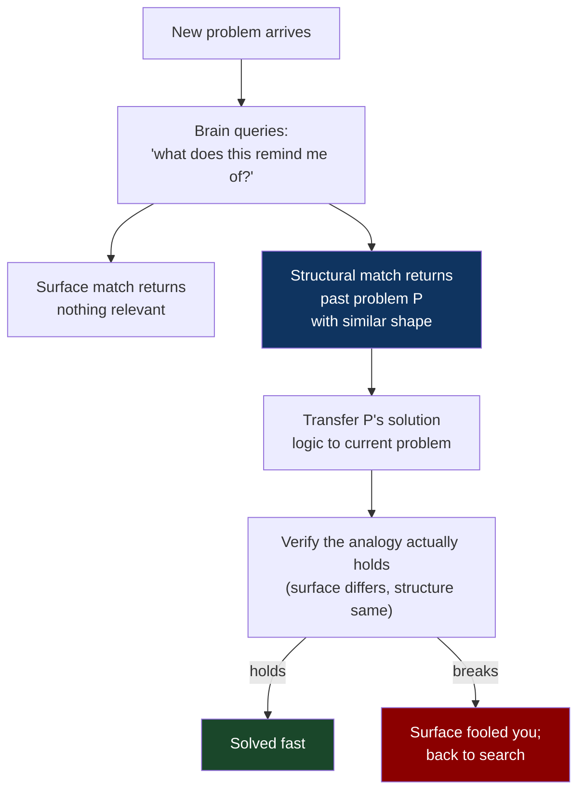
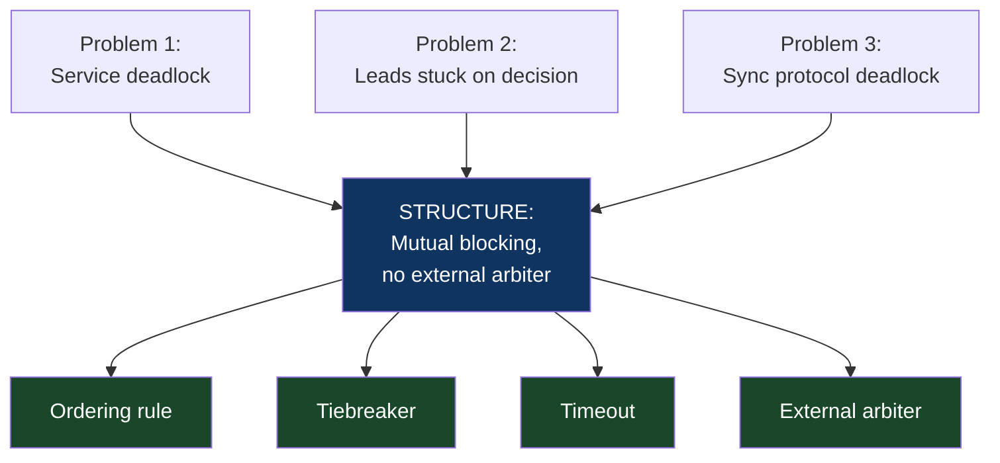
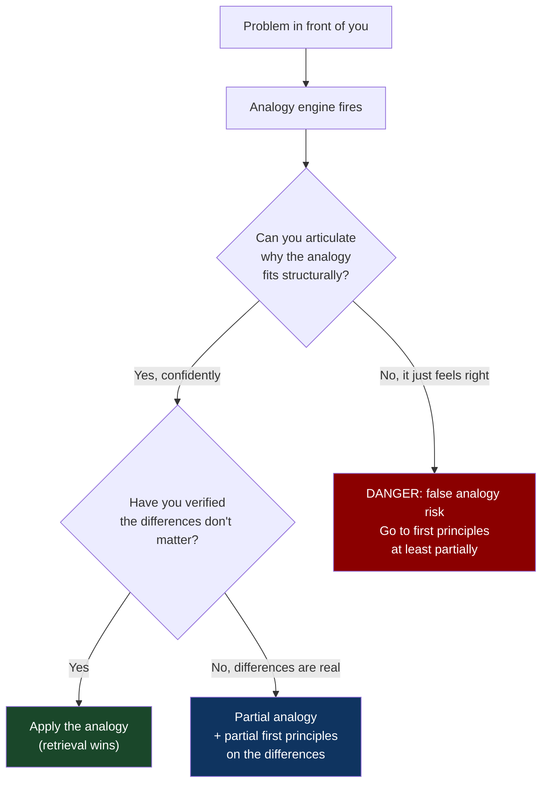

# CH-07: The Analogy Engine
### *Why expert problem-solving is mostly disguised retrieval — and why the disguise tricks you into thinking experts are smarter than you*

> **Part 2 of 5 · The Solver's Toolkit**
> **Model Type:** `meta`

---

## The Misread

A new engineer joins a team. She's brilliant on paper — top-of-class in algorithms, knows the language, has the credentials. In her first week, she's asked to look at a flaky test that's been intermittently failing for months. She spends two days investigating. She reads the test, the code under test, the test harness. She instruments. She runs locally a hundred times. She cannot reproduce. She is genuinely confused; her debugging instincts are good, but every track she follows comes up empty.

She finally asks a senior engineer for help. He glances at the test for forty-five seconds. He says: "That's probably the time-of-day thing. We have a job at 4am that locks the table this test writes to. The test usually runs in CI between 4:01 and 4:03 and gets unlucky maybe 1 in 30 runs."

She stares. He didn't read the code. He didn't run the test. He didn't instrument anything. He looked at the test name, the table it touched, and inferred the entire failure pattern in under a minute. She thinks he must be much smarter than she is.

He isn't. He's not smarter at all. He has seen this specific pattern — "intermittent test failure on a table touched by a periodic batch job" — *four times before* at this company. The pattern lives in his head not as a fact but as a *retrieval key*. When a flaky test appears, his brain queries against the library of "flaky test patterns I've seen at this company" and gets a small set of candidates back. The candidates have probabilities attached. The test-table + intermittent-frequency combination matched the "batch job collision" pattern with high probability. He didn't reason from scratch. He retrieved.

The new engineer cannot retrieve because she has nothing indexed yet. Her algorithmic knowledge — formidable, real — is the wrong tool for this problem; the problem is not algorithmic, it's pattern-recognition over local history. She thinks she is missing intelligence. What she is actually missing is *an analogy library and a retrieval index over it*.

## The Blind Spot

We treat each problem as new because we have not consciously indexed our past problems by their *structure*. We index them by *surface*: "the time the database crashed," "the time the metric went red," "the bug in the auth flow." Surface-indexed memory makes retrieval random — encountering a new problem doesn't surface relevant past problems unless the new one shares specific surface features with an old one. Most problems don't, on the surface; they share structure.

The blind spot is that expert intuition *feels* mysterious from the outside. The expert reaches a conclusion in seconds that took the novice hours. The temptation is to attribute the gap to a stable trait — intelligence, talent, "having a knack" — rather than to the boring truth: the expert has more analogies, indexed better, and they're doing retrieval that masquerades as reasoning. The expert often can't articulate the retrieval. They say "it just feels like X" or "this reminds me of Y." The articulation is post-hoc. The retrieval is pre-conscious.

This is the same machinery as System 1 (CH-13). The analogy engine is one of the things System 1 does well, once trained.

## The Model, Precisely

**The Analogy Engine.**

Expert problem-solving is dominantly *retrieval of structurally similar problems you've already solved*, not derivation from first principles. The skill is in two parts: (1) *indexing* past problems by their abstract structure rather than their surface features, so that new problems retrieve relevant past ones; (2) *recognizing isomorphism* between the current problem and a retrieved candidate, so you can transfer the past solution's logic without being misled by surface differences.

What this model makes visible: novice engineers don't lack intelligence; they lack indexed analogies. Most "expertise" is portable in principle but not in practice, because the indexing has to be done by the learner from the inside — nobody can give you their analogy library. The implication for skill development is to *deliberately build* the index, by reflecting on completed problems in terms of their abstract structure, not their concrete details.

Spatially: think of past problems as books in a library. Surface indexing files them by cover color and title length. Structural indexing files them by *what kind of problem they are* — graph traversal, coordination, cache invalidation, race condition, naming conflict, resource starvation, feedback collapse. The structural index is dramatically harder to build. It is also the only useful index for retrieval when a new problem arrives wearing a different cover.

Pólya's full phrasing of this move: "Have you seen it before? Or have you seen the same problem in a slightly different form? Do you know a related problem? Look at the unknown! And try to think of a familiar problem having the same or a similar unknown."

Hofstadter's deeper framing: *analogy is the core of cognition*. Not a peripheral activity. Not a trick we sometimes use. The central thing the mind does to think at all. Every concept you have was built from analogies to other concepts; recognition itself is analogy.

## Three Domains, One Model

### Domain 1: Engineering — Recognizing Abstract Problem Shapes

Three problems land on an engineer's desk in one week:

1. A service that's deadlocking because two writers are waiting on each other's resources.
2. A team where two leads have been stuck on opposite sides of a decision for three weeks; each is waiting for the other to move first.
3. A messaging system where two clients each need the other to acknowledge a sync message before they can proceed.

A surface reader sees three different problems: a software issue, an organizational issue, a protocol issue. A structural reader sees one problem in three costumes: *mutual blocking with no external arbiter.*

Once the structural pattern is recognized, the solution space narrows dramatically. Mutual blocking with no external arbiter has a small set of known solutions: introduce an ordering rule (always acquire resources in a fixed order; always commit in a known sequence); introduce a tiebreaker (a coin flip, a timestamp, a senior person); introduce a timeout that lets one party proceed if the other doesn't act; introduce an external arbiter (a deadlock detector, a manager, a protocol coordinator). Any of these can be applied to any of the three problems with adaptation.

The engineer who has indexed "mutual blocking" as a structural pattern reaches for one of these solutions in seconds. The engineer who treats each problem as new reinvents some weak version of one solution per problem, often inconsistently across problems, often poorly. The structural index produces *transfer*: a lesson learned in one domain becomes ammunition in another.

The discipline is to *name* the structural pattern when you encounter it. Not just solve the deadlock, but say to yourself: "this was mutual blocking with no external arbiter; the solution was to introduce an ordering rule; the pattern generalizes." That naming is the indexing.

### Domain 2: Organization — Anti-Pattern Recognition

A new manager joins a team. In her first month she notices: meetings are dominated by one senior engineer who shoots down ideas before they're fully proposed; junior engineers have stopped contributing; the senior engineer is technically excellent and respected by leadership; the team has been "stuck" on a project for two quarters; the senior engineer reports that the team is "underperforming."

A new manager with no analogy library treats this as a unique situation requiring careful diagnosis. A manager with an indexed library sees, in under a minute, the *Brilliant Asshole* anti-pattern: a high-status individual contributor whose technical excellence is real, whose interpersonal effects are corrosive, whose dominance suppresses team contribution, and whose self-report about team performance routes the blame outward.

The pattern has been described thousands of times. It has known interventions: explicit norms enforced by the manager; structured meeting formats that prevent dominance; private feedback to the brilliant asshole; in escalation, removal. None of these are guaranteed; the pattern is hard precisely because the individual is genuinely talented and leadership often protects them. But the *known solution space* gives the manager a sequence of moves to try, rather than starting from scratch.

The same pattern recognition extends across the manager's career. "Empire builder" is a pattern. "Hero culture" is a pattern. "Founder bottleneck" is a pattern. "Two-pizza team that should have been split six months ago" is a pattern. Each pattern indexes a cluster of past situations and a cluster of known interventions. Without the index, every organizational problem is novel and the manager is perpetually rediscovering basics. With the index, the manager spends their effort on the *specific deviation* from the pattern — what's different about this instance — rather than re-deriving the whole thing.

### Domain 3: Charles Darwin's Use of Malthus

This is one of the cleanest examples of structural analogy producing breakthrough science. In 1838, Darwin had been collecting observations on the variation of species for years. He had the data. He could see that variation existed, that some individuals reproduced more than others, that traits seemed to pass down. He did not yet have the mechanism.

He read Thomas Malthus's *Essay on the Principle of Population*. Malthus was making an *economic and demographic* argument: human populations grow geometrically, but food supply grows arithmetically; therefore population is always under pressure from limited resources; therefore competition for survival is inevitable.

Darwin's flash of insight was to map Malthus's argument *structurally* onto biology. The structure was: any population with reproduction faster than resources can support produces competition; competition produces differential survival; differential survival of heritable variation produces directed change over generations. Malthus had built this engine for humans facing food scarcity. Darwin recognized that the engine ran on any population — pigeons, finches, beetles, plants — facing any limit. The mechanism for evolution was identical to Malthus's mechanism for population pressure; only the domain had changed.

The analogy was *structural*, not surface. Pigeons are not humans. Food scarcity in 18th-century England is not the same as food scarcity in the Galápagos. But the underlying engine — *reproduction faster than resources, plus heritable variation, plus differential survival* — was identical, and recognizing the identity was the entire breakthrough. Darwin didn't invent natural selection; he saw that Malthus's argument was already the mechanism of natural selection, dressed in economic clothing.

Without the analogy library — without years of breeding observations giving him a sense of how heritable traits behave; without an awareness of Malthus's argument as a generalizable engine rather than a parochial economic claim — the recognition could not have happened. Darwin's intelligence was the retrieval and the recognition. The components were there for anyone who had built the same library.

## Where The Model Breaks

**The hidden assumption:** the past problem and the current problem are *structurally* similar, not just *superficially* similar.

The deadly version of analogy-based reasoning is *false analogy*: matching on surface features when the underlying structure differs. The seasoned engineer who pattern-matches "this looks like the time-of-day batch job thing" might be right or might be confidently applying a solution that doesn't fit because the structure here is different. The cost of false analogy is high because the engineer's confidence is high — they have a strong prior from the past pattern, and that prior crowds out the genuine diagnostic work the new problem actually needs.

False analogy is especially seductive because it *also* feels like the analogy engine working correctly. The same retrieval mechanism produces both. The difference is whether the retrieved candidate actually matches the new problem's structure. The only countermeasure is a habit of *verifying* the analogy: after retrieval, before action, ask "what's specifically different about this case, and does the difference matter?" This is the same skill as catching substitutions (CH-03) — both failure modes share the deep mechanism of confident pattern-matching producing the wrong answer.

A second failure mode: *over-fitting* to the analogy. Even when the analogy is structurally correct, the *details* of the past solution may not transfer. The deadlock solution that worked in the database system involves locks and timeouts that have no analog in the organizational case. The structural recognition tells you to look for "introduce ordering" or "introduce arbiter" — but applying database-specific locking semantics to a human dispute would be ridiculous. The analogy engine retrieves the *shape* of the solution; the specific implementation must still be local.

A third failure: domains where there is *no useful prior analogy*. Genuinely novel problems exist (rarely, but they exist). When you're working at the frontier of a discipline, the analogy library has no relevant entries, and reaching for one anyway produces nostalgic solutions to unfamiliar problems. This is the failure mode of senior people whose libraries are deep but stale: every new problem looks like an old one because the old ones are all they have.

**The signal you're in the break zone:** your analogy fires strongly, but you can't articulate *why* the new problem shares the past problem's structure. If the pattern match is operating below the threshold of articulation, you can't verify it. If you can't verify it, you can't tell false analogy from true.

## The Collision

**This model says:** retrieve aggressively from your indexed past; transfer fast.
**First Principles (CH-04) says:** decompose; rebuild; don't trust the inherited shape.

The collision is direct. The analogy engine is *the* mechanism for *not* doing first-principles work. They are opposite cognitive moves, and both are sometimes the right move.

Specific scenario where they collide: you encounter a system architecture problem that strongly reminds you of one you solved at a previous company. The analogy says: apply the same pattern; you've already done the work; this is exactly what your library is for. First principles says: your previous company had different constraints, scale, team composition, and risk profile; the pattern may be a false analogy; decompose this problem on its own terms.

**The meta-skill:** the deciding signal is whether you can name the analogy's structural fit *and* the candidate ways it might fail. If you can do both, the analogy is reliable. If you can do only the first (it fits!) but not the second (where might it not?), you're at high risk of false analogy and should mix in first-principles checking of the load-bearing parts. The strongest expert pattern is *retrieval + targeted first-principles verification on the specific differences*. That is what the senior engineer in the opening did unconsciously: the "1 in 30 runs" detail was a fit-check on the analogy, not just a confident pattern match.

## The Retrofit

**Event:** The Bohr model of the atom, 1913.

In the years before Bohr, atomic physics was in a confusing state. Rutherford's experiments had revealed that atoms had small dense nuclei surrounded by mostly empty space — implying electrons orbited the nucleus somehow — but the orbital model predicted that electrons would lose energy continuously and spiral into the nucleus, which obviously wasn't happening or atoms wouldn't exist.

Niels Bohr's contribution was a structural analogy borrowed from astronomy. Solar systems are stable: planets orbit the sun in stable orbits without spiraling in. The reason solar systems are stable involves gravity and orbital mechanics; the reason atoms might be stable, Bohr proposed, involves something analogous in electromagnetic terms — electrons occupy discrete allowed orbits, not arbitrary ones, and they jump between orbits by absorbing or emitting specific energy quanta.

The analogy was structural. The mechanism of stability (discrete stable states) was borrowed from the solar system. The implementation (electromagnetic interaction, quantized energy levels) was atomic. The borrowed structure was the entire creative move. Bohr did not derive quantum mechanics; he proposed a model that worked because it was analogous to a known stable system in a different domain.

Re-reading through the analogy engine: Bohr's model was wrong in important ways. Electron orbits are not actually orbital paths; the analogy is broken at the quantum level, where electrons exist as probability distributions, not particles tracing trajectories. The Bohr model overstayed its usefulness; later physicists had to do significant work to dismantle the analogy and replace it with a more accurate (and weirder, less analogous) quantum description.

**What was invisible:** the Bohr model's success and failure are *both* the analogy engine. The success was that the analogy let physicists make progress — calculate hydrogen spectra, predict experiments, build new theory — when they had nothing else to work with. The failure was that the analogy became sticky; later evidence that didn't fit the analogy was rationalized into the analogy for years before the model was finally replaced. This is the meta-lesson: analogies are *temporary scaffolding*. They let you build a structure you couldn't have built otherwise. They must also be eventually disassembled when the structure can stand on its own and the scaffolding is in the way.

**The intervention point:** any physicist in the 1920s who had the discipline to ask, regularly, "where does the solar-system analogy break, and what would atomic physics look like if we let it break?" would have gotten to quantum mechanics faster. The actual path took another decade because the analogy was load-bearing for the field's intuitions. The lesson generalizes: every analogy you rely on has a sell-by date, and the discipline of asking when the date has passed is the meta-skill of the analogy engine.

## The Practice Rep

> **Duration:** 48 hours
> **What you're training:** the habit of indexing problems by structure, not surface, so your future analogy engine has something useful to retrieve from

**The exercise:**
For the next 48 hours, every time you solve a problem of any size — a bug fix, a design decision, a team conversation that resolved a conflict, a clever workaround — write down two things:

1. The *surface* description: "I fixed the bug where the timestamp was offset by an hour."
2. The *structural* description: "I solved a *unit-mismatch propagation across a system boundary* problem."

The structural description should describe the *kind* of problem in terms that would apply to other instances of the same kind. "Mutual blocking with no external arbiter." "Inherited conclusion failing because original context differs from current context." "Load-bearing assumption was implicit; making it explicit revealed the bug." "Pattern-match was overriding genuine diagnosis."

Build a running document. Aim for at least eight entries in 48 hours.

**What to look for:**
The structural descriptions will *feel awkward* at first. You'll find yourself wanting to describe what you did rather than what kind of problem it was. The discipline is to abstract *away* the specifics until the description would apply to other situations with the same shape. The signal that you're getting it: an entry from yesterday will start to feel relevant to a problem today that has completely different surface features. That moment — when the structural index actually retrieves something useful — is the engine working.

Over time (longer than 48 hours), the running document becomes your library. The library compounds. Two years of structural indexing produces an engineer who "just sees" patterns that look like magic to people whose indexing was surface-only. The magic is not magic. It is the index.

**The log:**
At the end of 48 hours, write one sentence: "I saw the Analogy Engine at work when [the specific moment I recognized a problem today as structurally similar to a problem from before, even though the surface was completely different]."
