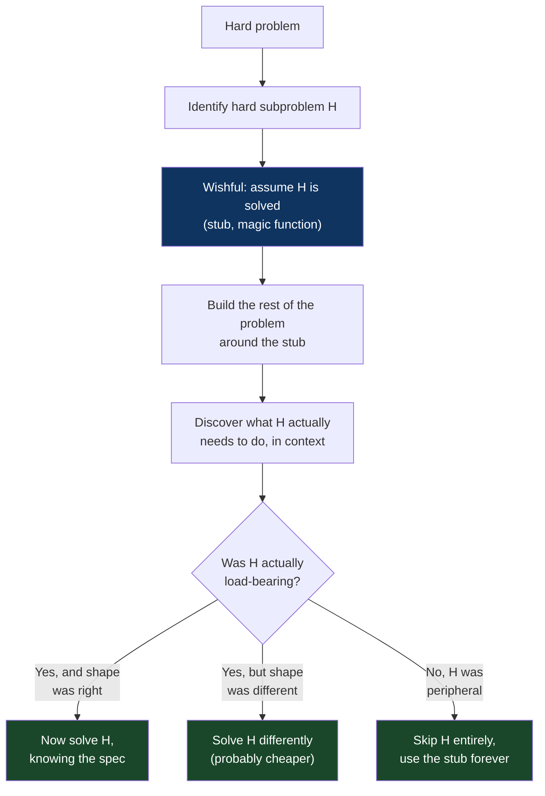
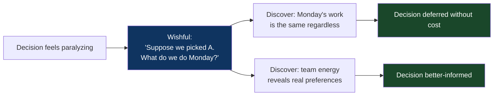
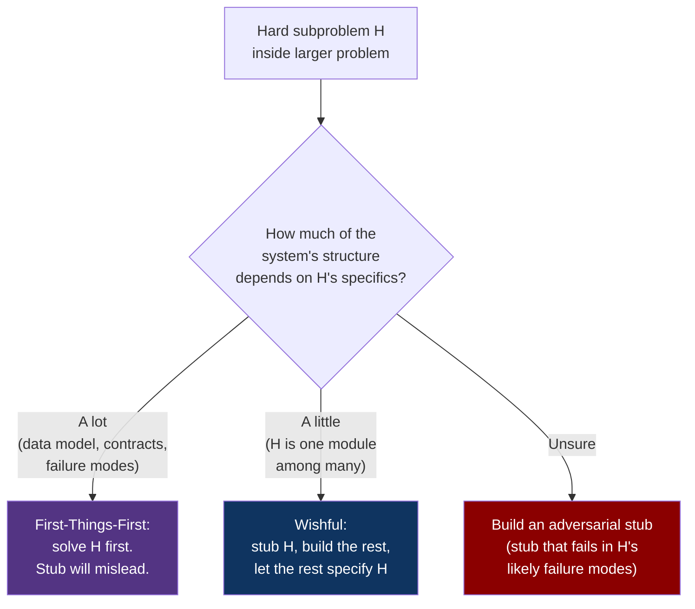

# CH-08: Wishful Thinking
### *Why assuming the hard part is solved is the most underused move in problem-solving*

> **Part 2 of 5 · The Solver's Toolkit**
> **Model Type:** `decision`

---

## The Misread

A team has been asked to build a feature: a system that automatically detects anomalies in a stream of user behavior events and surfaces them to a security team for review. The team has six weeks. They begin.

The first thing they do is what every responsible team does: they start with the hardest part. The anomaly detection itself. They review papers on streaming anomaly detection, evaluate three candidate algorithms, prototype each on a sample dataset, argue about the tradeoffs in tuning parameters, debate whether to use an ML-based approach or a statistical one, prototype the ML approach, find it doesn't generalize well, return to statistical methods, refine the thresholds, find the false-positive rate is too high, refine the thresholds again. Four weeks in, they have a moderately working anomaly detector. They have built nothing else.

They have two weeks left. They now need to: ingest events from the streaming infrastructure, persist anomalies for review, build a UI for the security team to triage them, implement an alerting mechanism, handle deduplication, integrate with the on-call rotation. The remaining work is enormous. They ship the feature late, with a UI that is essentially a database table view, no deduplication, and an alerting mechanism that floods Slack with duplicate notifications. The anomaly detector — the part they spent four weeks on — works fine. The system around it is the bottleneck. The security team complains. The feature is judged a failure.

In the retrospective, an engineer who had argued for a different approach early on says, mostly to himself: "We should have stubbed out the detector and built everything around it first. We would have learned that the security team actually needs the workflow, not the algorithm."

He was right. The team had committed to the hard part first because *the hard part was the part that felt like real work*. The rest felt like glue. The glue was the entire product.

## The Blind Spot

We over-couple. When a problem has a hard subproblem inside it, we feel we cannot proceed without solving the hard subproblem. This intuition has a kernel of truth — sometimes the rest genuinely depends on a specific shape of the solution — but it overshoots in the common case. Most of the time, the rest of the problem can be built around a *stub* of the hard subproblem, and building the rest reveals what the hard subproblem actually needs to do (often less than you thought, occasionally something different than you thought).

The blind spot is that *the perceived difficulty of a subproblem inflates its perceived centrality.* Hard subproblems feel like they must be solved first because they are scary, and scary things demand attention. But the centrality of a subproblem is not measured by its difficulty; it's measured by how much of the rest of the system actually depends on its specific form. Many hard subproblems turn out to be peripheral — they can be replaced by simpler approximations, or skipped entirely with a manual workaround for v1, or revealed to be solving a problem nobody actually has.

Wishful thinking is the deliberate move to *bypass* the hard subproblem temporarily, by assuming it's solved, and let the rest of the system tell you what the hard subproblem actually needs to do. The cost is the discomfort of having an unsolved hole in your work. The benefit is that you don't waste weeks solving the wrong shape of the hard subproblem because you didn't yet know what shape it needed.

## The Model, Precisely

**Wishful Thinking.**

When you encounter a hard subproblem inside a larger problem, *assume the subproblem is solved* — write a stub, a magic function, a placeholder, an oracle — and build the rest of the problem around it. The rest of the problem will tell you what shape the subproblem's solution actually needs to take. Often the rest is the actual problem and the subproblem was a phantom; often the subproblem's required shape is different (and smaller) than you'd have guessed; occasionally the subproblem turns out to be genuinely necessary and you've earned the right to spend effort on it.

What this model makes visible: most "hard problems" are bundles of one or two genuinely hard subproblems and a lot of context that defines what the subproblems must do. You can't tell which is which by staring at the bundle. You can only tell by *building the context first* — using stubs for the hard subproblems — and watching which stubs the context actually presses against.

Spatially: imagine you're crossing a canyon with a stream at the bottom and a cliff face on the far side. The obvious approach is to descend, ford the stream, climb the cliff. You're stuck on how to climb the cliff. Wishful thinking: assume you've climbed the cliff. What's on the other side? Where are you trying to go? Is there a path *around* the canyon you didn't notice because you were focused on the cliff? Is the cliff actually shorter at the next bend? The cliff-focused approach commits to one route. The wishful approach surveys the terrain.

Rusczyk's version (from *Art of Problem Solving*): when stuck on a hard subproblem in a competition problem, write down "suppose I had X" where X is what the subproblem would give you, and see if you can finish the problem from there. The remainder often constrains what X must be, and the constraint often makes X easier to find.

## Three Domains, One Model

### Domain 1: Engineering — The Stubbed Service

A team is building a recommendation system. The hard problem is the ranking model itself — what algorithm, what features, what training procedure. The naive plan is: train a great ranker, then build the serving infrastructure, then ship the product.

The wishful plan is: stub the ranker as `return random.shuffle(candidates)[:10]`. Build the serving infrastructure. Build the API. Build the client-side rendering. Ship the entire stack to internal users with the random ranker.

What this reveals, in days rather than months:
- The serving infrastructure has a latency budget. The random ranker takes 0.1ms; this tells you the rest of the system uses, say, 80ms; this tells you the ranker has 20ms to work with. *Now you know the latency constraint the ranker must satisfy.* Without the wishful build, the team would have designed a ranker that took 200ms and discovered the budget problem in week 8.
- The client renders 10 results at a time. *Now you know the ranker needs to produce 10 high-confidence results, not a long ranked list.* Different optimization problem.
- Internal users report that even the random ranker "feels okay" for most queries because the candidate pool is already curated. *Now you know that ranking quality matters only on the long tail; most of the value can come from candidate generation, not ranking.*
- The user behavior signals — click-through rate, dwell time — are now flowing through the system. *Now you have training data for the real ranker, generated by the random one. You can actually train the model you originally planned, with real data, instead of guessing what features matter.*

The wishful version produces, in two weeks, *more knowledge about what the ranker should be* than four months of pure ranker development would have. The ranker that eventually ships is better, because it was specified by lived experience rather than imagined requirements.

### Domain 2: Organization — The Stubbed Decision

A team is paralyzed on a strategic question: which of three product directions to pursue. The question feels enormous. Each direction requires hiring, capital allocation, and a year of focus. The team has been debating for two months.

Wishful intervention: pick one direction by coin flip (or by anyone's preference) and *assume* that's the answer. Now ask: given that decision, what do we do this week? What hires do we start? What conversations do we have? What's the first milestone?

Two things happen. (a) The team's *energy reveals itself.* People who were neutral in debate become animated when forced to plan execution; people who were strongly arguing for a direction become anxious when forced to execute it. The execution-level enthusiasm and resistance is much better signal than the strategic debate was. (b) The team discovers that some of the hard work — recruiting, customer conversations, prototyping — is the *same regardless of direction*. The strategic decision doesn't actually need to be made for another month, because the next month's work is direction-agnostic.

The wishful move didn't make the decision. It made the decision *less load-bearing* by revealing that the next few weeks of action didn't depend on it. The team's anxiety had been treating the decision as immediate; it wasn't. The wishful experiment surfaced this.

### Domain 3: Mathematics — Existence Proofs

In mathematics, an existence proof shows that some object satisfying certain properties *exists*, without necessarily constructing the object. A common pattern: *assume* the object exists, derive its properties, show the properties are consistent, conclude the object exists.

A classic version: proving the existence of irrational numbers. *Assume* there exists a number whose square is 2 (call it √2). *Assume* it's rational: √2 = a/b in lowest terms. Then 2 = a²/b², so a² = 2b², so a is even, so a = 2c, so 4c² = 2b², so b² = 2c², so b is even — contradicting "lowest terms." Therefore √2 cannot be rational. But √2 exists (geometrically — it's the diagonal of a unit square). Therefore irrational numbers exist.

The wishful move was at the start: *assume* √2 is rational and see what happens. The contradiction we derived from the assumption is what proves the original claim. The proof technique — assume a property, derive consequences, watch what falls out — is wishful thinking in its purest form. Mathematics has industrialized it: it's called *proof by contradiction*, and a substantial fraction of mathematical proofs use it because *forward construction* of certain objects is infeasible while *assuming and refuting* is tractable.

Einstein's thought experiments are wishful thinking applied to physics. "What would I see if I rode alongside a beam of light?" is *assume* a frame of reference that may or may not be physically possible, derive consequences, see what the consequences imply about reality. The conclusion — that the speed of light must be constant in all frames — was derived from a wish that turned out to be impossible, but the derivation of "what would have to be true if the wish were possible" produced relativity.

## Where The Model Breaks

**The hidden assumption:** the hard subproblem can be stubbed without invalidating the work you build on top of the stub.

Some hard subproblems are *structurally* load-bearing in ways that make stubs misleading. A stubbed cryptographic primitive that "always returns true" lets you build an authentication system that will be insecure when the real primitive is plugged in, because the rest of the system was built around assumptions that the stub satisfied trivially but the real version cannot. A stubbed consensus algorithm that "always agrees" lets you build a distributed system that will deadlock when the real one disagrees, because the rest of the system was built without ever exercising the disagreement case.

The pattern is: when the hard subproblem's *failure modes* are what shape the rest of the system, a stub that doesn't have those failure modes will let you build a system that ignores the constraints it needs to respect. The remedy is to make the stub *adversarial* — instead of a stub that always works, build a stub that *fails in the ways the real version might fail*, so the rest of the system is forced to handle the failure modes from day one. This is harder than a simple stub but preserves the wishful-thinking benefit.

A second failure: wishful thinking applied to *infeasible* problems can build elaborate scaffolding around impossibilities. If the hard subproblem is "violate the laws of physics" or "solve an NP-hard problem in polynomial time" or "build a perpetual motion machine," the wishful version produces a system that fails at the integration step, and all the surrounding work was waste. The defense is: before stubbing, sanity-check that the subproblem is at least *probably* solvable. If you can't, you may be building a beautiful machine around an impossibility.

A third failure: cultural. In some organizations, shipping a stub feels like failing to do the real work. The stub is judged as the product. The wishful approach is rejected on aesthetic grounds. This is less about the model's break and more about the organization's break, but it constrains where you can apply the model.

**The signal you're in the break zone:** you've stubbed the hard subproblem, built around the stub, and the surrounding system *doesn't reveal anything about the subproblem's required shape* — the stub works fine, the system seems to work, and replacing the stub later would not be informed by anything the wishful version produced. At that point, you've discovered that the hard subproblem and the rest of the system are not actually coupled in the way you thought. Either the subproblem is genuinely independent (solve it on its own merits) or your stub is too forgiving (make it adversarial).

## The Collision

**This model says:** stub the hard part; let the rest of the system tell you what the hard part must do.
**First-Things-First / Hard-Things-First says:** the hard subproblem is hard for a reason; if you don't solve it, the rest of the system may be built on assumptions the hard part can't satisfy; do the hard work first so you know what's possible.

The collision is real. There are problems where the hard part *is* the thing that constrains everything else, and a stub will mislead you. There are problems where the hard part is overrated and the rest is the actual problem.

Scenario where they collide: a team is building a real-time collaborative editor. The hard subproblem is conflict resolution when two users edit the same text simultaneously. Wishful says: stub it (last-write-wins, or merge with random tiebreaker) and build the rest. First-things-first says: the entire user experience depends on conflict resolution being correct; if you build the UI around a wrong model of conflicts, you'll have to rebuild everything when the real algorithm reshapes the contract.

In this specific case, first-things-first is probably right. The conflict resolution algorithm shapes the data model, the API, the UI affordances, and the user expectations. A wrong-shaped algorithm forces a rewrite of the whole stack. The hard subproblem is genuinely load-bearing for the rest.

**The meta-skill:** the deciding signal is *how much of the rest of the system's design depends on the specific shape of the hard subproblem's solution*. If little (the subproblem is a module with a stable interface), wishful is correct — stub it, build the rest, refine. If much (the subproblem's solution determines data model, API contracts, UX expectations), first-things-first is correct — solve it first because everything else is downstream of its shape. Most teams default to first-things-first because hard problems demand attention. The skill is recognizing when this default is wrong, which is more often than the default suggests.

## The Retrofit

**Event:** The development of the Apollo Guidance Computer's flight software, 1962–1969.

The team at MIT's Instrumentation Lab (led by Margaret Hamilton, among others) faced a problem of staggering ambition: writing real-time control software for a computer with 4KB of RAM and 64KB of ROM, running calculations that were on the edge of feasibility, with consequences that included losing astronauts.

The team did not start by solving the hardest subproblems first. They could not — the hardest subproblems included things like *what happens if the radar overloads the computer while the lunar module is descending* — situations they couldn't even fully enumerate yet. Instead, they built the software in layers. The lowest layer was a real-time executive that *assumed* tasks were well-behaved (a wishful assumption). The next layer was guidance computation that *assumed* the executive worked (another wishful assumption). The integration revealed which assumptions broke.

Most famously: during the Apollo 11 lunar descent, the rendezvous radar's data flooded the computer with interrupts that consumed CPU cycles. The computer threw the now-legendary 1201 and 1202 alarms, indicating it was shedding lower-priority tasks to keep the critical guidance loop running. The reason it could shed tasks gracefully — rather than crashing and aborting the landing — was that the software had been built around a wishful assumption (tasks would be well-behaved) but had been *given the ability to gracefully degrade* when the assumption failed. This graceful degradation was the team's response to discovering, during integration, that their wishful assumption couldn't be guaranteed.

If they had tried to first-things-first the problem — fully specify every possible interrupt pattern before writing the executive — they would never have finished. The problem space was too large to enumerate. By starting with wishful assumptions and building down, they discovered which assumptions actually failed in practice and built specific defenses. The result was software that worked when it had to, not because every case had been pre-planned, but because the structure was robust to assumption-failure.

Re-reading through wishful thinking: the Apollo software's success was a series of wishful assumptions, each replaced by specific defenses as the surrounding system revealed which assumptions couldn't hold. The discipline was *making the wishful assumptions explicit* — naming them, knowing where they were, building tests that exercised them — so that when the integration phase began, the assumption failures were discovered systematically rather than catastrophically.

**What was invisible:** the alternative architecture, a fully-specified-up-front system that pre-planned every contingency, would have failed not because it was wrong but because it could never have been *completed*. The problem space exceeded the team's ability to enumerate it. Wishful thinking, applied iteratively, was the only feasible path. The success was structural: building a system that could *survive* its assumptions being wrong, rather than trying to ensure the assumptions were right.

**The intervention point:** Hamilton's later writing on this — she coined the term "software engineering" partly in service of this — emphasizes that the discipline is recognizing where the wishful assumptions live and treating them as first-class architectural elements. Most software disasters are unrecognized wishful assumptions; most software successes are explicit ones with defenses built around them.

## The Practice Rep

> **Duration:** 48 hours
> **What you're training:** the discipline of bypassing the hardest subproblem temporarily to learn what shape its solution actually needs to take

**The exercise:**
For the next 48 hours, every time you find yourself stuck on a subproblem inside a larger task, write one sentence:

"Assume [the stuck part] is solved. The next step is then ____."

If you can fill in the second half, the wishful move has worked: there's productive work to do that doesn't actually require the stuck part to be solved yet. Do that work. The stuck part will reveal its required shape as you build around it.

If you cannot fill in the second half — if the stuck part really is the next step — then the wishful move has confirmed that this subproblem is load-bearing for the next chunk of work. Now you have permission to focus on it, knowing it's not just discomfort that's keeping you there.

**What to look for:**
The first surprise is how often the second half *can* be filled in. Most "stuck" moments are not "blocked"; they're "uncomfortable." The discomfort manufactured the perception of blocking. The wishful move dissolves the false block.

The second surprise is when you complete the next step, the next-next step, the next-next-next step, and discover that the stuck part now has a much smaller scope than you thought, or has been replaced by something simpler, or is no longer needed at all. The original problem reshaped under your hands as you built around the wish.

The third surprise is the opposite: occasionally, working around a stub, you'll discover that the stub's interface is wrong in a way that forces you back to the subproblem with much better information than you had before. The wishful work didn't avoid the hard part; it specified the hard part.

**The log:**
At the end of 48 hours, write one sentence: "I saw Wishful Thinking at work when [the specific moment I bypassed a hard subproblem with a stub and discovered the rest of the work was the actual problem, or that the hard subproblem's required shape was different than I expected]."
